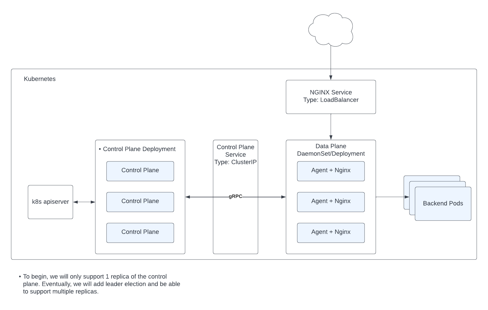
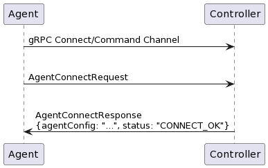
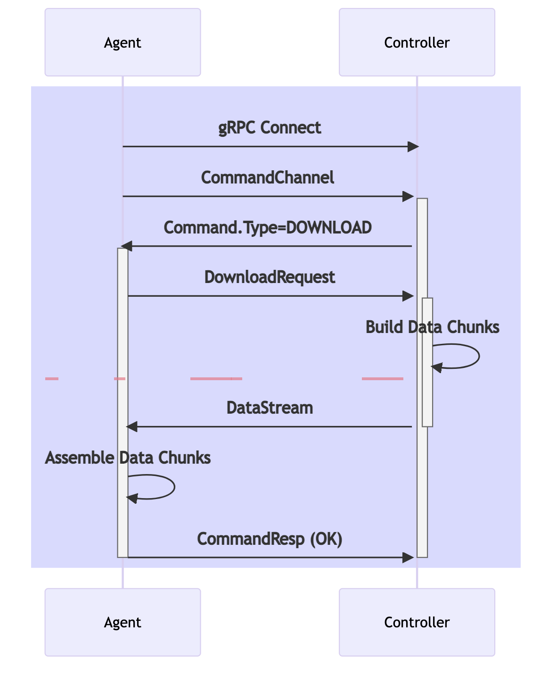

# Separation of control and data plane

**Archived; Superseded by [Proposal 1508](https://github.com/nginx/nginx-gateway-fabric/tree/main/docs/proposals/control-data-plane-split/README.md)**

This document proposes a design for separating the control and data planes.

Issue #292: https://github.com/nginx/nginx-gateway-fabric/issues/292

> Note: I use data plane and agent interchangeably in this document.

## Background

NGF composes its control and data plane containers into a single Kubernetes Pod. The control plane uses OS signals and a
shared file system to configure and reload nginx. This architecture is problematic because the same RBAC policies govern
the control and data planes and share CVE potential. A compromised control plane may impact the customer’s traffic. The
Kubernetes API server may be affected if the data plane is compromised. In addition to security concerns, this
architecture does not allow the control plane and data plane to scale independently.

## Goals

- Data plane and control plane containers run in separate Pods
- The communication channel between the control and data planes can be encrypted
- Data planes can register with control plane
- Data plane can scale independently of the control plane
- RBAC policy for data plane follows the principle of least privilege. The data plane should not have access to the
  Kubernetes API server.
- RBAC policy for control plane follows the principle of least privilege.

## Non-Goals

- Control plane can scale
- Support for multiple control planes per GatewayClass or Namespace.

## Design

Since the choice of a data plane agent will inform the rest of the design, I will start by proposing the agent.

### Nginx Agent

I propose using the [nginx agent](https://github.com/nginx/agent) as our data plane agent.

#### Evaluation of Requirements

The following list outlines all of NGF's requirements for an agent and whether the nginx agent meets them:

- [x] It is open source.
- [x] It supports both OSS and Plus versions of nginx.
- [x] It can be deployed in Kubernetes.
  - [ ] It supports readiness and liveness probes.
  - [x] It supports logging to stderr/stdout.
  - [x] It handles SIGTERM gracefully.
  - [ ] Its container base image is scratch or something minimal.
  - [x] It supports a read-only root file system.
  - [x] It can run as a non-root user.
- [x] It can configure an nginx instance running in the same Pod.
- [x] It is loosely coupled to the nginx version. The Nginx version can be updated independently of the agent.
- [x] A user can update it independently of the control plane.
- [x] It can accept configuration from a control plane running in a different Pod.
- [x] It can report the status of configuration attempts to the control plane.
- [x] It should not crash because of bad config.
- [x] It can authenticate with the control plane.
- [x] It supports TLS between the control plane and the agent.
- [x] It registers itself with the control plane.
- [x] Many agents can register to a single control plane.
- [x] It can scale separately from the control plane.
- [x] A user can configure it independently of other agents.
- [x] It does not need access to the Kubernetes apiserver.
- [x] It has a REST endpoint for metrics in Prometheus format.
- [x] It should be lightweight.
- [x] It can handle frequent configuration changes (~ 1 change/second).
- [x] It can handle large configurations.
- [ ] It allows the control plane to access the N+ API securely.

#### Missing Requirements

The nginx agent is missing a few requirements we will need to add for our use case.

Features needed (in priority order, more or less):

- Add support for TLS CA certificate rotation for the agent <-> control plane gRPC channel
- Deterministically confirm that a nginx reload succeeds (e.g. check that new worker processes are running)
- Add an option to configure the server's token via a file
- Add an option to refresh server token from a file
- Add readiness and liveness endpoints
- Produce a container image as a release artifact
  - This image should be non-root
  - This image should be as minimal as possible
- Allow the control plane to access the N+ API to configure upstreams and the key-value store.
- Add support for metrics enrichment. Metrics can be enriched with Kubernetes meta-information such as namespace, pod
  name, etc.

Agent features/plugins that we'd like to disable:

- Metrics service client
- Data plane status updates
- Config upload feature
  - This is the feature that uploads the config to the control plane
- The nginx-counting feature
- The activity-events feature

#### Benefits

Using the nginx agent has the following benefits:

- Saves us development time. We can drop the agent in and start using it immediately (with some caveats).
- Requires limited changes to the control plane.
- It runs `nginx -t` before reloading nginx. Which will improve our error reporting.
- No need to reinvent the wheel and contribute to the plethora of nginx agents.
- It supports the core features that we need.
- It is open source, but has a dedicated team from NGINX maintaining it.
- It supports additional features that we may need in the future.
- It has an established community of users (NMS) that are putting it through its paces.
- It is built to be modular and configurable. We should be able to disable most or all of the features we don’t need in
  the future.

#### Drawbacks

Using the nginx agent has the following drawbacks:

- It is not custom-built for our use case. It contains more features that we need.
- It was not built to run in Kubernetes.
  - Violates some of the best practices for running in Kubernetes. For example, it runs two processes in a single
      container.
  - Metrics do not include Kubernetes meta-information.
- It is a dependency that we do not control.
- It does not support dynamic configuration of upstreams and the key-value store.
- We may need to replace it in the future if we run into performance issues or encounter a blocker.

### Alternatives

#### Write our own agent

We could write our own agent. This would give us the most control over the design and implementation. There are few
different approaches we could take to design an agent.

**Approach 1: Use the nginx agent as a library and build our own agent on top of it**

Rather than start from scratch, we could use nginx agent packages to build a new agent. This would allow us to reuse the
agent code and build a more lightweight agent that meets only our needs.

Benefits:

- We can reuse some nginx agent code.
- We can pick and choose what we want to include in our agent.
- We can make the agent more Kubernetes-friendly.

Drawbacks:

- I'm not sure how feasible this is. The nginx agent is not designed to be used as a library. Some features may be hard
  to tease apart.
- We would have to maintain the agent ourselves.
- We wouldn't have as much say in the roadmap of the agent.

**Approach 2: Develop an API for nginx**

We could develop an API for nginx. This would allow us to configure nginx on a more granular level than the nginx agent.
Rather than sending the entire nginx configuration on every update, we could update only what has changed, such as
endpoints, servers, or locations. We could use the [Nginx Controller API][controller], the [N+ API][nplus], and
the [xDS API][xds] as inspiration for the design.

Benefits:

- We can configure nginx on a more granular level.
- We have control over the design and implementation.
- We can add dynamic configuration wherever possible

Drawbacks:

- Time. It would take a lot of time to develop, implement, and maintain this agent.
- We would add yet another nginx agent to the ecosystem.

**Approach 3: Use the xDS API and build an agent that translates xDS to nginx config**

The xDS API was developed for Envoy, however there is a [CNCF xDS API Working Group][xds-wg] that is working to create a
universal data plane API based on the xDS APIs.

Benefits:

- We can participate xDS Working Group and help drive the evolution of the APIs
- We don't have to design our own API
- We could focus on the data plane and bring in an xDS control plane
- An agent that translates xDS to nginx config could be useful for other projects

Drawbacks:

- Steep learning curve. We would need to learn xDS APIs
- Translating xDS to nginx config is not a trivial task. Some features will not map easily to nginx config.
- We would either need to completely re-write our control plane or adopt an xDS control plane

#### Modify nginx-agent

We could modify the nginx agent to meet our needs. This would require us to maintain a fork of the nginx agent. I see
this option as a last resort that we can decide to adopt if we hit a roadblock with the nginx agent.

[controller]: https://docs.nginx.com/nginx-controller/api/overview/

[nplus]: http://nginx.org/en/docs/http/ngx_http_api_module.html

[xds]: https://www.envoyproxy.io/docs/envoy/latest/api-docs/xds_protocol

[xds-wg]: https://github.com/cncf/xds

### Deployment Architecture



- _Control Plane Deployment_: The control plane is a Kubernetes Deployment with one container running the NGF
  controller. Initially, the control plane will be limited to a single Pod. Once we add leader election, the control
  plane will be able to scale. The control plane will perform the same functions as it does today, but instead of
  configuring nginx by writing files to a shared volume, it will send the configuration to the agent via gRPC.
- _Control Plane Service_: Exposes the control plane via a Kubernetes Service of type `ClusterIP`. The data plane will
  use the DNS name of the Service to connect to the control plane.
- _Data Plane DaemonSet/Deployment_: A user can deploy the data plane as either a DaemonSet or Deployment. The data
  plane contains a single container running both the agent and nginx processes. The agent will download the
  configuration from the control plane over a streaming RPC.
- _NGINX Service_: Exposes nginx via a Kubernetes Service of type `LoadBalancer .`This is the entry point for the
  customer’s traffic. Initially, this Service will only expose ports 80 and 443. In the future, if we add support for
  additional listener ports, this Service will expose all the listener ports. Note that this Service should not expose
  any of the agent’s ports.

The user will deploy the control plane, and data plane via Kubernetes manifests. The control plane supports a
single `GatewayClass` and  `Gateway` resource. Following this model, it makes sense for the control plane to support a
single data plane Deployment/DaemonSet. Each agent+nginx Pod in the data plane will receive the same configuration from
the control plane. In the future, we may reconsider this model if there’s a use case for the control plane to support
multiple `Gateway` resources. For example, in that model, it might make sense for the control plane to be responsible
for provisioning a separate data plane for each `Gateway.`

### Running Multiple NGF Controllers

Users can run multiple NGF controllers in the same cluster by leveraging the `GatewayClass` resource. Multiple NGF
controllers will be able to coexist in the same cluster as long as they each have a unique corresponding `GatewayClass`
resource. In this case, each installation of NGF will contain a unique `GatewayClass` resource, a control plane
Deployment, and a data plane Deployment/DaemonSet.

### Communication Channels

The control plane and agent will communicate over gRPC. The agent will establish a gRPC connection to the control plane
on start-up. The agent will gracefully retry to connect to the control plane, so the start order of the containers is
not an issue. The gRPC runtime will handle the connection establishment and management. If an error occurs or the stream
or connection is dropped, the connection must be reestablished.

### gRPC Definitions

#### Commander Service

The control plane will have to implement the `Commander` gRPC service defined below.

```protobuf
// Interface exported by the server.
service Commander {

  // A Bidirectional streaming RPC established by the data plane agent and is kept open
  rpc CommandChannel(stream Command) returns (stream Command) {}

  // A streaming RPC established by the data plane agent and is used to download resources associated with commands
  // The download stream will be kept open for the duration of the data transfer and will be closed when its done/
  // The transfer is a stream of chunks as follows:
  // - header
  //    - data chunk count to follow
  //    - resource identifier/metadata
  // - data 1
  // ...
  // - data
  //
  // each data chunk is of a size smaller than the maximum gRPC payload
  rpc Download(DownloadRequest) returns (stream DataChunk) {}

  // A streaming RPC established by the data plane agent and is used to upload resources associated with commands
  rpc Upload(stream DataChunk) returns (UploadStatus) {}
}
```

The `CommandChannel` RPC is a bidirectional stream RPC that is established by the agent and remains an open HTTP/2
stream over the course of the agent’s lifetime. The purpose of this channel is for the control plane and the agent to
send command requests and responses to one another. For more information on the command message, see
the [Command Message](#command-message) section.

Commands can contain payloads, but they are mostly small (a few kb at most) and should not transport large amounts of
data. The message size is significant with gRPC because gRPC has a message size limit. For larger payloads, like the
nginx configuration, the `Download` and `Upload` RPCs will be used in conjunction with commands.

The control plane will use the `Download` channel to push the configuration to the agent. See
the [Configuration Download](#configuration-download) section for details.

The agent uses the `Upload` command to upload large payloads, such as the nginx configuration, to the control plane. For
our use case, we only need the ability to send the nginx configuration from the control plane to the agent. We do not
need the agent to upload its configuration to the control plane. Ideally, we would like to disable this functionality in
the agent.

For the full commander service definition, see
this [file](https://github.com/nginx/agent/blob/main/sdk/proto/command_svc.proto).

#### Command Message

Command Messages have the following structure:

- Metadata - contains details about the sender and the message.
- Type - contains information about the type of data the message carries.
- Data - the message payload.

Command messages act as envelopes, but they make use of both the type field and the `oneof` feature of gRPC to embed
different types of payloads.

```protobuf
// Command is the envelope sent between the management plane and the data plane, requesting some action or reporting a response
message Command {
  Metadata meta = 1 [(gogoproto.jsontag) = "meta"];        // add metadata later with fields like timestamp etc

  enum CommandType {
    NORMAL = 0;
    DOWNLOAD = 1;
    UPLOAD = 2;
  }
  // used as a dispatch flag to quickly send the command to the correct base processor that will then further sort
  // based on the actual data type
  CommandType type = 2 [(gogoproto.jsontag) = "type"];

  oneof data {
    // common command status response - used by most command responses
    CommandStatusResponse cmd_status = 3 [(gogoproto.jsontag) = "cmd_status"];

    // request action on nginx config when sent C → A - all action values (see NgxConfig)
    // notify config details when sent  A → C - only RETURN action
    NginxConfig nginx_config = 4 [(gogoproto.jsontag) = "nginx_config"];

    // request action on nginx config when sent C → A - all action values (see NgxConfig)
    // notify config details when sent  A → C - only RETURN action
    NginxConfigResponse nginx_config_response = 5 [(gogoproto.jsontag) = "nginx_config_response"];

    // request connection to a management plane, A → C
    AgentConnectRequest agent_connect_request = 6 [(gogoproto.jsontag) = "agent_connect_request"];

    // connection response to the data plane, C → A
    AgentConnectResponse agent_connect_response = 7 [(gogoproto.jsontag) = "agent_connect_response"];

    // request Configuration parameters for agent, A → C
    AgentConfigRequest agent_config_request = 8 [(gogoproto.jsontag) = "agent_config_request"];

    // configuration parameters for Agent C → A. This message can be sent asynchronously as well
    AgentConfig agent_config = 9 [(gogoproto.jsontag) = "agent_config"];

    // DataplaneStatus reports Dataplane metrics the Agent is aware of
    DataplaneStatus dataplane_status = 11 [(gogoproto.jsontag) = "dataplane_status"];

    // EventReport reports events the Agent is aware of, e.g. Start/Stop of Agent, Config Apply NGINX
    f5.nginx.agent.sdk.events.EventReport event_report = 12 [(gogoproto.jsontag) = "event_report"];

    // DataplaneSoftwareDetails contains details for additional software running on the dataplane that pertains
    // to NGINX Agent
    DataplaneSoftwareDetails dataplane_software_details = 13 [(gogoproto.jsontag) = "dataplane_software_details"];

    // DataplaneUpdate contains details for dataplane resources that have changed
    DataplaneUpdate dataplane_update = 14 [(gogoproto.jsontag) = "dataplane_update"];
  }
}
```

There are many command types defined above, and the control plane does not care about all of them. However, any commands
that we do not care about can be easily ignored by the control plane by inspecting the message type.

For the full command message definition, see
this [file](https://github.com/nginx/agent/blob/main/sdk/proto/command.proto).

#### Nginx Config Message

The control plane sends the `NginxConfig` message in chunks over the `Download` channel to the agent in order to
configure nginx.

```protobuf
message NginxConfig {
  NginxConfigAction action = 1 [(gogoproto.jsontag) = "action"];
  ConfigDescriptor config_data = 2 [(gogoproto.jsontag) = "config_data"];
  ZippedFile zconfig = 3 [(gogoproto.jsontag) = "zconfig"];
  ZippedFile zaux = 4 [(gogoproto.jsontag) = "zaux"];
  AccessLogs access_logs = 5 [(gogoproto.jsontag) = "access_logs"];
  ErrorLogs error_logs = 6 [(gogoproto.jsontag) = "error_logs"];
  SslCertificates ssl = 7 [(gogoproto.jsontag) = "ssl"];
  DirectoryMap directory_map = 8 [(gogoproto.jsontag) = "directory_map"];
}
```

- `action`: what action the agent should take with the nginx config: apply, test, rollback, return, or force.
- `config_data`: contains metadata on the agent and nginx instance we are configuring.
- `zconfig`: a zipped file with all nginx `.conf` files.
- `zaux`: a zipped file with all nginx auxiliary files, such as njs modules, static html files, etc.
- `access_logs`: meta-information about the access logs.
- `error_logs`: meta-information about the error logs.
- `ssl`: meta-information about the SSL certificates stored on the data plane.
- `directory_map`:meta-information about the nginx configuration files. The agent uses this for synchronization (i.e.,
  comparing configuration against previous deployments) and to interrogate the file system before applying the
  configuration.

I found that for NGF’s use case, the `access_logs,` `error_logs,` and `ssl` fields are unnecessary. For more details on
how the control plane pushes nginx config to the agent, see the [Configuration Download](#configuration-download)
section.

For the full `NginxConfig` message definition, see
this [file](https://github.com/nginx/agent/blob/main/sdk/proto/nginx.proto).

### Encryption

The agent and control plane communication channel will be encrypted. We will store the server certificate, key pair, and
CA certificate in Kubernetes Secrets. The user will install the Secrets in the `nginx-gateway` namespace under the
following names:

- `nginx-gateway-cert`: This Secret will contain the TLS certificate and private key that the control plane will use to
  serve gRPC traffic.
- `nginx-agent-cert`: This Secret will contain the CA bundle that validates the control plane’s certificate.

The Secrets will be mounted to the control plane and agent containers, respectively. If desired, we can make the Secret
names and mount path configurable via flags. For production, we will direct the user to provide their own certificates.
For development and testing purposes, we will provide a self-signed default certificate. In order to be secure by
default, NGF should generate the default certificates and keypair during installation using a Kubernetes Job.

#### Certificate Rotation

Kubernetes [automatically updates mounted Secrets][auto-update-secrets] when the content changes, but the control plane
and agent must make sure they are using the latest certificates. We can achieve this by providing a callback in
the [`tls.Config`][tls-config] for the gRPC server and client. We will need to add his functionality to the agent as
well.

[auto-update-secrets]: https://kubernetes.io/docs/concepts/configuration/secret/#mounted-secrets-are-updated-automatically

[tls-config]: https://pkg.go.dev/crypto/tls#Config

### Authorization

The agent will use a Kubernetes ServiceAccount token to authenticate with the control plane. The control plane will
authenticate the token by sending a request to the Kubernetes [TokenReview API][token-review].


On start-up the agent will create a gRPC [`CommanderClient`][client] and connect to the control plane
[`CommanderServer`][server] using the server address, server token, and TLS options specified in the agent’s
configuration file (see [Agent Configuration](#agent-configuration)). This connection is secured by TLS; see the
[Encryption](#encryption) section for more information. The control plane will validate the token with
Kubernetes by sending a TokenReview API request. If the token is valid, the bidirectional streaming `CommandChannel`
between the agent and the control plane is established and left open for the lifetime of the agent.

Upon successful connection, the agent will register by sending an `AgentConnectionRequest` command sent from the agent
to the control plane over the `CommandChannel.` This message is used by the control plane to associate the agent with
internal resources correctly. See the [Registration](#agent-registration) section for more information.

#### Long-lived token v/s bound token

Long-lived tokens are JWT tokens for a ServiceAccount that are valid for the lifetime of the ServiceAccount. They are
stored in Secrets and can be mounted to a Pod as a file or an environment variable. We can use the TokenReview API to
verify the token. While long-lived tokens can still be created and used in Kubernetes, bound tokens are now the default
and preferred option.

Bound ServiceAccount tokens are OpenID Connect (OIDC) identity tokens that are obtained directly from
the [TokenRequest API][token-request] and are mounted into Pods using a [projected volume][projected-volume]. Bound
tokens are more secure than long-lived tokens because they are time-bound, audience-bound, and object-bound.

- Time-bound: Bound tokens expire after a configurable amount of time. The default is 1 hour. The kubelet will
  periodically refresh the token before it expires.
- Audience-bound: Bound tokens are only valid for a specific audience. The audience is a string that identifies the
  intended recipient of the token.
- Object-bound: Bound tokens are bound to the Pod.

The TokenReview API only considers a bound token to be valid if the token is not expired, the audience of the token
matches the audience specified in the TokenReview API request, and the Pod that the token is bound to is still present
and running.

Bound tokens expire, and are written to the filesystem by the kubelet. While bound tokens are more secure than
long-lived tokens, the agent needs to be modified to use them. The agent would need to be able to reload the tokens from
the filesystem periodically. That would require the following changes in the agent code:

- Add a new configuration option to specify the path to the token file. Currently, the agent supports reading the token
  from an environment variable or the configuration file, not from a file.
- Modify the gRPC client to fetch the token from a file before connecting to the control plane. Currently, the token is
  loaded on start-up and never refreshed. If the agent reconnects to the control plane, it will use the same token
  provided on start-up.

I propose that we initially use a long-lived token for the agent. This will allow us to get the agent up and running
quickly. We can then add support for bound tokens in a future release.

To create the long-lived token, we will provide the following manifest:

```yaml
apiVersion: v1
kind: Secret
metadata:
  name: nginx-agent-token-secret
  annotations:
    kubernetes.io/service-account.name: nginx-agent
type: kubernetes.io/service-account-token
```

And expose the token as an environment variable in the agent container:

```yaml
    env:
    - name: NMS_SERVER_TOKEN
      valueFrom:
        secretKeyRef:
          name: nginx-agent-token-secret
          key: token
```

The agent will load the token from the `$NSM_SERVER_TOKEN` environment variable and add it to the `Authorization`
header of the gRPC request when connecting to the control plane.

For a good comparison of long-lived and bound tokens, see [this blog post][bound-token-gke].

[token-review]: https://kubernetes.io/docs/reference/kubernetes-api/authentication-resources/token-review-v1/

[bound-token-gke]: https://cloud.google.com/blog/products/containers-kubernetes/kubernetes-bound-service-account-tokens

[token-request]: https://kubernetes.io/docs/reference/kubernetes-api/authentication-resources/token-request-v1/

[projected-volume]: https://kubernetes.io/docs/reference/access-authn-authz/service-accounts-admin/#bound-service-account-token-volume

### Agent Registration



The agent will send an [`AgentConnectRequest`][connect] command to the control plane over the`CommandChannel` to
register with the control plane. This command includes the agent’s system ID and nginx ID(s) which the control plane
needs in order to push configuration. During registration, the control plane will store this information and associate
it with the connection.

In response, the control plane will send an [`AgentConnectResponse`][response] over the `CommandChannel .`
The `AgentConnectResponse` contains the connect request's status and the agent’s runtime configuration. This includes
the enabled features, extensions, tags, log configuration, and alias for the agent.


[client]: https://github.com/nginx/agent/blob/ea3a1b4df5d7ecf95bd3d9297d26e420f5e1dd57/sdk/proto/command_svc.pb.go#L59

[server]: https://github.com/nginx/agent/blob/ea3a1b4df5d7ecf95bd3d9297d26e420f5e1dd57/sdk/proto/command_svc.pb.go#L184

[connect]: https://github.com/nginx/agent/blob/ea3a1b4df5d7ecf95bd3d9297d26e420f5e1dd57/sdk/proto/agent.pb.go#L92

[response]: https://github.com/nginx/agent/blob/ea3a1b4df5d7ecf95bd3d9297d26e420f5e1dd57/sdk/proto/agent.pb.go#L226

### Configuration Download

#### Building the NginxConfig message

Currently, NGF configures nginx by translating the Gateway API resources into
an [internal representation of the nginx config][internal-config], executing a template with this data to generate the
nginx configuration as bytes, and then writing the bytes to the filesystem.

The agent expects the configuration files to be compressed and packaged into a [`ZippedFile`][zip-file] message.
The `ZippedFile` message contains the compressed configuration files' contents, the files' root directory, and the
contents' checksum.

To produce the `ZippedFile` message, the control plane will import the [`zip.Writer`][zip-writer] from the agent’s SDK.
The control plane will still execute the template to generate the nginx configuration as bytes, but instead of writing
the files to the filesystem, the control plane will add the files to the `zip.Writer`.

In addition to the `ZippedFile` containing the nginx configuration files, we will also need to build the
[`DirectoryMap`][directory-map] message. The `DirectoryMap` message contains a mapping of the directory structure
holding the nginx configuration files. The agent uses this map to interrogate the file system before applying the config
and to determine which files to delete. Each file we add to the `zip.Writer` we will also add to the `DirectoryMap.`

The final pieces of the `NginxConfig` message that we will need to provide are the [`Action`][action] and
[`ConfigDescriptor`][config-descriptor] messages. We will set the action to `APPLY` and fill out the `ConfigDescriptor`
according to the agent information received during registration.

Note that we must send the entire nginx configuration to the agent on each configuration update. We can leverage the
checksum if we want to reduce the number of configuration updates sent to the agent. By storing the last checksum in the
control plane, we can avoid sending the configuration to the agent if it hasn’t changed.

#### Static Configuration Files

Static configuration files, such as njs modules, do not need to be sent to the agent on every configuration update.
Instead, we will mount these files to the agent’s container using a `ConfigMap .`This will also require us to specify
the path to the module in the agent’s configuration file and the `DirectoryMap` of the `NginxConfig` message to prevent
the agent from removing them from the filesystem.

#### Handling User’s Secret Data

The TLS certificates and keys specified in the [`GatewayTLSConfig`][gw-tls-config] field of `Listeners` are references
to Kubernetes Secrets. In the future, we will support other forms of authentication data, such as JWT tokens and
user/pass files. Users will also store this secret data in Kubernetes Secrets.

Currently, NGF watches all Secrets, stores them in memory, and then selectively writes them to the filesystem. We only
write Secrets that are referenced by `Listeners` to the filesystem. As part of the separation work, we need to figure
out a way for the data plane to have access to these TLS certificates and keys.

The challenge is that we do not want the data plane not to have access to the Kubernetes apiserver. This is one of the
driving reasons behind separating the control plane from the data plane. So, we need a way for the agent to retrieve the
TLS certificates and keys without having to make a request to the Kubernetes apiserver.

**Option 1: Send the secret data as part of the `NginxConfig` message**

The `NginxConfig` message has two `ZippedFile` fields, one for all nginx conf files and one for all the auxiliary files.
Auxiliary files are all files that are referenced by the nginx configuration but are not `.conf` files. For this option,
the control plane will continue to watch Secrets and store them in memory. When building the `NginxConfig`
message, we will add the content from all referenced Secrets to the auxiliary `ZippedFile` message as individual secret
data files. The `DirectoryMap` will also be updated to include the paths to these files. The agent will extract the
secret data files from the auxiliary `ZippedFile` and write them to the filesystem.

This option, or a variation, is used in several other Gateway/Ingress implementations. For example, the Contour Gateway
sends TLS certificates and keys over gRPC to its Envoy data plane. This Envoy API is called
the [Secret Discovery Service][sds]. The `ingress-nginx` project is also working on separating their control and data
planes, and in their draft implementation, the secret data is stored in the JSON config payload that is sent to the data
plane over gRPC. Additionally, APISix sends secret data over HTTP to their data plane.

Benefits:

- The agent does not need access to the Kubernetes apiserver.
- The agent does not need to be modified to support this.

Drawbacks:

- The control plane sends secret data over gRPC on every configuration update.

**Option 2: Run a sidecar container in the agent’s Pod that watches the Secrets and writes them to a shared volume**

For this option, we will write a Kubernetes controller that watches Secrets and writes them to a shared volume. This
controller will run as a sidecar in the agent’s Pod. We only want to write Secrets that are referenced by the nginx
configuration, so we need to figure out a way to tell the sidecar which Secrets to write. There’s also an ordering issue
to consider. The secret data must be written to the shared volume before the configuration that references the secret
data is applied, otherwise, the configuration application will fail. One way to do this is to write a plugin for the
agent that ranges over the `SslCertificates` field in the `NginxConfig`
message and requests those Secrets over localhost from the sidecar. In this case, the control plane is responsible for
writing the `SslCertificates` field in the `NginxConfig` message.

Benefits:

- Secret data is not sent over gRPC on every configuration update.
- The agent container does not need access to the Kubernetes apiserver.

Drawbacks:

- The agent needs to be modified to support this.
- We need to write and maintain an additional controller.
- We need to produce an additional container image.
- The Pod will still need to have access to the Kubernetes apiserver. We may be able to limit access to the sidecar
  container by disabling the automatic mounting of the ServiceAccount token and manually mounting the token to the
  sidecar container only. However, the agent does need a ServiceAccount token to connect to the control plane.

**Option 3: Run a DaemonSet that watches the Secrets and sends them to the agent over a Unix socket**

This option is similar to option 2, but instead of running the controller as a sidecar container, we will run it as a
DaemonSet. The controller will watch Secrets and send them to the agent over an API served over a Unix domain socket.
The agent will be responsible for writing the secret data to the filesystem.

This approach will require [`hostPath`][host-path] volumes on the agent and the Secret controller Pods, so they can
access the Unix domain socket on the host. It will also require a new plugin for the agent that can fetch the secret
data over the API and write it to the filesystem.

Benefits:

- Secret data is not sent over gRPC on every configuration update.
- The agent container does not need access to the Kubernetes apiserver.

Drawbacks:

- The agent needs to be modified to support this.
- We need to write and maintain an additional controller.
- We need to produce an additional container image.
- We need to use `hostPath` volumes which pose security risks and some Kubernetes distributions do not allow them.

> My preference is option 1, as it is the simplest and requires the least changes.

#### Sending the NginxConfig message



The control plane will send a `Download` command over the `CommandChannel` to the agent. Then, the control plane will
chunk out the `NginxConfig` message and send it over the `DownloadChannel .`The agent will receive the `Download`
command and then download the config chunks over the `DownloadChannel .`It will then assemble the chunks into a full
configuration and attempt to apply it. It will send the status of the configuration application over
the `CommandChannel` in a `NginxConfigResponse` message.

[internal-config]: https://github.com/nginx/nginx-gateway-fabric/blob/main/internal/nginx/config/http/config.go

[zip-file]: https://github.com/nginx/agent/blob/ea3a1b4df5d7ecf95bd3d9297d26e420f5e1dd57/sdk/proto/common.pb.go#L668

[zip-writer]: https://github.com/nginx/agent/blob/ea3a1b4df5d7ecf95bd3d9297d26e420f5e1dd57/sdk/zip/zipped_file.go#L36

[directory-map]: https://github.com/nginx/agent/blob/ea3a1b4df5d7ecf95bd3d9297d26e420f5e1dd57/sdk/proto/common.pb.go#L99

[action]: https://github.com/nginx/agent/blob/ea3a1b4df5d7ecf95bd3d9297d26e420f5e1dd57/sdk/proto/nginx.pb.go#L26

[config-descriptor]:https://github.com/nginx/agent/blob/ea3a1b4df5d7ecf95bd3d9297d26e420f5e1dd57/sdk/proto/config.pb.go#L81

[gw-tls-config]: https://gateway-api.sigs.k8s.io/reference/spec/#gateway.networking.k8s.io/v1.GatewayTLSConfig

[sds]: https://www.envoyproxy.io/docs/envoy/latest/configuration/security/secret

[host-path]: https://kubernetes.io/docs/concepts/storage/volumes/#hostpath


### Agent Configuration

We can configure the agent through a YAML file, command-line flags, or environment variables on start-up. The agent
interprets configuration in the following priorities (from highest to lowest):

1. Command-line flags
2. Environment variables
3. Config files

We can either configure the agent with command-line flags or mount the config file as a volume to the agent’s container.
Some configuration options we care about are:

- `server-host`: the DNS name of the control plane Kubernetes Service
- `server-grpcport`: the gRPC port that the control plane is listening on
- `tls-ca`: the path to the CA certificate file
- `tls-cert`: the path to the agent’s certificate file
- `tls-key`: the path to the agent’s private key file
- `tls-enable`: enable TLS for secure communication with the control plane
- `features`: list of enabled features
- `config-dirs`:the paths that you want to grant agent read/write access to

For a list of configuration options, see [NGINX Agent CLI Flags & Usage][cli].

The control plane can send runtime configuration using the [`AgentConfig`][agent-config] messages. I’m not sure if we
have a use case for runtime configuration at the moment.

[agent-config]: https://github.com/nginx/agent/blob/ea3a1b4df5d7ecf95bd3d9297d26e420f5e1dd57/sdk/proto/agent.pb.go#L320

[cli]: https://docs.nginx.com/nginx-management-suite/nginx-agent/install-nginx-agent/#nginx-agent-cli-flags-usage

## Edge Cases

The following edge cases should be considered and tested during implementation:

- The data plane fails to establish a connection with the control plane.
- Existing connections between data plane and control plane are terminated during a download event.

In these cases, we expect the agent to be resilient. It should not crash or produce invalid config, and it should retry
when possible.

## Data Plane Scaling

Since the data plane is deployed in its own Pod, a user can horizontally scale the data plane independently of the
control plane. When a new agent Pod spins up, the agent will register itself with the control plane. The control plane
will have to keep track of all the agents.

We will need to figure out how many agent instances can be supported by NGF’s control plane. As an example data point,
NGINX Controller can monitor and manage up to 100 N+ instances or up to 30 N+ instances with App Protect enabled. Since
our use case for the agent is much simpler than NGINX Controller, we may be able to support more instances of the agent.

## Metrics

The agent exposes a REST `/metrics` endpoint that returns metrics in Prometheus format. The agent also sends metrics to
the control plane. One feature we will need to add to the agent is the ability to enrich the metrics with additional
information. For example, upstream metrics need to be tied to the Kubernetes Pod name and namespace for them to be
useful.

## Performance

The agent team has a suite of performance tests [here][performance] that they run. If we need benchmarks on larger
configurations, we can work with them to add bigger config files to the test suite.

Config Push Benchmarks:

```shell
cpu: Intel(R) Xeon(R) Platinum 8370C CPU @ 2.80GHz
BenchmarkNginxConfig/../testdata/configs/bigger/1k.conf-2         	1000000000	         0.005241 ns/op	       0 B/op	       0 allocs/op
BenchmarkNginxConfig/../testdata/configs/bigger/2k.conf-2         	1000000000	         0.01087 ns/op	       0 B/op	       0 allocs/op
BenchmarkNginxConfig/../testdata/configs/bigger/3k.conf-2         	1000000000	         0.01492 ns/op	       0 B/op	       0 allocs/op
BenchmarkNginxConfig/../testdata/configs/bigger/10k.conf-2        	1000000000	         0.05086 ns/op	       0 B/op	       0 allocs/op
BenchmarkGetConfigFiles/GetConfigFiles-2                          	1000000000	         0.0004904 ns/op	   0 B/op	       0 allocs/op
BenchmarkGetConfigFiles/GetConfigFiles#01-2                       	1000000000	         0.0007442 ns/op	   0 B/op	       0 allocs/op
BenchmarkGetConfigFiles/GetConfigFiles#02-2                       	1000000000	         0.0009297 ns/op	   0 B/op	       0 allocs/op
BenchmarkGetConfigFiles/GetConfigFiles#03-2                       	1000000000	         0.002607 ns/op	       0 B/op	       0 allocs/op
```

Config Zip and Unzip Benchmarks:

```shell
BenchmarkZipConfig/Zip_config../testdata/configs/bigger/1k.conf-2            	1000000000	         0.0001852 ns/op	       0 B/op	       0 allocs/op
BenchmarkZipConfig/Zip_config../testdata/configs/bigger/2k.conf-2            	1000000000	         0.0000663 ns/op	       0 B/op	       0 allocs/op
BenchmarkZipConfig/Zip_config../testdata/configs/bigger/3k.conf-2            	1000000000	         0.0000674 ns/op	       0 B/op	       0 allocs/op
BenchmarkZipConfig/Zip_config../testdata/configs/bigger/10k.conf-2           	1000000000	         0.0000672 ns/op	       0 B/op	       0 allocs/op
BenchmarkUnZipConfig/#00-2                                                   1000000000	         0.0000193 ns/op	       0 B/op	       0 allocs/op
BenchmarkUnZipConfig/#01-2                                                   1000000000	         0.0000132 ns/op	       0 B/op	       0 allocs/op
BenchmarkUnZipConfig/#02-2                                                   1000000000	         0.0000118 ns/op	       0 B/op	       0 allocs/op
BenchmarkUnZipConfig/#03-2                                                   1000000000	         0.0000140 ns/op	       0 B/op	       0 allocs/op
PASS
ok  	command-line-arguments	17.727s
```

### Performance goals

- NGF can handle frequent configuration changes (1 change per second)
- NGF can handle large configurations:
  - 5000 server blocks
  - 64 TLS certs/keys
  - 50 JWT keys
  - 50 TLS cert/keys for egress
  - 50 CA certs
  - 50 basic auth files
  - 50 OIDC secrets
- NGF can scale to X number of data plane pods (we need to figure out what X is)

[performance]: https://github.com/nginx/agent/blob/main/test/performance/user_workflow_test.go
