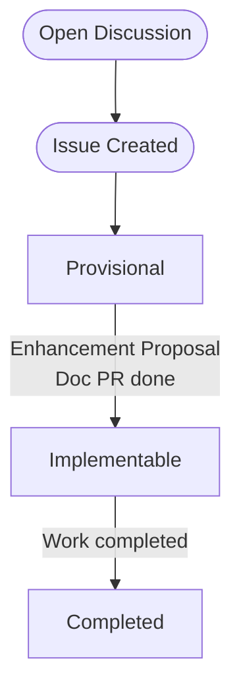

# Enhancement Proposal

This document describes the process of submitting an Enhancement Proposal. Enhancement Proposals are a way to propose,
communicate, and coordinate on enhancements for the NGINX Gateway Fabric. It is based off of
the [Gateway Enhancement Proposals][gep]. Their purpose is to:

- Make changes and proposals discoverable (current and future).
- Provide a common place to discuss design, architecture, and impacts of a particular change.
- Document design ideas, tradeoffs, and decisions for historical reference.

[gep]: https://github.com/kubernetes-sigs/gateway-api/blob/c8b54a05c850cd717eb852c4874c6c89d02a5ef8/geps/overview.md

## When to Write an Enhancement Proposal

You should only write an Enhancement Proposal if a maintainer has requested one for a particular issue. All enhancement
requests should start as an idea on [GitHub Discussions][discussion]. Not all enhancement requests will require an
Enhancement Proposal. For example, here are some examples of requests that may not need an Enhancement Proposal:

- Gateway API fields. However, some larger Gateway API fields may require Enhancement Proposals if they require
  significant changes to the architecture of the code.
- Small changes (validation, documentation, fixups). It is always possible that the maintainers will determine a "small"
  change ends up requiring a Enhancement Proposal.

[discussion]: https://github.com/nginx/nginx-gateway-fabric/discussions

## Process

The diagram below shows the Enhancement Proposal process:

### 1. Open a GitHub Discussion

Before creating an issue or Enhancement Proposal, [open an idea][idea] on GitHub discussion. Describe the enhancement
you would like, any use cases you have, and other relevant details. Beginning with a discussion allows you to get
feedback from the maintainers and the community before you invest time in writing an Enhancement Proposal.

[idea]: https://github.com/nginx/nginx-gateway-fabric/discussions/new?category=ideas

### 2. Create an Issue

If there is consensus on the discussion post that the enhancement is important and should be included in the roadmap, a
maintainer will ask you to [open an issue][issue] on GitHub.

Not every enhancement warrants an Enhancement Proposal. _If_ the enhancement issue requires an Enhancement Proposals,
the maintainers will add the label `enhancement-proposal` to the issue.

[issue]: https://github.com/nginx/nginx-gateway-fabric/issues/new?assignees=&labels=proposal&projects=&template=enhancement.md&title=

### 3. Agree on the Goals (Provisional)

Write the first version of your Enhancement Proposal using the [template](/docs/proposals/template.md), including only
the summary of the enhancement and the sections addressing the "Goals" and "Non-Goals". The purpose of this initial
Enhancement Proposal is to achieve consensus on the objectives before filling out the details of implementation. Set the
[status](#status) field in the Enhancement Proposal document to "Provisional".

Open a Pull Request with your Enhancement Proposal and work with the reviewers to get the necessary approvals. All
Enhancement Proposals should be placed in the [docs/proposals](/docs/proposals) directory.

### 4. Document Implementation Details

Once the goals are set and the Provisional Enhancement Proposal has been merged, you can begin filling out the
implementation details of the [template](/docs/proposals/template.md). Set the [status](#status) field in the
Enhancement Proposal document to "Implementable".

Make your changes to the existing Provisional Enhancement Proposal and open a Pull Request. Work with the reviewers to
get the necessary approvals.

### 5. Implement

Once the Implementable Enhancement Proposal is merged, you can start implementing the proposed changes. In some cases it
may be beneficial to open a draft Pull Request with a prototype of the changes. Otherwise, open a standard Pull Request
with the changes and update the status field of the corresponding Enhancement Proposal to "Completed".

> Note:
>
> Make sure to read the [Development Guide](https://github.com/nginx/nginx-gateway-fabric/blob/main/CONTRIBUTING.md#development-guide)
> before making any code changes.

## Status

Each Enhancement Proposal has a status field that defines its current state. Each transition will require a PR to update
the Enhancement Proposal.

- **Provisional:** The goals described by this Enhancement Proposal have consensus but implementation details have not
  been agreed to yet.
- **Implementable:** The goals and implementation details described by this Enhancement Proposal have consensus but have
  not been fully implemented yet.
- **Completed:** This Enhancement Proposal has been implemented.

Although less common, some Enhancement Proposals may end up in one of the following states:

- **Deferred:** We do not currently have bandwidth to handle this Enhancement Proposal, it may be revisited in the
  future.
- **Rejected:** This proposal was considered but ultimately rejected.
- **Replaced:** This proposal was considered but ultimately replaced by a newer proposal.
- **Withdrawn:** This proposal was considered but ultimately withdrawn by the author.
