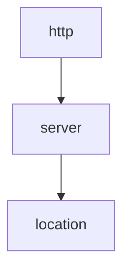

# Enhancement Proposal-1632: Client Settings Policy

- Issue: https://github.com/nginx/nginx-gateway-fabric/issues/1632
- Status: Completed

## Summary

This Enhancement Proposal introduces the `ClientSettingsPolicy` API that allows Cluster Operators and Application developers to configure the behavior of the connection between the client and NGINX.

## TODO

The Policy and Metaresources GEP is currently under construction. There is an open [PR](https://github.com/kubernetes-sigs/gateway-api/pull/2813/) that contains significant changes to the Policy API.
While this proposal is based on the latest (as of Mar 13 2024) state of the PR, there are still open discussions that may introduce changes to the API. Once the PR is merged, this proposal will need to be revisited to ensure it aligns with the final Policy API.

## Goals

- Define client settings.
- Define an API for client settings.
- Outline the attachment points and scenarios for the client settings policy.
- Describe the inheritance behavior of client settings when multiple policies exist.

## Non-Goals

- Provide implementation details for implementing the client settings policy.
- Define attachment and inheritance behavior for multiple Gateways.

## Introduction

### Client Settings

Client settings are NGINX directives that affect requests sent from the downstream client to NGINX Gateway Fabric.

To begin, the Client Settings Policy will include the following NGINX directives:

- [`client_max_body_size`](https://nginx.org/en/docs/http/ngx_http_core_module.html#client_max_body_size)
- [`client_body_timeout`](https://nginx.org/en/docs/http/ngx_http_core_module.html#client_body_timeout)
- [`keepalive_requests`](https://nginx.org/en/docs/http/ngx_http_core_module.html#keepalive_requests)
- [`keepalive_time`](https://nginx.org/en/docs/http/ngx_http_core_module.html#keepalive_time)
- [`keepalive_timeout`](https://nginx.org/en/docs/http/ngx_http_core_module.html#keepalive_timeout)

In the future, we can extend the Client Settings Policy to include more client-related directives, such as `client_body_buffer_size`, `client_header_buffer_size`.

## Use Cases

- As a Cluster Operator, I want to set defaults for client settings that will work for most applications so that most Application Developers will not have to tweak these settings.
- As an Application Developer, I want to be able to configure client settings for my application based on its behavior or requirements.
- As an Application Developer, I want to override the defaults for client settings set by the Cluster Operator because the defaults do not satisfy my application's requirements or behavior.

## API

The `ClientSettingsPolicy` API is a CRD that is a part of the `gateway.nginx.org` Group. It adheres to the guidelines and requirements of an Inherited Policy as outlined in the [Policy and Metaresources GEP](https://gateway-api.sigs.k8s.io/geps/gep-713/).

Below is the Golang API for the `ClientSettingsPolicy` API:

### Go

```go
package v1alpha1

import (
    metav1 "k8s.io/apimachinery/pkg/apis/meta/v1"
    gatewayv1alpha2 "sigs.k8s.io/gateway-api/apis/v1alpha2"
)

type ClientSettingsPolicy struct {
    metav1.TypeMeta   `json:",inline"`
    metav1.ObjectMeta `json:"metadata,omitempty"`

    // Spec defines the desired state of the ClientSettingsPolicy.
    Spec ClientSettingsPolicySpec `json:"spec"`

    // Status defines the state of the ClientSettingsPolicy.
    Status gatewayv1alpha2.PolicyStatus `json:"status,omitempty"`
}

type ClientSettingsPolicySpec struct {
    // TargetRef identifies an API object to apply the policy to.
    // Object must be in the same namespace as the policy.
    // Support: Gateway and HTTPRoute
    TargetRef gatewayv1alpha2.LocalPolicyTargetReference `json:"targetRef"`

    // Body defines the client request body settings.
    // +optional
    Body *ClientBody `json:"body,omitempty"`

    // KeepAlive defines the keep-alive settings.
    // +optional
    KeepAlive *ClientKeepAlive `json:"keepAlive,omitempty"`
}

// ClientBody contains the settings for the client request body.
type ClientBody struct {
    // MaxSize sets the maximum allowed size of the client request body.
    // Setting size to 0 disables checking of client request body size.
    // +optional
    MaxSize *Size `json:"maxSize,omitempty"`

    // Timeout defines a timeout for reading client request body. The timeout is set only for a period between
    // two successive read operations, not for the transmission of the whole request body.
    // +optional
    Timeout *Duration `json:"timeout,omitempty"`
}

// ClientKeepAlive defines the keep-alive settings for clients.
type ClientKeepAlive struct {
    // Requests sets the maximum number of requests that can be served through one keep-alive connection.
    // After the maximum number of requests are made, the connection is closed.
    // +optional
    Requests *int32 `json:"requests,omitempty"`

    // Time defines the maximum time during which requests can be processed through one keep-alive connection.
    // After this time is reached, the connection is closed following the subsequent request processing.
    // +optional
    Time *Duration `json:"time,omitempty"`

    // Timeout defines the keep-alive timeouts for clients.
    // +optional
    Timeout *ClientKeepAliveTimeout `json:"timeout,omitempty"`
}

// ClientKeepAliveTimeout defines the timeouts related to keep-alive client connections.
type ClientKeepAliveTimeout struct {
    // Server sets the timeout during which a keep-alive client connection will stay open on the server side.
    // The zero value disables keep-alive client connections.
    // +optional
    Server *Duration `json:"server,omitempty"`

    // Header sets the timeout in the "Keep-Alive: timeout=time" response header field.
    // +optional
    Header *Duration `json:"header,omitempty"`
}

// Duration is a string value representing a duration in time.
// The format is a subset of the syntax parsed by Golang time.ParseDuration.
// Examples: 1h, 12m, 30s, 150ms.
type Duration string

// Size is a string value representing a size. Size can be specified in bytes, kilobytes (suffix k),
// or megabytes (suffix m).
// Examples: 1024, 8k, 1m.
type Size string
```

### Versioning and Installation

The version of the `ClientSettingsPolicy` API will be `v1alpha1`.

The `ClientSettingsPolicy` CRD will be installed by the Cluster Operator via Helm or with manifests. It will be required, and if the `ClientSettingsPolicy` CRD does not exist in the cluster, NGINX Gateway Fabric will log errors until it is installed.

### Status

#### CRD Label

According to the [Policy and Metaresources GEP](https://gateway-api.sigs.k8s.io/geps/gep-713/), the `ClientSettingsPolicy` CRD must have the `gateway.networking.k8s.io/policy: inherited` label to specify that it is an inherited policy.
This label will help with discoverability and will be used by the planned Gateway API Policy [kubectl plugin](https://gateway-api.sigs.k8s.io/geps/gep-713/#kubectl-plugin-or-command-line-tool).

#### Conditions

According to the [Policy and Metaresources GEP](https://gateway-api.sigs.k8s.io/geps/gep-713/), the `ClientSettingsPolicy` CRD must include a `status` stanza with a slice of Conditions.

The `Accepted` Condition must be populated on the `ClientSettingsPolicy` CRD using the reasons defined in the [PolicyCondition API](https://github.com/kubernetes-sigs/gateway-api/blob/main/apis/v1alpha2/policy_types.go). If these reasons are not sufficient, we can add implementation-specific reasons.

#### Setting Status on Objects Affected by a Policy

In the Policy and Metaresources GEP, there's a provisional status described [here](https://gateway-api.sigs.k8s.io/geps/gep-713/#standard-status-condition-on-policy-affected-objects) that involves adding a Condition or annotation to all objects affected by a Policy.

This solution gives the object owners some knowledge that their object is affected by a policy but minimizes status updates by limiting them to when the affected object starts or stops being affected by a policy.
Even though this status is provisional, implementing it now will help with discoverability and allow us to give feedback on the solution.

Implementing this involves defining a new Condition type and reason:

```go
package conditions

import (
    gatewayv1alpha2 "sigs.k8s.io/gateway-api/apis/v1alpha2"
)


const (
    ClientSettingsPolicyAffected gatewayv1alpha2.PolicyConditionType = "gateway.nginx.org/ClientSettingsPolicyAffected"
    PolicyAffectedReason gatewayv1alpha2.PolicyConditionReason = "PolicyAffected"
)

```

NGINX Gateway Fabric must set this Condition on all HTTPRoutes and Gateways affected by a `ClientSettingsPolicy`.
Below is an example of what this Condition may look like:

```yaml
Conditions:
  Type:                  gateway.nginx.org/ClientSettingsPolicyAffected
  Message:               Object affected by a ClientSettingsPolicy.
  Observed Generation:   1
  Reason:                PolicyAffected
  Status:                True
```

Some additional rules:

- This Condition should be added when the affected object starts being affected by a `ClientSettingsPolicy`.
- If an object is affected by multiple `ClientSettingsPolicy`, only one Condition should exist.
- When the last `ClientSettingsPolicy` affecting that object is removed, the Condition should be removed.
- The Observed Generation is the generation of the affected object, not the generation of the `ClientSettingsPolicy`.

#### Policy Ancestor Status

In the updated version of the [Policy and Metaresources GEP](https://github.com/kubernetes-sigs/gateway-api/pull/2813/files), which is still under review, the `PolicyAncestorStatus` only applies to Direct Policies.
[`PolicyAncestorStatus`](https://github.com/kubernetes-sigs/gateway-api/blob/f1758d1bc233d78a3e1e6cfba34336526655d03d/apis/v1alpha2/policy_types.go#L156) contains a list of ancestor resources (usually Gateways) that are associated with the policy, and the status of the policy for each ancestor.
This status provides a view of the resources the policy is affecting. It is beneficial for policies implemented by multiple controllers (e.g., BackendTLSPolicy) or that attach to resources with different capabilities.

Since the `ClientSettingsPolicy` is an Inherited Policy and there is no expectation that other implementations will implement this policy, `PolicyAncestorStatus` is not required and may have limited user benefits.
However, it's possible that future Gateway API tooling will expect policy status to include this status, so we may end up adding it later.

#### Future Status

Beyond the Condition requirements discussed above, there are no other standard status requirements for Inherited Policies. However, the following requirements are provisional, and we may need to implement them in the future:

- [GatewayClass status Extension Types](https://gateway-api.sigs.k8s.io/geps/gep-713/#gatewayclass-status-extension-types-listing)
- [Standard status stanza](https://gateway-api.sigs.k8s.io/geps/gep-713/#standard-status-stanza)
- [PolicyBinding resource](https://gateway-api.sigs.k8s.io/geps/gep-713/#policybinding-resource)

This topic is currently up for discussion, and more solutions may be added to the Spec.

### YAML

Below is an example of `ClientSettingsPolicy` YAML definition:

```yaml
apiVersion: gateway.nginx.org/v1alpha1
kind: ClientSettingsPolicy
metadata:
  name: example-client-settings
  namespace: default
spec:
  targetRef:
    group: gateway.networking.k8s.io
    kind: Gateway
    name: example-gateway
  body:
    maxSize: 10m
    timeout: 30s
  keepAlive:
    requests: 100
    time: 5m
    timeout:
      server: 2m
      header: 1m
status:
  ancestors:
    ancestorRef:
      group: gateway.networking.k8s.io
      kind: Gateway
      name: example-gateway
      namespace: default
    conditions:
    - type: Accepted
      status: "True"
      reason: Accepted
      message: Policy is accepted
```

and the Gateway it is attached to:

```yaml
apiVersion: gateway.networking.k8s.io/v1
kind: Gateway
metadata:
  name: gateway
spec:
  gatewayClassName: nginx
  listeners:
  - name: http
    port: 80
    protocol: HTTP
    hostname: "*.example.com"
status:
  conditions:
  - type: Accepted
    status: "True"
    reason: Accepted
    message: Gateway is accepted
  - type: Programmed
    status: "True"
    reason: Programmed
    message: Gateway is programmed
  - type: gateway.nginx.org/ClientSettingsPolicyAffected # new condition
    status: "True"
    reason: PolicyAffected
    message: Object affected by a ClientSettingsPolicy.
```

## Attachment and Inheritance

The `ClientSettingsPolicy` may be attached to Gateways and HTTPRoutes.

There are three possible attachment scenarios:

**1. Gateway Attachment**


When a `ClientSettingsPolicy` is attached to a Gateway only, all the HTTPRoutes attached to the Gateway inherit the client settings.

**2: HTTPRoute Attachment**


When a `ClientSettingsPolicy` is attached to an HTTPRoute only, the settings in that policy apply to that HTTPRoute only. In this case, the `foo` HTTPRoute is the only route affected by a `ClientSettingsPolicy`. The Gateway, `bar`, and `baz` HTTPRoutes will use the default NGINX values for client settings.

**3: Gateway and HTTPRoute Attachment**


When a `ClientSettingsPolicy` is attached to a Gateway and one or more of the HTTPRoutes that are attached to that Gateway, the effective policy is calculated by accepting the "lowest" default configured.
Let's examine each HTTPRoute's effective policy:

- `baz`: This HTTPRoute has a `ClientSettingsPolicy` attached to it that sets both the max body size and the body timeout. It's also affected by the `ClientSettingsPolicy` attached to the Gateway, which also sets these two values. Since HTTPRoutes are a "lower" object than Gateways in the inheritance hierarchy, the defaults set by the policy attached to the `baz` route win.
- `bar`: This HTTPRoute does not have a policy attached to it but is affected by the policy attached to the Gateway. As a result, it inherits the settings from the Gateway's policy.
- `foo`: This HTTPRoute is similar to the `baz` route because it is affected by two policies: the policy attached to the Gateway and the policy attached to itself. However, since the policy attached to itself only sets the value for max body size, the `foo` route inherits the value for body timeout from the Gateway policy.

For more information on how to calculate effective policies, see the [hierarchy](https://gateway-api.sigs.k8s.io/geps/gep-713/#hierarchy) and [merging](https://gateway-api.sigs.k8s.io/geps/gep-713/#merging-into-existing-spec-fields) sections in the Policy and Metaresources GEP.

### NGINX Inheritance Behavior

The client settings NGINX directives are available in three NGINX contexts: http, server, and location. Similar to Gateway API resources, there is a hierarchy among these contexts:



In general, NGINX directives inherit downwards only. The location context inherits values set above it in the server and http contexts, and the server context inherits values set in the http context. Additionally, directives specified in a lower context will replace those specified in a higher context. So, a directive set in the location context will replace those set in the server and http contexts.
When a request is rewritten internally from one location to another, only directives in the second location apply. In other words, a location cannot inherit directives from another location.

There are some nuances to the inheritance behavior when dealing with array directives and action directives (see [NGINX Inheritance Behavior](https://blog.martinfjordvald.com/understanding-the-nginx-configuration-inheritance-model/) for more information), but the directives included in this policy follow this top-down inheritance pattern.

### Creating the Effective Policy in NGINX Config

To determine how to reliably and consistently create the effective policy in NGINX config, we need to apply the policies for each attachment scenario to the three NGINX mappings described [here](/docs/developer/mapping.md).

**1. Gateway Attachment**

A. Distinct Hostname:


B. Same Hostname:


C. Internal Redirect:


For this attachment scenario, specifying the directives in every server context creates the effective policies for the attached HTTPRoutes. Specifying the directives in the http context would have the same effect, but this would not work once we add support for [multiple Gateway resources](https://github.com/nginx/nginx-gateway-fabric/issues/1443).

**2. HTTPRoute Attachment**

A. Distinct Hostname:


B. Same Hostname:


C. Internal Redirect


For this attachment scenario, specifying the directives in the _final_ location blocks generated from the HTTPRoute with the policy attached achieves the effective policy. _Final_ means the location that ultimately handles the request.

**3. Gateway and HTTPRoute Attachment**

A. Distinct Hostname:


B. Same Hostname:


C. Internal Redirect


For this attachment scenario, specifying the directives in the server and the _final_ location blocks creates the effective policies. All settings specified in the Gateway's policy are set as directives in the server block. For the HTTPRoute policies, only the settings whose values differ from the Gateway policy's settings are set in the location contexts.

#### Overall Strategy

The findings in the prior section can be condensed and generalized into the following two rules:

- When a `ClientSettingsPolicy` is attached to a Gateway, add the corresponding NGINX directives to each server block generated from that Gateway.
- When a `ClientSettingsPolicy` is attached to an HTTPRoute, add the corresponding NGINX directives to each of the _final_ location blocks generated for the HTTPRoute.

We can rely on NGINX to compute the effective policy by applying its own inheritance rules.

## Testing

- Unit tests
- Functional tests that test the attachment and inheritance behavior outlined in this document. The details of these tests are out of scope for this document.

## Security Considerations

### Validation

Validating all fields in the `ClientSettingsPolicy` is critical to ensuring that the NGINX config generated by NGINX Gateway Fabric is correct and secure.

All fields in the `ClientSettingsPolicy` will be validated with Open API Schema. If the Open API Schema validation rules are not sufficient, we will use [CEL](https://kubernetes.io/docs/tasks/extend-kubernetes/custom-resources/custom-resource-definitions/#validation-rules).

## Future Work

- Add support for more client-related directives, such as `client_body_buffer_size`, `client_header_buffer_size`, or `keepalive_disable`.
- Extend implementation to support multiple Gateways.
- Allow attaching to GRPCRoutes. [GRPCRoute implementation](https://github.com/nginx/nginx-gateway-fabric/issues/1139) is scheduled for the 1.3 release. All the directives included in this policy are applicable to gRPC servers (HTTP/2 server). For streams, the `client_max_body_size` directive applies to the entire stream, not individual messages. Therefore, for streaming methods it is recommended that this be set to a large value or 0 to disable checking.
- Extend with HTTP/2 and HTTP/3 directives. For example, `http2_preread_size`, `http2_chunk_size`, `http2_max_concurrent_streams`, etc. See the [HTTP/2](https://nginx.org/en/docs/http/ngx_http_v2_module.html) and [HTTP/3](https://nginx.org/en/docs/http/ngx_http_v3_module.html) modules for more directives.
- Add more attachment points. For example, allowing attachment to GatewayClasses or Gateway Listeners.
- Improve on status and discoverability.

## References

- [NGINX Extensions Enhancement Proposal](nginx-extensions.md)
- [Policy and Metaresources Gateway Enhancement Proposal](https://gateway-api.sigs.k8s.io/geps/gep-713/)
- [Kubernetes API Conventions](https://github.com/kubernetes/community/blob/master/contributors/devel/sig-architecture/api-conventions.md)
- [NGINX Inheritance Behavior](https://blog.martinfjordvald.com/understanding-the-nginx-configuration-inheritance-model/)
