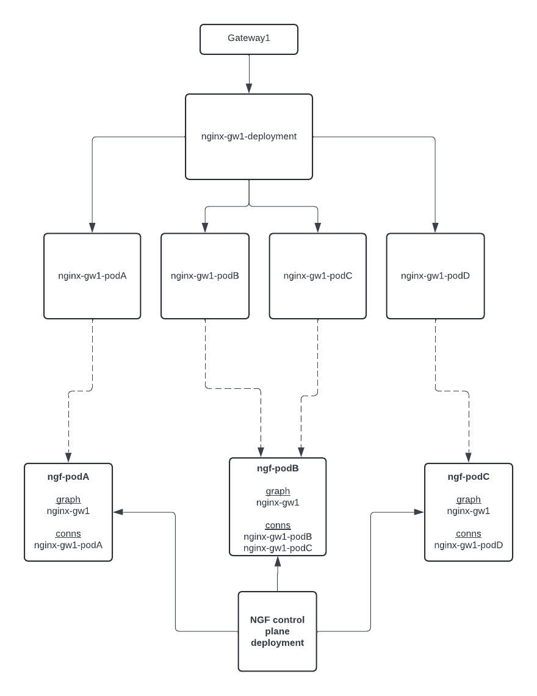
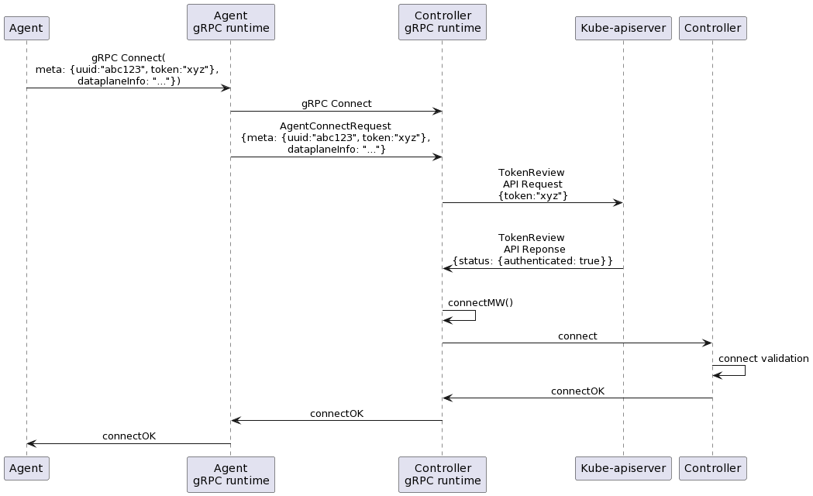

# Proposal-1508: Separation of control and data plane

This document proposes a design for separating the control and data planes.

- Issue https://github.com/nginxinc/nginx-gateway-fabric/issues/1508
- Status: Implementable

## Background

NGF composes its control and data plane containers into a single Kubernetes Pod. The control plane uses OS signals and a
shared file system to configure and reload nginx. This architecture is problematic because the same RBAC policies govern
the control and data planes and share CVE potential. A compromised control plane may impact the customer’s traffic. The
Kubernetes API server may be affected if the data plane is compromised. In addition to security concerns, this
architecture does not allow the control plane and data plane to scale independently.

An added benefit is that this architecture makes it possible for the control plane to provision the data plane, unlocking the ability to support multiple Gateways with a single control plane.

## Goals

- Data plane and control plane containers run in separate Pods
- The communication channel between the control and data planes can be encrypted
- Data planes can register with control plane
- Data plane can scale independently of the control plane
- RBAC policy for data plane follows the principle of least privilege. The data plane should not have access to the
  Kubernetes API server.
- RBAC policy for control plane follows the principle of least privilege.
- Control plane provisions the data plane when a Gateway resource is created.

## Design

We will be using [NGINX Agent v3](https://github.com/nginx/agent/tree/v3) as our agent for the data plane. Our control plane and agent will connect to each other over a secure gRPC channel. The control plane will send nginx configuration updates over the channel using the agent's API, and the agent will write the files and reconfigure nginx.

Whenever a user creates a Gateway resource, the control plane will provision an nginx deployment and service for that Gateway. The nginx/agent deployment will register itself with the control plane, and any Gateway API configuration that is created by a user for that Gateway will be sent to that nginx deployment.

### Deployment Architecture


- _Control Plane Deployment_: The control plane is a Kubernetes Deployment with one container running the NGF
  controller. The control plane will perform the same functions as it does today, but instead of
  configuring nginx by writing files to a shared volume, it will send the configuration to the agent via gRPC.
- _Control Plane Service_: Exposes the control plane via a Kubernetes Service of type `ClusterIP`. The data plane will
  use the DNS name of the Service to connect to the control plane.
- _Data Plane DaemonSet/Deployment_: The data plane can be deployed as either a DaemonSet or Deployment. The data
  plane contains a single container running both the agent and nginx processes. The agent will download the
  configuration from the control plane over a streaming RPC.
- _NGINX Service_: Exposes nginx via a Kubernetes Service of type `LoadBalancer .` This is the entry point for the
  customer’s traffic. Note that this Service should not expose any of the agent’s ports.

#### Further Requirements and Implementation Details

- Both deployments should have read only filesystems.
- Both deployments should have the minimal permissions required to perform their functions.
- The nginx deployment should be configurable via the helm chart.
  - Downside of this is that these options will apply to all nginx instances.
  - We could introduce a CRD, but where would it attach? We already have NginxProxy which controls dynamic data plane configuration, and this may eventually attach to the Gateway instead of just the GatewayClass. Would a Deployment configuration fit in there, and would it be dynamic? That would require us to completely redeploy nginx if a user changes those settings.
  - We could start with the helm chart option, and rely on user feedback to see if we need to get more granular.
  - This could also involve creating a ConfigMap that the control plane consumes on startup and contains all nginx Deployment/Daemonset configuration, including NGINX Plus usage configuration.
- Resources created for the nginx deployment (Service, Secrets, ConfigMap, etc.) should have configurable labels and annotations via the GatewayInfrastructure field in the Gateway resource. See [the GEP](https://gateway-api.sigs.k8s.io/geps/gep-1762/#automated-deployments).
- Control plane creates the nginx deployment and service when a Gateway resource is created, in the same namespace as the Gateway resource. When the Gateway is deleted, the control plane deletes nginx deployment and service.
- Control plane should label the nginx service and deployment with something related to the name of the Gateway so it can easily be linked. See [the GEP](https://gateway-api.sigs.k8s.io/geps/gep-1762/#automated-deployments).
- Liveness/Readiness probes:
  - Control plane probe currently waits until we configure nginx. Going forward, this probe should just be when the control plane is ready to configure, in other words the controller runtime manager has started and returns 200 from its health endpoint.
- Control plane should not restart data plane pods if they are unhealthy. This can either be left in the hands of the users, or if utilizing a liveness probe, Kubernetes will restart the pod.

### Agent Configuration

Using [nginx-agent.conf](https://github.com/nginx/agent/blob/v3/nginx-agent.conf), we can configure the agent on startup. Note that this example conf file may not have all available options. At a minimum, it will need to be configured for the following:

- command server is the NGF ClusterIP service
  - [tls settings](#encryption) for this connection
- prometheus metrics are exposed and available on the expected port (`9113`) and path (`/metrics`)

### Connecting and Registering an Agent

The control plane and agent will communicate over gRPC. The agent will establish a gRPC connection to the control plane
on start-up. The agent will gracefully retry to connect to the control plane, so the start order of the containers is
not an issue. The gRPC runtime will handle the connection establishment and management. If an error occurs or the stream or connection is dropped, the connection must be reestablished.

#### Further Requirements and Implementation Details

- The control plane will need to run a gRPC server for the agent to connect to.
- When an agent connects to the control plane, the payload _should_ contain the hostname (pod name) and nginx instanceID of the registering agent. This can be used to keep track of all agents/pods that are connected.
  - We need to be able to link an agent connection with a subscription. These are two different gRPC calls. `Subscribe` is where we actually send an nginx config to an agent. We need to ensure that we are sending the correct nginx config to the correct agent. Ideally we use metadata from the agent connection (maybe hostname, maybe we need middleware to extract token/uuid from grpc connection headers) and store that in the context. The context is then used in the `Subscribe` call, where we can extract the agent identifier and send the proper nginx config for that identifier.

  Process: agent `Connects` to NGF. We get its identifier and pod name, add the identifier(s) to a context cache, track that connection, and create a subscription channel for it. Agent then `Subscribes`. The context passed in allows us to use the identifier to grab the proper subscription channel and listen on it. This channel will receive a `ConfigApplyRequest` when we have a new nginx config to write.

- If a single nginx deployment is scaled, we should ensure that all instances for that deployment receive the same config (and aren't treated as "different").
- Each Gateway graph that the control plane builds internally should be directly tied to an nginx deployment.
- Whenever the control plane sees an nginx instance become Ready, we send its config to it (it doesn't matter if this is a new pod or a restarted pod).
- If no nginx instances exist, control plane should not send any configuration.
- The control plane should check if a connection exists first before sending the config.
- If the control plane is scaled, then we should mark non-leaders as Unready (return non-200 readiness probe). This will prevent nginx agents from connecting to the non-leaders (k8s removes the Unready Pods from the Endpoint pool), and therefore only the leader will send config and write statuses.
  - We will need to ensure that the leader Pod can handle many nginx connections.



### Agent API

The control plane will need to implement the proper gRPC APIs in order to connect and send configuration to the agent.

Useful references:

- [Basic mock control plane](https://github.com/nginx/agent/tree/v3/test/mock/grpc)
- [Proto definitions](https://github.com/nginx/agent/blob/v3/docs/proto/protos.md)

The gRPC services to implement in the control plane are:

`CommandService`: this handles the connection and subscription to the agent. This will make a `ConfigApplyRequest` when we need to write nginx config. This request will contain a `FileOverview`, which is essentially a list of filenames that are to be sent.

`FileService`: when the agent receives a `ConfigApplyRequest`, it sends a `GetFile` request to this service to download the file contents contained in the original `FileOverview`.

Some API methods will not need to be implemented. For example, `UpdateFile` is used by the agent to send a file that was updated on the agent side to the control plane. In our case, this won't happen since our control plane has full control over the config. Methods relating to this functionality can be stubbed out.

### Metrics

Agent can be configured to expose metrics on a `/metrics` endpoint. Our control plane will need to configure agent to do this so that Prometheus can scrape each agent for nginx metrics.

### NGINX Plus

#### Upstream server state

In the current implementation using NGINX Plus, when only upstream servers change, NGF writes the upstream servers in the nginx config, but does not reload. It then calls the NGINX Plus API to update the servers. This process allows us to update the upstream servers using the API and not have to reload nginx, while still having the upstream servers exist in the nginx config for easy debugging and consistency. However, when using agent, any config write will result in a reload. To preserve the ability to update upstreams with the API without needing a reload, we'll have to utilize a `state` file instead of writing the servers directly in the nginx config. This way the list of servers is still available on the filesystem for debugging, but is written by the nginx when making the API call instead of by the control plane directly.

An example of what this looks like is defined [here](https://docs.nginx.com/nginx/admin-guide/load-balancer/dynamic-configuration-api/#configuring-persistence-of-dynamic-configuration).

#### Secret duplication and synchronization

There are multiple Secrets that an NGINX Plus user can and will be creating. These include:

- JWT Secret for running NGINX Plus
- Docker Registry Secret for pulling NGINX Plus
- Client cert/key Secret for NIM connection
- CA cert Secret for NIM connection

With the new architecture, a user should initially create those Secrets in the nginx-gateway namespace. The control plane will then need to duplicate these Secrets to any namespace where it deploys an nginx instance. This is because the Secrets are mounted to the nginx deployment. The control plane should also update the Secrets if the original Secrets are ever updated, meaning it will have to now watch for Secret updates.

This process must be documented so users are aware that their Secrets are being duplicated into other namespaces.

### Encryption

The agent and control plane communication channel will be encrypted. We will store the server certificate, key pair, and
CA certificate in Kubernetes Secrets. The server Secret will live in the `nginx-gateway` namespace, and the agent Secret will live in the same namespace where the agent is deployed. The Secrets need to exist before the control plane and data planes are deployed.

- `nginx-gateway-cert`: This Secret will contain the TLS certificate and private key that the control plane will use to
  serve gRPC traffic.
- `nginx-agent-cert`: This Secret will contain the CA bundle that validates the control plane’s certificate.

The Secrets will be mounted to the control plane and agent containers, respectively. If desired, we can make the Secret
names and mount path configurable via flags. For production, we will direct the user to provide their own certificates.
For development and testing purposes, we will provide a self-signed default certificate. In order to be secure by
default, NGF should generate the default certificates and keypair during installation using a Kubernetes Job.

Using cert-manager may also be an easy option to reduce the burden of installing and rotating Secrets. A user would need to install this before NGF, and ensure they create agent Secrets before deploying their Gateway resource. We could also tie the NGF control plane directly into cert-manager so that our control plane could create the agent Secrets for the user when they create a Gateway resource, further reducing the burden on the user.

Or we could use SPIRE, which might automate all of this. Potential downside is the need for `hostPath` mounting, which is a security concern.

#### Certificate Rotation

Kubernetes automatically updates mounted Secrets when the content changes, but the control plane
and agent must make sure they are using the latest certificates. We can achieve this by providing a callback in
the [`tls.Config`][tls-config] for the gRPC server and client.

[tls-config]: https://pkg.go.dev/crypto/tls#Config

### Authorization

The agent will use a Kubernetes ServiceAccount token to authenticate with the control plane. The control plane will
authenticate the token by sending a request to the Kubernetes [TokenReview API][token-review].



On start-up the agent will create a gRPC client and connect to the control plane
server using the server address, server token, and TLS options specified in the agent’s
configuration file (see [Agent Configuration](#agent-configuration)). This connection is secured by TLS; see the
[Encryption](#encryption) section for more information. The control plane will validate the token with
Kubernetes by sending a TokenReview API request. If the token is valid, the bidirectional streaming connection
between the agent and the control plane is established and left open for the lifetime of the agent.

#### Long-lived token v/s bound token

Long-lived tokens are JWT tokens for a ServiceAccount that are valid for the lifetime of the ServiceAccount. They are
stored in Secrets and can be mounted to a Pod as a file or an environment variable. We can use the TokenReview API to
verify the token. While long-lived tokens can still be created and used in Kubernetes, bound tokens are now the default
and preferred option.

Bound ServiceAccount tokens are OpenID Connect (OIDC) identity tokens that are obtained directly from
the [TokenRequest API][token-request] and are mounted into Pods using a [projected volume][projected-volume]. Bound
tokens are more secure than long-lived tokens because they are time-bound, audience-bound, and object-bound.

- Time-bound: Bound tokens expire after a configurable amount of time. The default is 1 hour. The kubelet will
  periodically refresh the token before it expires.
- Audience-bound: Bound tokens are only valid for a specific audience. The audience is a string that identifies the
  intended recipient of the token.
- Object-bound: Bound tokens are bound to the Pod.

The TokenReview API only considers a bound token to be valid if the token is not expired, the audience of the token
matches the audience specified in the TokenReview API request, and the Pod that the token is bound to is still present
and running.

Bound tokens expire, and are written to the filesystem by the kubelet. While bound tokens are more secure than
long-lived tokens, the agent needs to be modified to use them. The agent would need to be able to reload the tokens from
the filesystem periodically. That would require the following changes in the agent code:

- Add a new configuration option to specify the path to the token file. Currently, the agent supports reading the token
  from an environment variable or the configuration file, not from a file.
- Modify the gRPC client to fetch the token from a file before connecting to the control plane. Currently, the token is
  loaded on start-up and never refreshed. If the agent reconnects to the control plane, it will use the same token
  provided on start-up.

The agent team has these tasks on their roadmap as of the date of writing this design. However, as a backup plan, we can use the long-lived tokens.

To create the long-lived token, we will provide the following manifest:

```yaml
apiVersion: v1
kind: Secret
metadata:
  name: nginx-agent-token-secret
  annotations:
    kubernetes.io/service-account.name: nginx-agent
type: kubernetes.io/service-account-token
```

And expose the token as an environment variable in the agent container:

```yaml
    env:
    - name: AGENT_SERVER_TOKEN
      valueFrom:
        secretKeyRef:
          name: nginx-agent-token-secret
          key: token
```

The agent will load the token from the `$AGENT_SERVER_TOKEN` environment variable and add it to the `Authorization`
header of the gRPC request when connecting to the control plane.

For a good comparison of long-lived and bound tokens, see [this blog post][bound-token-gke].

[token-review]: https://kubernetes.io/docs/reference/kubernetes-api/authentication-resources/token-review-v1/

[bound-token-gke]: https://cloud.google.com/blog/products/containers-kubernetes/kubernetes-bound-service-account-tokens

[token-request]: https://kubernetes.io/docs/reference/kubernetes-api/authentication-resources/token-request-v1/

[projected-volume]: https://kubernetes.io/docs/reference/access-authn-authz/service-accounts-admin/#bound-service-account-token-volume

## Edge Cases

The following edge cases should be considered and tested during implementation:

- The data plane fails to establish a connection with the control plane.
- Existing connections between data plane and control plane are terminated during a download event.

In these cases, we expect the agent to be resilient. It should not crash or produce invalid config, and it should retry
when possible.

## Performance

Our NFR tests will help ensure that performance of scaling and configuration have not degraded. We also may want to enhance these tests to include scaling nginx deployments.

## Open Questions

- nginx readiness/liveness probe...can agent expose any type of health endpoint?
