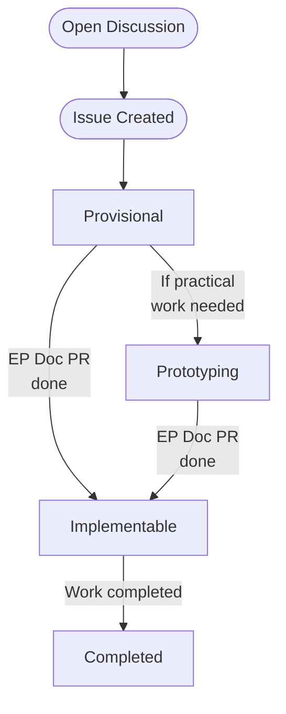

# Enhancement Proposal (EP)

This document describes the process of submitting an Enhancement Proposal (EP). EPs are a way to propose, communicate,
and coordinate on new features for the NGINX Kubernetes Gateway. It is based off of
the [Gateway Enhancement Proposals](https://github.com/kubernetes-sigs/gateway-api/blob/main/geps/overview.md). Their
purpose is to:

- Make changes and proposals discoverable (current and future).
- Provide a common place to discuss design, architecture, and impacts of a particular change.
- Document design ideas, tradeoffs, and decisions for historical reference.

## Process

The diagram below shows the EP process:

### 1. Open a GitHub Discussion

Before creating an issue or EP, open
a [GitHub discussion](https://github.com/nginxinc/nginx-kubernetes-gateway/discussions). Describe the feature you would
like, any use cases you have, and other relevant details. Beginning with a discussion allows you to get feedback from
the maintainers and the community before you invest time in writing an EP.

### 2. Create an Issue

If there is consensus on the discussion post that the feature is important and should be included in the roadmap, a
maintainer will ask you
to [open an issue](https://github.com/nginxinc/nginx-kubernetes-gateway/issues/new?assignees=&labels=proposal&projects=&template=enhancement.md&title=)
on GitHub.

### 3. Agree on the Goals (Provisional)

The first version of your EP should include a summary of the feature and sections addressing the "Goals" and Non-Goals."
The purpose of this initial EP is to achieve consensus on the objectives before filling out the details of
implementation. Once this version of the EP is approved, designate it as "Provisional."

### 4. Document Implementation Details

Once the goals are set, begin filling out the implementation details. The details should include the following:

- APIs and customer driven interfaces -- this includes CLI arguments, public libraries and SDKs, API resources and
  objects.
- Use cases.
- Security considerations.
- User experience and user interface changes.
- Testing plans and considerations.
- References.
- Any alternatives considered and why we decided against them.

Once the EP is merged, mark it as "Implementable".

### 5. Prototype (optional)

In some cases, you may be asked or want to create a prototype of the design. Prototypes are a good way to get early
feedback about the implementation without investing too much time and effort on the small details. When creating a
prototype of an EP, mark the EP as "Prototyping" and open a Draft PR. If the prototype is approved, you can move on to
the next stage. Otherwise, you may be asked to make changes to the design and resubmit the EP as "Provisional".

Note that the prototype is not expected to be merged, but should be used as a way to move an EP from "Provisional" to "
Implementable".

### 6. Implement

Once the EP is marked as "Implementable", you can start implementing the proposed changes. Once the changes have been
merged, the EP issue should be closed and the EP should be marked as "Completed".

## Status

Each EP has a status field that defines its current state. Each transition will require a PR to update the EP.

* **Provisional:** The goals described by this EP have consensus but implementation details have not been agreed to yet.
* **Prototyping:** An extension of `Provisional` which can be opted in to in order to indicate that there are some
  active practical tests and experiments going on which are intended to be a part of the development of this EP.
* **Implementable:** The goals and implementation details described by this EP have consensus but have not been fully
  implemented yet.
* **Completed:** This EP has been implemented.

Although less common, some EPs may end up in one of the following states:

* **Deferred:** We do not currently have bandwidth to handle this EP, it may be revisited in the future.
* **Rejected:** This proposal was considered but ultimately rejected.
* **Replaced:** This proposal was considered but ultimately replaced by a newer proposal.
* **Withdrawn:** This proposal was considered but ultimately withdrawn by the author.

## Format

EPs should match the format of this [template](template.md).

## Out of scope

The following is out of scope for EPs:

* Bug fixes
* Gateway API features. However, some larger Gateway API features may require EPs if they require significant changes to the
  architecture of the code.
* Small changes (validation, documentation, fixups). It is always possible that the reviewers will determine a "small"
  change ends up requiring a EP.
