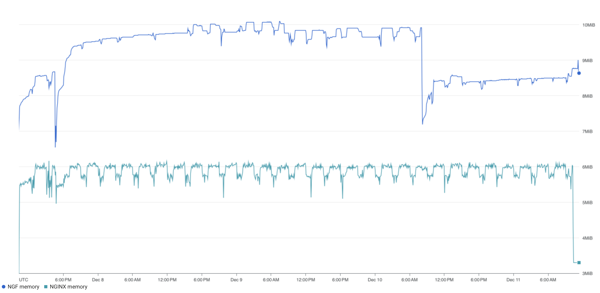
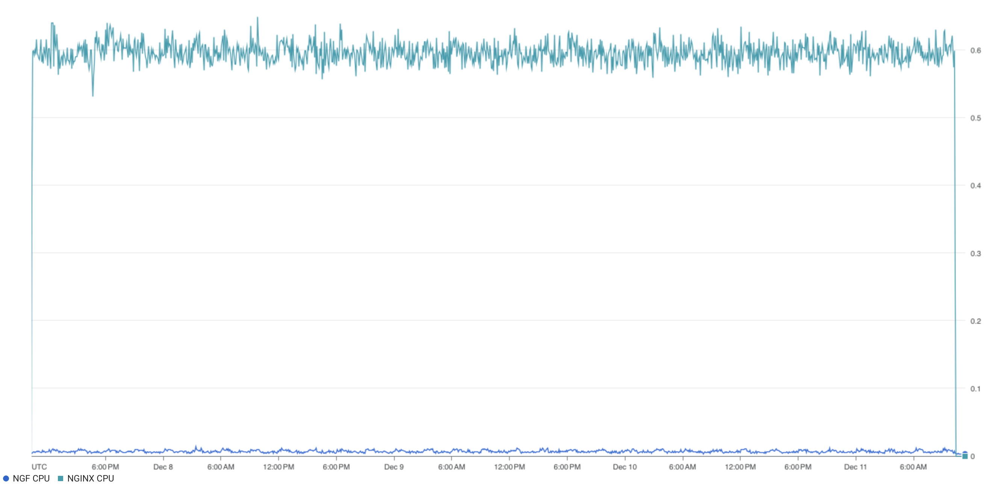

# Results for v1.1.0

<!-- TOC -->

- [Results for v1.1.0](#results-for-v110)
  - [Versions](#versions)
  - [Traffic](#traffic)
    - [NGF](#ngf)
      - [Error Log](#error-log)
    - [NGINX](#nginx)
      - [Error Log](#error-log-1)
      - [Access Log](#access-log)
  - [Key Metrics](#key-metrics)
    - [Containers memory](#containers-memory)
    - [Containers CPU](#containers-cpu)
    - [NGINX metrics](#nginx-metrics)
    - [Reloads](#reloads)
  - [Existing Issues still relevant](#existing-issues-still-relevant)

<!-- TOC -->

## Versions

NGF version:

```text
commit: "21a2507d3d25ac0428384dce2c042799ed28b856"
date: "2023-12-06T23:47:17Z"
version: "edge"
```

with NGINX:

```text
nginx/1.25.3
built by gcc 12.2.1 20220924 (Alpine 12.2.1_git20220924-r10)
OS: Linux 5.15.109+
```

Kubernetes:

```text
Server Version: version.Info{Major:"1", Minor:"27", GitVersion:"v1.27.5-gke.200", GitCommit:"f9aad8e51abb509136cb82b4a00cc3d77d3d70d9", GitTreeState:"clean", BuildDate:"2023-08-26T23:26:22Z", GoVersion:"go1.20.7 X:boringcrypto", Compiler:"gc", Platform:"linux/amd64"}
```

## Traffic

HTTP:

```text
wrk -t2 -c100 -d96h http://cafe.example.com/coffee

Running 5760m test @ http://cafe.example.com/coffee
  2 threads and 100 connections
  Thread Stats   Avg      Stdev     Max   +/- Stdev
    Latency   182.30ms  146.48ms   2.00s    82.86%
    Req/Sec   306.26    204.19     2.18k    65.75%
  207104807 requests in 5760.00m, 72.17GB read
  Socket errors: connect 0, read 362418, write 218736, timeout 19693
Requests/sec:    599.26
Transfer/sec:    218.97KB
```

HTTPS:

```text
wrk -t2 -c100 -d96h https://cafe.example.com/tea

Running 5760m test @ https://cafe.example.com/tea
  2 threads and 100 connections
  Thread Stats   Avg      Stdev     Max   +/- Stdev
    Latency   172.15ms  118.59ms   2.00s    68.16%
    Req/Sec   305.26    203.43     2.33k    65.34%
  206387831 requests in 5760.00m, 70.81GB read
  Socket errors: connect 44059, read 356656, write 0, timeout 126
Requests/sec:    597.19
Transfer/sec:    214.84KB
```

While there are socket errors in the output, there are no connection-related errors in NGINX logs.
Further investigation is out of scope of this test.

### NGF

#### Error Log

```text
resource.type="k8s_container"
resource.labels.cluster_name="ciara-1"
resource.labels.namespace_name="nginx-gateway"
resource.labels.container_name="nginx-gateway"
severity=ERROR
SEARCH("error")
```

There were 36 error logs across 2 pod instances. They came in 2 almost identical batches, one on the first day of
running the test, after approximately 6 hours, and the second 2.5 days later. They were both relating to leader election
loss, and subsequent restart (see https://github.com/nginxinc/nginx-gateway-fabric/issues/1100).

Both error batches caused the pod to restart, but not terminate. However, the first pod was terminated about 10 minutes
after the first error batch and subsequent restart occurred. Exactly why this pod was terminated is not currently clear,
but it looks to be a cluster event (perhaps an upgrade) as the coffee and tea pods were terminated at that time also.
Strangely, there were 6 pod restarts in total of the second pod, but no other errors were observed over the test period
other than what was seen above, and grepping the logs for start-up logs only produced the 2 known restarts relating to
the leader election loss, plus initial start-up of both pods (4 in total).

```console
kubectl get pods -n nginx-gateway
NAME                                               READY   STATUS    RESTARTS      AGE
my-release-nginx-gateway-fabric-78d4b84447-4hss5   2/2     Running   6 (31h ago)   3d22h
```

### NGINX

#### Error Log

Errors:

```text
resource.type=k8s_container AND
resource.labels.pod_name="my-release-nginx-gateway-fabric-78d4b84447-4hss5" AND
resource.labels.container_name="nginx" AND
severity=ERROR AND
SEARCH("`[warn]`") OR SEARCH("`[error]`")
```

No entries found.

#### Access Log

Non-200 response codes in NGINX access logs:

```text
resource.type=k8s_container AND
resource.labels.pod_name="my-release-nginx-gateway-fabric-78d4b84447-4hss5" AND
resource.labels.container_name="nginx"
"GET" "HTTP/1.1" -"200"
```

No such responses.

## Key Metrics

### Containers memory



Memory usage dropped twice which appears to correspond with the restarts seen above relating to leader election.
Interestingly, before the first restart and after the second restart, memory usage sat at about 8.5MiB, but for the
majority of the test run, memory usage was about 9.5-10MiB. The previous release test run also had memory usage at
about 9-10MiB, but more stable usage across the duration of the test. However, there were no restarts observed in the
v1.0.0 test run. I don't think there is anything to investigate here.

### Containers CPU



No unexpected spikes or drops.

### NGINX metrics

In this test, NGINX metrics were not correctly exported so no dashboards are available for these.

### Reloads

In this test, NGINX metrics were not correctly exported so no dashboards are available for these.

Reload related metrics at the end:

```text
# TYPE nginx_gateway_fabric_nginx_reloads_milliseconds histogram
nginx_gateway_fabric_nginx_reloads_milliseconds_bucket{class="nginx",le="500"} 1647
nginx_gateway_fabric_nginx_reloads_milliseconds_bucket{class="nginx",le="1000"} 4043
nginx_gateway_fabric_nginx_reloads_milliseconds_bucket{class="nginx",le="5000"} 4409
nginx_gateway_fabric_nginx_reloads_milliseconds_bucket{class="nginx",le="10000"} 4409
nginx_gateway_fabric_nginx_reloads_milliseconds_bucket{class="nginx",le="30000"} 4409
nginx_gateway_fabric_nginx_reloads_milliseconds_bucket{class="nginx",le="+Inf"} 4409
nginx_gateway_fabric_nginx_reloads_milliseconds_sum{class="nginx"} 2.701667e+06
nginx_gateway_fabric_nginx_reloads_milliseconds_count{class="nginx"} 4409
# HELP nginx_gateway_fabric_nginx_reloads_total Number of successful NGINX reloads
# TYPE nginx_gateway_fabric_nginx_reloads_total counter
nginx_gateway_fabric_nginx_reloads_total{class="nginx"} 4409
```

All successful reloads took less than 5 seconds, with most (>90%) under 1 second.

## Existing Issues still relevant

- NGF unnecessary reloads NGINX when it reconciles
  Secrets - https://github.com/nginxinc/nginx-gateway-fabric/issues/1112
- Use NGF Logger in Client-Go Library - https://github.com/nginxinc/nginx-gateway-fabric/issues/1101
