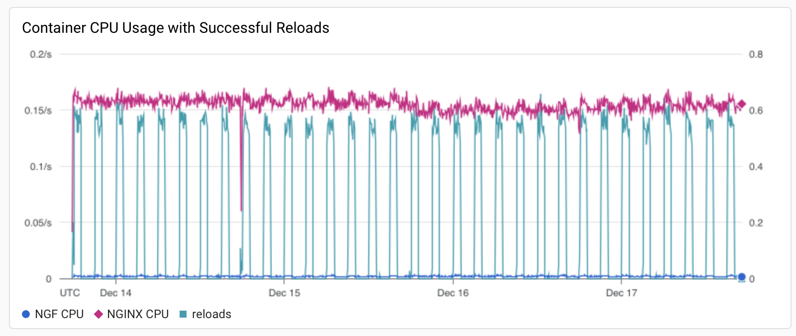

# Results for v1.1.0

<!-- TOC -->

- [Results for v1.1.0](#results-for-v110)
  - [Versions](#versions)
  - [Traffic](#traffic)
    - [NGF](#ngf)
      - [Error Log](#error-log)
    - [NGINX](#nginx)
      - [Error Log](#error-log-1)
      - [Access Log](#access-log)
  - [Key Metrics](#key-metrics)
    - [Containers memory](#containers-memory)
    - [Containers CPU](#containers-cpu)
    - [NGINX metrics](#nginx-metrics)
    - [Reloads](#reloads)
  - [Existing Issues still relevant](#existing-issues-still-relevant)

<!-- TOC -->

## Versions

NGF version:

```text
commit: "7e075c636f1a40e6dc849c6bb9ba288c9801bd4a"
date: "2023-12-13T17:45:06Z"
version: "edge"
```

with NGINX:

```text
nginx/1.25.3
built by gcc 12.2.1 20220924 (Alpine 12.2.1_git20220924-r10)
OS: Linux 5.15.109+
```

Kubernetes:

```text
Server Version: version.Info{Major:"1", Minor:"27", GitVersion:"v1.27.5-gke.200", GitCommit:"f9aad8e51abb509136cb82b4a00cc3d77d3d70d9", GitTreeState:"clean", BuildDate:"2023-08-26T23:26:22Z", GoVersion:"go1.20.7 X:boringcrypto", Compiler:"gc", Platform:"linux/amd64"}
```

## Traffic

HTTP:

```text
wrk -t2 -c100 -d96h http://cafe.example.com/coffee

Running 5760m test @ http://cafe.example.com/coffee
  2 threads and 100 connections
  Thread Stats   Avg      Stdev     Max   +/- Stdev
    Latency   177.87ms  143.16ms   2.00s    82.78%
    Req/Sec   314.21    211.96     2.32k    65.78%
  212474192 requests in 5760.00m, 74.08GB read
  Socket errors: connect 0, read 346218, write 508394, timeout 10574
Requests/sec:    614.80
Transfer/sec:    224.78KB
```

HTTPS:

```text
wrk -t2 -c100 -d96h https://cafe.example.com/tea

Running 5760m test @ https://cafe.example.com/tea
  2 threads and 100 connections
  Thread Stats   Avg      Stdev     Max   +/- Stdev
    Latency   168.63ms  118.44ms   2.00s    69.72%
    Req/Sec   313.02    210.77     2.31k    65.50%
  211667319 requests in 5760.00m, 72.65GB read
  Socket errors: connect 80661, read 338673, write 0, timeout 147
Requests/sec:    612.46
Transfer/sec:    220.42KB
```

While there are socket errors in the output, there are no connection-related errors in NGINX logs.
Further investigation is out of scope of this test.

### NGF

#### Error Log

```text
resource.type="k8s_container"
resource.labels.cluster_name="<CLUSTER_NAME>"
resource.labels.namespace_name="nginx-gateway"
resource.labels.container_name="nginx-gateway"
severity=ERROR
SEARCH("error")
```

There were 53 error logs, and 6 restarts, across 3 pod instances. The error logs came in 3 almost identical batches,
starting just over 24 hours after the initial deployment, and then each subsequent error batch just over 24 hours after
the last. They were all relating to leader election loss, and subsequent restart (see https://github.com/nginx/nginx-gateway-fabric/issues/1100). There were also 2 termination events, both of these occurred approximately 5 minutes
after a leader election loss and successful restart.

Each error batches caused the pod to restart, but not terminate. The first pod was terminated about 5 minutes
after the first error batch and subsequent restart occurred. A similar occurance happened after the third error batch.
There was no termination event after the second error batch. Exactly why these pods were terminated is not currently
clear, but it looks to be a cluster event (perhaps an upgrade) as the coffee and tea pods were terminated at that time
also. All the restarts happened roughly at the same time each day.

```text
{"level":"info", "msg":"Starting manager", "ts":"2023-12-13T17:45:10Z"} -> Start-up
{"level":"info", "msg":"Starting manager", "ts":"2023-12-14T17:43:11Z"} -> First error batch
{"level":"info", "msg":"Starting manager", "ts":"2023-12-14T17:47:36Z"} -> First pod terminated, second pod start
{"level":"info", "msg":"Starting manager", "ts":"2023-12-15T17:47:22Z"} -> Second error batch
{"level":"info", "msg":"Starting manager", "ts":"2023-12-16T17:52:21Z"} -> Third error batch
{"level":"info", "msg":"Starting manager", "ts":"2023-12-16T17:58:01Z"} -> Second pod terminated, third pod start
```

### NGINX

#### Error Log

Errors:

```text
resource.type=k8s_container AND
resource.labels.cluster_name="<CLUSTER_NAME>" AND
resource.labels.container_name="nginx" AND
severity=ERROR AND
SEARCH("`[warn]`") OR SEARCH("`[error]`")
```

No entries found.

#### Access Log

Non-200 response codes in NGINX access logs:

```text
resource.type=k8s_container AND
resource.labels.cluster_name="<CLUSTER_NAME>" AND
resource.labels.container_name="nginx"
"GET" "HTTP/1.1" -"200"
```

No such responses.

## Key Metrics

### Containers memory


Memory usage dropped once which appears to correspond with a restart event seen above relating to leader election.
There did seem to be a creeping up of memory before this restart, and then memory usage remained consistent for the rest
of the test. Memory usage was slightly higher than what was observed in the v1.0.0 longevity test, but unless we see
this trending upwards on future longevity tests, I don't think there is anything to investigate here.

### Containers CPU



One drop in NGINX CPU that corresponds with a Pod termination event.

### NGINX metrics


The drop of _requests_ on Dec 16 corresponds to a Pod termination event. There are no correlated errors in NGINX logs.

### Reloads

Rate of reloads - successful and errors:


Reload spikes correspond to 1 hour periods of backend re-rollouts.
However, small spikes, correspond to periodic reconciliation of Secrets, which (incorrectly)
triggers a reload -- https://github.com/nginx/nginx-gateway-fabric/issues/1112

No reloads finished with an error.

Reload time distribution with 50th, 95th and 99th percentiles and the threshold:


Note - 60s is the threshold for waiting for NGINX to be reloaded.
Reload related metrics at the end:

```text
# HELP nginx_gateway_fabric_nginx_reloads_milliseconds Duration in milliseconds of NGINX reloads
# TYPE nginx_gateway_fabric_nginx_reloads_milliseconds histogram
nginx_gateway_fabric_nginx_reloads_milliseconds_bucket{class="nginx",le="500"} 4626
nginx_gateway_fabric_nginx_reloads_milliseconds_bucket{class="nginx",le="1000"} 6831
nginx_gateway_fabric_nginx_reloads_milliseconds_bucket{class="nginx",le="5000"} 7317
nginx_gateway_fabric_nginx_reloads_milliseconds_bucket{class="nginx",le="10000"} 7317
nginx_gateway_fabric_nginx_reloads_milliseconds_bucket{class="nginx",le="30000"} 7317
nginx_gateway_fabric_nginx_reloads_milliseconds_bucket{class="nginx",le="+Inf"} 7317
nginx_gateway_fabric_nginx_reloads_milliseconds_sum{class="nginx"} 3.060948e+06
nginx_gateway_fabric_nginx_reloads_milliseconds_count{class="nginx"} 7317
# HELP nginx_gateway_fabric_nginx_reloads_total Number of successful NGINX reloads
# TYPE nginx_gateway_fabric_nginx_reloads_total counter
nginx_gateway_fabric_nginx_reloads_total{class="nginx"} 7317
```

All successful reloads took less than 5 seconds, with most (>90%) under 1 second.

## Existing Issues still relevant

- NGF unnecessary reloads NGINX when it reconciles Secrets - https://github.com/nginx/nginx-gateway-fabric/issues/1112
- Use NGF Logger in Client-Go Library - https://github.com/nginx/nginx-gateway-fabric/issues/1101
