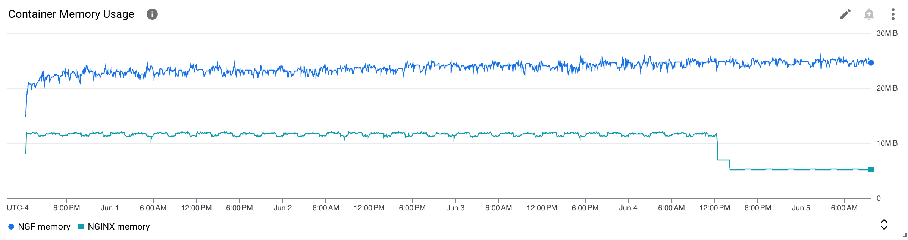
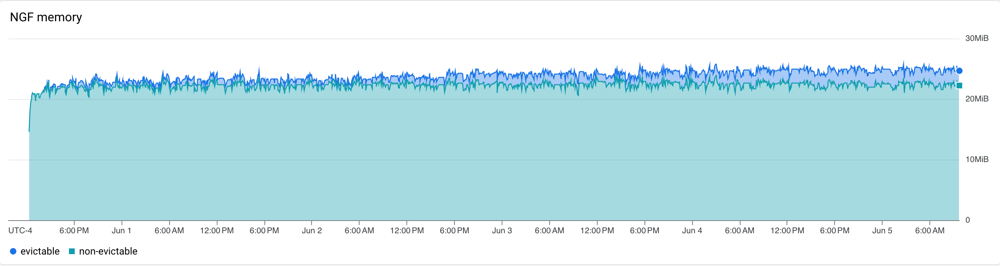
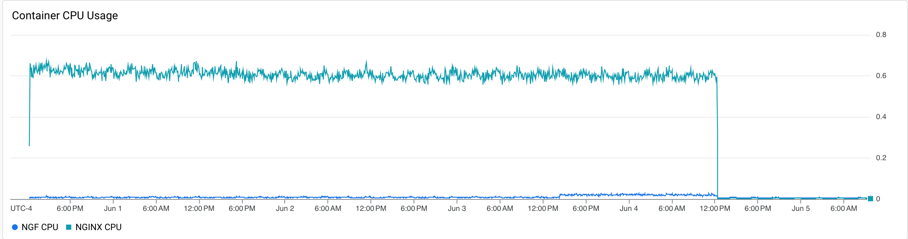
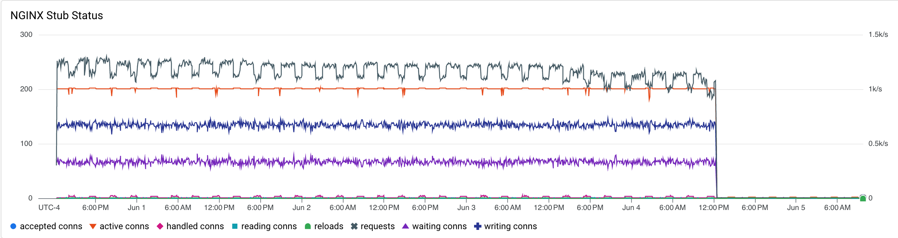
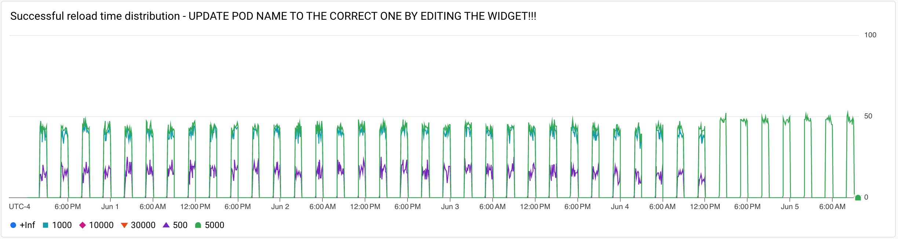

# Results

## Test environment

NGINX Plus: false

GKE Cluster:

- Node count: 3
- k8s version: v1.28.9-gke.1000000
- vCPUs per node: 2
- RAM per node: 4019180Ki
- Max pods per node: 110
- Zone: us-central1-c
- Instance Type: e2-medium
- NGF pod name -- ngf-longevity-nginx-gateway-fabric-59576c5749-dgrwg

## Traffic

HTTP:

```text
Running 5760m test @ http://cafe.example.com/coffee
  2 threads and 100 connections
  Thread Stats   Avg      Stdev     Max   +/- Stdev
    Latency   186.26ms  145.81ms   2.00s    78.32%
    Req/Sec   299.23    199.98     1.80k    66.54%
  202451765 requests in 5760.00m, 70.37GB read
  Socket errors: connect 0, read 338005, write 0, timeout 4600
Requests/sec:    585.80
Transfer/sec:    213.51KB
```

HTTPS:

```text
Running 5760m test @ https://cafe.example.com/tea
  2 threads and 100 connections
  Thread Stats   Avg      Stdev     Max   +/- Stdev
    Latency   177.05ms  122.73ms   1.98s    67.91%
    Req/Sec   298.12    199.66     1.83k    66.52%
  201665338 requests in 5760.00m, 69.02GB read
  Socket errors: connect 0, read 332742, write 0, timeout 40
Requests/sec:    583.52
Transfer/sec:    209.42KB
```

### Logs

No error logs in nginx-gateway

No error logs in nginx

### Key Metrics

#### Containers memory



Drop in NGINX memory usage corresponds to the end of traffic generation.

#### NGF Container Memory



### Containers CPU



Drop in NGINX CPU usage corresponds to the end of traffic generation.

### NGINX metrics



Drop in request corresponds to the end of traffic generation.


### Reloads

Rate of reloads - successful and errors:


Reload spikes correspond to 1 hour periods of backend re-rollouts.

No reloads finished with an error.

Reload time distribution - counts:




Reload related metrics at the end:


All successful reloads took less than 5 seconds, with most under 1 second.

## Comparison with previous runs

Graphs look similar to 1.2.0 results.
As https://github.com/nginxinc/nginx-gateway-fabric/issues/1112 was fixed, we no longer see the corresponding
reload spikes.
Memory usage is flat, but ~1 Mb higher than in 1.2.0.
