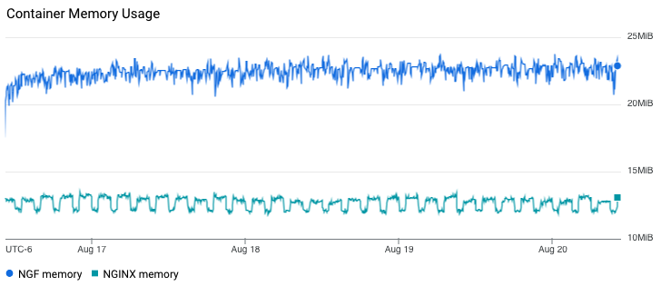
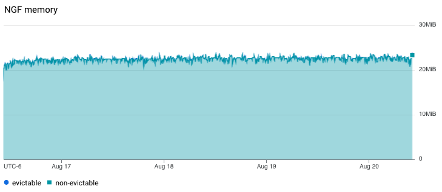
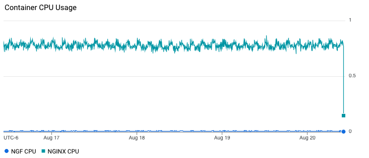
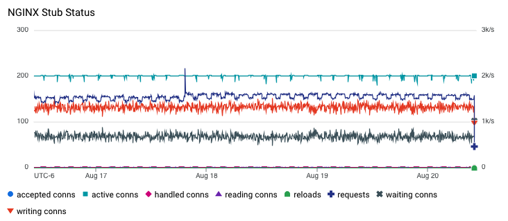
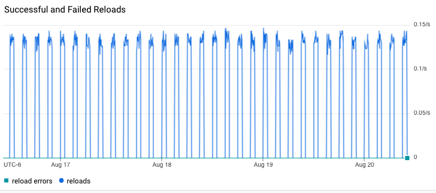
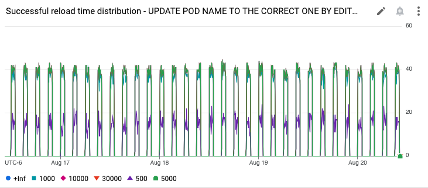

# Results

## Test environment

NGINX Plus: false

NGINX Gateway Fabric:

- Commit: f765b79b6cb76bf18affd138604ca0ee12f57a19
- Date: 2024-08-15T21:46:21Z
- Dirty: false

GKE Cluster:

- Node count: 12
- k8s version: v1.29.7-gke.1008000
- vCPUs per node: 2
- RAM per node: 4019160Ki
- Max pods per node: 110
- Zone: us-west2-a
- Instance Type: e2-medium

## Traffic

HTTP:

```text
Running 5760m test @ http://cafe.example.com/coffee
  2 threads and 100 connections
  Thread Stats   Avg      Stdev     Max   +/- Stdev
    Latency   139.11ms  117.12ms   2.00s    91.14%
    Req/Sec   396.68    259.55     2.08k    65.79%
  268947649 requests in 5760.00m, 92.04GB read
  Socket errors: connect 0, read 344704, write 0, timeout 565
Requests/sec:    778.20
Transfer/sec:    279.25KB
```

HTTPS:

```text
Running 5760m test @ https://cafe.example.com/tea
  2 threads and 100 connections
  Thread Stats   Avg      Stdev     Max   +/- Stdev
    Latency   131.64ms   94.48ms   1.99s    70.49%
    Req/Sec   395.26    259.07     2.08k    65.47%
  267943878 requests in 5760.00m, 90.15GB read
  Socket errors: connect 0, read 338530, write 0, timeout 9
Requests/sec:    775.30
Transfer/sec:    273.51KB
```

### Logs

No error logs in nginx-gateway

No error logs in nginx

### Key Metrics

#### Containers memory



#### NGF Container Memory



### Containers CPU



### NGINX metrics



### Reloads

Rate of reloads - successful and errors:




Reload spikes correspond to 1 hour periods of backend re-rollouts.

No reloads finished with an error.

Reload time distribution - counts:



## Comparison with previous runs

Graphs look similar to 1.3.0 results.
