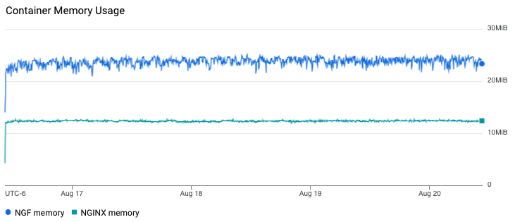
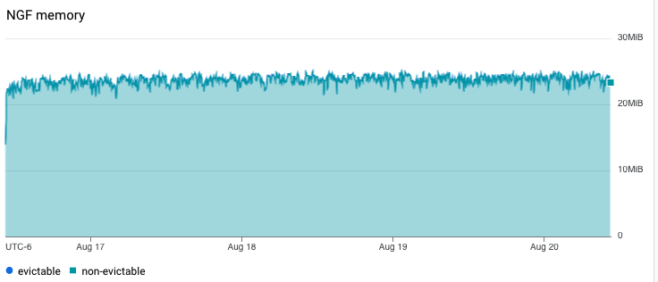
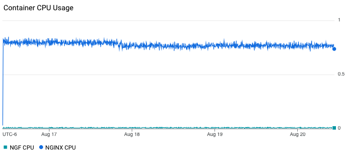
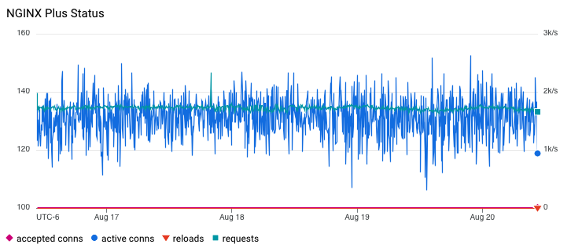
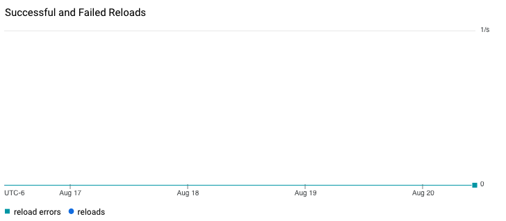

# Results

## Test environment

NGINX Plus: true

NGINX Gateway Fabric:

- Commit: 16a95222a968aef46277a77070f79bea9b87da12
- Date: 2024-08-16T15:29:44Z
- Dirty: false

GKE Cluster:

- Node count: 12
- k8s version: v1.29.7-gke.1008000
- vCPUs per node: 2
- RAM per node: 4019160Ki
- Max pods per node: 110
- Zone: us-west2-a
- Instance Type: e2-medium

## Traffic

HTTP:

```text
Running 5760m test @ http://cafe.example.com/coffee
  2 threads and 100 connections
  Thread Stats   Avg      Stdev     Max   +/- Stdev
    Latency   121.06ms   88.32ms   1.69s    70.69%
    Req/Sec   439.03    284.47     2.18k    65.18%
  297838416 requests in 5760.00m, 101.94GB read
  Non-2xx or 3xx responses: 9
Requests/sec:    861.80
Transfer/sec:    309.28KB
```

HTTPS:

```text
Running 5760m test @ https://cafe.example.com/tea
  2 threads and 100 connections
  Thread Stats   Avg      Stdev     Max   +/- Stdev
    Latency   121.25ms   88.41ms   1.56s    70.69%
    Req/Sec   438.02    283.40     2.19k    65.30%
  297157634 requests in 5760.00m, 100.04GB read
  Non-2xx or 3xx responses: 1
Requests/sec:    859.83
Transfer/sec:    303.52KB
```

Note: Non-2xx or 3xx responses correspond to the error in NGINX log, see below.

### Logs

nginx-gateway:

a lot of expected "usage reporting not enabled" errors.

nginx:

```text
2024/06/01 21:34:09 [error] 104#104: *115862644 no live upstreams while connecting to upstream, client: 10.128.0.112, server: cafe.example.com, request: "GET /tea HTTP/1.1", upstream: "http://longevity_tea_80/tea", host: "cafe.example.com"
2024/06/03 12:01:07 [error] 105#105: *267137988 no live upstreams while connecting to upstream, client: 10.128.0.112, server: cafe.example.com, request: "GET /coffee HTTP/1.1", upstream: "http://longevity_coffee_80/coffee", host: "cafe.example.com"
```

Similar to last release.

### Key Metrics

#### Containers memory



#### NGF Container Memory



### Containers CPU



### NGINX Plus metrics



### Reloads

Rate of reloads - successful and errors:



Note: compared to NGINX, we don't have as many reloads here, because NGF uses NGINX Plus API to reconfigure NGINX
for endpoints changes.

## Comparison with previous runs

Graphs look similar to 1.3.0 results.
