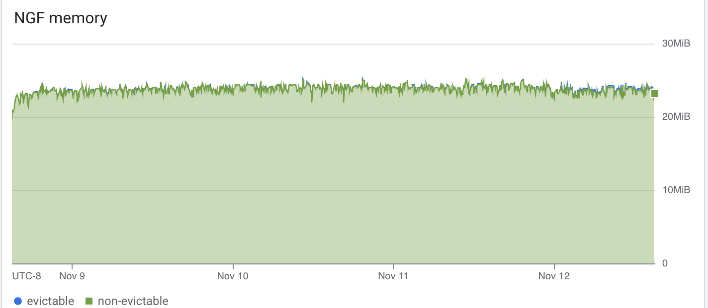
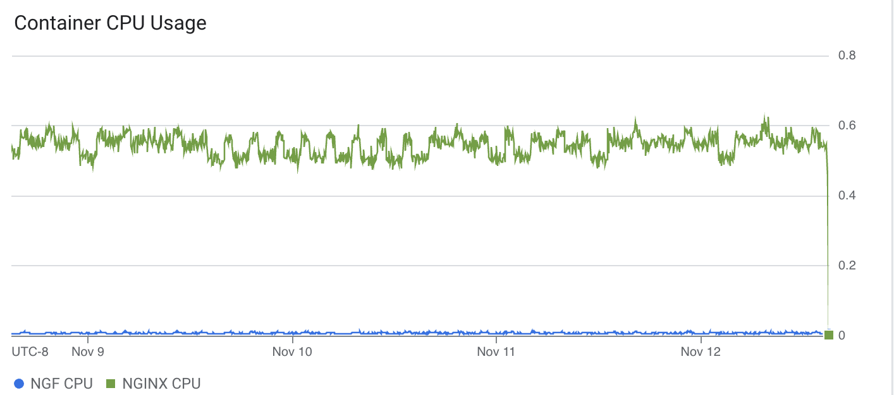
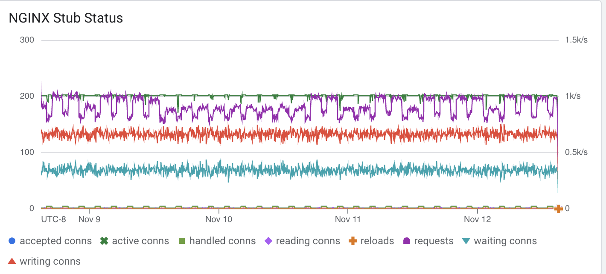
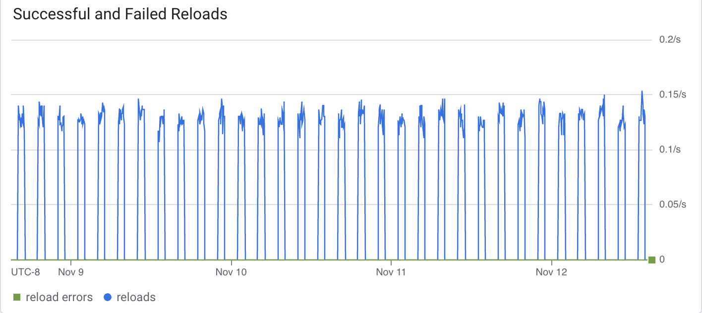
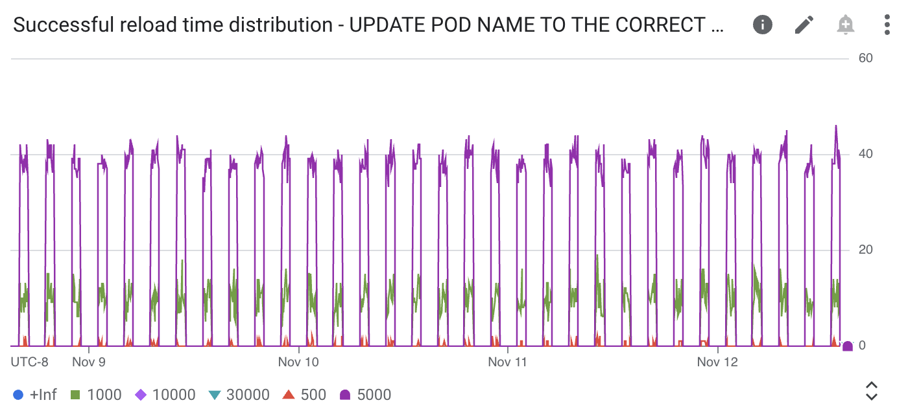

# Results

## Test environment

NGINX Plus: false

NGINX Gateway Fabric:

- Commit: 36f245bcba55935064324ff5803d66110117f7da
- Date: 2024-11-08T19:20:48Z
- Dirty: false

GKE Cluster:

- Node count: 2
- k8s version: v1.30.5-gke.1443001
- vCPUs per node: 2
- RAM per node: 4018120Ki
- Max pods per node: 110
- Zone: us-west2-a
- Instance Type: e2-medium

## Traffic

HTTP:

```text
Running 5760m test @ http://cafe.example.com/coffee
  2 threads and 100 connections
  Thread Stats   Avg      Stdev     Max   +/- Stdev
    Latency   236.88ms  177.22ms   2.00s    72.93%
    Req/Sec   232.09    156.40     1.90k    66.16%
  156451087 requests in 5760.00m, 53.52GB read
  Socket errors: connect 0, read 350645, write 0, timeout 75472
Requests/sec:    452.69
Transfer/sec:    162.39KB
KB
```

HTTPS:

```text
Running 5760m test @ https://cafe.example.com/tea
  2 threads and 100 connections
  Thread Stats   Avg      Stdev     Max   +/- Stdev
    Latency   223.09ms  138.95ms   2.00s    63.95%
    Req/Sec   230.23    155.14     1.80k    66.18%
  155166081 requests in 5760.00m, 52.20GB read
  Socket errors: connect 0, read 345712, write 0, timeout 176
Requests/sec:    448.98
Transfer/sec:    158.37KB

```


### Logs

No error logs in nginx-gateway

Error logs in nginx

### Key Metrics

#### Containers memory


#### NGF Container Memory



### Containers CPU



### NGINX metrics



### Reloads

Rate of reloads - successful and errors:



Reload spikes correspond to 1 hour periods of backend re-rollouts.

No reloads finished with an error.

Reload time distribution - counts:




## Comparison with previous runs

Graphs look similar to 1.4.0 results.
