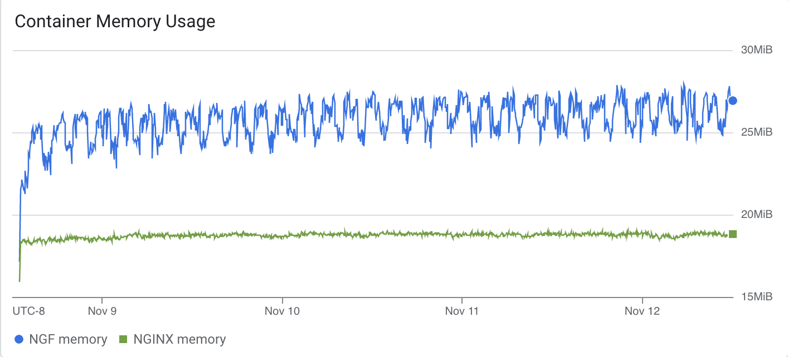
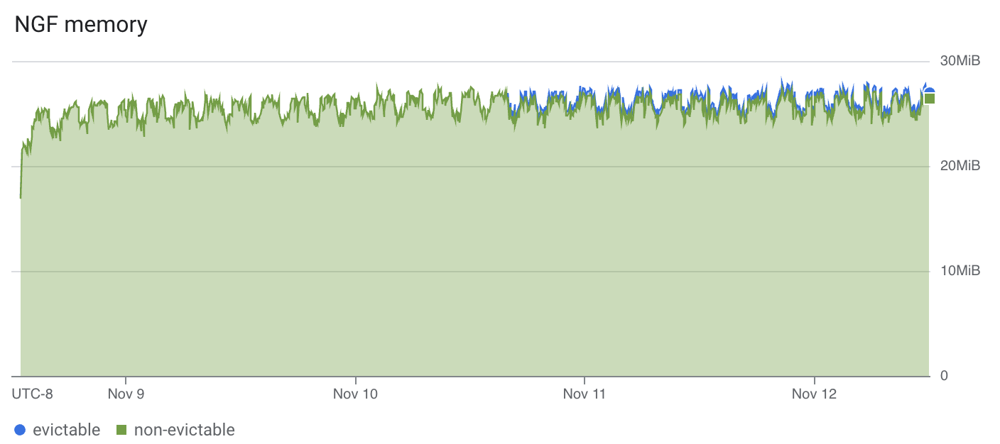
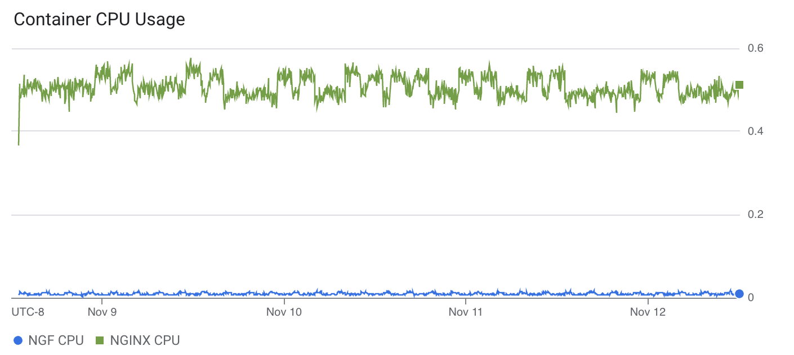
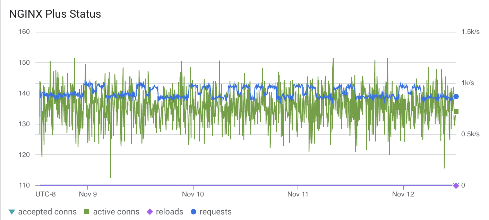
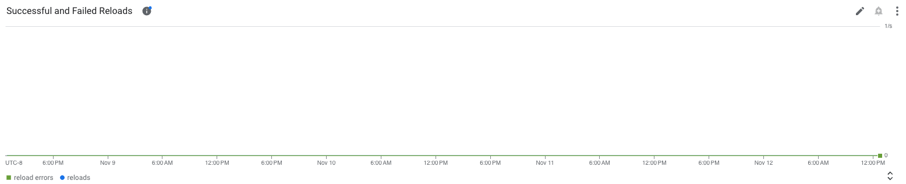

# Results

## Test environment

NGINX Plus: true

NGINX Gateway Fabric:

- Commit: 36f245bcba55935064324ff5803d66110117f7da
- Date: 2024-11-08T19:20:48Z
- Dirty: false

GKE Cluster:

- Node count: 2
- k8s version: v1.30.5-gke.1443001
- vCPUs per node: 2
- RAM per node: 4018120Ki
- Max pods per node: 110
- Zone: us-west2-a
- Instance Type: e2-medium

## Traffic

HTTP:

```text
Running 5760m test @ http://cafe.example.com/coffee
  2 threads and 100 connections
  Thread Stats   Avg      Stdev     Max   +/- Stdev
    Latency   228.08ms  136.20ms   1.92s    63.92%
    Req/Sec   232.02    153.44     1.71k    66.90%
  156457702 requests in 5760.00m, 53.53GB read
  Non-2xx or 3xx responses: 5
Requests/sec:    452.71
Transfer/sec:    162.41KB
```

HTTPS:

```text
Running 5760m test @ https://cafe.example.com/tea
  2 threads and 100 connections
  Thread Stats   Avg      Stdev     Max   +/- Stdev
    Latency   229.75ms  136.23ms   1.92s    63.81%
    Req/Sec   229.91    151.31     1.63k    66.59%
  155060805 requests in 5760.00m, 52.19GB read
  Non-2xx or 3xx responses: 3
Requests/sec:    448.67
Transfer/sec:    158.33KB
```

### Logs

No error logs in nginx-gateway

Error logs in nginx

We could not get non-2xx errors from the cluster but should likely be similar to last release's issues.


### Key Metrics

#### Containers memory



#### NGF Container Memory



### Containers CPU



### NGINX Plus metrics



### Reloads

Rate of reloads - successful and errors:



Note: compared to NGINX, we don't have as many reloads here, because NGF uses NGINX Plus API to reconfigure NGINX
for endpoints changes.

## Comparison with previous runs

Graphs look similar to 1.4.0 results.
