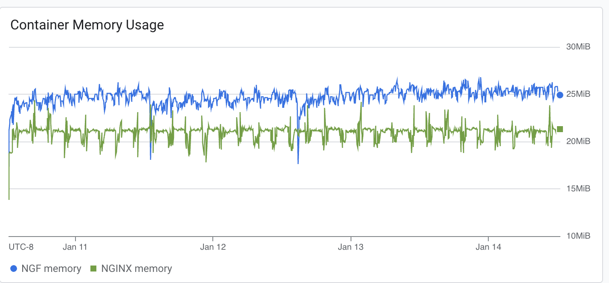
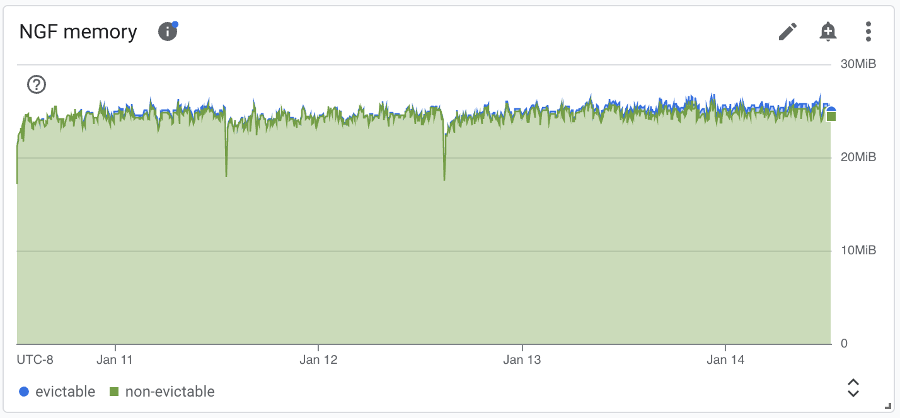
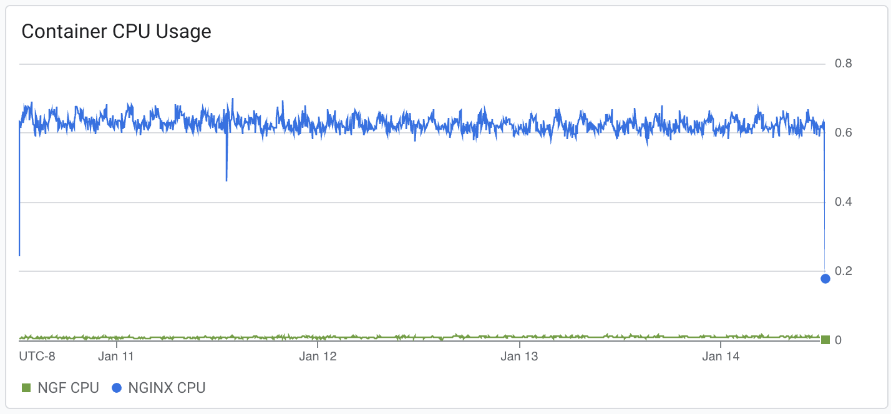
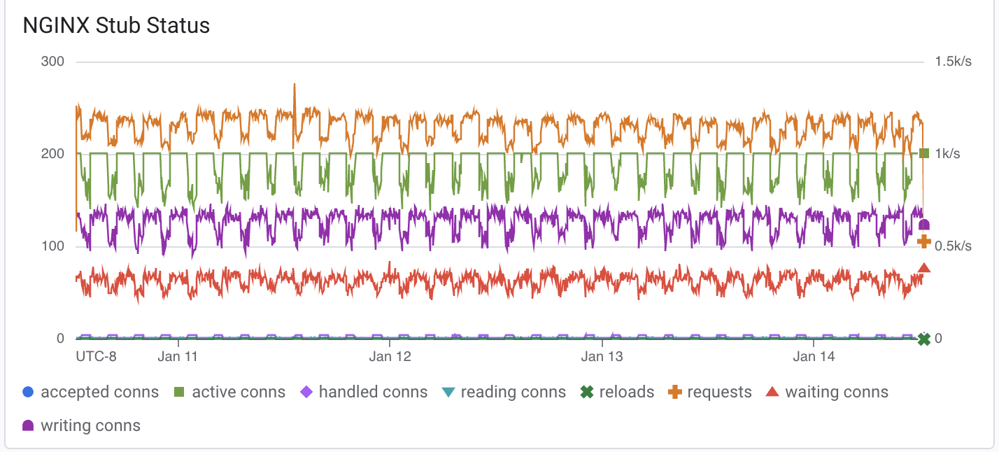
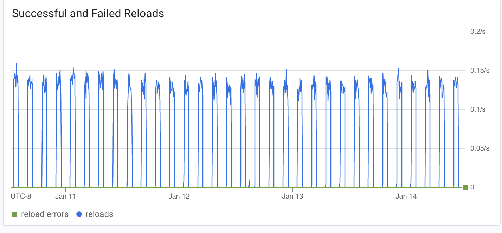
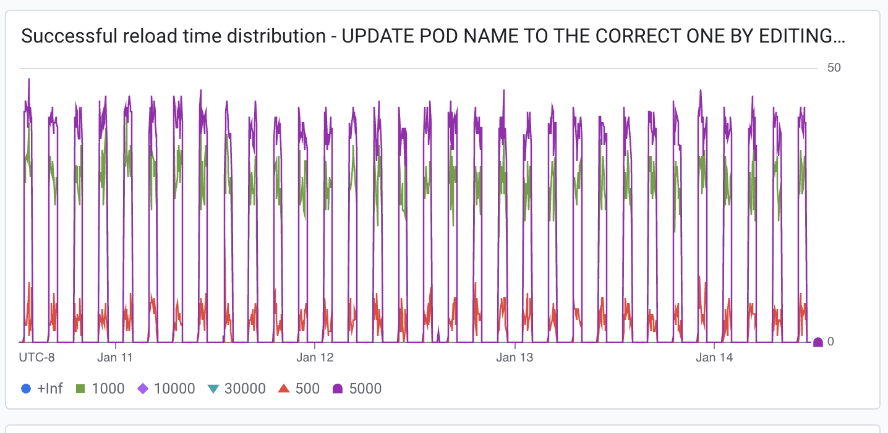

# Results

## Test environment

NGINX Plus: false

NGINX Gateway Fabric:

- Commit: 8be03e1fc5161a2b1bc0962fb0d8732114a9093d
- Date: 2025-01-14T18:57:38Z
- Dirty: true

GKE Cluster:

- Node count: 3
- k8s version: v1.30.6-gke.1596000
- vCPUs per node: 2
- RAM per node: 4018128Ki
- Max pods per node: 110
- Zone: us-central1-c
- Instance Type: e2-medium

## Traffic

HTTP:

```text
Running 5760m test @ http://cafe.example.com/coffee
  2 threads and 100 connections
  Thread Stats   Avg      Stdev     Max   +/- Stdev
    Latency   189.49ms  147.10ms   2.00s    78.44%
    Req/Sec   293.54    193.84     1.95k    66.59%
  198532845 requests in 5760.00m, 67.91GB read
  Socket errors: connect 0, read 309899, write 63, timeout 2396
Requests/sec:    574.46
Transfer/sec:    206.05KB
```

HTTPS:

```text
Running 5760m test @ https://cafe.example.com/tea
  2 threads and 100 connections
  Thread Stats   Avg      Stdev     Max   +/- Stdev
    Latency   179.59ms  121.50ms   1.99s    67.56%
    Req/Sec   292.54    193.88     2.39k    66.47%
  197890521 requests in 5760.00m, 66.57GB read
  Socket errors: connect 176, read 303560, write 0, timeout 7
Requests/sec:    572.60
Transfer/sec:    201.98KB
```

### Logs

No error logs in nginx-gateway.

No error logs in nginx.


### Key Metrics

#### Containers memory



#### NGF Container Memory



### Containers CPU



### NGINX metrics



### Reloads

Rate of reloads - successful and errors:



Reload spikes correspond to 1 hour periods of backend re-rollouts.

No reloads finished with an error.

Reload time distribution - counts:




## Comparison with previous results

Graphs look similar to 1.5.0 results. There is a color change swap in a few graphs which is a little confusing.
NGINX container memory increased dramatically. NGINX Stub Status graph is confusing to interpret, which can make it seem
quite different to the 1.5.0 results, but it is similar, only with an increase in requests.
