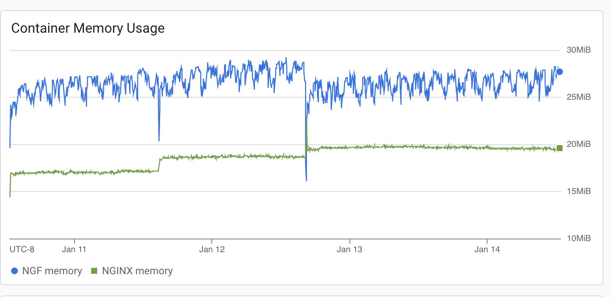
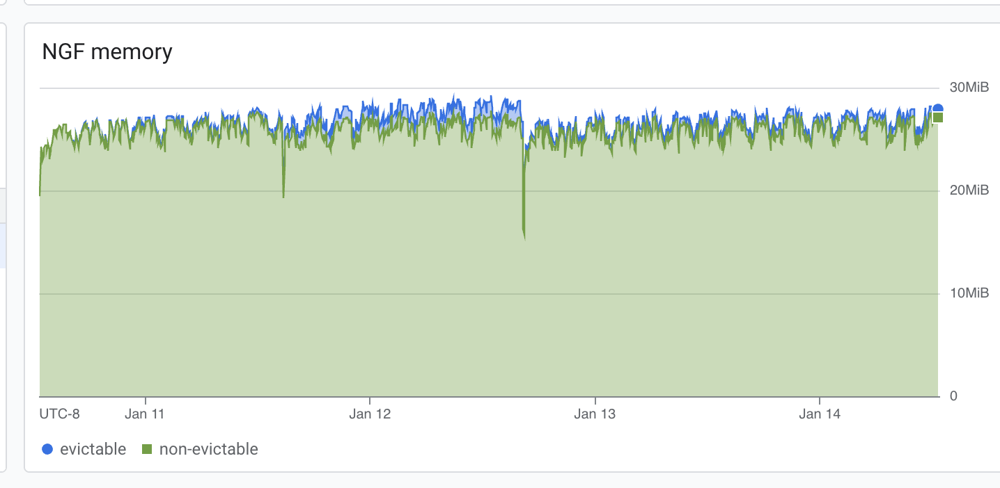
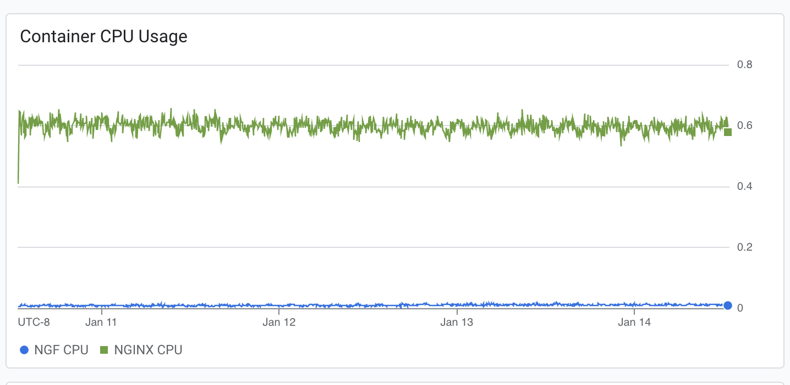
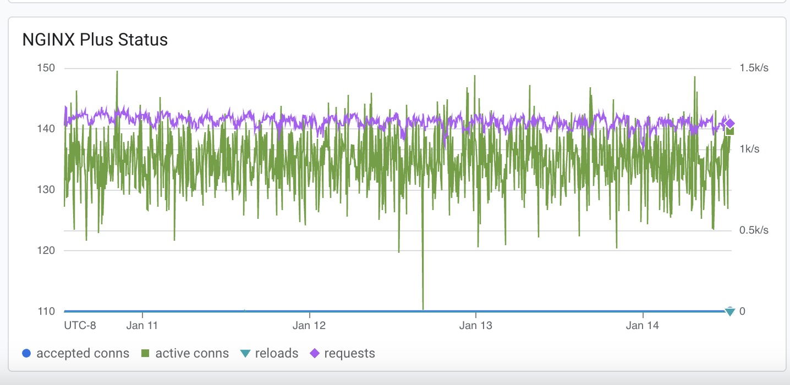
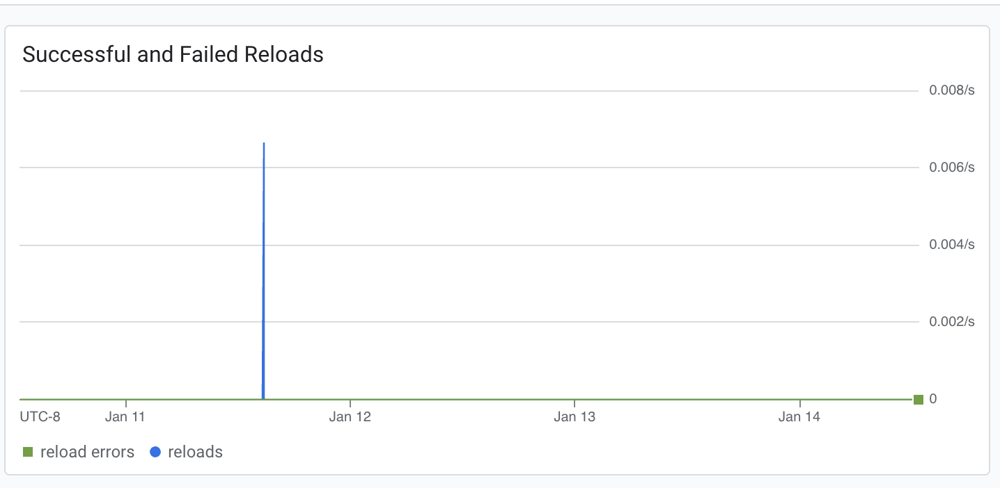
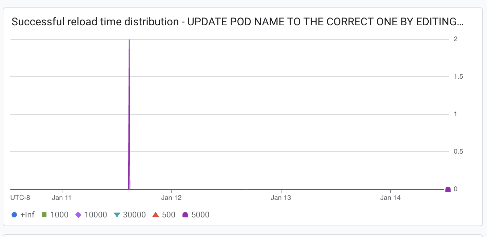

# Results

## Test environment

NGINX Plus: true

NGINX Gateway Fabric:

- Commit: 8be03e1fc5161a2b1bc0962fb0d8732114a9093d
- Date: 2025-01-14T18:57:38Z
- Dirty: true

GKE Cluster:

- Node count: 3
- k8s version: v1.30.6-gke.1596000
- vCPUs per node: 2
- RAM per node: 4018128Ki
- Max pods per node: 110
- Zone: us-central1-c
- Instance Type: e2-medium

## Traffic

HTTP:

```text
Running 5760m test @ http://cafe.example.com/coffee
  2 threads and 100 connections
  Thread Stats   Avg      Stdev     Max   +/- Stdev
    Latency   178.76ms  115.93ms   1.54s    65.67%
    Req/Sec   298.56    193.44     2.46k    65.81%
  202236770 requests in 5760.00m, 69.39GB read
  Socket errors: connect 0, read 68, write 118, timeout 4
  Non-2xx or 3xx responses: 22514
Requests/sec:    585.18
Transfer/sec:    210.54KB
```

HTTPS:

```text
Running 5760m test @ https://cafe.example.com/tea
  2 threads and 100 connections
  Thread Stats   Avg      Stdev     Max   +/- Stdev
    Latency   178.97ms  115.95ms   1.45s    65.64%
    Req/Sec   297.98    193.03     1.82k    65.83%
  201870214 requests in 5760.00m, 68.09GB read
  Socket errors: connect 95, read 57, write 0, timeout 0
  Non-2xx or 3xx responses: 6
Requests/sec:    584.12
Transfer/sec:    206.60KB
```


### Logs

### nginx-gateway
```text
error=pkg/mod/k8s.io/client-go@v0.32.0/tools/cache/reflector.go:251: Failed to watch *v1alpha1.ClientSettingsPolicy: clientsettingspolicies.gateway.nginx.org is forbidden: User "system:serviceaccount:nginx-gateway:ngf-longevity-nginx-gateway-fabric" cannot watch resource "clientsettingspolicies" in API group "gateway.nginx.org" at the cluster scope;level=error;logger=UnhandledError;msg=Unhandled Error;stacktrace=k8s.io/client-go/tools/cache.DefaultWatchErrorHandler
	pkg/mod/k8s.io/client-go@v0.32.0/tools/cache/reflector.go:166
k8s.io/client-go/tools/cache.(*Reflector).Run.func1
	pkg/mod/k8s.io/client-go@v0.32.0/tools/cache/reflector.go:316
k8s.io/apimachinery/pkg/util/wait.BackoffUntil.func1
	pkg/mod/k8s.io/apimachinery@v0.32.0/pkg/util/wait/backoff.go:226
k8s.io/apimachinery/pkg/util/wait.BackoffUntil
	pkg/mod/k8s.io/apimachinery@v0.32.0/pkg/util/wait/backoff.go:227
k8s.io/client-go/tools/cache.(*Reflector).Run
	pkg/mod/k8s.io/client-go@v0.32.0/tools/cache/reflector.go:314
k8s.io/client-go/tools/cache.(*controller).Run.(*Group).StartWithChannel.func2
	pkg/mod/k8s.io/apimachinery@v0.32.0/pkg/util/wait/wait.go:55
k8s.io/apimachinery/pkg/util/wait.(*Group).Start.func1
	pkg/mod/k8s.io/apimachinery@v0.32.0/pkg/util/wait/wait.go:72;ts=2025-01-14T20:45:36Z
```

### nginx

```text
2025/01/14 06:29:09 [error] 216#216: *345664926 no live upstreams while connecting to upstream, client: 10.128.0.34, server: cafe.example.com, request: "GET /coffee HTTP/1.1", upstream: "http://longevity_coffee_80/coffee", host: "cafe.example.com"

10.128.0.34 - - [14/Jan/2025:06:29:09 +0000] "GET /coffee HTTP/1.1" 502 150 "-" "-"
2025/01/14 06:29:09 [error] 216#216: *345664926 no live upstreams while connecting to upstream, client: 10.128.0.34, server: cafe.example.com, request: "GET /coffee HTTP/1.1", upstream: "http://longevity_coffee_80/coffee", host: "cafe.example.com"

```

### Key Metrics

#### Containers memory



#### NGF Container Memory



### Containers CPU



### NGINX Plus metrics



### Reloads

Rate of reloads - successful and errors:



Note: compared to OSS NGINX, we don't have as many reloads here, because NGF uses NGINX Plus API to reconfigure NGINX
for endpoints changes.

Reload time distribution - counts:



## Comparison with previous results

Graphs look similar to 1.4.0 results. CPU usage increased slightly. There was a noticeable error sometime two days in
where memory usage dipped heavily and so did the NGINX plus status, which could a test error instead of product error.
There looked to be a reload event where past results didn't have one. NGINX errors differ from previous results errors but
are consistent with errors seen in the 1.6.0 test suite. NGF error is something to keep an eye on. The NGINX errors did not coincide
with the abnormalities on any of the graphs.
