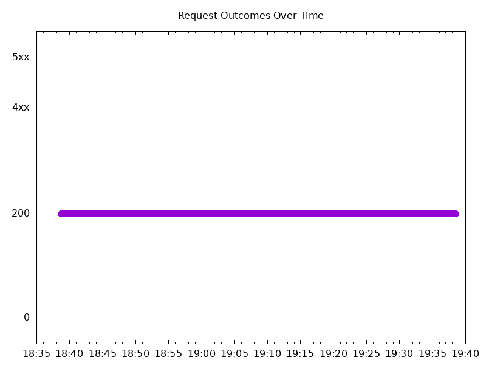
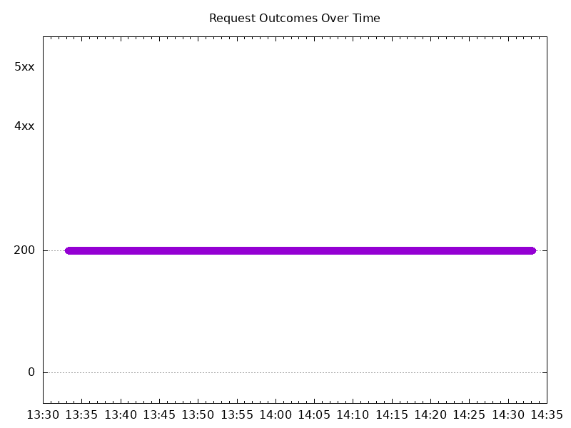

# Results

## Test environment

NGINX Plus: true

GKE Cluster:

- Node count: 3
- k8s version: v1.27.8-gke.1067004
- vCPUs per node: 2
- RAM per node: 4022900Ki
- Max pods per node: 110
- Zone: us-east1-b
- Instance Type: e2-medium

## Test: Send https /tea traffic

```text
Requests      [total, rate, throughput]         6000, 100.02, 100.01
Duration      [total, attack, wait]             59.992s, 59.99s, 1.429ms
Latencies     [min, mean, 50, 90, 95, 99, max]  875.104µs, 1.898ms, 1.747ms, 2.209ms, 2.583ms, 6.361ms, 28.839ms
Bytes In      [total, mean]                     921988, 153.66
Bytes Out     [total, mean]                     0, 0.00
Success       [ratio]                           100.00%
Status Codes  [code:count]                      200:6000  
Error Set:
```



## Test: Send http /coffee traffic

```text
Requests      [total, rate, throughput]         6000, 100.02, 100.01
Duration      [total, attack, wait]             59.995s, 59.99s, 5.26ms
Latencies     [min, mean, 50, 90, 95, 99, max]  851.561µs, 1.876ms, 1.707ms, 2.189ms, 2.665ms, 6.922ms, 33ms
Bytes In      [total, mean]                     963938, 160.66
Bytes Out     [total, mean]                     0, 0.00
Success       [ratio]                           100.00%
Status Codes  [code:count]                      200:6000  
Error Set:
```


