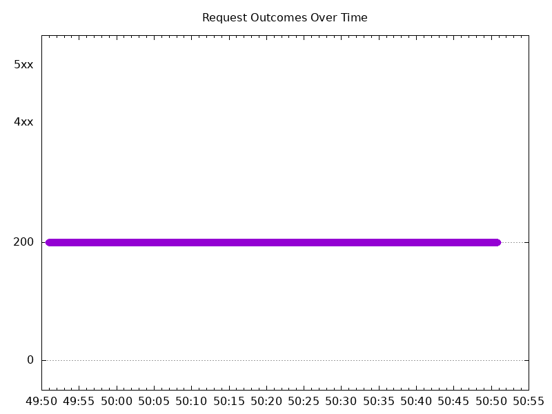

# Results

## Test environment

NGINX Plus: true

GKE Cluster:

- Node count: 12
- k8s version: v1.28.9-gke.1000000
- vCPUs per node: 16
- RAM per node: 65855088Ki
- Max pods per node: 110
- Zone: us-east1-b
- Instance Type: n2d-standard-16

## Test: Send https /tea traffic

```text
Requests      [total, rate, throughput]         6000, 100.02, 100.01
Duration      [total, attack, wait]             59.991s, 59.99s, 1.392ms
Latencies     [min, mean, 50, 90, 95, 99, max]  666.477µs, 1.359ms, 1.276ms, 1.74ms, 1.894ms, 2.331ms, 50.572ms
Bytes In      [total, mean]                     924000, 154.00
Bytes Out     [total, mean]                     0, 0.00
Success       [ratio]                           100.00%
Status Codes  [code:count]                      200:6000  
Error Set:
```


## Test: Send http /coffee traffic

```text
Requests      [total, rate, throughput]         6000, 100.02, 100.01
Duration      [total, attack, wait]             59.991s, 59.99s, 1.589ms
Latencies     [min, mean, 50, 90, 95, 99, max]  886.813µs, 1.521ms, 1.464ms, 1.864ms, 2.029ms, 2.426ms, 13.752ms
Bytes In      [total, mean]                     966000, 161.00
Bytes Out     [total, mean]                     0, 0.00
Success       [ratio]                           100.00%
Status Codes  [code:count]                      200:6000  
Error Set:
```


