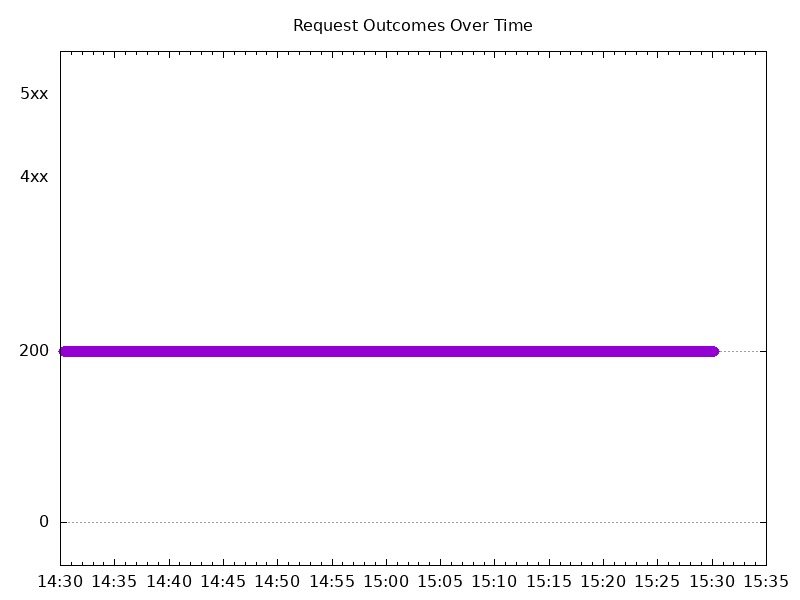

# Results

## Test environment

NGINX Plus: false

GKE Cluster:

- Node count: 12
- k8s version: v1.28.9-gke.1000000
- vCPUs per node: 16
- RAM per node: 65855088Ki
- Max pods per node: 110
- Zone: us-east1-b
- Instance Type: n2d-standard-16

## Summary

- Similar results as last time.

## Test: Send http /coffee traffic

```text
Requests      [total, rate, throughput]         6000, 100.02, 100.01
Duration      [total, attack, wait]             59.992s, 59.99s, 1.099ms
Latencies     [min, mean, 50, 90, 95, 99, max]  795.938µs, 1.153ms, 1.119ms, 1.308ms, 1.386ms, 1.658ms, 13.45ms
Bytes In      [total, mean]                     954000, 159.00
Bytes Out     [total, mean]                     0, 0.00
Success       [ratio]                           100.00%
Status Codes  [code:count]                      200:6000  
Error Set:
```


## Test: Send https /tea traffic

```text
Requests      [total, rate, throughput]         6000, 100.02, 100.00
Duration      [total, attack, wait]             59.999s, 59.991s, 7.907ms
Latencies     [min, mean, 50, 90, 95, 99, max]  836.052µs, 1.21ms, 1.16ms, 1.38ms, 1.481ms, 1.842ms, 13.741ms
Bytes In      [total, mean]                     912000, 152.00
Bytes Out     [total, mean]                     0, 0.00
Success       [ratio]                           100.00%
Status Codes  [code:count]                      200:6000  
Error Set:
```


