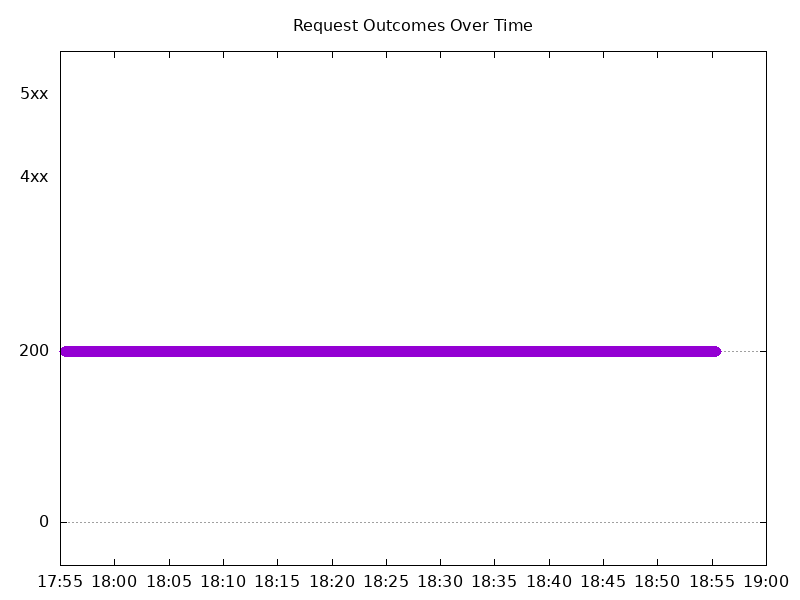

# Results

## Test environment

NGINX Plus: false

NGINX Gateway Fabric:

- Commit: 16a95222a968aef46277a77070f79bea9b87da12
- Date: 2024-08-16T15:29:44Z
- Dirty: false

GKE Cluster:

- Node count: 12
- k8s version: v1.29.7-gke.1008000
- vCPUs per node: 16
- RAM per node: 65855012Ki
- Max pods per node: 110
- Zone: us-west1-b
- Instance Type: n2d-standard-16

## Summary:

- Performance seems to have improved.

## Test: Send https /tea traffic

```text
Requests      [total, rate, throughput]         6000, 100.02, 100.01
Duration      [total, attack, wait]             59.991s, 59.99s, 883.687µs
Latencies     [min, mean, 50, 90, 95, 99, max]  717.401µs, 1.039ms, 1.012ms, 1.192ms, 1.256ms, 1.426ms, 12.471ms
Bytes In      [total, mean]                     924000, 154.00
Bytes Out     [total, mean]                     0, 0.00
Success       [ratio]                           100.00%
Status Codes  [code:count]                      200:6000  
Error Set:
```


## Test: Send http /coffee traffic

```text
Requests      [total, rate, throughput]         6000, 100.02, 100.01
Duration      [total, attack, wait]             59.991s, 59.99s, 886.936µs
Latencies     [min, mean, 50, 90, 95, 99, max]  686.413µs, 949.204µs, 930.943µs, 1.071ms, 1.125ms, 1.246ms, 14.436ms
Bytes In      [total, mean]                     967939, 161.32
Bytes Out     [total, mean]                     0, 0.00
Success       [ratio]                           100.00%
Status Codes  [code:count]                      200:6000  
Error Set:
```


