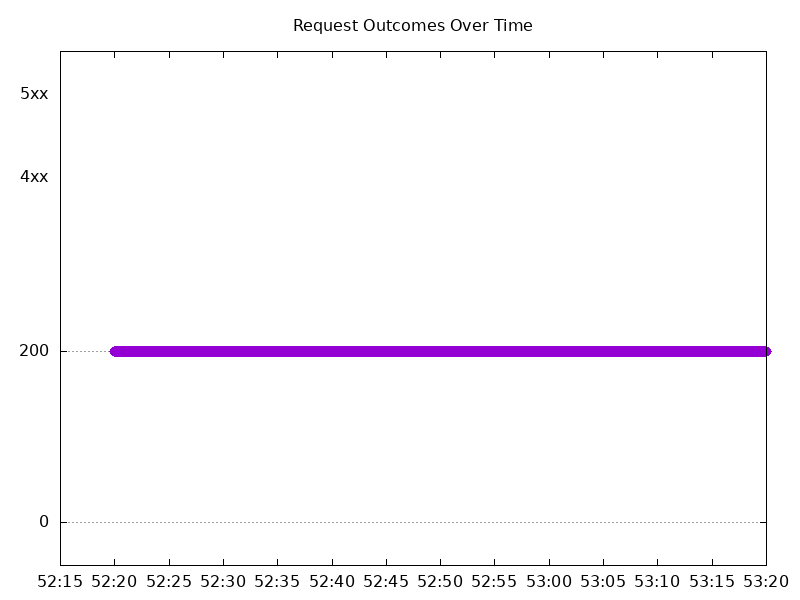

# Results

## Test environment

NGINX Plus: true

NGINX Gateway Fabric:

- Commit: 16a95222a968aef46277a77070f79bea9b87da12
- Date: 2024-08-16T15:29:44Z
- Dirty: false

GKE Cluster:

- Node count: 12
- k8s version: v1.29.7-gke.1008000
- vCPUs per node: 16
- RAM per node: 65855012Ki
- Max pods per node: 110
- Zone: us-west1-b
- Instance Type: n2d-standard-16

## Summary:

- Performance seems to have improved.

## Test: Send http /coffee traffic

```text
Requests      [total, rate, throughput]         6000, 100.02, 100.01
Duration      [total, attack, wait]             59.991s, 59.99s, 746.557µs
Latencies     [min, mean, 50, 90, 95, 99, max]  492.426µs, 916.951µs, 894.929µs, 997.453µs, 1.04ms, 1.225ms, 12.566ms
Bytes In      [total, mean]                     960000, 160.00
Bytes Out     [total, mean]                     0, 0.00
Success       [ratio]                           100.00%
Status Codes  [code:count]                      200:6000  
Error Set:
```


## Test: Send https /tea traffic

```text
Requests      [total, rate, throughput]         6000, 100.02, 100.01
Duration      [total, attack, wait]             59.991s, 59.99s, 844.339µs
Latencies     [min, mean, 50, 90, 95, 99, max]  714.591µs, 948.908µs, 919.169µs, 1.03ms, 1.081ms, 1.24ms, 12.421ms
Bytes In      [total, mean]                     919974, 153.33
Bytes Out     [total, mean]                     0, 0.00
Success       [ratio]                           100.00%
Status Codes  [code:count]                      200:6000  
Error Set:
```


