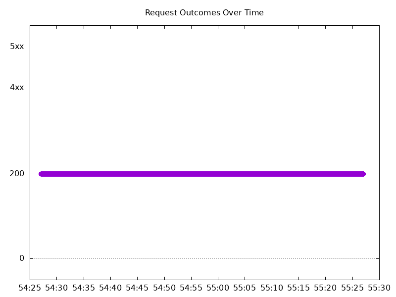

# Results

## Test environment

NGINX Plus: false

NGINX Gateway Fabric:

- Commit: 8624530af3c518afd8f7013566a102e8b3497b76
- Date: 2024-11-11T18:50:09Z
- Dirty: false

GKE Cluster:

- Node count: 12
- k8s version: v1.30.5-gke.1443001
- vCPUs per node: 16
- RAM per node: 65853972Ki
- Max pods per node: 110
- Zone: us-west2-a
- Instance Type: n2d-standard-16

## Test: Send https /tea traffic

```text
Requests      [total, rate, throughput]         6000, 100.02, 100.01
Duration      [total, attack, wait]             59.992s, 59.991s, 932.645µs
Latencies     [min, mean, 50, 90, 95, 99, max]  423.711µs, 787.549µs, 794.414µs, 912.095µs, 954.864µs, 1.145ms, 5.769ms
Bytes In      [total, mean]                     936000, 156.00
Bytes Out     [total, mean]                     0, 0.00
Success       [ratio]                           100.00%
Status Codes  [code:count]                      200:6000  
Error Set:
```


## Test: Send http /coffee traffic

```text
Requests      [total, rate, throughput]         6000, 100.02, 100.01
Duration      [total, attack, wait]             59.991s, 59.991s, 841.48µs
Latencies     [min, mean, 50, 90, 95, 99, max]  571.076µs, 810.669µs, 797.263µs, 906.628µs, 949.507µs, 1.075ms, 4.51ms
Bytes In      [total, mean]                     972000, 162.00
Bytes Out     [total, mean]                     0, 0.00
Success       [ratio]                           100.00%
Status Codes  [code:count]                      200:6000  
Error Set:
```


