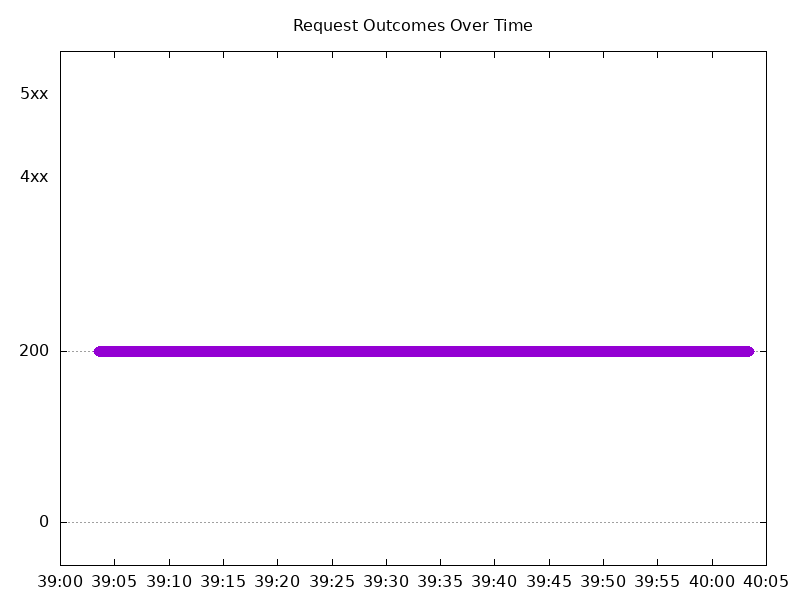

# Results

## Test environment

NGINX Plus: true

NGINX Gateway Fabric:

- Commit: a0126a6435dd4bd69c1a7f48ee15eecb76c68400
- Date: 2024-11-12T20:33:03Z
- Dirty: false

GKE Cluster:

- Node count: 12
- k8s version: v1.30.5-gke.1443001
- vCPUs per node: 16
- RAM per node: 65853972Ki
- Max pods per node: 110
- Zone: us-west2-a
- Instance Type: n2d-standard-16

## Test: Send https /tea traffic

```text
Requests      [total, rate, throughput]         6000, 100.02, 100.01
Duration      [total, attack, wait]             59.991s, 59.99s, 913.55µs
Latencies     [min, mean, 50, 90, 95, 99, max]  641.837µs, 869.912µs, 849.956µs, 964.838µs, 1.013ms, 1.148ms, 6.51ms
Bytes In      [total, mean]                     930000, 155.00
Bytes Out     [total, mean]                     0, 0.00
Success       [ratio]                           100.00%
Status Codes  [code:count]                      200:6000  
Error Set:
```


## Test: Send http /coffee traffic

```text
Requests      [total, rate, throughput]         6000, 100.02, 100.02
Duration      [total, attack, wait]             59.991s, 59.99s, 598.948µs
Latencies     [min, mean, 50, 90, 95, 99, max]  462.116µs, 857.769µs, 840.074µs, 963.374µs, 1.013ms, 1.155ms, 19.413ms
Bytes In      [total, mean]                     966000, 161.00
Bytes Out     [total, mean]                     0, 0.00
Success       [ratio]                           100.00%
Status Codes  [code:count]                      200:6000  
Error Set:
```


