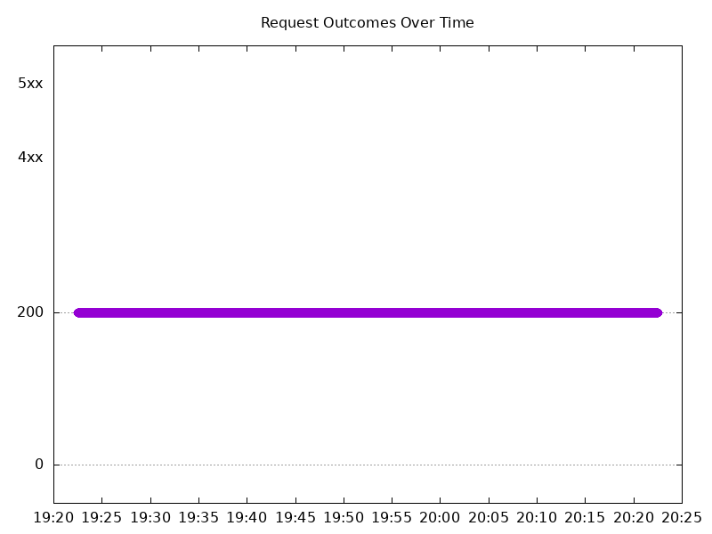

# Results

## Test environment

NGINX Plus: false

NGINX Gateway Fabric:

- Commit: b61c61d3f9ca29c6eb93ce9b44e652c9a521b3a4
- Date: 2025-01-13T16:47:24Z
- Dirty: false

GKE Cluster:

- Node count: 12
- k8s version: v1.30.6-gke.1596000
- vCPUs per node: 16
- RAM per node: 65853984Ki
- Max pods per node: 110
- Zone: us-west1-b
- Instance Type: n2d-standard-16

## Summary:

- Latency increased across both HTTPS and HTTP traffic.


## Test: Send http /coffee traffic

```text
Requests      [total, rate, throughput]         6000, 100.02, 100.02
Duration      [total, attack, wait]             59.991s, 59.99s, 532.496µs
Latencies     [min, mean, 50, 90, 95, 99, max]  462.848µs, 904.959µs, 898.168µs, 1.053ms, 1.115ms, 1.268ms, 18.821ms
Bytes In      [total, mean]                     968026, 161.34
Bytes Out     [total, mean]                     0, 0.00
Success       [ratio]                           100.00%
Status Codes  [code:count]                      200:6000
Error Set:
```


## Test: Send https /tea traffic

```text
Requests      [total, rate, throughput]         6000, 100.02, 100.01
Duration      [total, attack, wait]             59.991s, 59.99s, 737.848µs
Latencies     [min, mean, 50, 90, 95, 99, max]  705.036µs, 1.009ms, 973.41µs, 1.16ms, 1.217ms, 1.4ms, 15.604ms
Bytes In      [total, mean]                     932022, 155.34
Bytes Out     [total, mean]                     0, 0.00
Success       [ratio]                           100.00%
Status Codes  [code:count]                      200:6000
Error Set:
```


