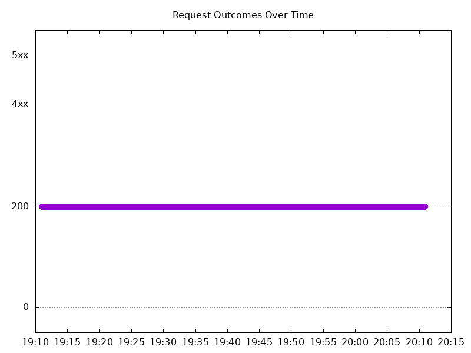

# Results

## Test environment

NGINX Plus: true

NGINX Gateway Fabric:

- Commit: b61c61d3f9ca29c6eb93ce9b44e652c9a521b3a4
- Date: 2025-01-13T16:47:24Z
- Dirty: false

GKE Cluster:

- Node count: 12
- k8s version: v1.30.6-gke.1596000
- vCPUs per node: 16
- RAM per node: 65853984Ki
- Max pods per node: 110
- Zone: us-west1-b
- Instance Type: n2d-standard-16

## Test: Send http /coffee traffic

```text
Requests      [total, rate, throughput]         6000, 100.02, 100.01
Duration      [total, attack, wait]             59.992s, 59.991s, 800.455µs
Latencies     [min, mean, 50, 90, 95, 99, max]  608.736µs, 814.699µs, 794.88µs, 908.762µs, 953.288µs, 1.106ms, 9.306ms
Bytes In      [total, mean]                     967993, 161.33
Bytes Out     [total, mean]                     0, 0.00
Success       [ratio]                           100.00%
Status Codes  [code:count]                      200:6000  
Error Set:
```



## Test: Send https /tea traffic

```text
Requests      [total, rate, throughput]         6000, 100.02, 100.01
Duration      [total, attack, wait]             59.992s, 59.991s, 880.798µs
Latencies     [min, mean, 50, 90, 95, 99, max]  654.62µs, 940.714µs, 911.965µs, 1.074ms, 1.13ms, 1.359ms, 11.669ms
Bytes In      [total, mean]                     930000, 155.00
Bytes Out     [total, mean]                     0, 0.00
Success       [ratio]                           100.00%
Status Codes  [code:count]                      200:6000  
Error Set:
```


