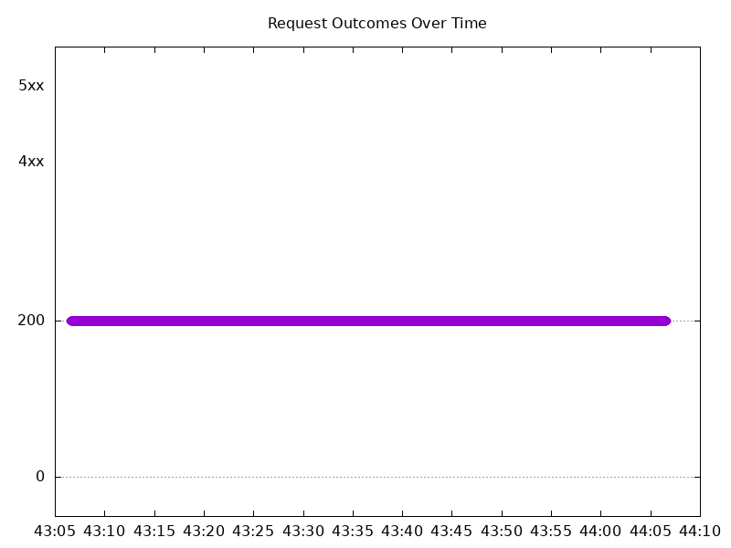
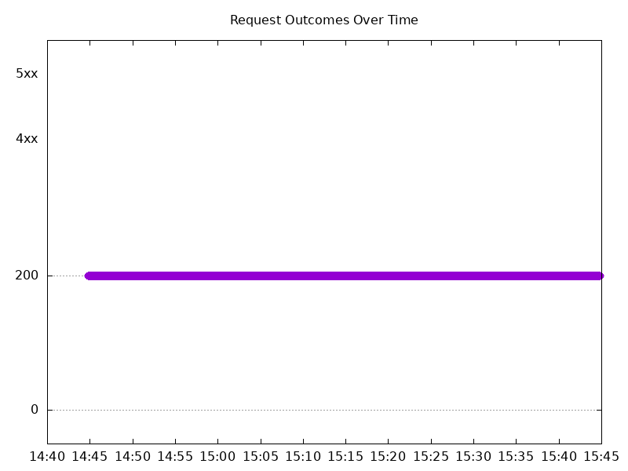

# Results

## Test environment

NGINX Plus: false

NGINX Gateway Fabric:

- Commit: bf8ea47203eb4695af0d359243c73de2d1badbbf
- Date: 2024-09-13T20:33:11Z
- Dirty: false

GKE Cluster:

- Node count: 12
- k8s version: v1.30.3-gke.1639000
- vCPUs per node: 16
- RAM per node: 65853968Ki
- Max pods per node: 110
- Zone: us-west1-b
- Instance Type: n2d-standard-16

## Test: Send http /coffee traffic

```text
Requests      [total, rate, throughput]         6000, 100.02, 100.01
Duration      [total, attack, wait]             59.992s, 59.991s, 884.168µs
Latencies     [min, mean, 50, 90, 95, 99, max]  634.08µs, 868.36µs, 853.024µs, 982.366µs, 1.035ms, 1.149ms, 4.411ms
Bytes In      [total, mean]                     968003, 161.33
Bytes Out     [total, mean]                     0, 0.00
Success       [ratio]                           100.00%
Status Codes  [code:count]                      200:6000  
Error Set:
```



## Test: Send https /tea traffic

```text
Requests      [total, rate, throughput]         6000, 100.02, 100.01
Duration      [total, attack, wait]             59.991s, 59.991s, 741.801µs
Latencies     [min, mean, 50, 90, 95, 99, max]  649.146µs, 849.636µs, 833.298µs, 943.565µs, 991.03µs, 1.118ms, 9.986ms
Bytes In      [total, mean]                     930000, 155.00
Bytes Out     [total, mean]                     0, 0.00
Success       [ratio]                           100.00%
Status Codes  [code:count]                      200:6000  
Error Set:
```


