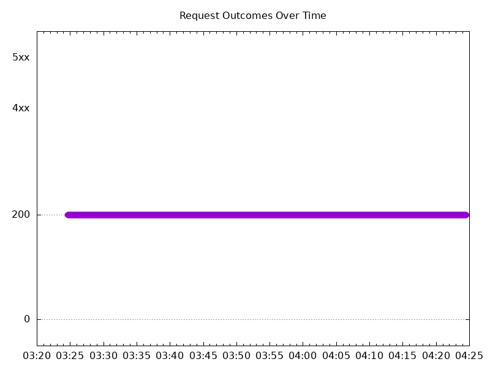
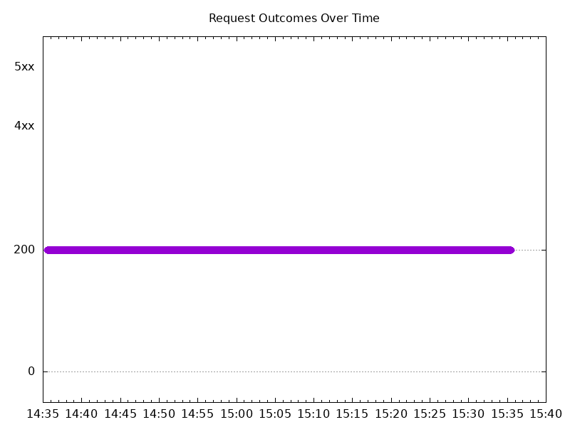

# Results

## Test environment

NGINX Plus: false

GKE Cluster:

- Node count: 12
- k8s version: v1.29.6-gke.1038001
- vCPUs per node: 16
- RAM per node: 65855012Ki
- Max pods per node: 110
- Zone: us-west1-b
- Instance Type: n2d-standard-16

## Test: Send https /tea traffic

```text
Requests      [total, rate, throughput]         6000, 100.02, 100.01
Duration      [total, attack, wait]             59.991s, 59.99s, 799.917µs
Latencies     [min, mean, 50, 90, 95, 99, max]  450.094µs, 821.717µs, 823.258µs, 951.13µs, 997.824µs, 1.126ms, 11.934ms
Bytes In      [total, mean]                     920025, 153.34
Bytes Out     [total, mean]                     0, 0.00
Success       [ratio]                           100.00%
Status Codes  [code:count]                      200:6000  
Error Set:
```



## Test: Send http /coffee traffic

```text
Requests      [total, rate, throughput]         6000, 100.02, 100.02
Duration      [total, attack, wait]             59.991s, 59.99s, 794.113µs
Latencies     [min, mean, 50, 90, 95, 99, max]  618.014µs, 872.17µs, 856.784µs, 991.181µs, 1.038ms, 1.148ms, 12.075ms
Bytes In      [total, mean]                     960000, 160.00
Bytes Out     [total, mean]                     0, 0.00
Success       [ratio]                           100.00%
Status Codes  [code:count]                      200:6000  
Error Set:
```


