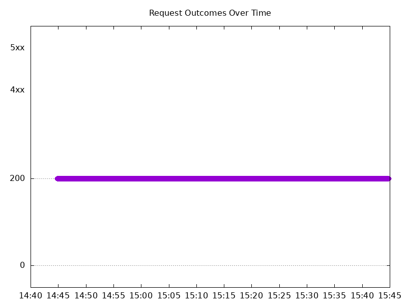

# Results

## Test environment

NGINX Plus: false

NGINX Gateway Fabric:

- Commit: 929413c15af7bee3adb32e103c9d1513a693da16
- Date: 2024-11-28T12:52:45Z
- Dirty: false

GKE Cluster:

- Node count: 12
- k8s version: v1.30.5-gke.1443001
- vCPUs per node: 16
- RAM per node: 65853964Ki
- Max pods per node: 110
- Zone: us-west1-b
- Instance Type: n2d-standard-16

## Test: Send https /tea traffic

```text
Requests      [total, rate, throughput]         6000, 100.02, 100.02
Duration      [total, attack, wait]             59.991s, 59.99s, 826.186µs
Latencies     [min, mean, 50, 90, 95, 99, max]  737.77µs, 996.724µs, 950.613µs, 1.096ms, 1.148ms, 1.399ms, 15.97ms
Bytes In      [total, mean]                     926014, 154.34
Bytes Out     [total, mean]                     0, 0.00
Success       [ratio]                           100.00%
Status Codes  [code:count]                      200:6000  
Error Set:
```



## Test: Send http /coffee traffic

```text
Requests      [total, rate, throughput]         6000, 100.02, 100.02
Duration      [total, attack, wait]             59.991s, 59.99s, 821.837µs
Latencies     [min, mean, 50, 90, 95, 99, max]  658.827µs, 960.372µs, 914.96µs, 1.048ms, 1.094ms, 1.347ms, 22.956ms
Bytes In      [total, mean]                     960000, 160.00
Bytes Out     [total, mean]                     0, 0.00
Success       [ratio]                           100.00%
Status Codes  [code:count]                      200:6000  
Error Set:
```


