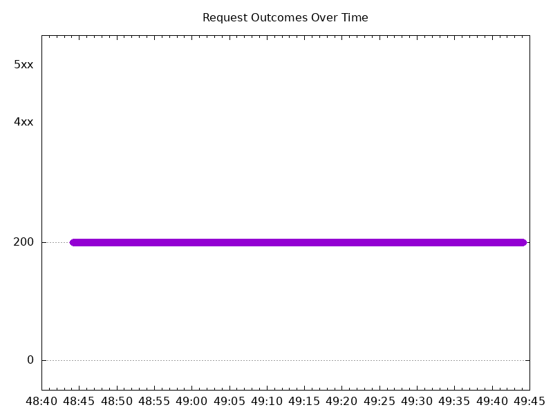
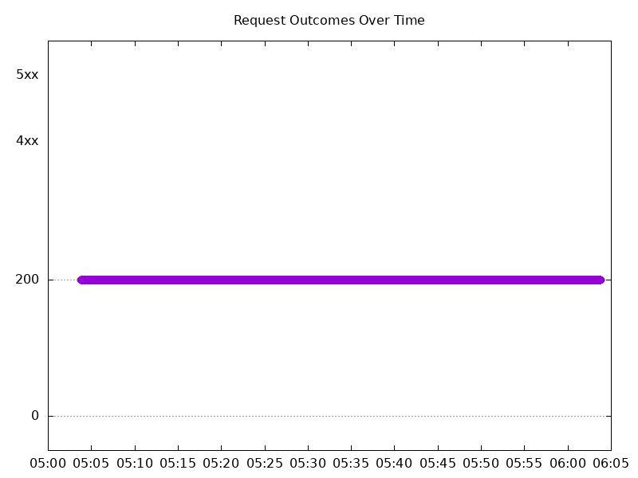

# Results

## Test environment

NGINX Plus: true

NGINX Gateway Fabric:

- Commit: bf8ea47203eb4695af0d359243c73de2d1badbbf
- Date: 2024-09-13T20:33:11Z
- Dirty: false

GKE Cluster:

- Node count: 12
- k8s version: v1.30.3-gke.1639000
- vCPUs per node: 16
- RAM per node: 65853960Ki
- Max pods per node: 110
- Zone: us-west1-b
- Instance Type: n2d-standard-16

## Test: Send https /tea traffic

```text
Requests      [total, rate, throughput]         6000, 100.02, 100.01
Duration      [total, attack, wait]             59.991s, 59.99s, 1.041ms
Latencies     [min, mean, 50, 90, 95, 99, max]  625.872µs, 826.301µs, 807.398µs, 918.006µs, 960.877µs, 1.112ms, 6.257ms
Bytes In      [total, mean]                     936000, 156.00
Bytes Out     [total, mean]                     0, 0.00
Success       [ratio]                           100.00%
Status Codes  [code:count]                      200:6000  
Error Set:
```



## Test: Send http /coffee traffic

```text
Requests      [total, rate, throughput]         6000, 100.02, 100.01
Duration      [total, attack, wait]             59.991s, 59.99s, 1.116ms
Latencies     [min, mean, 50, 90, 95, 99, max]  437.199µs, 801.276µs, 794.836µs, 903.922µs, 948.055µs, 1.064ms, 6.149ms
Bytes In      [total, mean]                     972000, 162.00
Bytes Out     [total, mean]                     0, 0.00
Success       [ratio]                           100.00%
Status Codes  [code:count]                      200:6000  
Error Set:
```


