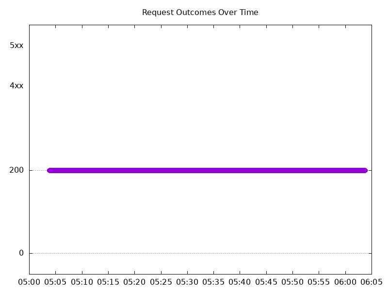

# Results

## Test environment

NGINX Plus: true

NGINX Gateway Fabric:

- Commit: 929413c15af7bee3adb32e103c9d1513a693da16
- Date: 2024-11-28T12:52:45Z
- Dirty: false

GKE Cluster:

- Node count: 12
- k8s version: v1.30.5-gke.1443001
- vCPUs per node: 16
- RAM per node: 65853972Ki
- Max pods per node: 110
- Zone: us-west1-b
- Instance Type: n2d-standard-16

## Test: Send https /tea traffic

```text
Requests      [total, rate, throughput]         6000, 100.02, 100.01
Duration      [total, attack, wait]             59.991s, 59.991s, 798.287µs
Latencies     [min, mean, 50, 90, 95, 99, max]  667.36µs, 885.127µs, 863.095µs, 997.184µs, 1.045ms, 1.188ms, 14.513ms
Bytes In      [total, mean]                     936000, 156.00
Bytes Out     [total, mean]                     0, 0.00
Success       [ratio]                           100.00%
Status Codes  [code:count]                      200:6000  
Error Set:
```


## Test: Send http /coffee traffic

```text
Requests      [total, rate, throughput]         6000, 100.02, 100.01
Duration      [total, attack, wait]             59.991s, 59.991s, 801.148µs
Latencies     [min, mean, 50, 90, 95, 99, max]  639.595µs, 880.974µs, 857.222µs, 1.007ms, 1.067ms, 1.214ms, 11.71ms
Bytes In      [total, mean]                     974020, 162.34
Bytes Out     [total, mean]                     0, 0.00
Success       [ratio]                           100.00%
Status Codes  [code:count]                      200:6000  
Error Set:
```


