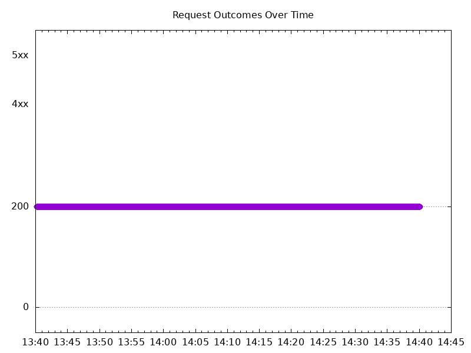

# Results

## Test environment

GKE Cluster:

- Node count: 2
- k8s version: v1.27.8-gke.1067000
- vCPUs per node: 2
- RAM per node: 4022908Ki
- Max pods per node: 110
- Zone: us-west2-a
- Instance Type: e2-medium

## Test: Send http /coffee traffic

```text
Requests      [total, rate, throughput]         6000, 100.02, 100.01
Duration      [total, attack, wait]             59.993s, 59.991s, 1.7ms
Latencies     [min, mean, 50, 90, 95, 99, max]  712.906µs, 1.865ms, 1.604ms, 2.425ms, 3.022ms, 7.933ms, 46.534ms
Bytes In      [total, mean]                     966000, 161.00
Bytes Out     [total, mean]                     0, 0.00
Success       [ratio]                           100.00%
Status Codes  [code:count]                      200:6000  
Error Set:
```


## Test: Send https /tea traffic

```text
Requests      [total, rate, throughput]         6000, 100.02, 100.01
Duration      [total, attack, wait]             59.995s, 59.991s, 4.799ms
Latencies     [min, mean, 50, 90, 95, 99, max]  818.289µs, 1.919ms, 1.645ms, 2.521ms, 3.188ms, 7.732ms, 56.168ms
Bytes In      [total, mean]                     924000, 154.00
Bytes Out     [total, mean]                     0, 0.00
Success       [ratio]                           100.00%
Status Codes  [code:count]                      200:6000  
Error Set:
```


