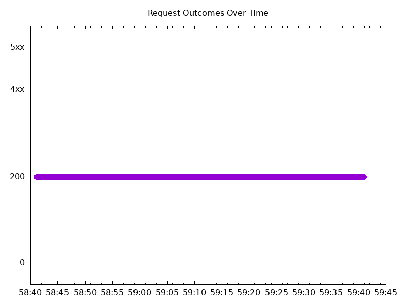

# Results

## Test environment

NGINX Plus: false

GKE Cluster:

- Node count: 12
- k8s version: v1.29.4-gke.1043004
- vCPUs per node: 16
- RAM per node: 65855012Ki
- Max pods per node: 110
- Zone: us-east1-b
- Instance Type: n2d-standard-16

## Test: Send http /coffee traffic

```text
Requests      [total, rate, throughput]         6000, 100.02, 100.01
Duration      [total, attack, wait]             59.991s, 59.991s, 878.01µs
Latencies     [min, mean, 50, 90, 95, 99, max]  687.75µs, 1.202ms, 1.174ms, 1.401ms, 1.463ms, 1.613ms, 12.928ms
Bytes In      [total, mean]                     960000, 160.00
Bytes Out     [total, mean]                     0, 0.00
Success       [ratio]                           100.00%
Status Codes  [code:count]                      200:6000  
Error Set:
```


## Test: Send https /tea traffic

```text
Requests      [total, rate, throughput]         6000, 100.02, 100.01
Duration      [total, attack, wait]             59.991s, 59.99s, 966.11µs
Latencies     [min, mean, 50, 90, 95, 99, max]  603.69µs, 1.182ms, 1.153ms, 1.384ms, 1.449ms, 1.623ms, 12.779ms
Bytes In      [total, mean]                     920039, 153.34
Bytes Out     [total, mean]                     0, 0.00
Success       [ratio]                           100.00%
Status Codes  [code:count]                      200:6000  
Error Set:
```


# Results

## Test environment

NGINX Plus: false

GKE Cluster:

- Node count: 12
- k8s version: v1.29.5-gke.1091002
- vCPUs per node: 16
- RAM per node: 65855012Ki
- Max pods per node: 110
- Zone: us-west1-b
- Instance Type: n2d-standard-16

## Test: Send http /coffee traffic

```text
Requests      [total, rate, throughput]         6000, 100.02, 100.01
Duration      [total, attack, wait]             59.991s, 59.99s, 1.04ms
Latencies     [min, mean, 50, 90, 95, 99, max]  576.735µs, 1.043ms, 1.029ms, 1.17ms, 1.22ms, 1.358ms, 12.163ms
Bytes In      [total, mean]                     960000, 160.00
Bytes Out     [total, mean]                     0, 0.00
Success       [ratio]                           100.00%
Status Codes  [code:count]                      200:6000  
Error Set:
```


## Test: Send https /tea traffic

```text
Requests      [total, rate, throughput]         6000, 100.02, 100.01
Duration      [total, attack, wait]             59.991s, 59.99s, 1.146ms
Latencies     [min, mean, 50, 90, 95, 99, max]  692.961µs, 1.088ms, 1.066ms, 1.203ms, 1.253ms, 1.386ms, 12.365ms
Bytes In      [total, mean]                     918000, 153.00
Bytes Out     [total, mean]                     0, 0.00
Success       [ratio]                           100.00%
Status Codes  [code:count]                      200:6000  
Error Set:
```


