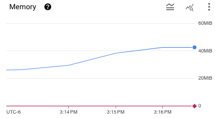
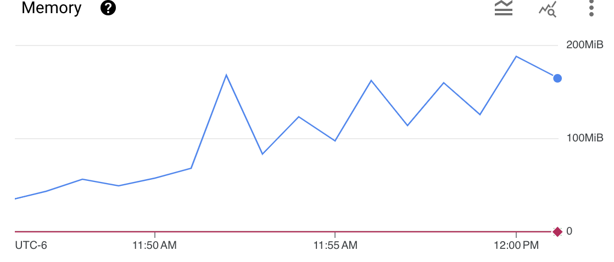

# Results for v1.2.0

<!-- TOC -->
- [Results for v1.2.0](#results-for-v120)
  - [Summary](#summary)
  - [Versions](#versions)
  - [Tests](#tests)
    - [Scale Listeners](#scale-listeners)
    - [Scale HTTPS Listeners](#scale-https-listeners)
    - [Scale HTTPRoutes](#scale-httproutes)
    - [Scale Upstream Servers](#scale-upstream-servers)
    - [Scale HTTP Matches](#scale-http-matches)
  - [Future Improvements](#future-improvements)
<!-- TOC -->

## Summary

- Overall, reloads and reload times look similar to 1.1.
- As expected, for N+ there are no reloads for upstream servers.
- Number of batch events has reduced, subsequently increasing the average time of each batch.
- Memory, CPU usage, and time to ready numbers are similar to 1.1.
- In general, N+ and OSS numbers are similar. In a few tests, the N+ CPU usage is lower than OSS. In one test, the memory and time to ready numbers are higher than OSS.
- No concerning errors or restarts.

## Versions

NGF version:

```text
"version":"edge"
"commit":"e1d6ebb5065bab73af3a89faba4f49c7a5b971cd"
"date":"2024-03-18T20:41:44Z"
```

NGINX:

```text
nginx version: nginx/1.25.4
built by gcc 12.2.1 20220924 (Alpine 12.2.1_git20220924-r10)
built with OpenSSL 3.1.3 19 Sep 2023 (running with OpenSSL 3.1.4 24 Oct 2023)
```

NGINX Plus:

```text
nginx version: nginx/1.25.3 (nginx-plus-r31-p1)
built by gcc 13.2.1 20231014 (Alpine 13.2.1_git20231014)
built with OpenSSL 3.1.4 24 Oct 2023
```

Kubernetes: `v1.29.2-gke.1217000`

## Tests

### Scale Listeners

Reloads:

| OSS/N+ | Total | Total Errors | Ave Time (ms)      | <= 500ms |
|--------|-------|--------------|--------------------|----------|
| OSS    | 128   | 0            | 135.21245321573875 | 100%     |
| N+     | 128   | 0            | 137.11475409836066 | 100%     |


Event Batch Processing:

| OSS/N+ | Total | Ave Time (ms)      | <= 500ms | <= 1000ms | <= 5000ms |
|--------|-------|--------------------|----------|-----------|-----------|
| OSS    | 384   | 274.37551927060446 | 83.85%   | 95.05%    | 100%      |
| N+     | 384   | 276.705856062934   | 82.29%   | 91.15%    | 100%      |

**NGINX Errors**: None.

**NGF Errors**: None.

**Pod Restarts**: None.

**CPU and Memory:**

**OSS**:




**N+:**


**Time To Ready:**

**OSS**:


**N+:**


**Findings**

- Reload count and reload times are similar to 1.1.
- Fewer event batches.
- Event batch processing time has increased.
- Memory and CPU look similar.
- Time to ready numbers look similar.
- CPU is slightly better for N+, memory and time to ready numbers are slightly worse.

### Scale HTTPS Listeners

Reloads:

| OSS/N+ | Total | Total Errors | Ave Time (ms)      | <= 500ms |
|--------|-------|--------------|--------------------|----------|
| OSS    | 128   | 0            | 158.3148148148148  | 100%     |
| N+     | 128   | 0            | 155.80952380952382 | 100%     |


Event Batch Processing:

| OSS/N+ | Total | Ave Time (ms)     | <= 500ms | <= 1000ms | <= 5000ms |
|--------|-------|-------------------|----------|-----------|-----------|
| OSS    | 446   | 376.7357377720319 | 380/446  | 95%       | 100%      |
| N+     | 446   | 582.7019230769231 | 370/446  | 95%       | 100%      |


**NGINX Errors**: None.

**NGF Errors**: None.

**Pod Restarts**: None.

**CPU and Memory**

**OSS:**


**N+:**


**Time To Ready:**

**OSS:**


**N+:**


**Findings**

- Reloads have gone up slightly, but the reload time is similar.
- Fewer event batches.
- Event processing time has increased.
- Memory and CPU look similar.
- Time to ready numbers are slightly worse.
- N+ event processing time is greater than OSS; could be a one-off.
- A few of the requests failed with `remote error: tls: unrecognized name`. This seems to be a transient error. I was able to pass traffic to these server names after the test ended.
- CPU is slightly better for N+, memory and time to ready numbers are similar.

### Scale HTTPRoutes

Reloads:

| OSS/N+ | Total | Total Errors | Ave Time (ms)     | <= 500ms | <= 1000ms |
|--------|-------|--------------|-------------------|----------|-----------|
| OSS    | 1001  | 0            | 383.3207313264937 | 75.72%   | 100%      |
| N+     | 1001  | 0            | 363.4901960784314 | 79.02%   | 100%      |


Event Batch Processing:

| OSS/N+ | Total | Ave Time (ms)      | <= 500ms | <= 1000ms | <= 5000ms |
|--------|-------|--------------------|----------|-----------|-----------|
| OSS    | 1005  | 470.87463201381377 | 59.64%   | 99.7%     | 100%      |
| N+     | 1005  | 448.05991285403053 | 63.84%   | 99.8%     | 100%      |


> Note: In the scale tests for the 1.1 release, we tested with and without a delay. Since the results were very similar in the 1.1 release, I dropped the test with the delay.

**NGINX Errors**: None.

**NGF Errors**: None.

**Pod Restarts**: None.

**CPU and Memory**:

**OSS:**


**N+:**




**Time To Ready**:

**OSS:**


The peak at point (511, 30) corresponds the following error in the [results.csv](TestScale_HTTPRoutes/results.csv): `"Get ""http://35.236.49.243/"": dial tcp 35.236.49.243:80: i/o timeout"`.
The logs of the `nginx-gateway` container show that the 511th HTTPRoute (named `route-510` due to zero-indexing) is reconciled and configured in under 500ms:

```text
INFO 2024-03-19T18:55:13.993993097Z {"HTTPRoute":{…}, "controller":"httproute", "controllerGroup":"gateway.networking.k8s.io", "controllerKind":"HTTPRoute", "level":"info", "msg":"Reconciling the resource", "name":"route-510", "namespace":"default", "reconcileID":"e1041f73-d1b2-401c-8dfb-757021e08507", "ts":"2024-03-19T18:55:13Z"}
INFO 2024-03-19T18:55:13.994026717Z {"HTTPRoute":{…}, "controller":"httproute", "controllerGroup":"gateway.networking.k8s.io", "controllerKind":"HTTPRoute", "level":"info", "msg":"Upserted the resource", "name":"route-510", "namespace":"default", "reconcileID":"e1041f73-d1b2-401c-8dfb-757021e08507", "ts":"2024-03-19T18:55:13Z"}
INFO 2024-03-19T18:55:13.994033817Z {"level":"info", "logger":"eventLoop", "msg":"added an event to the next batch", "total":1, "ts":"2024-03-19T18:55:13Z", "type":"*events.UpsertEvent"}
INFO 2024-03-19T18:55:13.994044917Z {"batchID":522, "level":"info", "logger":"eventLoop.eventHandler", "msg":"Handling events from the batch", "total":1, "ts":"2024-03-19T18:55:13Z"}
DEBUG 2024-03-19T18:55:13.994052427Z {"batchID":522, "level":"debug", "logger":"eventLoop.eventHandler", "msg":"Started processing event batch", "ts":"2024-03-19T18:55:13Z"}
INFO 2024-03-19T18:55:14.005555375Z {"level":"info", "logger":"nginxFileManager", "msg":"Deleted file", "path":"/etc/nginx/conf.d/http.conf", "ts":"2024-03-19T18:55:14Z"}
INFO 2024-03-19T18:55:14.005593935Z {"level":"info", "logger":"nginxFileManager", "msg":"Deleted file", "path":"/etc/nginx/conf.d/config-version.conf", "ts":"2024-03-19T18:55:14Z"}
INFO 2024-03-19T18:55:14.005765195Z {"level":"info", "logger":"nginxFileManager", "msg":"Wrote file", "path":"/etc/nginx/conf.d/http.conf", "ts":"2024-03-19T18:55:14Z"}
INFO 2024-03-19T18:55:14.005780375Z {"level":"info", "logger":"nginxFileManager", "msg":"Wrote file", "path":"/etc/nginx/conf.d/config-version.conf", "ts":"2024-03-19T18:55:14Z"}
INFO 2024-03-19T18:55:14.413460919Z {"batchID":522, "level":"info", "logger":"eventLoop.eventHandler", "msg":"NGINX configuration was successfully updated", "ts":"2024-03-19T18:55:14Z"}
```

Which makes me believe that this error happened at the LoadBalancer and is not significant.

When the point (511, 30) is removed, the time to ready graph looks like the following:


**N+:**


**Findings**

- Reload count and times look similar to 1.1.
- Fewer event batches.
- Event processing time increased.
- Memory and CPU are pretty similar.
- Time to ready numbers, when the outlier is removed, are similar.
- CPU, memory, and time to ready numbers are similar for N+ and OSS.

### Scale Upstream Servers

| OSS/N+ | # Upstream Servers | Start Time (UNIX) | End Time (UNIX) | Duration (s) |
|--------|--------------------|-------------------|-----------------|--------------|
| OSS    | 648                | 1710883196        | 1710883236      | 40           |
| N+     | 556                | 1710886186        | 1710886227      | 41           |

Reloads:

| OSS/N+ | Total | Total Errors | Ave Time (ms)      | <= 500ms |
|--------|-------|--------------|--------------------|----------|
| OSS    | 122   | 0            | 125.82786885245902 | 100%     |
| N+     | 0     | 0            | N/A                | N/A      |

Event Batch Processing:

| OSS/N+ | Total | Ave Time (ms)      | <=500ms | <=1000ms | <=5000ms |
|--------|-------|--------------------|---------|----------|----------|
| OSS    | 122   | 209.40983606557376 | 100%    | 100%     | 100%     |
| N+     | 113   | 131.24778761061947 | 98.23%  | 99.12%   | 100%     |


> Note:
> The Prometheus `rate` queries did not return a value, probably due to the small duration. The average times were calculated by dividing the sum by the count.

**NGINX Errors**: None.

**NGF Errors**: None.

**Pod Restarts**: None.

**CPU and Memory**:

**OSS:**


**N+:**


**Findings**

- Fewer reloads for OSS.
- Reload time is much lower, but the 1.1 number looks like it could be wrong. All reloads were under 500ms, but the average time is 1126ms. My guess is that the average time is actually 112.6ms.
- Fewer event batches.
- Similar event processing time.
- CPU peak looks higher than 1.1, but it's hard to tell since the 1.1 graph does not look like it captures the peak.
- Memory looks similar.
- N+ results confirm no reloads for upstream servers.
- CPU is better (peak at .05 vs .2) for N+, memory is similar.

### Scale HTTP Matches

**Results for the first match**:

OSS:

```text
Running 30s test @ http://cafe.example.com
  2 threads and 10 connections
  Thread Stats   Avg      Stdev     Max   +/- Stdev
    Latency     2.93ms   35.39ms   1.04s    99.56%
    Req/Sec     4.97k   344.60     5.89k    72.21%
  296946 requests in 30.10s, 104.78MB read
Requests/sec:   9865.48
Transfer/sec:      3.48MB

```

N+:

```text
Running 30s test @ http://cafe.example.com
  2 threads and 10 connections
  Thread Stats   Avg      Stdev     Max   +/- Stdev
    Latency     0.99ms  180.94us   4.30ms   73.44%
    Req/Sec     5.02k   290.27     5.83k    71.05%
  299941 requests in 30.10s, 105.84MB read
Requests/sec:   9964.72
Transfer/sec:      3.52MB
```

**Results for the last match**:

OSS:

```text
Running 30s test @ http://cafe.example.com
  2 threads and 10 connections
  Thread Stats   Avg      Stdev     Max   +/- Stdev
    Latency     1.21ms  274.51us   4.20ms   70.17%
    Req/Sec     4.12k   340.53     5.30k    68.89%
  246174 requests in 30.10s, 86.86MB read
Requests/sec:   8178.64
Transfer/sec:      2.89MB
```

N+:

```text
Running 30s test @ http://cafe.example.com
  2 threads and 10 connections
  Thread Stats   Avg      Stdev     Max   +/- Stdev
    Latency     1.34ms    4.40ms 207.21ms   99.85%
    Req/Sec     4.17k   352.84     5.12k    68.39%
  249209 requests in 30.10s, 87.93MB read
Requests/sec:   8279.45
Transfer/sec:      2.92MB
```

**Findings**:

- For N+, the first match response times are slightly better than the last match.
- For OSS, the last match response times are slightly better than the first match.
- N+ performance is slightly better than OSS for the first match, but slightly worse for the last match.

## Future Improvements

- Check that the statuses of the Gateway API resources are updated after each scaling event.
- Measure the time it takes for NGF to update the status of the Gateway API resources after creating or updating the resources.
