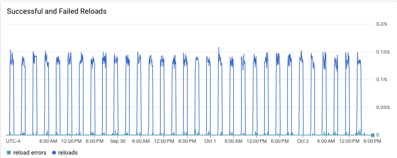

# Results for v1.0.0

<!-- TOC -->

- [Results for v1.0.0](#results-for-v100)
  - [Versions](#versions)
  - [Traffic](#traffic)
    - [NGF](#ngf)
      - [Error Log](#error-log)
    - [NGINX](#nginx)
      - [Error Log](#error-log-1)
      - [Access Log](#access-log)
  - [Key Metrics](#key-metrics)
    - [Containers memory](#containers-memory)
    - [Containers CPU](#containers-cpu)
    - [NGINX metrics](#nginx-metrics)
    - [Reloads](#reloads)
  - [Opened Issues](#opened-issues)
  - [Future Improvements](#future-improvements)

<!-- TOC -->

## Versions

NGF version:

```text
commit: "07d76315931501d878f3ed079142aa1899be1bd3"
date: "2023-09-28T16:49:51Z"
version: "edge"
```

with NGINX:

```text
nginx/1.25.2
built by gcc 12.2.1 20220924 (Alpine 12.2.1_git20220924-r10)
OS: Linux 5.15.109+
```

Kubernetes:

```text
Server Version: version.Info{Major:"1", Minor:"27", GitVersion:"v1.27.3-gke.100", GitCommit:"6466b51b762a5c49ae3fb6c2c7233ffe1c96e48c", GitTreeState:"clean", BuildDate:"2023-06-23T09:27:28Z", GoVersion:"go1.20.5 X:boringcrypto", Compiler:"gc", Platform:"linux/amd64"}
```

## Traffic

HTTP:

```text
wrk -t2 -c100 -d96h http://cafe.example.com/coffee/long2

Running 5760m test @ http://cafe.example.com/coffee/long2
  2 threads and 100 connections
  Thread Stats   Avg      Stdev     Max   +/- Stdev
    Latency   174.97ms  140.07ms   2.00s    83.57%
    Req/Sec   319.15    212.21     2.21k    65.75%
  210108892 requests in 5615.74m, 74.42GB read
  Socket errors: connect 0, read 356317, write 0, timeout 4299
Requests/sec:    623.57
Transfer/sec:    231.60KB
```

HTTPS:

```text
wrk -t2 -c100 -d96h https://cafe.example.com/tea/long2

Running 5760m test @ https://cafe.example.com/tea/long2
  2 threads and 100 connections
  Thread Stats   Avg      Stdev     Max   +/- Stdev
    Latency   165.13ms  113.14ms   1.99s    68.74%
    Req/Sec   317.87    211.81     2.15k    65.17%
  209303259 requests in 5616.52m, 72.99GB read
  Socket errors: connect 0, read 351351, write 0, timeout 3
Requests/sec:    621.09
Transfer/sec:    227.12KB
```

While there are socket errors in the output, there are no connection-related errors in NGINX logs.
Further investigation is out of scope of this test.

### NGF

#### Error Log

```text
resource.type="k8s_container"
resource.labels.pod_name="nginx-gateway-b6cdb65cd-h8bgs"
resource.labels.namespace_name="nginx-gateway"
resource.labels.container_name="nginx-gateway"
severity=ERROR
SEARCH("error")
```

Found 104 entries, All entries are similar to:

```json
{
    "stacktrace": "github.com/nginxinc/nginx-gateway-fabric/internal/mode/static.(*eventHandlerImpl).HandleEventBatch\n\t/home/runner/work/nginx-gateway-fabric/nginx-gateway-fabric/internal/mode/static/handler.go:105\ngithub.com/nginxinc/nginx-gateway-fabric/internal/framework/events.(*EventLoop).Start.func1.1\n\t/home/runner/work/nginx-gateway-fabric/nginx-gateway-fabric/internal/framework/events/loop.go:68",
    "logger": "eventHandler",
    "error": "failed to reload NGINX: reload unsuccessful: no new NGINX worker processes started for config version 11135. Please check the NGINX container logs for possible configuration issues: context deadline exceeded",
    "level": "error",
    "msg": "Failed to update NGINX configuration",
    "ts": "2023-10-01T18:44:03Z"
}
```

See Key metrics Reloads further in this doc.

During the first run of the longevity test, for a shorter period (1 day), the following appeared in NGF logs:

```text
I0926 20:58:42.883382       6 leaderelection.go:250] attempting to acquire leader lease nginx-gateway/nginx-gateway-leader-election...
I0926 20:58:43.073317       6 leaderelection.go:260] successfully acquired lease nginx-gateway/nginx-gateway-leader-election
{"level":"info","ts":"2023-09-26T20:58:43Z","logger":"leaderElector","msg":"Started leading"}
E0927 08:09:20.830614       6 leaderelection.go:332] error retrieving resource lock nginx-gateway/nginx-gateway-leader-election: Get "https://10.64.0.1:443/apis/coordination.k8s.io/v1/namespaces/nginx-gateway/leases/nginx-gateway-leader-election?timeout=5s": net/http: request canceled (Client.Timeout exceeded while awaiting headers)
E0927 08:09:25.829736       6 leaderelection.go:332] error retrieving resource lock nginx-gateway/nginx-gateway-leader-election: Get "https://10.64.0.1:443/apis/coordination.k8s.io/v1/namespaces/nginx-gateway/leases/nginx-gateway-leader-election?timeout=5s": context deadline exceeded
I0927 08:09:25.830070       6 leaderelection.go:285] failed to renew lease nginx-gateway/nginx-gateway-leader-election: timed out waiting for the condition
{"level":"info","ts":"2023-09-27T08:09:25Z","logger":"leaderElector","msg":"Stopped leading"}
E0927 08:09:35.862628       6 event.go:289] Unable to write event: '&v1.Event{TypeMeta:v1.TypeMeta{Kind:"", APIVersion:""}, ObjectMeta:v1.ObjectMeta{Name:"nginx-gateway-leader-election.1788b315c7bd90e5", GenerateName:"", Namespace:"nginx-gateway", SelfLink:"", UID:"", ResourceVersion:"", Generation:0, CreationTimestamp:time.Date(1, time.January, 1, 0, 0, 0, 0, time.UTC), DeletionTimestamp:<nil>, DeletionGracePeriodSeconds:(*int64)(nil), Labels:map[string]string(nil), Annotations:map[string]string(nil), OwnerReferences:[]v1.OwnerReference(nil), Finalizers:[]string(nil), ManagedFields:[]v1.ManagedFieldsEntry(nil)}, InvolvedObject:v1.ObjectReference{Kind:"Lease", Namespace:"nginx-gateway", Name:"nginx-gateway-leader-election", UID:"eb133a0d-7622-4b80-a0d1-d49755e52a1f", APIVersion:"coordination.k8s.io/v1", ResourceVersion:"1044977", FieldPath:""}, Reason:"LeaderElection", Message:"nginx-gateway-b6cdb65cd-bt7zg stopped leading", Source:v1.EventSource{Component:"nginx-gateway-fabric-nginx", Host:""}, FirstTimestamp:time.Date(2023, time.September, 27, 8, 9, 25, 831766245, time.Local), LastTimestamp:time.Date(2023, time.September, 27, 8, 9, 25, 831766245, time.Local), Count:1, Type:"Normal", EventTime:time.Date(1, time.January, 1, 0, 0, 0, 0, time.UTC), Series:(*v1.EventSeries)(nil), Action:"", Related:(*v1.ObjectReference)(nil), ReportingController:"nginx-gateway-fabric-nginx", ReportingInstance:""}': 'Post "https://10.64.0.1:443/api/v1/namespaces/nginx-gateway/events?timeout=10s": net/http: request canceled (Client.Timeout exceeded while awaiting headers)'(may retry after sleeping)
{"level":"info","ts":"2023-09-27T17:19:27Z","logger":"statusUpdater","msg":"Skipping updating Nginx Gateway status because not leader"}
{"level":"info","ts":"2023-09-27T19:54:13Z","logger":"statusUpdater","msg":"Skipping updating Gateway API status because not leader"}
{"level":"info","ts":"2023-09-27T19:54:15Z","logger":"statusUpdater","msg":"Skipping updating Gateway API status because not leader"}
{"level":"info","ts":"2023-09-27T19:54:24Z","logger":"statusUpdater","msg":"Skipping updating Gateway API status because not leader"}
{"level":"info","ts":"2023-09-27T19:54:25Z","logger":"statusUpdater","msg":"Skipping updating Gateway API status because not leader"}
```

There are two problems:

- The NGF pod lost its leadership, even though no other NGF pods were
  running -- https://github.com/nginxinc/nginx-gateway-fabric/issues/1100
- The leader elector logs are not structural -- https://github.com/nginxinc/nginx-gateway-fabric/issues/1101

### NGINX

#### Error Log

Errors:

```text
resource.type="k8s_container"
resource.labels.pod_name="nginx-gateway-b6cdb65cd-h8bgs"
resource.labels.namespace_name="nginx-gateway"
resource.labels.container_name="nginx"
severity=ERROR
SEARCH("`[warn]`") OR SEARCH("`[error]`")
```

No entries found.

#### Access Log

Non-200 response codes in NGINX access logs:

```text
severity=INFO
"GET" "HTTP/1.1" -"200"
```

No such responses.

## Key Metrics

### Containers memory


No unexpected spikes or drops.

### Containers CPU


No unexpected spikes or drops.

### NGINX metrics


The drop of _requests_ on Sep 29 is neither significant nor has any correlated errors in NGINX logs.

### Reloads

Rate of reloads - successful and errors:



Reload spikes correspond to 1 hour periods of backend re-rollouts.
However, small spikes, like at 1pm Sep 29, correspond to periodic reconciliation of Secrets, which (incorrectly)
triggers a reload -- https://github.com/nginxinc/nginx-gateway-fabric/issues/1112

A small percentage of reloads finished with error. That happened because of the bug in NFG - it wouldn't wait long
enough for the NGINX master to start new worker
processes --  https://github.com/nginxinc/nginx-gateway-fabric/issues/1106

Reload time distribution with 50th, 95th and 99th percentiles and the threshold:


Note - 60s is the threshold for waiting for NGINX to be reloaded.

Reload related metrics at the end:

```text
# HELP nginx_gateway_fabric_nginx_reloads_milliseconds Duration in milliseconds of NGINX reloads
# TYPE nginx_gateway_fabric_nginx_reloads_milliseconds histogram
nginx_gateway_fabric_nginx_reloads_milliseconds_bucket{class="nginx",le="500"} 5608
nginx_gateway_fabric_nginx_reloads_milliseconds_bucket{class="nginx",le="1000"} 13926
nginx_gateway_fabric_nginx_reloads_milliseconds_bucket{class="nginx",le="5000"} 14842
nginx_gateway_fabric_nginx_reloads_milliseconds_bucket{class="nginx",le="10000"} 14842
nginx_gateway_fabric_nginx_reloads_milliseconds_bucket{class="nginx",le="30000"} 14842
nginx_gateway_fabric_nginx_reloads_milliseconds_bucket{class="nginx",le="+Inf"} 14842
nginx_gateway_fabric_nginx_reloads_milliseconds_sum{class="nginx"} 8.645665e+06
nginx_gateway_fabric_nginx_reloads_milliseconds_count{class="nginx"} 14842
```

All successful reloads took less than 5 seconds.

## Opened Issues

- NGF doesn't wait long enough for new NGINX workers to
  start - https://github.com/nginxinc/nginx-gateway-fabric/issues/1106
- NGF unnecessary reloads NGINX when it reconciles
  Secrets - https://github.com/nginxinc/nginx-gateway-fabric/issues/1112
- Statuses not reported because no leader gets elected - https://github.com/nginxinc/nginx-gateway-fabric/issues/1100
- Use NGF Logger in Client-Go Library - https://github.com/nginxinc/nginx-gateway-fabric/issues/1101

## Future Improvements

- Control Plane transactions weren't fully tested. While we tested that NGF processes EndpointSlices changes, we didn't
  test any transaction that result into status of updates of resources, like a change in an HTTPRoute.
  updated.
