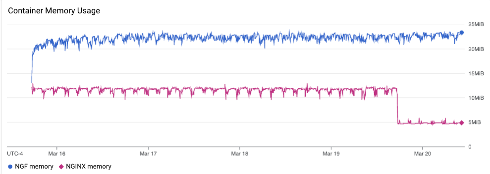
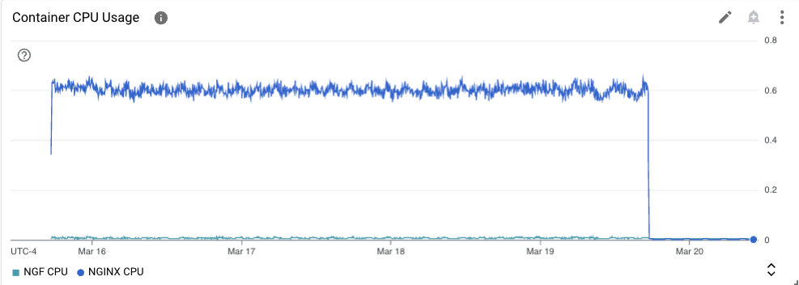
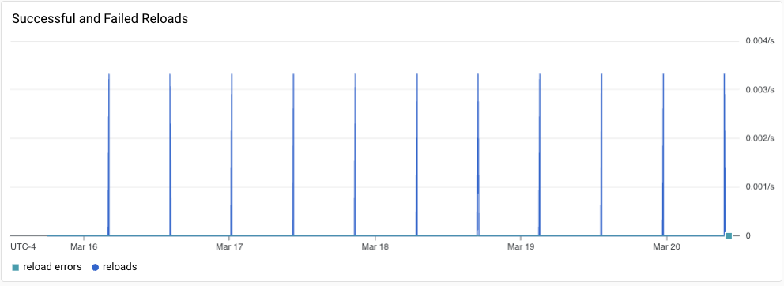

# Results

Note: product telemetry feature was enabled but sending of product telemetry data was disabled.

## NGINX OSS

### Test environment

NGINX Plus: false

GKE Cluster:

- Node count: 3
- k8s version: v1.27.8-gke.1067004
- vCPUs per node: 2
- RAM per node: 4022900Ki
- Max pods per node: 110
- Zone: us-central1-c
- Instance Type: e2-medium

NGF pod name -- ngf-longevity-nginx-gateway-fabric-7f596f74c5-xzkzb

### Traffic

HTTP:

```text
Running 5760m test @ http://cafe.example.com/coffee
  2 threads and 100 connections
  Thread Stats   Avg      Stdev     Max   +/- Stdev
    Latency   183.83ms  143.49ms   2.00s    79.14%
    Req/Sec   303.07    204.23     2.22k    66.90%
  204934013 requests in 5760.00m, 71.25GB read
  Socket errors: connect 0, read 344459, write 0, timeout 5764
Requests/sec:    592.98
Transfer/sec:    216.19KB
```

HTTPS:

```text
Running 5760m test @ https://cafe.example.com/tea
  2 threads and 100 connections
  Thread Stats   Avg      Stdev     Max   +/- Stdev
    Latency   175.23ms  122.10ms   2.00s    68.72%
    Req/Sec   301.92    203.60     1.95k    66.97%
  204120642 requests in 5760.00m, 69.83GB read
  Socket errors: connect 0, read 337203, write 0, timeout 246
Requests/sec:    590.63
Transfer/sec:    211.87KB
```

### Logs

No error logs in nginx-gateway

No error logs in nginx

### Key Metrics

#### Containers memory



Drop in NGINX memory usage corresponds to the end of traffic generation.

#### NGF Container Memory


### Containers CPU



Drop in NGINX CPU usage corresponds to the end of traffic generation.

### NGINX metrics


Drop in request corresponds to the end of traffic generation.


### Reloads

Rate of reloads - successful and errors:


Reload spikes correspond to 1 hour periods of backend re-rollouts.
However, small spikes, correspond to periodic reconciliation of Secrets, which (incorrectly)
triggers a reload -- https://github.com/nginxinc/nginx-gateway-fabric/issues/1112

No reloads finished with an error.

Reload time distribution - counts:


Reload related metrics at the end:


All successful reloads took less than 5 seconds, with most under 1 second.

## NGINX Plus

### Test environment

NGINX Plus: false

GKE Cluster:

- Node count: 3
- k8s version: v1.27.8-gke.1067004
- vCPUs per node: 2
- RAM per node: 4022900Ki
- Max pods per node: 110
- Zone: us-central1-c
- Instance Type: e2-medium

NGF pod name -- ngf-longevity-nginx-gateway-fabric-fc7f6bcf-cnlww

### Traffic

HTTP:

```text
Running 5760m test @ http://cafe.example.com/coffee
  2 threads and 100 connections
  Thread Stats   Avg      Stdev     Max   +/- Stdev
    Latency   173.03ms  120.83ms   2.00s    68.41%
    Req/Sec   313.29    209.75     2.11k    65.95%
  211857930 requests in 5760.00m, 74.04GB read
  Socket errors: connect 0, read 307, write 0, timeout 118
  Non-2xx or 3xx responses: 6
Requests/sec:    613.01
Transfer/sec:    224.63KB
```

HTTPS:

```text
Running 5760m test @ https://cafe.example.com/tea
  2 threads and 100 connections
  Thread Stats   Avg      Stdev     Max   +/- Stdev
    Latency   173.25ms  120.87ms   2.00s    68.37%
    Req/Sec   312.62    209.06     1.95k    66.02%
  211427067 requests in 5760.00m, 72.76GB read
  Socket errors: connect 0, read 284, write 0, timeout 92
   vresponses: 4
Requests/sec:    611.77
Transfer/sec:    220.77KB
```

Note: Non-2xx or 3xx responses correspond to the error in NGINX log, see below.

### Logs

nginx-gateway:

a lot of expected "usage reporting not enabled" errors.

```text
INFO 2024-03-20T14:13:00.372305088Z [resource.labels.containerName: nginx-gateway] {"level":"info", "msg":"Wait completed, proceeding to shutdown the manager", "ts":"2024-03-20T14:13:00Z"}
ERROR 2024-03-20T14:13:00.374159128Z [resource.labels.containerName: nginx-gateway] {"error":"leader election lost", "level":"error", "msg":"error received after stop sequence was engaged", "stacktrace":"sigs.k8s.io/controller-runtime/pkg/manager.(*controllerManager).engageStopProcedure.func1 sigs.k8s.io/controller-runtime@v0.17.2/pkg/manager/internal.go:490", "ts":"2024-03-20T14:13:00Z"}
```

The error occurred during shutdown. Needs further investigation if the shutdown process should be fixed.
https://github.com/nginxinc/nginx-gateway-fabric/issues/1735

nginx:

```text
ERROR 2024-03-17T21:11:11.017601264Z [resource.labels.containerName: nginx] 2024/03/17 21:11:10 [error] 43#43: *211045372 no live upstreams while connecting to upstream, client: 10.128.0.19, server: cafe.example.com, request: "GET /tea HTTP/1.1", upstream: "http://longevity_tea_80/tea", host: "cafe.example.com"
```

10 errors like that occurred at different times. They occurred when backend pods were updated. Not clear why that happens.
Because number of errors is small compared with total handled requests (211857930 + 211427067), no need to further
investigate unless we see it in the future again at larger volume.

### Key Metrics

#### Containers memory


Drop in NGINX memory usage corresponds to the end of traffic generation.

#### NGF Container Memory


### Containers CPU


Drop in NGINX CPU usage corresponds to the end of traffic generation.

### NGINX Plus metrics


Drop in request corresponds to the end of traffic generation.

### Reloads

Rate of reloads - successful and errors:



Note: compared to NGINX, we don't have as many reloads here, because NGF uses NGINX Plus API to reconfigure NGINX
for endpoints changes.

However, small spikes, correspond to periodic reconciliation of Secrets, which (incorrectly)
triggers a reload -- https://github.com/nginxinc/nginx-gateway-fabric/issues/1112

No reloads finished with an error.

Reload time distribution - counts:


Reload related metrics at the end:


All successful reloads took less than 1 seconds, with most under 0.5 second.

## Comparison with previous runs

If we compare with 1.1.0 results, we will see that NGF container memory usage is 2 times higher.
That is probably due to a bug in metric visualization for 1.1.0 results (using mean instead of sum for aggregation).
Running 1.1.0 in a similar cluster yields only slightly less memory usage (-2..-1MB)


