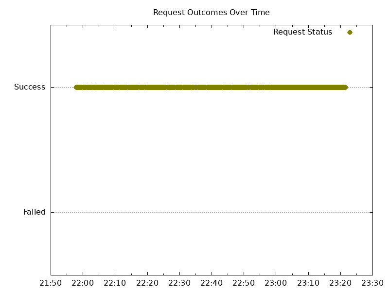

# Results

<!-- TOC -->
- [Results](#results)
  - [Summary](#summary)
  - [Versions](#versions)
  - [Analyze](#analyze)
    - [Tester VMs](#tester-vms)
<!-- TOC -->

## Summary

For the most part everything looked good, though a couple requests failed during the https upgrade.
Fewer 499 responses than in past releases, and didn't see any socket errors when using wrk.

## Versions

Kubernetes:

```json
"serverVersion": {
    "major": "1",
    "minor": "27",
    "gitVersion": "v1.27.3-gke.100",
    "gitCommit": "6466b51b762a5c49ae3fb6c2c7233ffe1c96e48c",
    "gitTreeState": "clean",
    "buildDate": "2023-06-23T09:27:28Z",
    "goVersion": "go1.20.5 X:boringcrypto",
    "compiler": "gc",
    "platform": "linux/amd64"
  }
```

Old NGF version:

```text
"version":"1.0.0"
"commit":"55b17384cdd4042ffca8dcb8b5c7dec8f6729df9"
"date":"2023-10-24T18:39:05Z"
```

New NGF version:

```text
version: "edge"
commit: "afba7606e2d9e4a5a08e0d0431df4b9e4f3a3437"
date: "2023-12-07T18:47:58Z"
```

### Analyze

- NGF logs: no errors
- NGINX logs: no errors

Lease was properly updated, and Gateway status updated with new listener.

#### Tester VMs

Tester 1 wrk output:

```text
Running 1m test @ http://cafe.example.com/coffee
  2 threads and 100 connections
  Thread Stats   Avg      Stdev     Max   +/- Stdev
    Latency    35.73ms   39.12ms 753.38ms   89.85%
    Req/Sec     1.75k   577.68     3.57k    68.25%
  Latency Distribution
     50%   25.13ms
     75%   45.05ms
     90%   75.44ms
     99%  183.71ms
  209294 requests in 1.00m, 74.45MB read
Requests/sec:   3486.00
Transfer/sec:      1.24MB
```

Tester 1 graph:



Tester 2 wrk output:

```text
Running 1m test @ https://cafe.example.com/tea
  2 threads and 100 connections
  Thread Stats   Avg      Stdev     Max   +/- Stdev
    Latency    34.82ms   37.53ms 753.43ms   89.95%
    Req/Sec     1.77k   565.66     4.29k    74.50%
  Latency Distribution
     50%   24.07ms
     75%   42.99ms
     90%   72.51ms
     99%  176.96ms
  211751 requests in 1.00m, 73.91MB read
Requests/sec:   3527.10
Transfer/sec:      1.23MB
```

Tester 2 graph:


