# Results

## Versions

Kubernetes:

```text
Server Version: version.Info{Major:"1", Minor:"27", GitVersion:"v1.27.5-gke.200",
GitCommit:"f9aad8e51abb509136cb82b4a00cc3d77d3d70d9", GitTreeState:"clean", BuildDate:"2023-08-26T23:26:22Z",
GoVersion:"go1.20.7 X:boringcrypto", Compiler:"gc", Platform:"linux/amd64"}
```

NGF:

```text
"version":"edge",
"commit":"7a6e198c8b6e1e81058cd9ad0717cffa2cc77bb8",
"date":"2023-12-07T22:27:22Z"
```

with NGINX:

```text
nginx version: nginx/1.25.3
built by gcc 12.2.1 20220924 (Alpine 12.2.1_git20220924-r10)
built with OpenSSL 3.1.3 19 Sep 2023 (running with OpenSSL 3.1.4 24 Oct 2023)
```

## Summary

Results are similar with 1.0.0 test results. Did not encounter instances of
NGF Pod readiness flagging under high load. Downtime and small errors/warnings still persisted.

Added new Issue to investigate intervals of missing data in the gradual scaling up sections.

- https://github.com/nginx/nginx-gateway-fabric/issues/1372

Existing Issues:

- https://github.com/nginx/nginx-gateway-fabric/issues/1185
- https://github.com/nginx/nginx-gateway-fabric/issues/1147

## 25 Node Cluster with anti affinity

### Scale Up Gradually

HTTP wrk output:

```text
Running 5m test @ http://cafe.example.com/coffee
  2 threads and 2 connections
  Thread Stats   Avg      Stdev     Max   +/- Stdev
    Latency     3.31ms   42.03ms   1.04s    99.51%
    Req/Sec     1.42k   120.96     1.70k    78.24%
  Latency Distribution
     50%  684.00us
     75%  765.00us
     90%    0.86ms
     99%    1.54ms
  725404 requests in 5.00m, 259.07MB read
  Socket errors: connect 0, read 19, write 0, timeout 3
Requests/sec:   2417.39
Transfer/sec:      0.86MB
```

HTTP Graph:

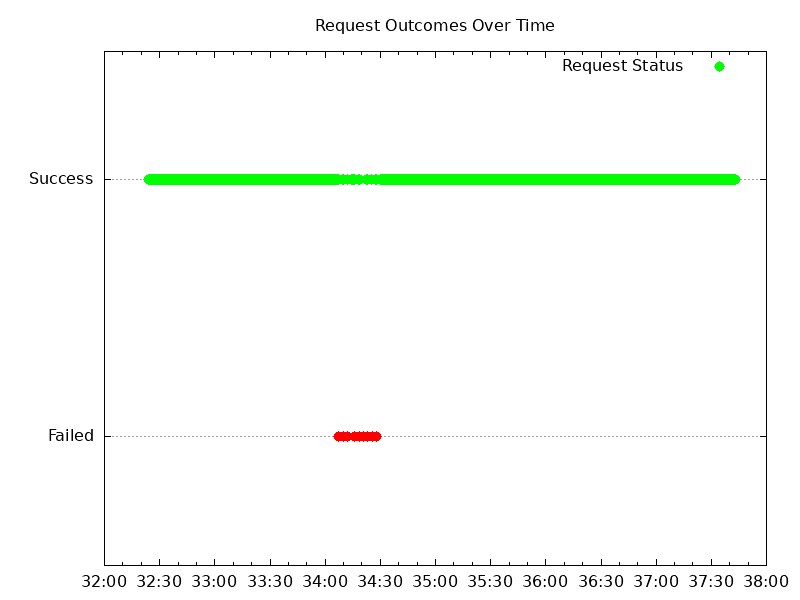

HTTPS wrk output:

```text
Running 5m test @ https://cafe.example.com/tea
  2 threads and 2 connections
  Thread Stats   Avg      Stdev     Max   +/- Stdev
    Latency     6.12ms   60.34ms   1.07s    99.04%
    Req/Sec     1.25k   106.37     1.44k    84.47%
  Latency Distribution
     50%  775.00us
     75%    0.87ms
     90%    0.98ms
     99%   39.75ms
  561506 requests in 5.00m, 196.84MB read
  Socket errors: connect 0, read 17, write 0, timeout 2
Requests/sec:   1871.29
Transfer/sec:    671.75KB
```

HTTPS graph:


Logs:

- NGF error logs: none
- NGINX error logs:

  Handful of these errors and warnings:

  ```text
  2023/12/11 19:14:13 [warn] 77#77: *159408 upstream server temporarily disabled while connecting to upstream, client: 10.128.0.2, server: cafe.example.com, request: "GET /tea HTTP/1.1", upstream: "http://10.100.6.4:8080/tea", host: "cafe.example.com"
  2023/12/11 19:14:13 [error] 77#77: *159408 upstream timed out (110: Operation timed out) while connecting to upstream, client: 10.128.0.2, server: cafe.example.com, request: "GET /tea HTTP/1.1", upstream: "http://10.100.6.4:8080/tea", host: "cafe.example.com"
  ```

- NGINX access logs:
  - 1.3 million 200s

### Scale Down Gradually

HTTP wrk output:

```text
Running 20m test @ http://cafe.example.com/coffee
  2 threads and 2 connections
  Thread Stats   Avg      Stdev     Max   +/- Stdev
    Latency     4.45ms   50.48ms   1.06s    99.31%
    Req/Sec     1.40k   110.26     1.71k    80.20%
  Latency Distribution
     50%  697.00us
     75%  781.00us
     90%    0.88ms
     99%    1.75ms
  2825074 requests in 18.75m, 0.99GB read
  Socket errors: connect 0, read 12, write 0, timeout 14
Requests/sec:   2510.62
Transfer/sec:      0.90MB
```

HTTP graph:

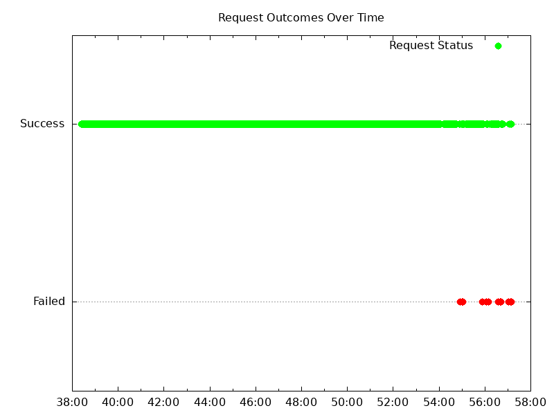

HTTPS wrk output:

```text
Running 20m test @ https://cafe.example.com/tea
  2 threads and 2 connections
  Thread Stats   Avg      Stdev     Max   +/- Stdev
    Latency     5.89ms   58.64ms   1.07s    99.07%
    Req/Sec     1.21k    97.92     1.45k    78.52%
  Latency Distribution
     50%  801.00us
     75%    0.90ms
     90%    1.03ms
     99%    5.57ms
  2443028 requests in 18.77m, 856.44MB read
  Socket errors: connect 0, read 20, write 0, timeout 17
Requests/sec:   2168.92
Transfer/sec:    778.60KB
```

HTTPs graph:


Logs:

- NGF error logs: none
- NGINX error/warn logs: none
- NGINX access logs:
  - ~5.3 million 200s
  - Two 499 `10.128.15.192 - - [11/Dec/2023:19:57:08 +0000] "GET /coffee HTTP/1.1" 499 0 "-" "-"` access logs
  - Two 499 `10.128.0.2 - - [11/Dec/2023:19:57:11 +0000] "GET /tea HTTP/1.1" 499 0 "-" "-"` access logs

### Scale Up Abruptly

HTTP wrk output:

```text
Running 2m test @ http://cafe.example.com/coffee
  2 threads and 2 connections
  Thread Stats   Avg      Stdev     Max   +/- Stdev
    Latency   721.49us  345.23us  20.92ms   96.89%
    Req/Sec     1.41k   124.29     1.65k    69.84%
  Latency Distribution
     50%  685.00us
     75%  771.00us
     90%    0.87ms
     99%    1.35ms
  193279 requests in 1.15m, 69.03MB read
Requests/sec:   2809.16
Transfer/sec:      1.00MB
```

HTTP graph:

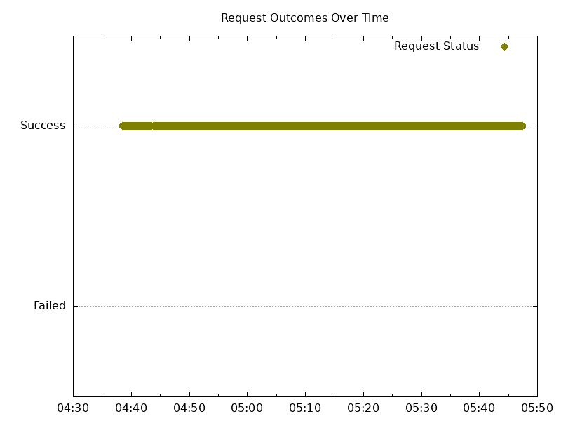

HTTPS wrk output:

```text
Running 2m test @ https://cafe.example.com/tea
  2 threads and 2 connections
  Thread Stats   Avg      Stdev     Max   +/- Stdev
    Latency   821.77us  363.70us  19.08ms   96.20%
    Req/Sec     1.24k   101.63     1.45k    68.32%
  Latency Distribution
     50%  782.00us
     75%    0.88ms
     90%    1.00ms
     99%    1.57ms
  173111 requests in 1.17m, 60.69MB read
Requests/sec:   2458.64
Transfer/sec:      0.86MB
```

HTTPS graph:

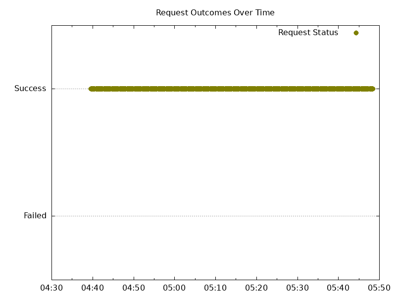

Logs:

- NGF Logs: none
- NGINX error logs: none
- NGINX access logs:
  - 367,525 200s

### Scale Down Abruptly

HTTP wrk output:

```text
Running 2m test @ http://cafe.example.com/coffee
  2 threads and 2 connections
  Thread Stats   Avg      Stdev     Max   +/- Stdev
    Latency   705.65us  203.09us  11.21ms   90.44%
    Req/Sec     1.43k   109.29     1.66k    67.61%
  Latency Distribution
     50%  678.00us
     75%  759.00us
     90%    0.86ms
     99%    1.27ms
  146097 requests in 0.86m, 52.18MB read
Requests/sec:   2842.15
Transfer/sec:      1.02MB
```

HTTP graph:

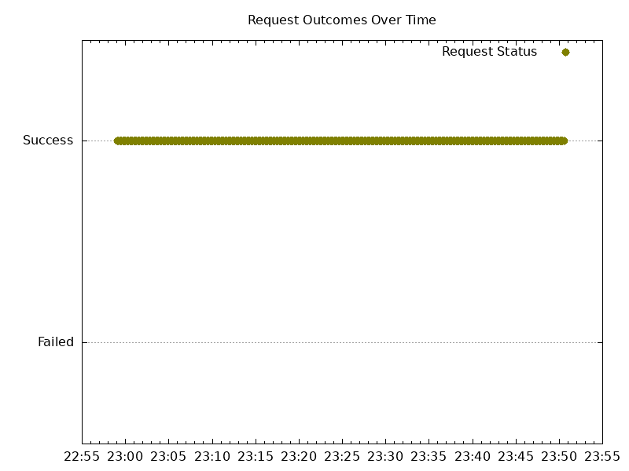

HTTPS wrk output:

```text
Running 2m test @ https://cafe.example.com/tea
  2 threads and 2 connections
  Thread Stats   Avg      Stdev     Max   +/- Stdev
    Latency   809.23us  219.76us  11.40ms   89.48%
    Req/Sec     1.24k    89.67     1.44k    65.07%
  Latency Distribution
     50%  781.00us
     75%    0.87ms
     90%    0.98ms
     99%    1.45ms
  126233 requests in 0.85m, 44.25MB read
  Socket errors: connect 0, read 2, write 0, timeout 0
Requests/sec:   2469.98
Transfer/sec:      0.87MB
```

HTTPS graph:

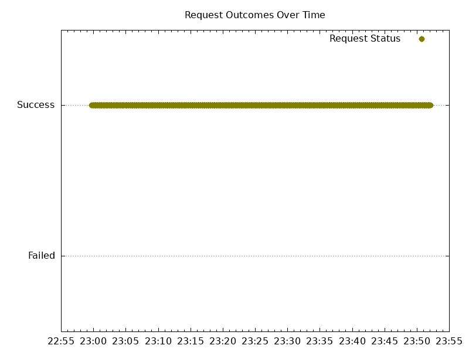

Logs:

- NGF logs: none
- NGINX error logs: none
- NGINX access logs:
  - 273,185 200s


## 10 Node Cluster

### Scale up Gradually

HTTP wrk output:

```text
Running 5m test @ http://cafe.example.com/coffee
  2 threads and 2 connections
  Thread Stats   Avg      Stdev     Max   +/- Stdev
    Latency     5.12ms   54.21ms   1.05s    99.19%
    Req/Sec     1.31k   134.56     1.54k    87.69%
  Latency Distribution
     50%  733.00us
     75%  830.00us
     90%    0.96ms
     99%    4.92ms
  480063 requests in 5.00m, 171.32MB read
  Socket errors: connect 0, read 18, write 0, timeout 9
Requests/sec:   1599.89
Transfer/sec:    584.64KB

```

HTTP graph:

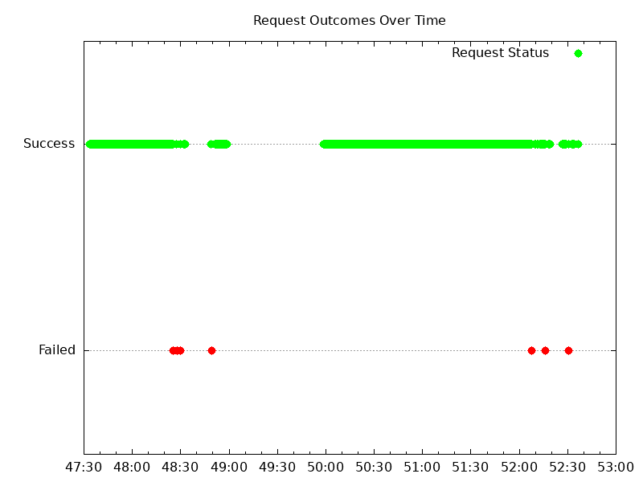

HTTPS wrk output:

```text
Running 5m test @ https://cafe.example.com/tea
  2 threads and 2 connections
  Thread Stats   Avg      Stdev     Max   +/- Stdev
    Latency     4.33ms   48.83ms   1.06s    99.33%
    Req/Sec     1.24k   137.71     1.45k    86.42%
  Latency Distribution
     50%  769.00us
     75%    0.87ms
     90%    1.00ms
     99%    3.07ms
  456473 requests in 5.00m, 159.85MB read
  Socket errors: connect 0, read 21, write 0, timeout 8
Requests/sec:   1521.27
Transfer/sec:    545.51KB

```

HTTPS graph:

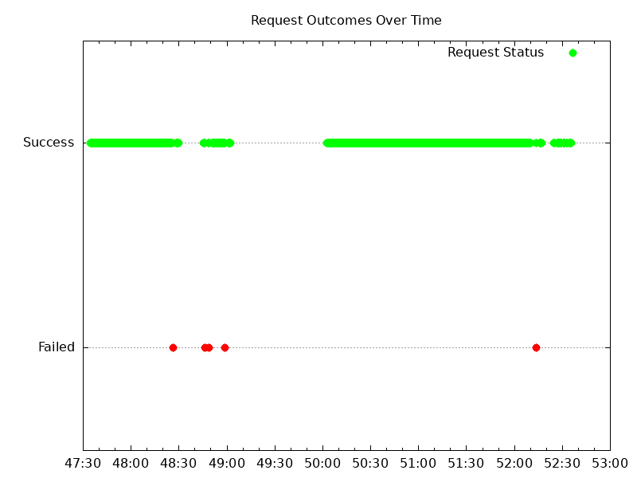

Logs:

- NGF error logs: none
- NGINX error/warn logs:

  Multiple warn/error about upstreams:

  ```text
  2023/12/07 19:49:58 [warn] 57#57: *50 upstream server temporarily disabled while connecting to upstream, client: 10.128.0.2, server: cafe.example.com, request: "GET /tea HTTP/1.1", upstream: "http://10.116.0.7:8080/tea", host: "cafe.example.com"
  2023/12/07 19:49:58 [error] 57#57: *50 upstream timed out (110: Operation timed out) while connecting to upstream, client: 10.128.0.2, server: cafe.example.com, request: "GET /tea HTTP/1.1", upstream: "http://10.116.0.7:8080/tea", host: "cafe.example.com"
  ```

- NGINX access logs:
  - ~ 900,000 200s
  - Two 499 `10.128.15.192 - - [07/Dec/2023:19:52:32 +0000] "GET /coffee HTTP/1.1" 499 0 "-" "-"` access logs
  - Two 499 `10.128.0.2 - - [07/Dec/2023:19:52:33 +0000] "GET /tea HTTP/1.1" 499 0 "-" "-"` access logs


### Scale Down Gradually

HTTP wrk output:

```text
Running 20m test @ http://cafe.example.com/coffee
  2 threads and 2 connections
  Thread Stats   Avg      Stdev     Max   +/- Stdev
    Latency    32.15ms  143.48ms   1.07s    94.95%
    Req/Sec     1.24k   194.27     1.58k    82.67%
  Latency Distribution
     50%  769.00us
     75%    0.92ms
     90%    1.22ms
     99%  862.53ms
  2247015 requests in 20.00m, 801.66MB read
  Socket errors: connect 0, read 15, write 44, timeout 50
Requests/sec:   1872.47
Transfer/sec:    684.06KB
```

HTTP graph:

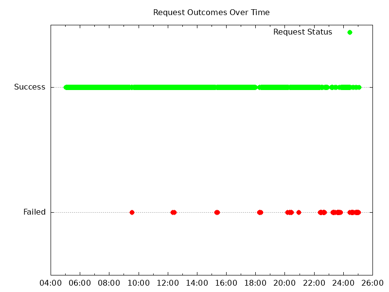

HTTPS wrk output

```text
Running 20m test @ https://cafe.example.com/tea
  2 threads and 2 connections
  Thread Stats   Avg      Stdev     Max   +/- Stdev
    Latency    29.33ms  136.91ms   1.07s    95.36%
    Req/Sec     1.17k   185.23     1.48k    81.06%
  Latency Distribution
     50%  814.00us
     75%    0.97ms
     90%    1.27ms
     99%  843.95ms
  2075061 requests in 20.00m, 726.46MB read
  Socket errors: connect 57, read 17, write 0, timeout 55
Requests/sec:   1729.17
Transfer/sec:    619.89KB
```

HTTPS graph:


Logs:

- NGF error logs: none
- NGINX error/warn logs:

  1 warn/error about upstreams:

  ```text
  2023/12/08 18:23:24 [warn] 170#170: *406056 upstream server temporarily disabled while connecting to upstream, client: 10.128.0.2, server: cafe.example.com, request: "GET /tea HTTP/1.1", upstream: "http://10.116.2.3:8080/tea", host: "cafe.example.com"
  2023/12/08 18:23:24 [error] 170#170: *406056 upstream timed out (110: Operation timed out) while connecting to upstream, client: 10.128.0.2, server: cafe.example.com, request: "GET /tea HTTP/1.1", upstream: "http://10.116.2.3:8080/tea", host: "cafe.example.com"
  ```

- NGINX access logs:
  - ~ 4.3 million 200 access logs
  - Two 499 `10.128.15.192 - - [08/Dec/2023:18:25:00 +0000] "GET /coffee HTTP/1.1" 499 0 "-" "-"` access logs
  - Two 499 `10.128.0.2 - - [08/Dec/2023:18:25:01 +0000] "GET /tea HTTP/1.1" 499 0 "-" "-"` access logs

### Scale Up Abruptly

HTTP wrk output:

```text
Running 2m test @ http://cafe.example.com/coffee
  2 threads and 2 connections
  Thread Stats   Avg      Stdev     Max   +/- Stdev
    Latency   812.57us  413.54us  27.47ms   94.29%
    Req/Sec     1.25k   169.63     1.60k    74.11%
  Latency Distribution
     50%  754.00us
     75%    0.88ms
     90%    1.06ms
     99%    1.82ms
  190724 requests in 2.00m, 68.04MB read
  Socket errors: connect 0, read 0, write 0, timeout 2
Requests/sec:   1589.34
Transfer/sec:    580.63KB
```

HTTP graph:

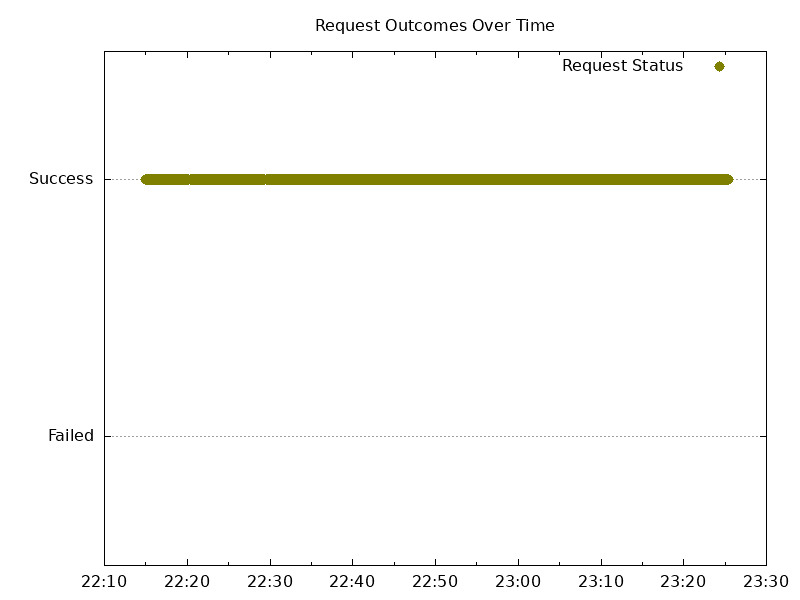

HTTPS wrk output:

```text
Running 2m test @ https://cafe.example.com/tea
  2 threads and 2 connections
  Thread Stats   Avg      Stdev     Max   +/- Stdev
    Latency     0.87ms  426.65us  22.99ms   94.29%
    Req/Sec     1.17k   157.09     1.52k    74.11%
  Latency Distribution
     50%  806.00us
     75%    0.94ms
     90%    1.12ms
     99%    1.92ms
  175399 requests in 2.00m, 61.41MB read
  Socket errors: connect 0, read 1, write 0, timeout 2
Requests/sec:   1461.60
Transfer/sec:    523.97KB
```

HTTPS graph:


Logs:

- NGF error logs: none
- NGINX error/warn logs: none
- NGINX access logs:
  - 367,320 200s
  - Two 499 `10.128.15.192 - - [08/Dec/2023:19:24:14 +0000] "GET /coffee HTTP/1.1" 499 0 "-" "-"` access logs
  - Two 499 `10.128.0.2 - - [08/Dec/2023:19:24:15 +0000] "GET /tea HTTP/1.1" 499 0 "-" "-"` access logs

### Scale Down Abruptly

HTTP wrk output:

```text
Running 2m test @ http://cafe.example.com/coffee
  2 threads and 2 connections
  Thread Stats   Avg      Stdev     Max   +/- Stdev
    Latency   828.59us  301.93us  13.31ms   87.69%
    Req/Sec     1.21k   141.47     1.53k    74.72%
  Latency Distribution
     50%  779.00us
     75%    0.91ms
     90%    1.08ms
     99%    1.75ms
  148744 requests in 2.00m, 53.07MB read
  Socket errors: connect 0, read 1, write 0, timeout 2
Requests/sec:   1239.20
Transfer/sec:    452.71KB
```

HTTP graph:


HTTPS wrk output:

```text
Running 2m test @ https://cafe.example.com/tea
  2 threads and 2 connections
  Thread Stats   Avg      Stdev     Max   +/- Stdev
    Latency     0.87ms  311.25us  14.75ms   88.43%
    Req/Sec     1.15k   134.78     1.41k    78.21%
  Latency Distribution
     50%  821.00us
     75%    0.95ms
     90%    1.12ms
     99%    1.85ms
  138988 requests in 2.00m, 48.66MB read
  Socket errors: connect 0, read 0, write 0, timeout 2
Requests/sec:   1157.85
Transfer/sec:    415.08KB
```

HTTPS graph:

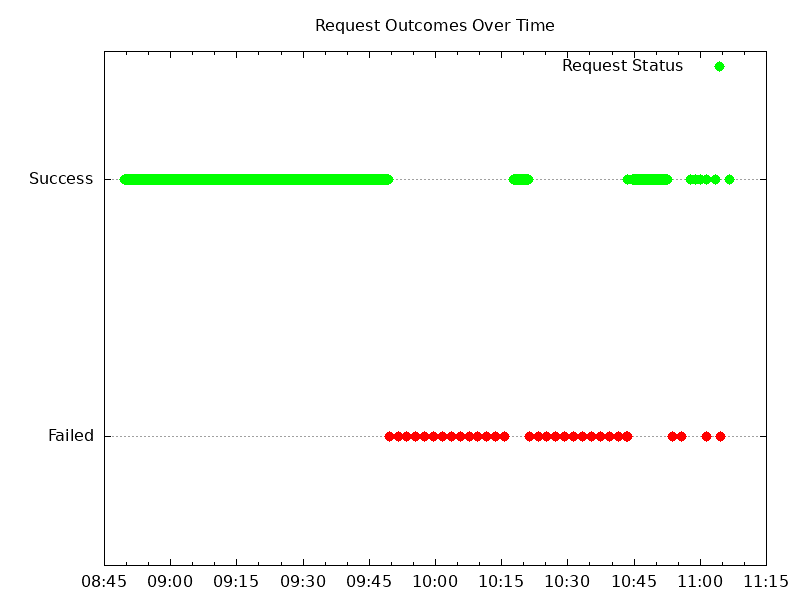

Logs:

- NGF error logs: none
- NGINX error/warn logs: none
- NGINX access logs:
  - 288,866 200s
  - Two 499 `10.128.15.192 - - [08/Dec/2023:20:10:47 +0000] "GET /coffee HTTP/1.1" 499 0 "-" "-"` access logs
  - Two 499 `10.128.0.2 - - [08/Dec/2023:20:10:48 +0000] "GET /tea HTTP/1.1" 499 0 "-" "-"` access logs

## Future Improvements

1. When applying the 10/25node values manifest, try with a larger sleep value and termination grace period to see
   if a bigger value of the delay can prevent traffic loss when scaling down. It could be that the chosen delay
   is not large enough to allow the fronting load balancer to gracefully drain the node with the terminating pod.
