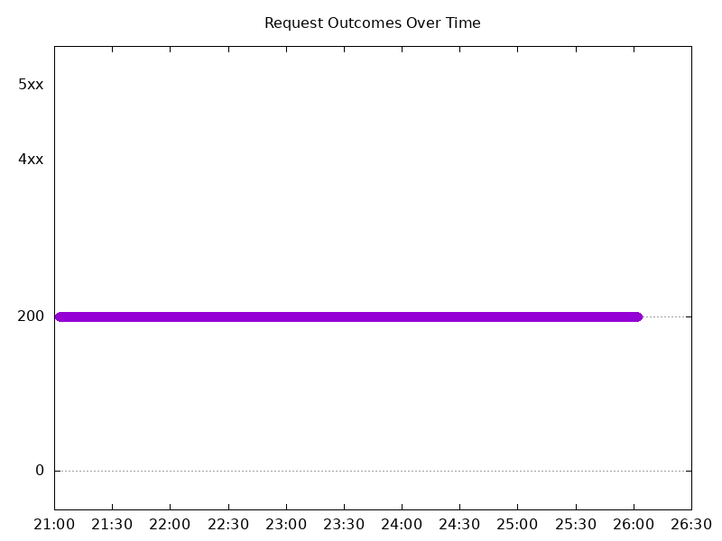
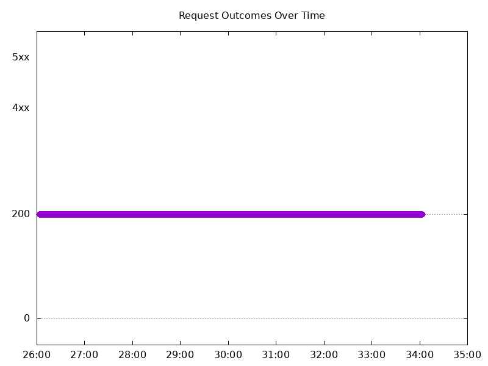
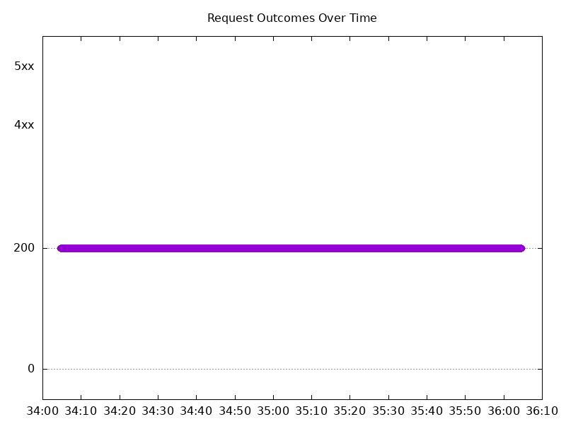
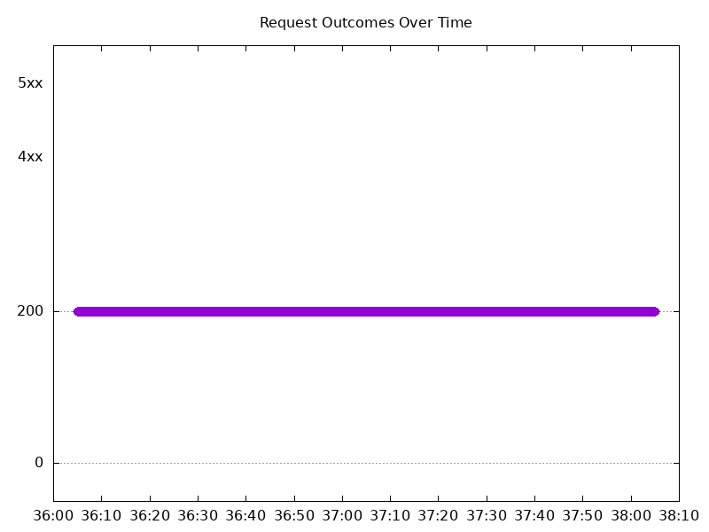
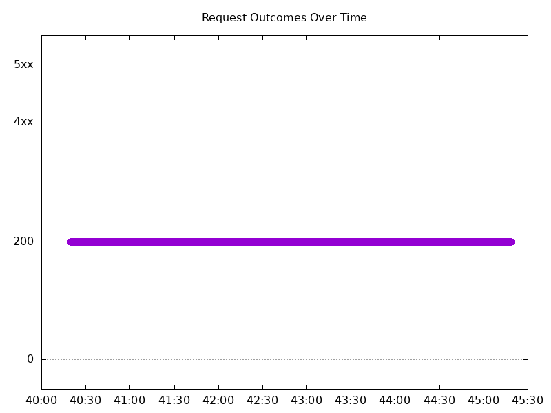
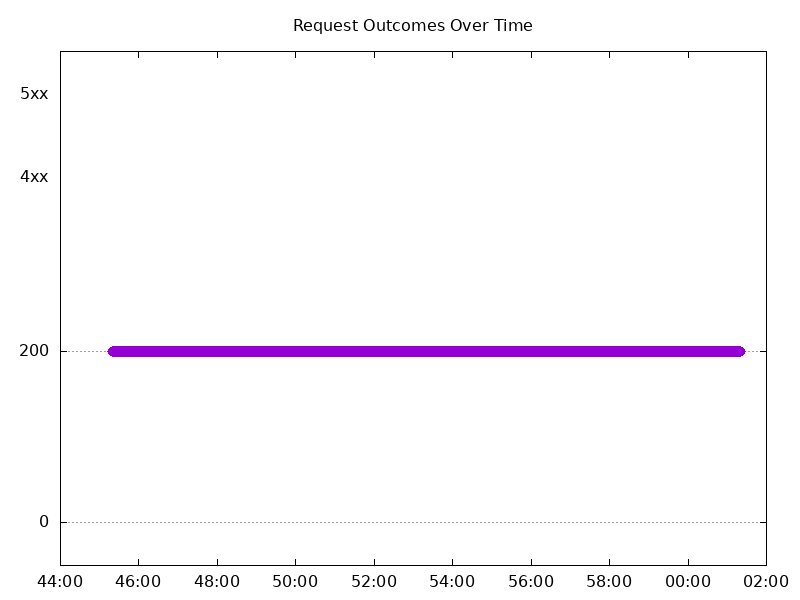
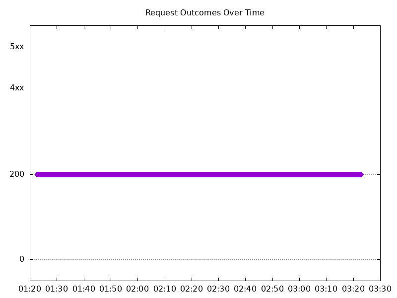

# Results

## Test environment

NGINX Plus: false

NGINX Gateway Fabric:

- Commit: 16a95222a968aef46277a77070f79bea9b87da12
- Date: 2024-08-16T15:29:44Z
- Dirty: false

GKE Cluster:

- Node count: 12
- k8s version: v1.29.7-gke.1008000
- vCPUs per node: 16
- RAM per node: 65855012Ki
- Max pods per node: 110
- Zone: us-west1-b
- Instance Type: n2d-standard-16

## One NGF Pod runs per node Test Results

### Scale Up Gradually

#### Test: Send https /tea traffic

```text
Requests      [total, rate, throughput]         30000, 100.00, 100.00
Duration      [total, attack, wait]             5m0s, 5m0s, 902.053µs
Latencies     [min, mean, 50, 90, 95, 99, max]  506.199µs, 971.444µs, 964.757µs, 1.107ms, 1.164ms, 1.38ms, 11.651ms
Bytes In      [total, mean]                     4625971, 154.20
Bytes Out     [total, mean]                     0, 0.00
Success       [ratio]                           100.00%
Status Codes  [code:count]                      200:30000  
Error Set:
```


#### Test: Send http /coffee traffic

```text
Requests      [total, rate, throughput]         30000, 100.00, 100.00
Duration      [total, attack, wait]             5m0s, 5m0s, 836.881µs
Latencies     [min, mean, 50, 90, 95, 99, max]  480.426µs, 944.842µs, 943.443µs, 1.082ms, 1.136ms, 1.371ms, 12.265ms
Bytes In      [total, mean]                     4835922, 161.20
Bytes Out     [total, mean]                     0, 0.00
Success       [ratio]                           100.00%
Status Codes  [code:count]                      200:30000  
Error Set:
```



### Scale Down Gradually

#### Test: Send https /tea traffic

```text
Requests      [total, rate, throughput]         48000, 100.00, 100.00
Duration      [total, attack, wait]             8m0s, 8m0s, 974.009µs
Latencies     [min, mean, 50, 90, 95, 99, max]  505.207µs, 950.261µs, 946.638µs, 1.069ms, 1.117ms, 1.306ms, 11.516ms
Bytes In      [total, mean]                     7401713, 154.20
Bytes Out     [total, mean]                     0, 0.00
Success       [ratio]                           100.00%
Status Codes  [code:count]                      200:48000  
Error Set:
```



#### Test: Send http /coffee traffic

```text
Requests      [total, rate, throughput]         48000, 100.00, 100.00
Duration      [total, attack, wait]             8m0s, 8m0s, 941.959µs
Latencies     [min, mean, 50, 90, 95, 99, max]  477.995µs, 924.815µs, 927.873µs, 1.045ms, 1.087ms, 1.297ms, 10.334ms
Bytes In      [total, mean]                     7737532, 161.20
Bytes Out     [total, mean]                     0, 0.00
Success       [ratio]                           100.00%
Status Codes  [code:count]                      200:48000  
Error Set:
```


### Scale Up Abruptly

#### Test: Send https /tea traffic

```text
Requests      [total, rate, throughput]         12000, 100.01, 100.01
Duration      [total, attack, wait]             2m0s, 2m0s, 1.129ms
Latencies     [min, mean, 50, 90, 95, 99, max]  558.902µs, 961.652µs, 956.724µs, 1.079ms, 1.125ms, 1.307ms, 8.716ms
Bytes In      [total, mean]                     1850359, 154.20
Bytes Out     [total, mean]                     0, 0.00
Success       [ratio]                           100.00%
Status Codes  [code:count]                      200:12000  
Error Set:
```


#### Test: Send http /coffee traffic

```text
Requests      [total, rate, throughput]         12000, 100.01, 100.01
Duration      [total, attack, wait]             2m0s, 2m0s, 1.129ms
Latencies     [min, mean, 50, 90, 95, 99, max]  536.485µs, 937.929µs, 936.882µs, 1.058ms, 1.105ms, 1.273ms, 9.489ms
Bytes In      [total, mean]                     1934397, 161.20
Bytes Out     [total, mean]                     0, 0.00
Success       [ratio]                           100.00%
Status Codes  [code:count]                      200:12000  
Error Set:
```



### Scale Down Abruptly

#### Test: Send https /tea traffic

```text
Requests      [total, rate, throughput]         12000, 100.01, 100.01
Duration      [total, attack, wait]             2m0s, 2m0s, 984.749µs
Latencies     [min, mean, 50, 90, 95, 99, max]  509.834µs, 960.864µs, 956.885µs, 1.095ms, 1.143ms, 1.287ms, 5.948ms
Bytes In      [total, mean]                     1850461, 154.21
Bytes Out     [total, mean]                     0, 0.00
Success       [ratio]                           100.00%
Status Codes  [code:count]                      200:12000  
Error Set:
```



#### Test: Send http /coffee traffic

```text
Requests      [total, rate, throughput]         12000, 100.01, 100.01
Duration      [total, attack, wait]             2m0s, 2m0s, 957.855µs
Latencies     [min, mean, 50, 90, 95, 99, max]  513.691µs, 939.826µs, 942.697µs, 1.074ms, 1.125ms, 1.261ms, 6.953ms
Bytes In      [total, mean]                     1934384, 161.20
Bytes Out     [total, mean]                     0, 0.00
Success       [ratio]                           100.00%
Status Codes  [code:count]                      200:12000  
Error Set:
```


## Multiple NGF Pods run per node Test Results

### Scale Up Gradually

#### Test: Send http /coffee traffic

```text
Requests      [total, rate, throughput]         30000, 100.00, 100.00
Duration      [total, attack, wait]             5m0s, 5m0s, 837.709µs
Latencies     [min, mean, 50, 90, 95, 99, max]  471.832µs, 944.124µs, 940.377µs, 1.064ms, 1.115ms, 1.384ms, 16.213ms
Bytes In      [total, mean]                     4835768, 161.19
Bytes Out     [total, mean]                     0, 0.00
Success       [ratio]                           100.00%
Status Codes  [code:count]                      200:30000  
Error Set:
```



#### Test: Send https /tea traffic

```text
Requests      [total, rate, throughput]         30000, 100.00, 100.00
Duration      [total, attack, wait]             5m0s, 5m0s, 932.757µs
Latencies     [min, mean, 50, 90, 95, 99, max]  525.989µs, 969.247µs, 961.393µs, 1.093ms, 1.145ms, 1.413ms, 9.794ms
Bytes In      [total, mean]                     4625994, 154.20
Bytes Out     [total, mean]                     0, 0.00
Success       [ratio]                           100.00%
Status Codes  [code:count]                      200:30000  
Error Set:
```


### Scale Down Gradually

#### Test: Send http /coffee traffic

```text
Requests      [total, rate, throughput]         96000, 100.00, 100.00
Duration      [total, attack, wait]             16m0s, 16m0s, 1.031ms
Latencies     [min, mean, 50, 90, 95, 99, max]  463.473µs, 918.692µs, 919.296µs, 1.037ms, 1.081ms, 1.306ms, 11.984ms
Bytes In      [total, mean]                     15475122, 161.20
Bytes Out     [total, mean]                     0, 0.00
Success       [ratio]                           100.00%
Status Codes  [code:count]                      200:96000  
Error Set:
```



#### Test: Send https /tea traffic

```text
Requests      [total, rate, throughput]         96000, 100.00, 100.00
Duration      [total, attack, wait]             16m0s, 16m0s, 925.491µs
Latencies     [min, mean, 50, 90, 95, 99, max]  495.684µs, 941.688µs, 936.431µs, 1.058ms, 1.107ms, 1.337ms, 23.817ms
Bytes In      [total, mean]                     14803423, 154.20
Bytes Out     [total, mean]                     0, 0.00
Success       [ratio]                           100.00%
Status Codes  [code:count]                      200:96000  
Error Set:
```


### Scale Up Abruptly

#### Test: Send http /coffee traffic

```text
Requests      [total, rate, throughput]         12000, 100.01, 100.01
Duration      [total, attack, wait]             2m0s, 2m0s, 700.716µs
Latencies     [min, mean, 50, 90, 95, 99, max]  471.013µs, 921.398µs, 924.082µs, 1.046ms, 1.091ms, 1.25ms, 8.123ms
Bytes In      [total, mean]                     1934379, 161.20
Bytes Out     [total, mean]                     0, 0.00
Success       [ratio]                           100.00%
Status Codes  [code:count]                      200:12000  
Error Set:
```


#### Test: Send https /tea traffic

```text
Requests      [total, rate, throughput]         12000, 100.01, 100.01
Duration      [total, attack, wait]             2m0s, 2m0s, 662.899µs
Latencies     [min, mean, 50, 90, 95, 99, max]  472.835µs, 935.5µs, 935.142µs, 1.058ms, 1.107ms, 1.312ms, 8.081ms
Bytes In      [total, mean]                     1850425, 154.20
Bytes Out     [total, mean]                     0, 0.00
Success       [ratio]                           100.00%
Status Codes  [code:count]                      200:12000  
Error Set:
```



### Scale Down Abruptly

#### Test: Send https /tea traffic

```text
Requests      [total, rate, throughput]         12000, 100.01, 100.01
Duration      [total, attack, wait]             2m0s, 2m0s, 829.541µs
Latencies     [min, mean, 50, 90, 95, 99, max]  439.527µs, 941.985µs, 941.659µs, 1.07ms, 1.113ms, 1.241ms, 6.466ms
Bytes In      [total, mean]                     1850388, 154.20
Bytes Out     [total, mean]                     0, 0.00
Success       [ratio]                           100.00%
Status Codes  [code:count]                      200:12000  
Error Set:
```


#### Test: Send http /coffee traffic

```text
Requests      [total, rate, throughput]         12000, 100.01, 100.01
Duration      [total, attack, wait]             2m0s, 2m0s, 934.561µs
Latencies     [min, mean, 50, 90, 95, 99, max]  491.245µs, 917.259µs, 921.304µs, 1.047ms, 1.09ms, 1.21ms, 4.294ms
Bytes In      [total, mean]                     1934387, 161.20
Bytes Out     [total, mean]                     0, 0.00
Success       [ratio]                           100.00%
Status Codes  [code:count]                      200:12000  
Error Set:
```


