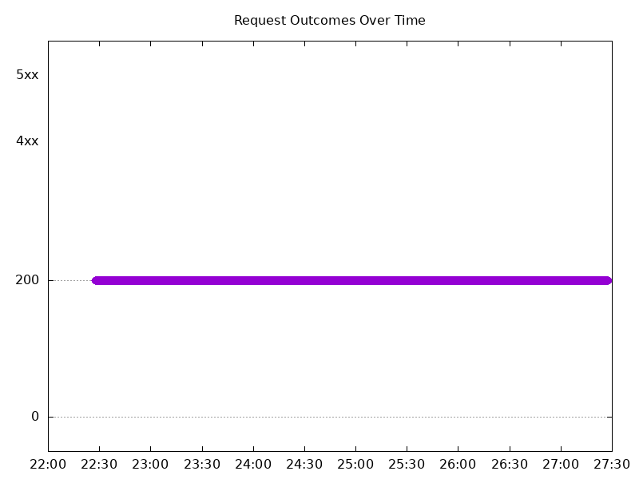
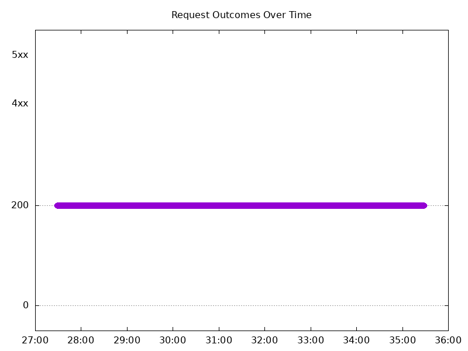
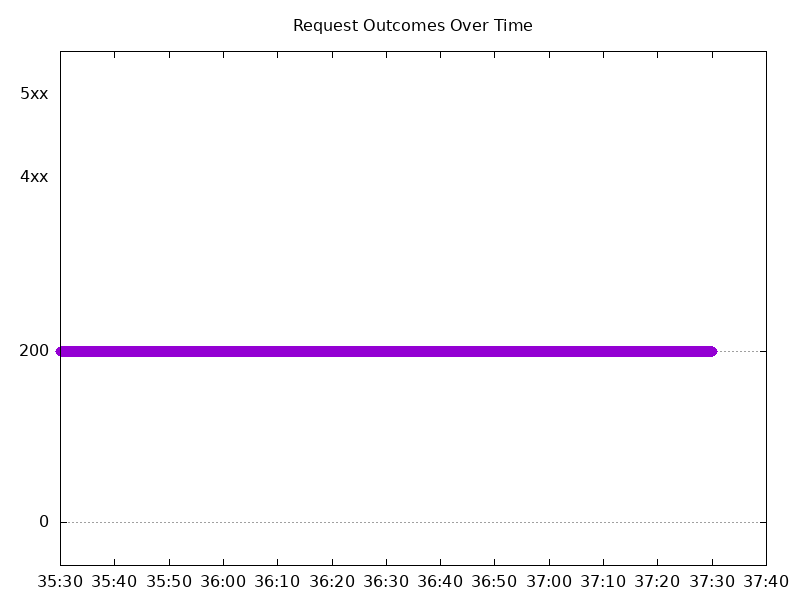
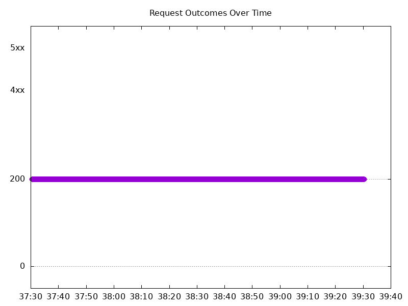
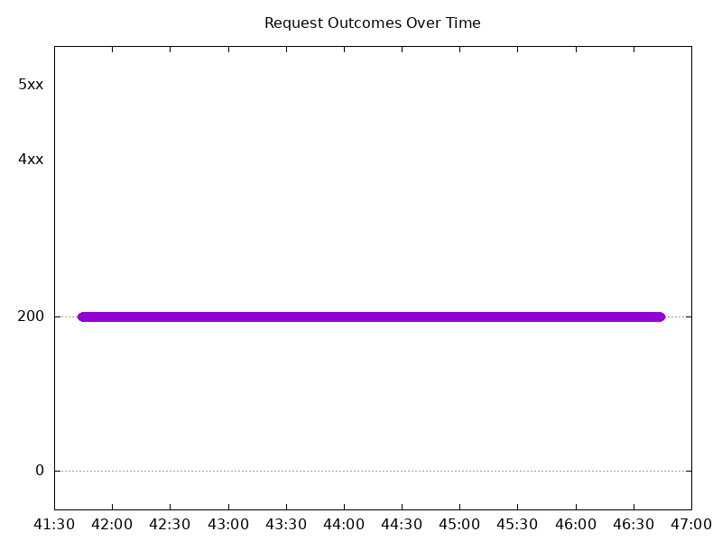
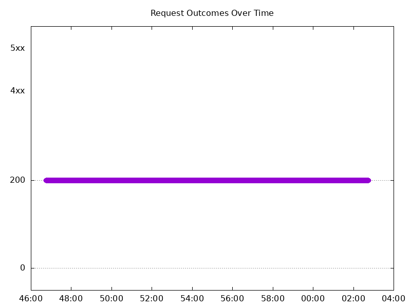
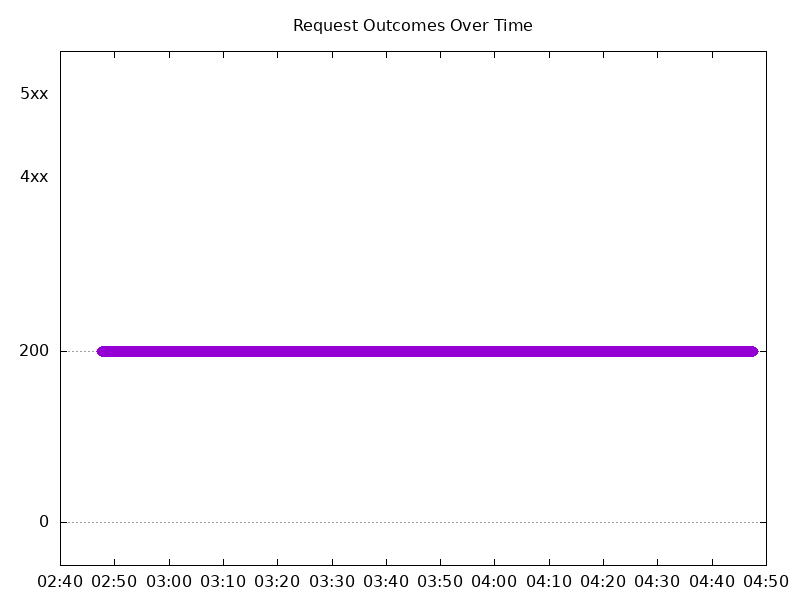
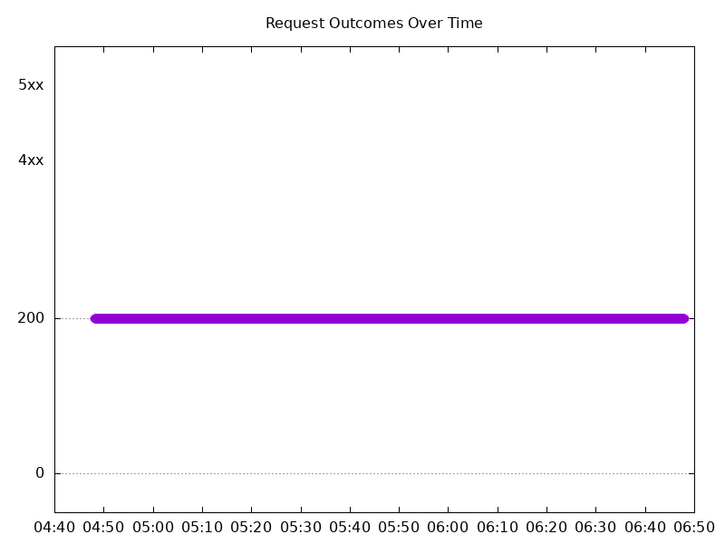

# Results

## Test environment

NGINX Plus: true

NGINX Gateway Fabric:

- Commit: 16a95222a968aef46277a77070f79bea9b87da12
- Date: 2024-08-16T15:29:44Z
- Dirty: false

GKE Cluster:

- Node count: 12
- k8s version: v1.29.7-gke.1008000
- vCPUs per node: 16
- RAM per node: 65855012Ki
- Max pods per node: 110
- Zone: us-west1-b
- Instance Type: n2d-standard-16

## Summary:

- Results are going to look different this time due to automating this test.
- No errors seen

## One NGF Pod runs per node Test Results

### Scale Up Gradually

#### Test: Send https /tea traffic

```text
Requests      [total, rate, throughput]         30000, 100.00, 100.00
Duration      [total, attack, wait]             5m0s, 5m0s, 997.429µs
Latencies     [min, mean, 50, 90, 95, 99, max]  487.981µs, 917.751µs, 916.807µs, 1.03ms, 1.075ms, 1.288ms, 11.558ms
Bytes In      [total, mean]                     4652931, 155.10
Bytes Out     [total, mean]                     0, 0.00
Success       [ratio]                           100.00%
Status Codes  [code:count]                      200:30000  
Error Set:
```


#### Test: Send http /coffee traffic

```text
Requests      [total, rate, throughput]         30000, 100.00, 100.00
Duration      [total, attack, wait]             5m0s, 5m0s, 1.167ms
Latencies     [min, mean, 50, 90, 95, 99, max]  455.747µs, 907.009µs, 906.441µs, 1.018ms, 1.061ms, 1.338ms, 13.555ms
Bytes In      [total, mean]                     4862949, 162.10
Bytes Out     [total, mean]                     0, 0.00
Success       [ratio]                           100.00%
Status Codes  [code:count]                      200:30000  
Error Set:
```



### Scale Down Gradually

#### Test: Send http /coffee traffic

```text
Requests      [total, rate, throughput]         48000, 100.00, 100.00
Duration      [total, attack, wait]             8m0s, 8m0s, 826.387µs
Latencies     [min, mean, 50, 90, 95, 99, max]  452.094µs, 912.773µs, 911.561µs, 1.032ms, 1.077ms, 1.313ms, 35.906ms
Bytes In      [total, mean]                     7780873, 162.10
Bytes Out     [total, mean]                     0, 0.00
Success       [ratio]                           100.00%
Status Codes  [code:count]                      200:48000  
Error Set:
```


#### Test: Send https /tea traffic

```text
Requests      [total, rate, throughput]         48000, 100.00, 100.00
Duration      [total, attack, wait]             8m0s, 8m0s, 934.651µs
Latencies     [min, mean, 50, 90, 95, 99, max]  483.458µs, 939.72µs, 933.477µs, 1.06ms, 1.11ms, 1.343ms, 12.382ms
Bytes In      [total, mean]                     7444826, 155.10
Bytes Out     [total, mean]                     0, 0.00
Success       [ratio]                           100.00%
Status Codes  [code:count]                      200:48000  
Error Set:
```



### Scale Up Abruptly

#### Test: Send https /tea traffic

```text
Requests      [total, rate, throughput]         12000, 100.01, 100.01
Duration      [total, attack, wait]             2m0s, 2m0s, 787.928µs
Latencies     [min, mean, 50, 90, 95, 99, max]  503.486µs, 916.519µs, 914.367µs, 1.033ms, 1.083ms, 1.286ms, 6.45ms
Bytes In      [total, mean]                     1861240, 155.10
Bytes Out     [total, mean]                     0, 0.00
Success       [ratio]                           100.00%
Status Codes  [code:count]                      200:12000  
Error Set:
```



#### Test: Send http /coffee traffic

```text
Requests      [total, rate, throughput]         12000, 100.01, 100.01
Duration      [total, attack, wait]             2m0s, 2m0s, 808.614µs
Latencies     [min, mean, 50, 90, 95, 99, max]  482.502µs, 881.536µs, 885.899µs, 999.696µs, 1.04ms, 1.235ms, 5.311ms
Bytes In      [total, mean]                     1945219, 162.10
Bytes Out     [total, mean]                     0, 0.00
Success       [ratio]                           100.00%
Status Codes  [code:count]                      200:12000  
Error Set:
```


### Scale Down Abruptly

#### Test: Send https /tea traffic

```text
Requests      [total, rate, throughput]         12000, 100.01, 100.01
Duration      [total, attack, wait]             2m0s, 2m0s, 884.416µs
Latencies     [min, mean, 50, 90, 95, 99, max]  520.845µs, 934.391µs, 934.513µs, 1.062ms, 1.107ms, 1.259ms, 7.428ms
Bytes In      [total, mean]                     1861200, 155.10
Bytes Out     [total, mean]                     0, 0.00
Success       [ratio]                           100.00%
Status Codes  [code:count]                      200:12000  
Error Set:
```



#### Test: Send http /coffee traffic

```text
Requests      [total, rate, throughput]         12000, 100.01, 100.01
Duration      [total, attack, wait]             2m0s, 2m0s, 854.529µs
Latencies     [min, mean, 50, 90, 95, 99, max]  501.951µs, 914.937µs, 919.559µs, 1.041ms, 1.086ms, 1.236ms, 10.345ms
Bytes In      [total, mean]                     1945212, 162.10
Bytes Out     [total, mean]                     0, 0.00
Success       [ratio]                           100.00%
Status Codes  [code:count]                      200:12000  
Error Set:
```


## Multiple NGF Pods run per node Test Results

### Scale Up Gradually

#### Test: Send http /coffee traffic

```text
Requests      [total, rate, throughput]         30000, 100.00, 100.00
Duration      [total, attack, wait]             5m0s, 5m0s, 878.612µs
Latencies     [min, mean, 50, 90, 95, 99, max]  458.789µs, 898.195µs, 898.053µs, 1.019ms, 1.065ms, 1.343ms, 13.466ms
Bytes In      [total, mean]                     4862959, 162.10
Bytes Out     [total, mean]                     0, 0.00
Success       [ratio]                           100.00%
Status Codes  [code:count]                      200:30000  
Error Set:
```


#### Test: Send https /tea traffic

```text
Requests      [total, rate, throughput]         30000, 100.00, 100.00
Duration      [total, attack, wait]             5m0s, 5m0s, 902.591µs
Latencies     [min, mean, 50, 90, 95, 99, max]  473.201µs, 929.404µs, 921.051µs, 1.042ms, 1.092ms, 1.398ms, 13.013ms
Bytes In      [total, mean]                     4652995, 155.10
Bytes Out     [total, mean]                     0, 0.00
Success       [ratio]                           100.00%
Status Codes  [code:count]                      200:30000  
Error Set:
```



### Scale Down Gradually

#### Test: Send http /coffee traffic

```text
Requests      [total, rate, throughput]         96000, 100.00, 100.00
Duration      [total, attack, wait]             16m0s, 16m0s, 874.918µs
Latencies     [min, mean, 50, 90, 95, 99, max]  416.818µs, 872.886µs, 875.578µs, 990.461µs, 1.032ms, 1.293ms, 12.454ms
Bytes In      [total, mean]                     15561692, 162.10
Bytes Out     [total, mean]                     0, 0.00
Success       [ratio]                           100.00%
Status Codes  [code:count]                      200:96000  
Error Set:
```



#### Test: Send https /tea traffic

```text
Requests      [total, rate, throughput]         96000, 100.00, 100.00
Duration      [total, attack, wait]             16m0s, 16m0s, 883.348µs
Latencies     [min, mean, 50, 90, 95, 99, max]  458.398µs, 901.365µs, 897.244µs, 1.015ms, 1.061ms, 1.323ms, 10.932ms
Bytes In      [total, mean]                     14889455, 155.10
Bytes Out     [total, mean]                     0, 0.00
Success       [ratio]                           100.00%
Status Codes  [code:count]                      200:96000  
Error Set:
```


### Scale Up Abruptly

#### Test: Send http /coffee traffic

```text
Requests      [total, rate, throughput]         12000, 100.01, 100.01
Duration      [total, attack, wait]             2m0s, 2m0s, 874.976µs
Latencies     [min, mean, 50, 90, 95, 99, max]  448.611µs, 874.103µs, 874.924µs, 992.459µs, 1.032ms, 1.265ms, 5.75ms
Bytes In      [total, mean]                     1945215, 162.10
Bytes Out     [total, mean]                     0, 0.00
Success       [ratio]                           100.00%
Status Codes  [code:count]                      200:12000  
Error Set:
```


#### Test: Send https /tea traffic

```text
Requests      [total, rate, throughput]         12000, 100.01, 100.01
Duration      [total, attack, wait]             2m0s, 2m0s, 867.934µs
Latencies     [min, mean, 50, 90, 95, 99, max]  471.009µs, 897.833µs, 892.857µs, 1.008ms, 1.057ms, 1.295ms, 12.271ms
Bytes In      [total, mean]                     1861225, 155.10
Bytes Out     [total, mean]                     0, 0.00
Success       [ratio]                           100.00%
Status Codes  [code:count]                      200:12000  
Error Set:
```



### Scale Down Abruptly

#### Test: Send https /tea traffic

```text
Requests      [total, rate, throughput]         12000, 100.01, 100.01
Duration      [total, attack, wait]             2m0s, 2m0s, 996.012µs
Latencies     [min, mean, 50, 90, 95, 99, max]  475.971µs, 891.505µs, 889.265µs, 1.017ms, 1.063ms, 1.245ms, 5.751ms
Bytes In      [total, mean]                     1861175, 155.10
Bytes Out     [total, mean]                     0, 0.00
Success       [ratio]                           100.00%
Status Codes  [code:count]                      200:12000  
Error Set:
```



#### Test: Send http /coffee traffic

```text
Requests      [total, rate, throughput]         12000, 100.01, 100.01
Duration      [total, attack, wait]             2m0s, 2m0s, 1.016ms
Latencies     [min, mean, 50, 90, 95, 99, max]  461.369µs, 871.683µs, 870.518µs, 993.054µs, 1.036ms, 1.182ms, 23.12ms
Bytes In      [total, mean]                     1945180, 162.10
Bytes Out     [total, mean]                     0, 0.00
Success       [ratio]                           100.00%
Status Codes  [code:count]                      200:12000  
Error Set:
```


