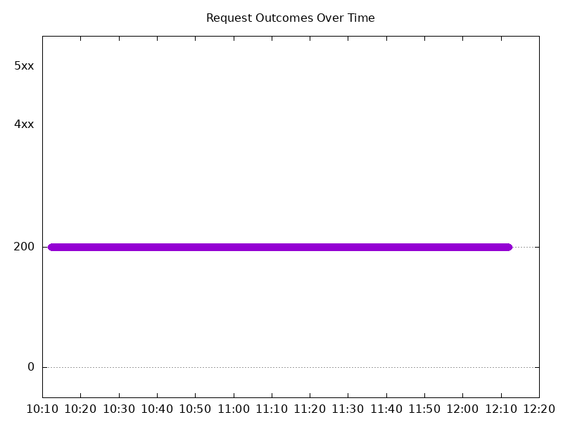
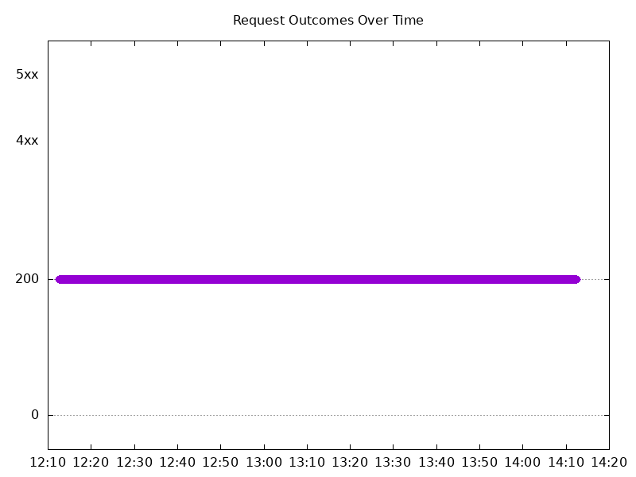
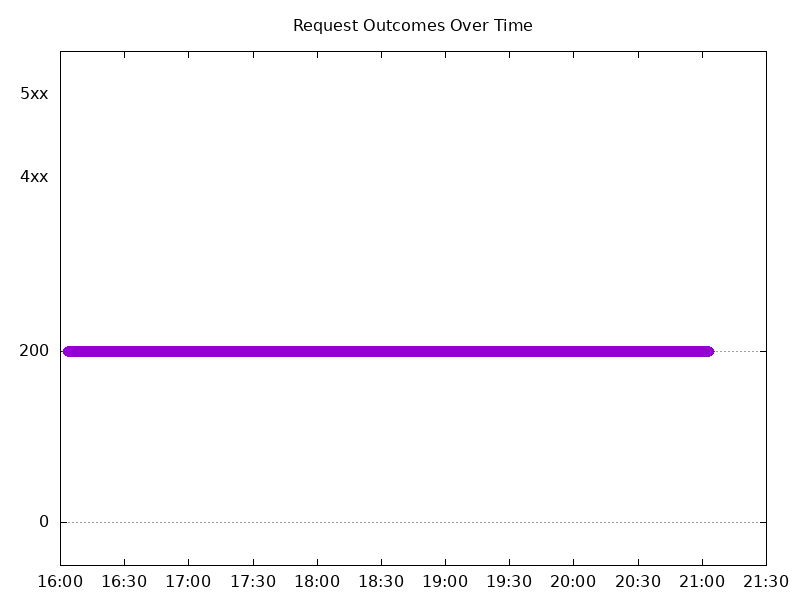
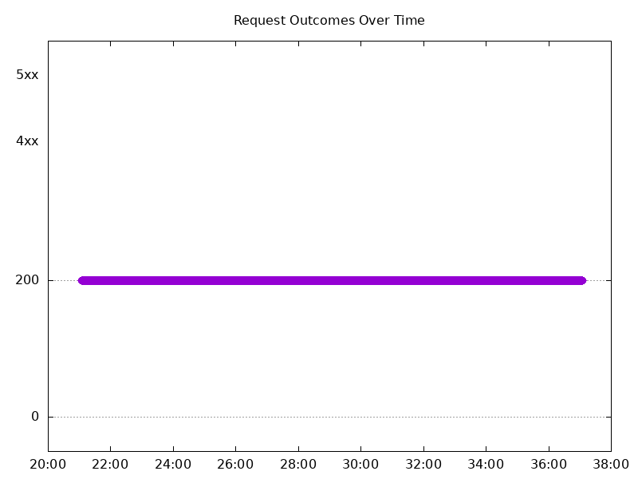
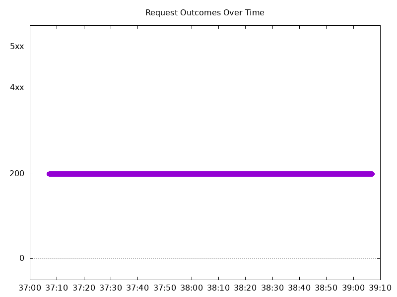
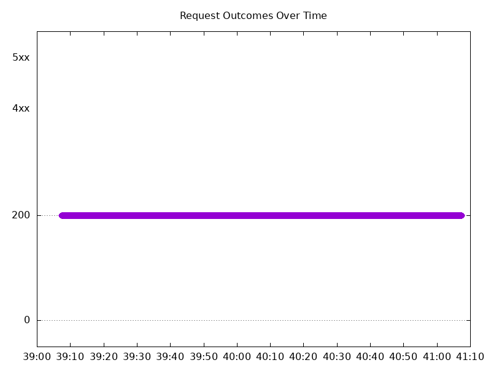

# Results

## Test environment

NGINX Plus: false

NGINX Gateway Fabric:

- Commit: 8624530af3c518afd8f7013566a102e8b3497b76
- Date: 2024-11-11T18:50:09Z
- Dirty: false

GKE Cluster:

- Node count: 12
- k8s version: v1.30.5-gke.1443001
- vCPUs per node: 16
- RAM per node: 65853972Ki
- Max pods per node: 110
- Zone: us-west2-a
- Instance Type: n2d-standard-16

## Summary:

- Performance seems consistent with previous run. 
- No errors seen.

## One NGF Pod runs per node Test Results

### Scale Up Gradually

#### Test: Send https /tea traffic

```text
Requests      [total, rate, throughput]         30000, 100.00, 100.00
Duration      [total, attack, wait]             5m0s, 5m0s, 736.494µs
Latencies     [min, mean, 50, 90, 95, 99, max]  436.247µs, 824.285µs, 814.086µs, 930.637µs, 978.866µs, 1.304ms, 33.017ms
Bytes In      [total, mean]                     4680000, 156.00
Bytes Out     [total, mean]                     0, 0.00
Success       [ratio]                           100.00%
Status Codes  [code:count]                      200:30000  
Error Set:
```


#### Test: Send http /coffee traffic

```text
Requests      [total, rate, throughput]         30000, 100.00, 100.00
Duration      [total, attack, wait]             5m0s, 5m0s, 819.08µs
Latencies     [min, mean, 50, 90, 95, 99, max]  382.043µs, 791.086µs, 788.636µs, 901.854µs, 946.77µs, 1.25ms, 12.511ms
Bytes In      [total, mean]                     4860000, 162.00
Bytes Out     [total, mean]                     0, 0.00
Success       [ratio]                           100.00%
Status Codes  [code:count]                      200:30000  
Error Set:
```


### Scale Down Gradually

#### Test: Send https /tea traffic

```text
Requests      [total, rate, throughput]         48000, 100.00, 100.00
Duration      [total, attack, wait]             8m0s, 8m0s, 1.086ms
Latencies     [min, mean, 50, 90, 95, 99, max]  417.245µs, 835.795µs, 826.937µs, 945.777µs, 993.897µs, 1.308ms, 16.636ms
Bytes In      [total, mean]                     7488000, 156.00
Bytes Out     [total, mean]                     0, 0.00
Success       [ratio]                           100.00%
Status Codes  [code:count]                      200:48000  
Error Set:
```


#### Test: Send http /coffee traffic

```text
Requests      [total, rate, throughput]         48000, 100.00, 100.00
Duration      [total, attack, wait]             8m0s, 8m0s, 894.604µs
Latencies     [min, mean, 50, 90, 95, 99, max]  407.723µs, 799.6µs, 797.645µs, 912.557µs, 956.655µs, 1.223ms, 8.118ms
Bytes In      [total, mean]                     7776000, 162.00
Bytes Out     [total, mean]                     0, 0.00
Success       [ratio]                           100.00%
Status Codes  [code:count]                      200:48000  
Error Set:
```


### Scale Up Abruptly

#### Test: Send https /tea traffic

```text
Requests      [total, rate, throughput]         12000, 100.01, 100.01
Duration      [total, attack, wait]             2m0s, 2m0s, 766.276µs
Latencies     [min, mean, 50, 90, 95, 99, max]  435.464µs, 833.151µs, 822.36µs, 939.638µs, 986.461µs, 1.282ms, 15.865ms
Bytes In      [total, mean]                     1872000, 156.00
Bytes Out     [total, mean]                     0, 0.00
Success       [ratio]                           100.00%
Status Codes  [code:count]                      200:12000  
Error Set:
```



#### Test: Send http /coffee traffic

```text
Requests      [total, rate, throughput]         12000, 100.01, 100.01
Duration      [total, attack, wait]             2m0s, 2m0s, 858.794µs
Latencies     [min, mean, 50, 90, 95, 99, max]  400.862µs, 804.877µs, 804.151µs, 920.27µs, 962.511µs, 1.133ms, 10.43ms
Bytes In      [total, mean]                     1944000, 162.00
Bytes Out     [total, mean]                     0, 0.00
Success       [ratio]                           100.00%
Status Codes  [code:count]                      200:12000  
Error Set:
```


### Scale Down Abruptly

#### Test: Send http /coffee traffic

```text
Requests      [total, rate, throughput]         12000, 100.01, 100.01
Duration      [total, attack, wait]             2m0s, 2m0s, 978.797µs
Latencies     [min, mean, 50, 90, 95, 99, max]  409.596µs, 848.432µs, 844.079µs, 966.023µs, 1.014ms, 1.17ms, 6.333ms
Bytes In      [total, mean]                     1944000, 162.00
Bytes Out     [total, mean]                     0, 0.00
Success       [ratio]                           100.00%
Status Codes  [code:count]                      200:12000  
Error Set:
```


#### Test: Send https /tea traffic

```text
Requests      [total, rate, throughput]         12000, 100.01, 100.01
Duration      [total, attack, wait]             2m0s, 2m0s, 839.728µs
Latencies     [min, mean, 50, 90, 95, 99, max]  444.844µs, 871.674µs, 863.095µs, 986.094µs, 1.034ms, 1.184ms, 8.749ms
Bytes In      [total, mean]                     1872000, 156.00
Bytes Out     [total, mean]                     0, 0.00
Success       [ratio]                           100.00%
Status Codes  [code:count]                      200:12000  
Error Set:
```



## Multiple NGF Pods run per node Test Results

### Scale Up Gradually

#### Test: Send https /tea traffic

```text
Requests      [total, rate, throughput]         30000, 100.00, 100.00
Duration      [total, attack, wait]             5m0s, 5m0s, 766.439µs
Latencies     [min, mean, 50, 90, 95, 99, max]  407.721µs, 838.975µs, 822.181µs, 946.504µs, 1ms, 1.381ms, 18.536ms
Bytes In      [total, mean]                     4680000, 156.00
Bytes Out     [total, mean]                     0, 0.00
Success       [ratio]                           100.00%
Status Codes  [code:count]                      200:30000  
Error Set:
```


#### Test: Send http /coffee traffic

```text
Requests      [total, rate, throughput]         30000, 100.00, 100.00
Duration      [total, attack, wait]             5m0s, 5m0s, 734.956µs
Latencies     [min, mean, 50, 90, 95, 99, max]  399.283µs, 816.981µs, 803.143µs, 926.274µs, 982.671µs, 1.355ms, 22.58ms
Bytes In      [total, mean]                     4860000, 162.00
Bytes Out     [total, mean]                     0, 0.00
Success       [ratio]                           100.00%
Status Codes  [code:count]                      200:30000  
Error Set:
```



### Scale Down Gradually

#### Test: Send https /tea traffic

```text
Requests      [total, rate, throughput]         96000, 100.00, 100.00
Duration      [total, attack, wait]             16m0s, 16m0s, 777.329µs
Latencies     [min, mean, 50, 90, 95, 99, max]  413.572µs, 839.155µs, 825.647µs, 964.872µs, 1.02ms, 1.321ms, 20.94ms
Bytes In      [total, mean]                     14976000, 156.00
Bytes Out     [total, mean]                     0, 0.00
Success       [ratio]                           100.00%
Status Codes  [code:count]                      200:96000  
Error Set:
```



#### Test: Send http /coffee traffic

```text
Requests      [total, rate, throughput]         96000, 100.00, 100.00
Duration      [total, attack, wait]             16m0s, 16m0s, 1.117ms
Latencies     [min, mean, 50, 90, 95, 99, max]  395.98µs, 813.203µs, 804.792µs, 938.257µs, 989.728µs, 1.298ms, 23.009ms
Bytes In      [total, mean]                     15552000, 162.00
Bytes Out     [total, mean]                     0, 0.00
Success       [ratio]                           100.00%
Status Codes  [code:count]                      200:96000  
Error Set:
```


### Scale Up Abruptly

#### Test: Send https /tea traffic

```text
Requests      [total, rate, throughput]         12000, 100.01, 100.01
Duration      [total, attack, wait]             2m0s, 2m0s, 930.383µs
Latencies     [min, mean, 50, 90, 95, 99, max]  404.832µs, 828.908µs, 814.937µs, 946.579µs, 1.001ms, 1.243ms, 23.067ms
Bytes In      [total, mean]                     1872000, 156.00
Bytes Out     [total, mean]                     0, 0.00
Success       [ratio]                           100.00%
Status Codes  [code:count]                      200:12000  
Error Set:
```



#### Test: Send http /coffee traffic

```text
Requests      [total, rate, throughput]         12000, 100.01, 100.01
Duration      [total, attack, wait]             2m0s, 2m0s, 884.074µs
Latencies     [min, mean, 50, 90, 95, 99, max]  424.027µs, 809.266µs, 798.651µs, 925.351µs, 973.343µs, 1.202ms, 19.003ms
Bytes In      [total, mean]                     1944000, 162.00
Bytes Out     [total, mean]                     0, 0.00
Success       [ratio]                           100.00%
Status Codes  [code:count]                      200:12000  
Error Set:
```


### Scale Down Abruptly

#### Test: Send http /coffee traffic

```text
Requests      [total, rate, throughput]         12000, 100.01, 100.01
Duration      [total, attack, wait]             2m0s, 2m0s, 948.393µs
Latencies     [min, mean, 50, 90, 95, 99, max]  401.641µs, 807.419µs, 806.328µs, 942.415µs, 987.82µs, 1.202ms, 8.503ms
Bytes In      [total, mean]                     1944000, 162.00
Bytes Out     [total, mean]                     0, 0.00
Success       [ratio]                           100.00%
Status Codes  [code:count]                      200:12000  
Error Set:
```



#### Test: Send https /tea traffic

```text
Requests      [total, rate, throughput]         12000, 100.01, 100.01
Duration      [total, attack, wait]             2m0s, 2m0s, 892.559µs
Latencies     [min, mean, 50, 90, 95, 99, max]  444.885µs, 834.074µs, 829.099µs, 964.511µs, 1.014ms, 1.199ms, 16.401ms
Bytes In      [total, mean]                     1872000, 156.00
Bytes Out     [total, mean]                     0, 0.00
Success       [ratio]                           100.00%
Status Codes  [code:count]                      200:12000  
Error Set:
```


