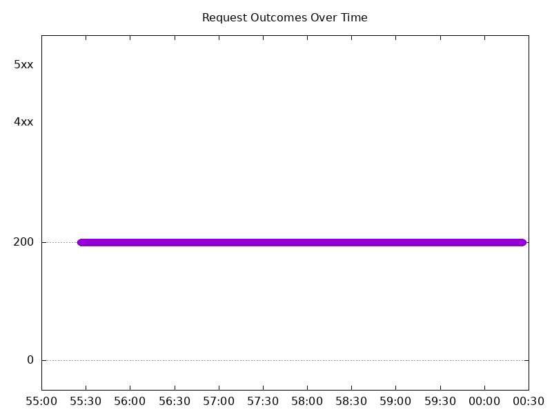
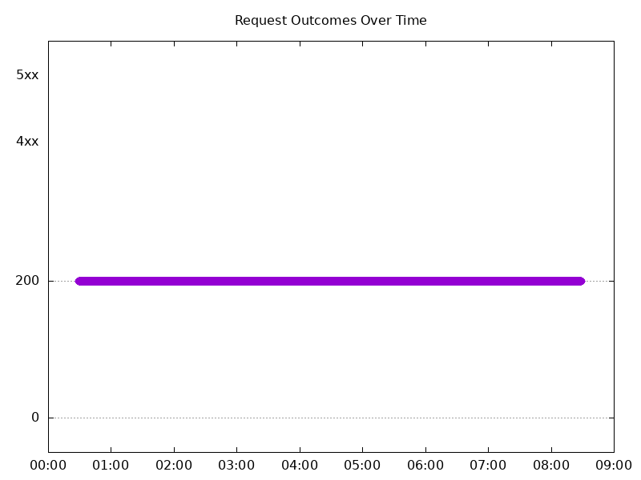
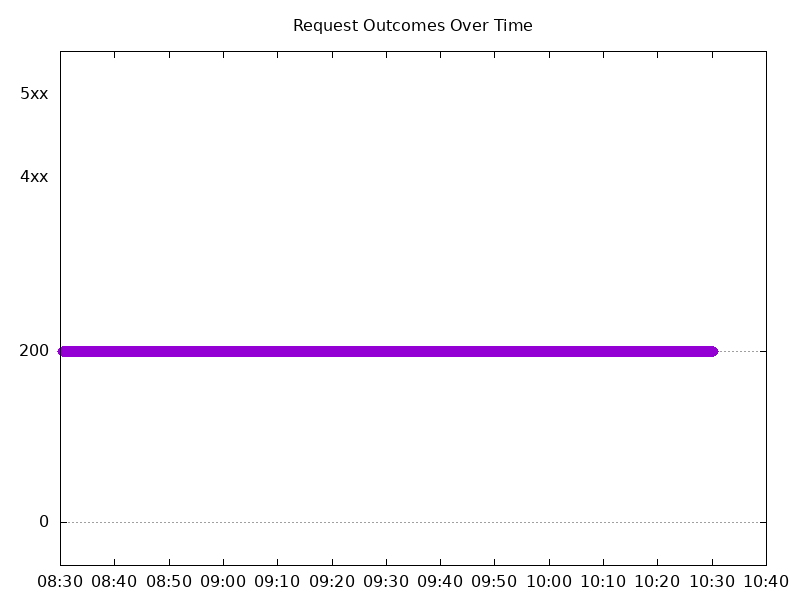
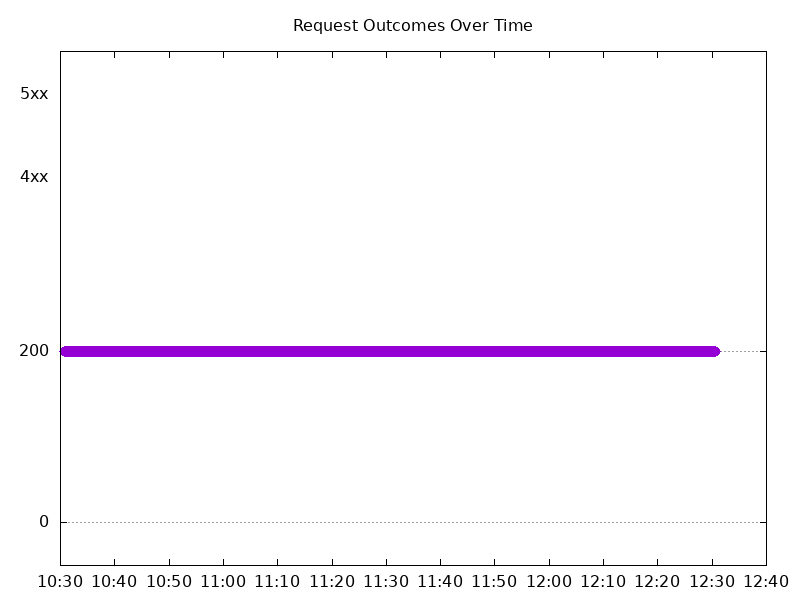
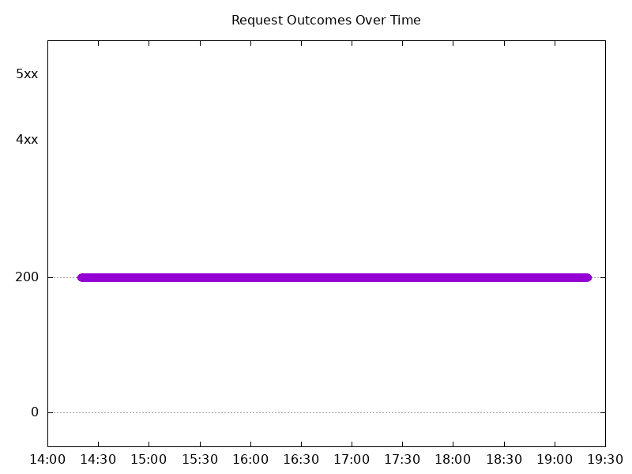
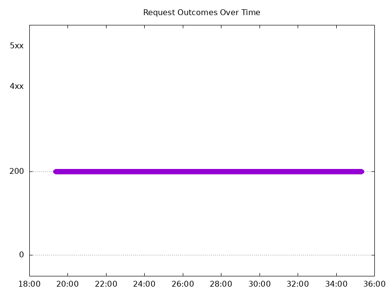
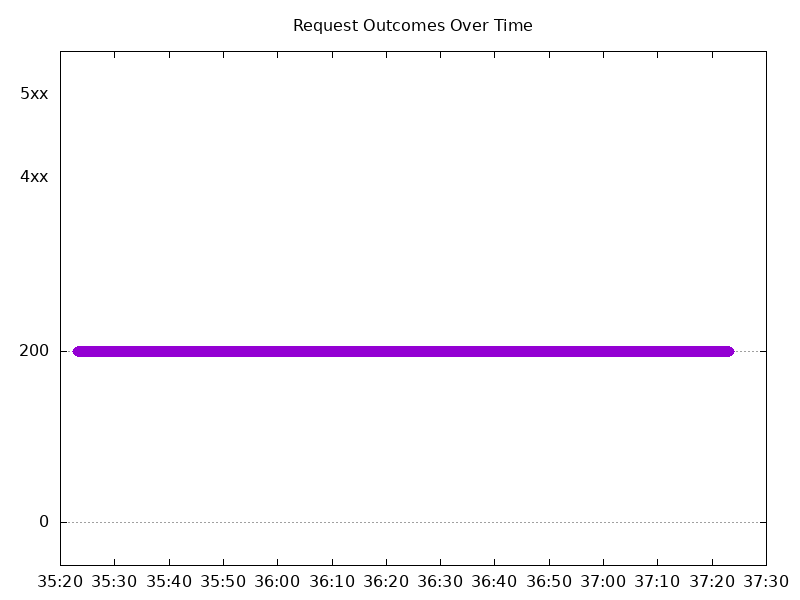
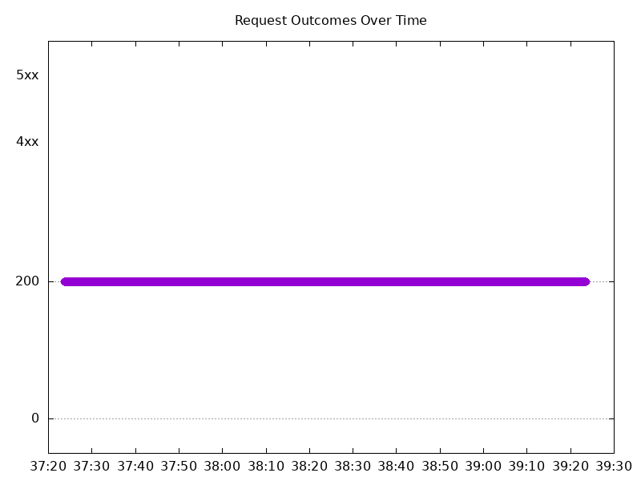

# Results

## Test environment

NGINX Plus: true

NGINX Gateway Fabric:

- Commit: a0126a6435dd4bd69c1a7f48ee15eecb76c68400
- Date: 2024-11-12T20:33:03Z
- Dirty: false

GKE Cluster:

- Node count: 12
- k8s version: v1.30.5-gke.1443001
- vCPUs per node: 16
- RAM per node: 65853972Ki
- Max pods per node: 110
- Zone: us-west2-a
- Instance Type: n2d-standard-16

## One NGF Pod runs per node Test Results

### Scale Up Gradually

#### Test: Send http /coffee traffic

```text
Requests      [total, rate, throughput]         30000, 100.00, 100.00
Duration      [total, attack, wait]             5m0s, 5m0s, 927.439µs
Latencies     [min, mean, 50, 90, 95, 99, max]  420.181µs, 864.343µs, 861.694µs, 992.418µs, 1.041ms, 1.346ms, 16.498ms
Bytes In      [total, mean]                     4802953, 160.10
Bytes Out     [total, mean]                     0, 0.00
Success       [ratio]                           100.00%
Status Codes  [code:count]                      200:30000  
Error Set:
```



#### Test: Send https /tea traffic

```text
Requests      [total, rate, throughput]         30000, 100.00, 100.00
Duration      [total, attack, wait]             5m0s, 5m0s, 942.062µs
Latencies     [min, mean, 50, 90, 95, 99, max]  451.26µs, 895.9µs, 888.141µs, 1.027ms, 1.081ms, 1.382ms, 15.963ms
Bytes In      [total, mean]                     4622983, 154.10
Bytes Out     [total, mean]                     0, 0.00
Success       [ratio]                           100.00%
Status Codes  [code:count]                      200:30000  
Error Set:
```


### Scale Down Gradually

#### Test: Send https /tea traffic

```text
Requests      [total, rate, throughput]         48000, 100.00, 100.00
Duration      [total, attack, wait]             8m0s, 8m0s, 888.599µs
Latencies     [min, mean, 50, 90, 95, 99, max]  434.571µs, 884.752µs, 880.769µs, 1.012ms, 1.059ms, 1.286ms, 36.001ms
Bytes In      [total, mean]                     7396950, 154.10
Bytes Out     [total, mean]                     0, 0.00
Success       [ratio]                           100.00%
Status Codes  [code:count]                      200:48000  
Error Set:
```



#### Test: Send http /coffee traffic

```text
Requests      [total, rate, throughput]         48000, 100.00, 100.00
Duration      [total, attack, wait]             8m0s, 8m0s, 904.607µs
Latencies     [min, mean, 50, 90, 95, 99, max]  422.524µs, 858.888µs, 859.399µs, 983.835µs, 1.028ms, 1.232ms, 15.636ms
Bytes In      [total, mean]                     7684939, 160.10
Bytes Out     [total, mean]                     0, 0.00
Success       [ratio]                           100.00%
Status Codes  [code:count]                      200:48000  
Error Set:
```


### Scale Up Abruptly

#### Test: Send http /coffee traffic

```text
Requests      [total, rate, throughput]         12000, 100.01, 100.01
Duration      [total, attack, wait]             2m0s, 2m0s, 961.958µs
Latencies     [min, mean, 50, 90, 95, 99, max]  428.25µs, 844.074µs, 844.033µs, 968.817µs, 1.015ms, 1.158ms, 13.262ms
Bytes In      [total, mean]                     1921172, 160.10
Bytes Out     [total, mean]                     0, 0.00
Success       [ratio]                           100.00%
Status Codes  [code:count]                      200:12000  
Error Set:
```


#### Test: Send https /tea traffic

```text
Requests      [total, rate, throughput]         12000, 100.01, 100.01
Duration      [total, attack, wait]             2m0s, 2m0s, 932.432µs
Latencies     [min, mean, 50, 90, 95, 99, max]  459.621µs, 880.442µs, 875.374µs, 1.007ms, 1.052ms, 1.245ms, 14.154ms
Bytes In      [total, mean]                     1849183, 154.10
Bytes Out     [total, mean]                     0, 0.00
Success       [ratio]                           100.00%
Status Codes  [code:count]                      200:12000  
Error Set:
```



### Scale Down Abruptly

#### Test: Send https /tea traffic

```text
Requests      [total, rate, throughput]         12000, 100.01, 100.01
Duration      [total, attack, wait]             2m0s, 2m0s, 1.119ms
Latencies     [min, mean, 50, 90, 95, 99, max]  456.468µs, 889.426µs, 886.269µs, 1.02ms, 1.066ms, 1.196ms, 12.822ms
Bytes In      [total, mean]                     1849242, 154.10
Bytes Out     [total, mean]                     0, 0.00
Success       [ratio]                           100.00%
Status Codes  [code:count]                      200:12000  
Error Set:
```



#### Test: Send http /coffee traffic

```text
Requests      [total, rate, throughput]         12000, 100.01, 100.01
Duration      [total, attack, wait]             2m0s, 2m0s, 1.166ms
Latencies     [min, mean, 50, 90, 95, 99, max]  430.594µs, 860.363µs, 861.391µs, 987.362µs, 1.031ms, 1.172ms, 36.835ms
Bytes In      [total, mean]                     1921215, 160.10
Bytes Out     [total, mean]                     0, 0.00
Success       [ratio]                           100.00%
Status Codes  [code:count]                      200:12000  
Error Set:
```


## Multiple NGF Pods run per node Test Results

### Scale Up Gradually

#### Test: Send http /coffee traffic

```text
Requests      [total, rate, throughput]         30000, 100.00, 100.00
Duration      [total, attack, wait]             5m0s, 5m0s, 887.923µs
Latencies     [min, mean, 50, 90, 95, 99, max]  422.524µs, 863.032µs, 854.987µs, 981.216µs, 1.035ms, 1.42ms, 14.641ms
Bytes In      [total, mean]                     4803052, 160.10
Bytes Out     [total, mean]                     0, 0.00
Success       [ratio]                           100.00%
Status Codes  [code:count]                      200:30000  
Error Set:
```



#### Test: Send https /tea traffic

```text
Requests      [total, rate, throughput]         30000, 100.00, 100.00
Duration      [total, attack, wait]             5m0s, 5m0s, 884.104µs
Latencies     [min, mean, 50, 90, 95, 99, max]  434.937µs, 893.783µs, 880.034µs, 1.017ms, 1.075ms, 1.463ms, 17.21ms
Bytes In      [total, mean]                     4623014, 154.10
Bytes Out     [total, mean]                     0, 0.00
Success       [ratio]                           100.00%
Status Codes  [code:count]                      200:30000  
Error Set:
```


### Scale Down Gradually

#### Test: Send http /coffee traffic

```text
Requests      [total, rate, throughput]         96000, 100.00, 100.00
Duration      [total, attack, wait]             16m0s, 16m0s, 553.229µs
Latencies     [min, mean, 50, 90, 95, 99, max]  399.301µs, 864.16µs, 863.475µs, 986.889µs, 1.031ms, 1.295ms, 14.378ms
Bytes In      [total, mean]                     15369570, 160.10
Bytes Out     [total, mean]                     0, 0.00
Success       [ratio]                           100.00%
Status Codes  [code:count]                      200:96000  
Error Set:
```



#### Test: Send https /tea traffic

```text
Requests      [total, rate, throughput]         96000, 100.00, 100.00
Duration      [total, attack, wait]             16m0s, 16m0s, 862.416µs
Latencies     [min, mean, 50, 90, 95, 99, max]  445.97µs, 891.672µs, 885.493µs, 1.016ms, 1.066ms, 1.334ms, 16.925ms
Bytes In      [total, mean]                     14793548, 154.10
Bytes Out     [total, mean]                     0, 0.00
Success       [ratio]                           100.00%
Status Codes  [code:count]                      200:96000  
Error Set:
```


### Scale Up Abruptly

#### Test: Send http /coffee traffic

```text
Requests      [total, rate, throughput]         12000, 100.01, 100.01
Duration      [total, attack, wait]             2m0s, 2m0s, 777.73µs
Latencies     [min, mean, 50, 90, 95, 99, max]  450.354µs, 861.791µs, 864.699µs, 986.387µs, 1.028ms, 1.219ms, 5.972ms
Bytes In      [total, mean]                     1921249, 160.10
Bytes Out     [total, mean]                     0, 0.00
Success       [ratio]                           100.00%
Status Codes  [code:count]                      200:12000  
Error Set:
```


#### Test: Send https /tea traffic

```text
Requests      [total, rate, throughput]         12000, 100.01, 100.01
Duration      [total, attack, wait]             2m0s, 2m0s, 993.42µs
Latencies     [min, mean, 50, 90, 95, 99, max]  475.984µs, 900.595µs, 894.769µs, 1.027ms, 1.079ms, 1.274ms, 15.436ms
Bytes In      [total, mean]                     1849201, 154.10
Bytes Out     [total, mean]                     0, 0.00
Success       [ratio]                           100.00%
Status Codes  [code:count]                      200:12000  
Error Set:
```



### Scale Down Abruptly

#### Test: Send http /coffee traffic

```text
Requests      [total, rate, throughput]         12000, 100.01, 100.01
Duration      [total, attack, wait]             2m0s, 2m0s, 906.108µs
Latencies     [min, mean, 50, 90, 95, 99, max]  450.262µs, 908.6µs, 904.442µs, 1.044ms, 1.095ms, 1.236ms, 36.213ms
Bytes In      [total, mean]                     1921185, 160.10
Bytes Out     [total, mean]                     0, 0.00
Success       [ratio]                           100.00%
Status Codes  [code:count]                      200:12000  
Error Set:
```



#### Test: Send https /tea traffic

```text
Requests      [total, rate, throughput]         12000, 100.01, 100.01
Duration      [total, attack, wait]             2m0s, 2m0s, 1.093ms
Latencies     [min, mean, 50, 90, 95, 99, max]  486.039µs, 929.675µs, 925.652µs, 1.07ms, 1.119ms, 1.262ms, 8.774ms
Bytes In      [total, mean]                     1849230, 154.10
Bytes Out     [total, mean]                     0, 0.00
Success       [ratio]                           100.00%
Status Codes  [code:count]                      200:12000  
Error Set:
```


