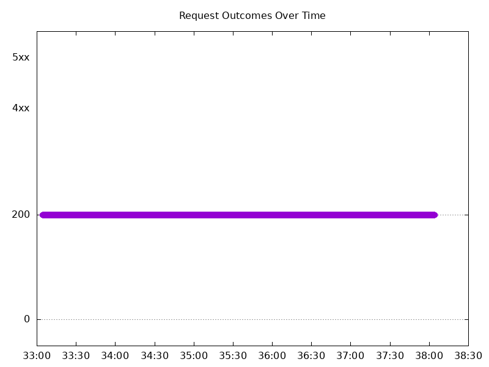
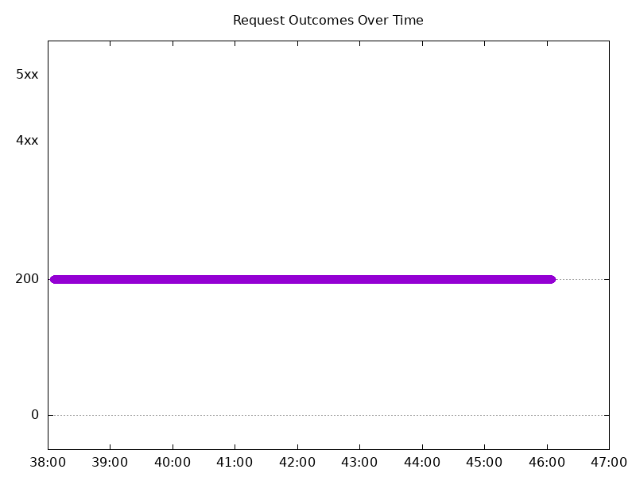
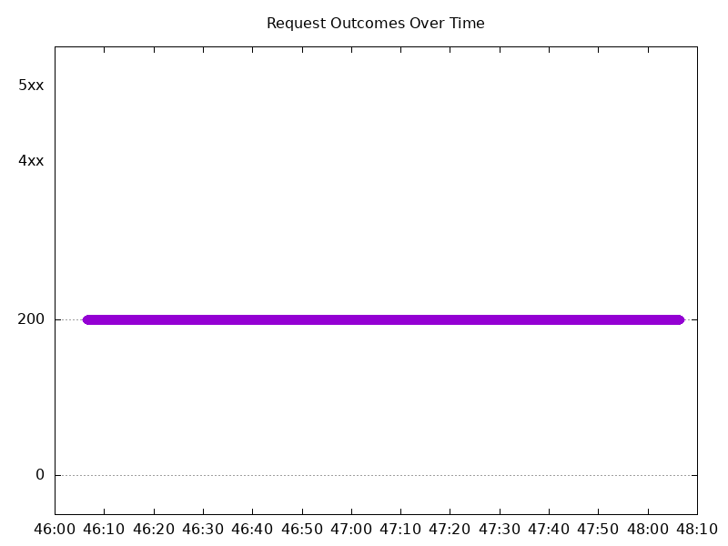
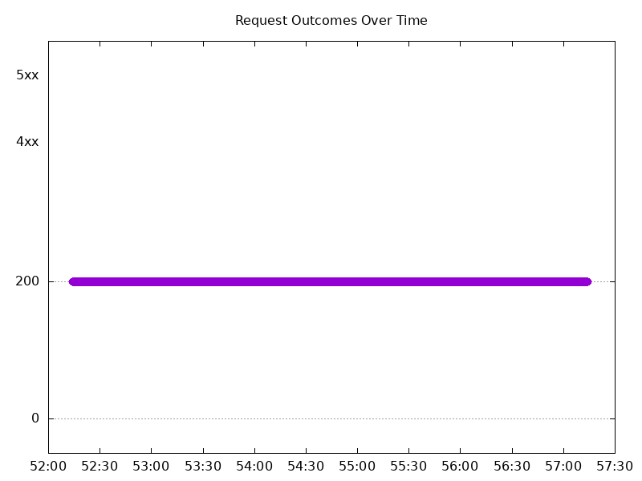
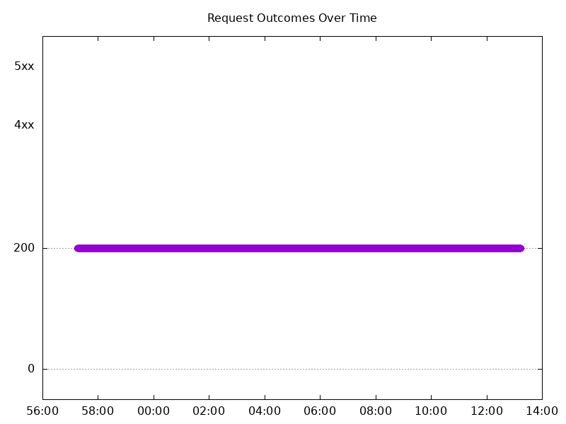
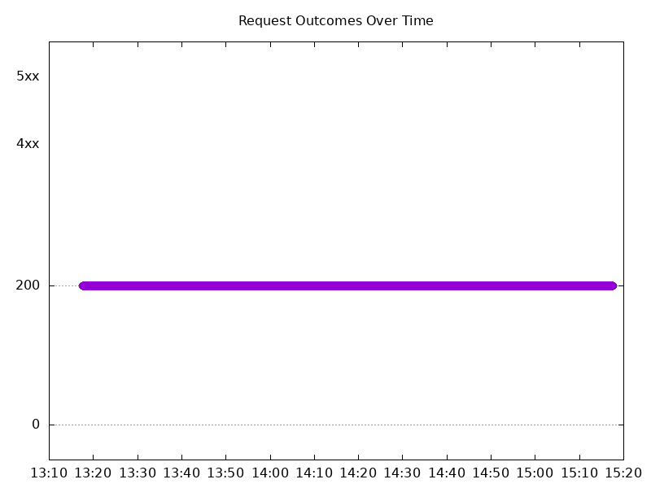
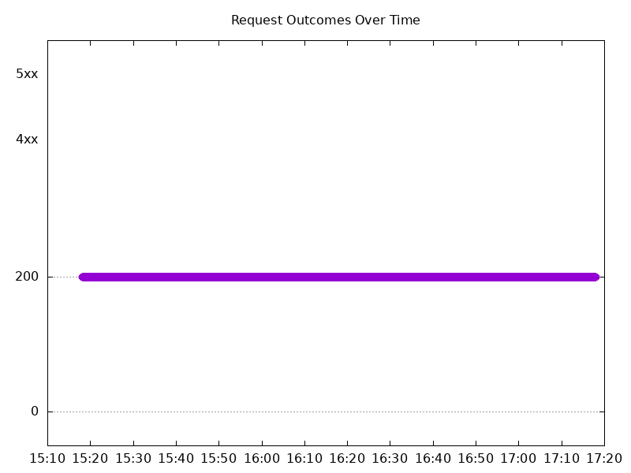

# Results

## Test environment

NGINX Plus: false

NGINX Gateway Fabric:

- Commit: b61c61d3f9ca29c6eb93ce9b44e652c9a521b3a4
- Date: 2025-01-13T16:47:24Z
- Dirty: false

GKE Cluster:

- Node count: 12
- k8s version: v1.30.6-gke.1596000
- vCPUs per node: 16
- RAM per node: 65853984Ki
- Max pods per node: 110
- Zone: us-west1-b
- Instance Type: n2d-standard-16

## One NGF Pod runs per node Test Results

### Scale Up Gradually

#### Test: Send https /tea traffic

```text
Requests      [total, rate, throughput]         30000, 100.00, 100.00
Duration      [total, attack, wait]             5m0s, 5m0s, 884.151µs
Latencies     [min, mean, 50, 90, 95, 99, max]  430.288µs, 894.252µs, 878.393µs, 1.057ms, 1.123ms, 1.348ms, 12.787ms
Bytes In      [total, mean]                     4625991, 154.20
Bytes Out     [total, mean]                     0, 0.00
Success       [ratio]                           100.00%
Status Codes  [code:count]                      200:30000  
Error Set:
```



#### Test: Send http /coffee traffic

```text
Requests      [total, rate, throughput]         30000, 100.00, 100.00
Duration      [total, attack, wait]             5m0s, 5m0s, 617.813µs
Latencies     [min, mean, 50, 90, 95, 99, max]  411.796µs, 849.819µs, 839.38µs, 1.001ms, 1.067ms, 1.305ms, 12.671ms
Bytes In      [total, mean]                     4805960, 160.20
Bytes Out     [total, mean]                     0, 0.00
Success       [ratio]                           100.00%
Status Codes  [code:count]                      200:30000  
Error Set:
```


### Scale Down Gradually

#### Test: Send http /coffee traffic

```text
Requests      [total, rate, throughput]         48000, 100.00, 100.00
Duration      [total, attack, wait]             8m0s, 8m0s, 935.746µs
Latencies     [min, mean, 50, 90, 95, 99, max]  413.772µs, 832.89µs, 828.193µs, 965.749µs, 1.02ms, 1.241ms, 11.886ms
Bytes In      [total, mean]                     7689523, 160.20
Bytes Out     [total, mean]                     0, 0.00
Success       [ratio]                           100.00%
Status Codes  [code:count]                      200:48000  
Error Set:
```



#### Test: Send https /tea traffic

```text
Requests      [total, rate, throughput]         48000, 100.00, 100.00
Duration      [total, attack, wait]             8m0s, 8m0s, 839.262µs
Latencies     [min, mean, 50, 90, 95, 99, max]  445.407µs, 859.764µs, 848.871µs, 993.325µs, 1.049ms, 1.258ms, 12.044ms
Bytes In      [total, mean]                     7401518, 154.20
Bytes Out     [total, mean]                     0, 0.00
Success       [ratio]                           100.00%
Status Codes  [code:count]                      200:48000  
Error Set:
```


### Scale Up Abruptly

#### Test: Send https /tea traffic

```text
Requests      [total, rate, throughput]         12000, 100.01, 100.01
Duration      [total, attack, wait]             2m0s, 2m0s, 981.012µs
Latencies     [min, mean, 50, 90, 95, 99, max]  449.478µs, 876.491µs, 863.628µs, 1.035ms, 1.091ms, 1.295ms, 11.09ms
Bytes In      [total, mean]                     1850379, 154.20
Bytes Out     [total, mean]                     0, 0.00
Success       [ratio]                           100.00%
Status Codes  [code:count]                      200:12000  
Error Set:
```


#### Test: Send http /coffee traffic

```text
Requests      [total, rate, throughput]         12000, 100.01, 100.01
Duration      [total, attack, wait]             2m0s, 2m0s, 956.004µs
Latencies     [min, mean, 50, 90, 95, 99, max]  426.158µs, 843.631µs, 838.899µs, 986.221µs, 1.038ms, 1.225ms, 9.264ms
Bytes In      [total, mean]                     1922412, 160.20
Bytes Out     [total, mean]                     0, 0.00
Success       [ratio]                           100.00%
Status Codes  [code:count]                      200:12000  
Error Set:
```



### Scale Down Abruptly

#### Test: Send http /coffee traffic

```text
Requests      [total, rate, throughput]         12000, 100.01, 100.01
Duration      [total, attack, wait]             2m0s, 2m0s, 1.159ms
Latencies     [min, mean, 50, 90, 95, 99, max]  407.742µs, 908.068µs, 906.137µs, 1.073ms, 1.125ms, 1.26ms, 8.881ms
Bytes In      [total, mean]                     1922385, 160.20
Bytes Out     [total, mean]                     0, 0.00
Success       [ratio]                           100.00%
Status Codes  [code:count]                      200:12000  
Error Set:
```


#### Test: Send https /tea traffic

```text
Requests      [total, rate, throughput]         12000, 100.01, 100.01
Duration      [total, attack, wait]             2m0s, 2m0s, 1.144ms
Latencies     [min, mean, 50, 90, 95, 99, max]  420.068µs, 940.104µs, 930.864µs, 1.113ms, 1.166ms, 1.305ms, 8.861ms
Bytes In      [total, mean]                     1850378, 154.20
Bytes Out     [total, mean]                     0, 0.00
Success       [ratio]                           100.00%
Status Codes  [code:count]                      200:12000  
Error Set:
```


## Multiple NGF Pods run per node Test Results

### Scale Up Gradually

#### Test: Send http /coffee traffic

```text
Requests      [total, rate, throughput]         30000, 100.00, 100.00
Duration      [total, attack, wait]             5m0s, 5m0s, 858.203µs
Latencies     [min, mean, 50, 90, 95, 99, max]  434.406µs, 878.34µs, 863.759µs, 1.034ms, 1.097ms, 1.376ms, 12.273ms
Bytes In      [total, mean]                     4806002, 160.20
Bytes Out     [total, mean]                     0, 0.00
Success       [ratio]                           100.00%
Status Codes  [code:count]                      200:30000  
Error Set:
```


#### Test: Send https /tea traffic

```text
Requests      [total, rate, throughput]         30000, 100.00, 100.00
Duration      [total, attack, wait]             5m0s, 5m0s, 975.731µs
Latencies     [min, mean, 50, 90, 95, 99, max]  452.033µs, 904.699µs, 886.261µs, 1.057ms, 1.119ms, 1.404ms, 13.241ms
Bytes In      [total, mean]                     4626020, 154.20
Bytes Out     [total, mean]                     0, 0.00
Success       [ratio]                           100.00%
Status Codes  [code:count]                      200:30000  
Error Set:
```



### Scale Down Gradually

#### Test: Send http /coffee traffic

```text
Requests      [total, rate, throughput]         96000, 100.00, 100.00
Duration      [total, attack, wait]             16m0s, 16m0s, 941.177µs
Latencies     [min, mean, 50, 90, 95, 99, max]  399.257µs, 854.526µs, 844.063µs, 1.006ms, 1.068ms, 1.305ms, 12.186ms
Bytes In      [total, mean]                     15378988, 160.20
Bytes Out     [total, mean]                     0, 0.00
Success       [ratio]                           100.00%
Status Codes  [code:count]                      200:96000  
Error Set:
```



#### Test: Send https /tea traffic

```text
Requests      [total, rate, throughput]         96000, 100.00, 100.00
Duration      [total, attack, wait]             16m0s, 16m0s, 1.044ms
Latencies     [min, mean, 50, 90, 95, 99, max]  408.91µs, 875.414µs, 861.002µs, 1.027ms, 1.094ms, 1.346ms, 17.722ms
Bytes In      [total, mean]                     14803207, 154.20
Bytes Out     [total, mean]                     0, 0.00
Success       [ratio]                           100.00%
Status Codes  [code:count]                      200:96000  
Error Set:
```


### Scale Up Abruptly

#### Test: Send http /coffee traffic

```text
Requests      [total, rate, throughput]         12000, 100.01, 100.01
Duration      [total, attack, wait]             2m0s, 2m0s, 806.048µs
Latencies     [min, mean, 50, 90, 95, 99, max]  422.292µs, 857.343µs, 847.614µs, 1.029ms, 1.103ms, 1.285ms, 5.302ms
Bytes In      [total, mean]                     1922384, 160.20
Bytes Out     [total, mean]                     0, 0.00
Success       [ratio]                           100.00%
Status Codes  [code:count]                      200:12000  
Error Set:
```


#### Test: Send https /tea traffic

```text
Requests      [total, rate, throughput]         12000, 100.01, 100.01
Duration      [total, attack, wait]             2m0s, 2m0s, 941.644µs
Latencies     [min, mean, 50, 90, 95, 99, max]  437.845µs, 881.542µs, 861.654µs, 1.052ms, 1.126ms, 1.303ms, 6.146ms
Bytes In      [total, mean]                     1850379, 154.20
Bytes Out     [total, mean]                     0, 0.00
Success       [ratio]                           100.00%
Status Codes  [code:count]                      200:12000  
Error Set:
```



### Scale Down Abruptly

#### Test: Send https /tea traffic

```text
Requests      [total, rate, throughput]         12000, 100.01, 100.01
Duration      [total, attack, wait]             2m0s, 2m0s, 803.102µs
Latencies     [min, mean, 50, 90, 95, 99, max]  456.04µs, 909.975µs, 899.85µs, 1.073ms, 1.129ms, 1.292ms, 9.787ms
Bytes In      [total, mean]                     1850444, 154.20
Bytes Out     [total, mean]                     0, 0.00
Success       [ratio]                           100.00%
Status Codes  [code:count]                      200:12000  
Error Set:
```


#### Test: Send http /coffee traffic

```text
Requests      [total, rate, throughput]         12000, 100.01, 100.01
Duration      [total, attack, wait]             2m0s, 2m0s, 794.084µs
Latencies     [min, mean, 50, 90, 95, 99, max]  432.036µs, 882.08µs, 877.001µs, 1.036ms, 1.087ms, 1.259ms, 9.732ms
Bytes In      [total, mean]                     1922353, 160.20
Bytes Out     [total, mean]                     0, 0.00
Success       [ratio]                           100.00%
Status Codes  [code:count]                      200:12000  
Error Set:
```


