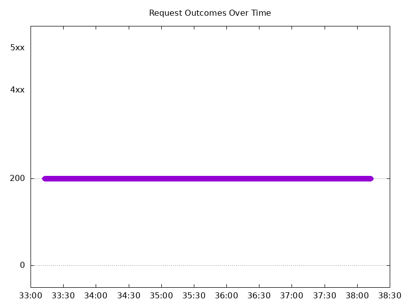
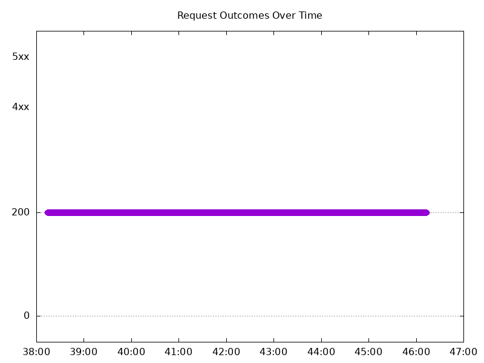
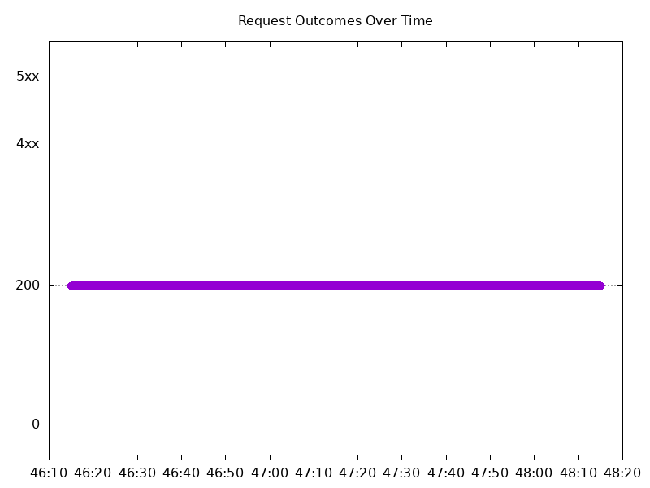
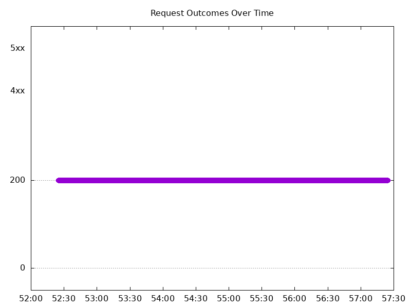
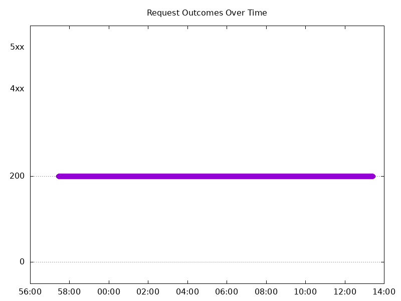
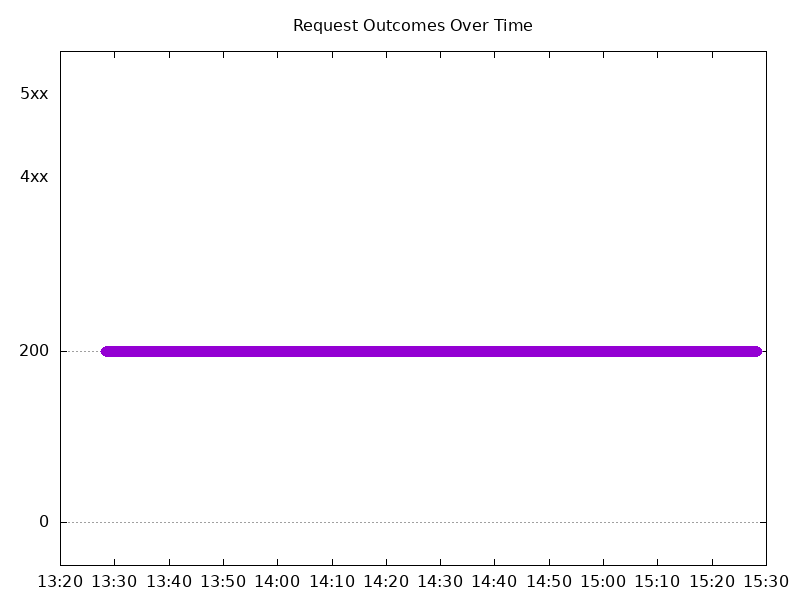

# Results

## Test environment

NGINX Plus: true

NGINX Gateway Fabric:

- Commit: b61c61d3f9ca29c6eb93ce9b44e652c9a521b3a4
- Date: 2025-01-13T16:47:24Z
- Dirty: false

GKE Cluster:

- Node count: 12
- k8s version: v1.30.6-gke.1596000
- vCPUs per node: 16
- RAM per node: 65853984Ki
- Max pods per node: 110
- Zone: us-west1-b
- Instance Type: n2d-standard-16

## Summary:

- Slight increase in average latency across all test cases.
- No errors.

## One NGF Pod runs per node Test Results

### Scale Up Gradually

#### Test: Send http /coffee traffic

```text
Requests      [total, rate, throughput]         30000, 100.00, 100.00
Duration      [total, attack, wait]             5m0s, 5m0s, 731.836µs
Latencies     [min, mean, 50, 90, 95, 99, max]  405.262µs, 951.414µs, 942.674µs, 1.133ms, 1.196ms, 1.441ms, 12.654ms
Bytes In      [total, mean]                     4805936, 160.20
Bytes Out     [total, mean]                     0, 0.00
Success       [ratio]                           100.00%
Status Codes  [code:count]                      200:30000
Error Set:
```



#### Test: Send https /tea traffic

```text
Requests      [total, rate, throughput]         30000, 100.00, 100.00
Duration      [total, attack, wait]             5m0s, 5m0s, 928.875µs
Latencies     [min, mean, 50, 90, 95, 99, max]  422.584µs, 974.005µs, 961.01µs, 1.153ms, 1.225ms, 1.478ms, 17.862ms
Bytes In      [total, mean]                     4626034, 154.20
Bytes Out     [total, mean]                     0, 0.00
Success       [ratio]                           100.00%
Status Codes  [code:count]                      200:30000
Error Set:
```


### Scale Down Gradually

#### Test: Send https /tea traffic

```text
Requests      [total, rate, throughput]         48000, 100.00, 100.00
Duration      [total, attack, wait]             8m0s, 8m0s, 955.351µs
Latencies     [min, mean, 50, 90, 95, 99, max]  461.146µs, 993.488µs, 983.448µs, 1.177ms, 1.24ms, 1.439ms, 18.887ms
Bytes In      [total, mean]                     7401553, 154.20
Bytes Out     [total, mean]                     0, 0.00
Success       [ratio]                           100.00%
Status Codes  [code:count]                      200:48000
Error Set:
```



#### Test: Send http /coffee traffic

```text
Requests      [total, rate, throughput]         48000, 100.00, 100.00
Duration      [total, attack, wait]             8m0s, 8m0s, 912.825µs
Latencies     [min, mean, 50, 90, 95, 99, max]  419.392µs, 932.199µs, 931.633µs, 1.104ms, 1.162ms, 1.359ms, 14.565ms
Bytes In      [total, mean]                     7689592, 160.20
Bytes Out     [total, mean]                     0, 0.00
Success       [ratio]                           100.00%
Status Codes  [code:count]                      200:48000
Error Set:
```


### Scale Up Abruptly

#### Test: Send https /tea traffic

```text
Requests      [total, rate, throughput]         12000, 100.01, 100.01
Duration      [total, attack, wait]             2m0s, 2m0s, 1.009ms
Latencies     [min, mean, 50, 90, 95, 99, max]  437.81µs, 958.122µs, 943.806µs, 1.159ms, 1.239ms, 1.45ms, 8.401ms
Bytes In      [total, mean]                     1850481, 154.21
Bytes Out     [total, mean]                     0, 0.00
Success       [ratio]                           100.00%
Status Codes  [code:count]                      200:12000
Error Set:
```


#### Test: Send http /coffee traffic

```text
Requests      [total, rate, throughput]         12000, 100.01, 100.01
Duration      [total, attack, wait]             2m0s, 2m0s, 1.026ms
Latencies     [min, mean, 50, 90, 95, 99, max]  404.512µs, 899.693µs, 901.006µs, 1.077ms, 1.14ms, 1.335ms, 7.566ms
Bytes In      [total, mean]                     1922365, 160.20
Bytes Out     [total, mean]                     0, 0.00
Success       [ratio]                           100.00%
Status Codes  [code:count]                      200:12000
Error Set:
```



### Scale Down Abruptly

#### Test: Send https /tea traffic

```text
Requests      [total, rate, throughput]         12000, 100.01, 100.01
Duration      [total, attack, wait]             2m0s, 2m0s, 780.518µs
Latencies     [min, mean, 50, 90, 95, 99, max]  406.603µs, 961.899µs, 949.821µs, 1.142ms, 1.209ms, 1.355ms, 27.837ms
Bytes In      [total, mean]                     1850421, 154.20
Bytes Out     [total, mean]                     0, 0.00
Success       [ratio]                           100.00%
Status Codes  [code:count]                      200:12000
Error Set:
```


#### Test: Send http /coffee traffic

```text
Requests      [total, rate, throughput]         12000, 100.01, 100.01
Duration      [total, attack, wait]             2m0s, 2m0s, 931.573µs
Latencies     [min, mean, 50, 90, 95, 99, max]  424.508µs, 934.592µs, 926.134µs, 1.112ms, 1.174ms, 1.32ms, 39.399ms
Bytes In      [total, mean]                     1922394, 160.20
Bytes Out     [total, mean]                     0, 0.00
Success       [ratio]                           100.00%
Status Codes  [code:count]                      200:12000
Error Set:
```


## Multiple NGF Pods run per node Test Results

### Scale Up Gradually

#### Test: Send https /tea traffic

```text
Requests      [total, rate, throughput]         30000, 100.00, 100.00
Duration      [total, attack, wait]             5m0s, 5m0s, 895.686µs
Latencies     [min, mean, 50, 90, 95, 99, max]  428.719µs, 977.84µs, 958.198µs, 1.175ms, 1.253ms, 1.52ms, 20.388ms
Bytes In      [total, mean]                     4626083, 154.20
Bytes Out     [total, mean]                     0, 0.00
Success       [ratio]                           100.00%
Status Codes  [code:count]                      200:30000
Error Set:
```


#### Test: Send http /coffee traffic

```text
Requests      [total, rate, throughput]         30000, 100.00, 100.00
Duration      [total, attack, wait]             5m0s, 5m0s, 875.402µs
Latencies     [min, mean, 50, 90, 95, 99, max]  390.731µs, 940.618µs, 924.826µs, 1.12ms, 1.205ms, 1.509ms, 12.669ms
Bytes In      [total, mean]                     4806006, 160.20
Bytes Out     [total, mean]                     0, 0.00
Success       [ratio]                           100.00%
Status Codes  [code:count]                      200:30000
Error Set:
```



### Scale Down Gradually

#### Test: Send http /coffee traffic

```text
Requests      [total, rate, throughput]         96000, 100.00, 100.00
Duration      [total, attack, wait]             16m0s, 16m0s, 770.017µs
Latencies     [min, mean, 50, 90, 95, 99, max]  399.823µs, 935.884µs, 927.357µs, 1.122ms, 1.191ms, 1.406ms, 53.699ms
Bytes In      [total, mean]                     15379358, 160.20
Bytes Out     [total, mean]                     0, 0.00
Success       [ratio]                           100.00%
Status Codes  [code:count]                      200:96000
Error Set:
```


#### Test: Send https /tea traffic

```text
Requests      [total, rate, throughput]         96000, 100.00, 100.00
Duration      [total, attack, wait]             16m0s, 16m0s, 1.031ms
Latencies     [min, mean, 50, 90, 95, 99, max]  404.664µs, 968.668µs, 952.902µs, 1.171ms, 1.249ms, 1.459ms, 62.262ms
Bytes In      [total, mean]                     14803402, 154.20
Bytes Out     [total, mean]                     0, 0.00
Success       [ratio]                           100.00%
Status Codes  [code:count]                      200:96000
Error Set:
```



### Scale Up Abruptly

#### Test: Send http /coffee traffic

```text
Requests      [total, rate, throughput]         12000, 100.01, 100.01
Duration      [total, attack, wait]             2m0s, 2m0s, 584.702µs
Latencies     [min, mean, 50, 90, 95, 99, max]  438.473µs, 908.694µs, 894.28µs, 1.094ms, 1.172ms, 1.432ms, 11.703ms
Bytes In      [total, mean]                     1922409, 160.20
Bytes Out     [total, mean]                     0, 0.00
Success       [ratio]                           100.00%
Status Codes  [code:count]                      200:12000
Error Set:
```


#### Test: Send https /tea traffic

```text
Requests      [total, rate, throughput]         12000, 100.01, 100.01
Duration      [total, attack, wait]             2m0s, 2m0s, 843.545µs
Latencies     [min, mean, 50, 90, 95, 99, max]  459.238µs, 1.002ms, 955.233µs, 1.182ms, 1.285ms, 1.786ms, 44.019ms
Bytes In      [total, mean]                     1850373, 154.20
Bytes Out     [total, mean]                     0, 0.00
Success       [ratio]                           100.00%
Status Codes  [code:count]                      200:12000
Error Set:
```



### Scale Down Abruptly

#### Test: Send http /coffee traffic

```text
Requests      [total, rate, throughput]         12000, 100.01, 100.01
Duration      [total, attack, wait]             2m0s, 2m0s, 1.06ms
Latencies     [min, mean, 50, 90, 95, 99, max]  452.602µs, 992.347µs, 976.316µs, 1.207ms, 1.285ms, 1.474ms, 34.554ms
Bytes In      [total, mean]                     1922450, 160.20
Bytes Out     [total, mean]                     0, 0.00
Success       [ratio]                           100.00%
Status Codes  [code:count]                      200:12000
Error Set:
```


#### Test: Send https /tea traffic

```text
Requests      [total, rate, throughput]         12000, 100.01, 100.01
Duration      [total, attack, wait]             2m0s, 2m0s, 1.249ms
Latencies     [min, mean, 50, 90, 95, 99, max]  471.173µs, 1.047ms, 1.024ms, 1.267ms, 1.349ms, 1.555ms, 43.182ms
Bytes In      [total, mean]                     1850373, 154.20
Bytes Out     [total, mean]                     0, 0.00
Success       [ratio]                           100.00%
Status Codes  [code:count]                      200:12000
Error Set:
```


