# Results

## Test environment

NGINX Plus: false

NGINX Gateway Fabric:

- Commit: 2ed7d4ae2f827623074c40653ac821b61ae72b63
- Date: 2024-08-08T21:29:44Z
- Dirty: false

GKE Cluster:

- Node count: 12
- k8s version: v1.29.6-gke.1254000
- vCPUs per node: 16
- RAM per node: 65855012Ki
- Max pods per node: 110
- Zone: us-west1-b
- Instance Type: n2d-standard-16

## One NGF Pod runs per node Test Results

### Scale Up Gradually

#### Test: Send https /tea traffic

```text
Requests      [total, rate, throughput]         30000, 100.00, 100.00
Duration      [total, attack, wait]             5m0s, 5m0s, 902.352µs
Latencies     [min, mean, 50, 90, 95, 99, max]  453.524µs, 958.438µs, 939.438µs, 1.123ms, 1.2ms, 1.503ms, 23.34ms
Bytes In      [total, mean]                     4593022, 153.10
Bytes Out     [total, mean]                     0, 0.00
Success       [ratio]                           100.00%
Status Codes  [code:count]                      200:30000  
Error Set:
```

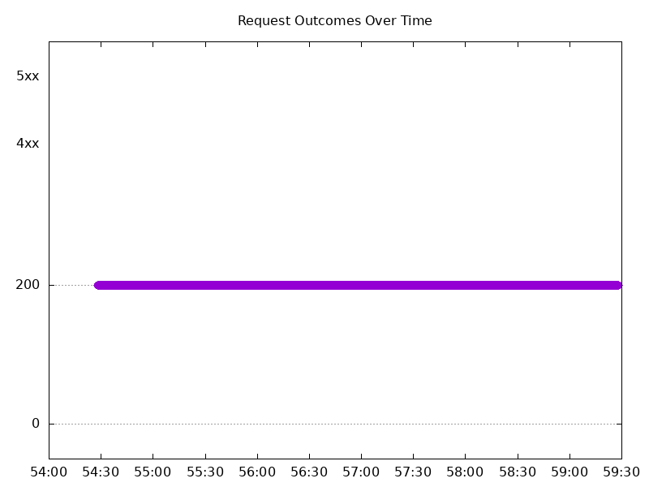

#### Test: Send http /coffee traffic

```text
Requests      [total, rate, throughput]         30000, 100.00, 100.00
Duration      [total, attack, wait]             5m0s, 5m0s, 1.006ms
Latencies     [min, mean, 50, 90, 95, 99, max]  423.552µs, 932.427µs, 921.614µs, 1.099ms, 1.168ms, 1.438ms, 12.702ms
Bytes In      [total, mean]                     4803038, 160.10
Bytes Out     [total, mean]                     0, 0.00
Success       [ratio]                           100.00%
Status Codes  [code:count]                      200:30000  
Error Set:
```

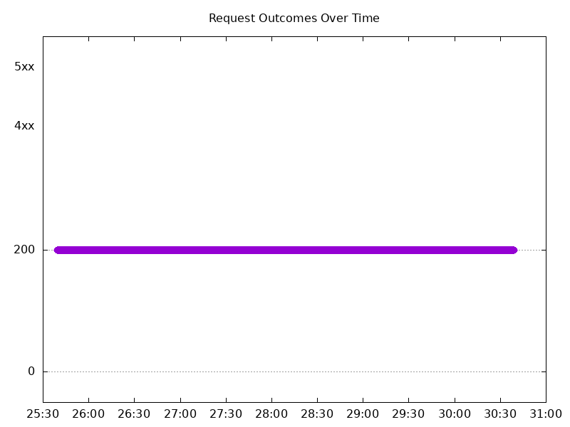

### Scale Down Gradually

#### Test: Send https /tea traffic

```text
Requests      [total, rate, throughput]         48000, 100.00, 100.00
Duration      [total, attack, wait]             8m0s, 8m0s, 680.207µs
Latencies     [min, mean, 50, 90, 95, 99, max]  443.091µs, 960.573µs, 947.208µs, 1.125ms, 1.197ms, 1.444ms, 40.346ms
Bytes In      [total, mean]                     7348873, 153.10
Bytes Out     [total, mean]                     0, 0.00
Success       [ratio]                           100.00%
Status Codes  [code:count]                      200:48000  
Error Set:
```

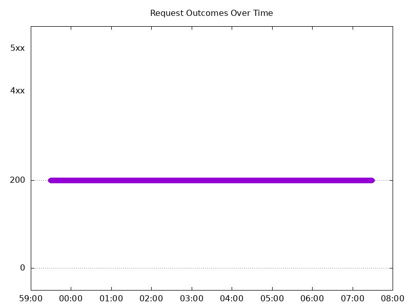

#### Test: Send http /coffee traffic

```text
Requests      [total, rate, throughput]         48000, 100.00, 100.00
Duration      [total, attack, wait]             8m0s, 8m0s, 940.357µs
Latencies     [min, mean, 50, 90, 95, 99, max]  444.457µs, 927.009µs, 919.456µs, 1.088ms, 1.158ms, 1.421ms, 39.704ms
Bytes In      [total, mean]                     7684856, 160.10
Bytes Out     [total, mean]                     0, 0.00
Success       [ratio]                           100.00%
Status Codes  [code:count]                      200:48000  
Error Set:
```

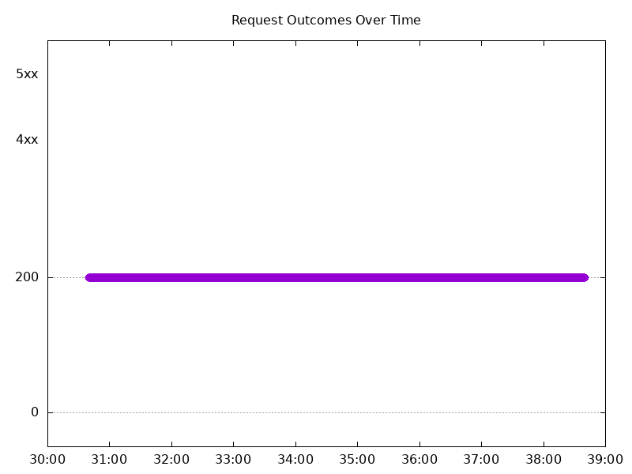

### Scale Up Abruptly

#### Test: Send https /tea traffic

```text
Requests      [total, rate, throughput]         12000, 100.01, 100.01
Duration      [total, attack, wait]             2m0s, 2m0s, 821.097µs
Latencies     [min, mean, 50, 90, 95, 99, max]  472.586µs, 940.088µs, 931.23µs, 1.092ms, 1.155ms, 1.393ms, 9.017ms
Bytes In      [total, mean]                     1837196, 153.10
Bytes Out     [total, mean]                     0, 0.00
Success       [ratio]                           100.00%
Status Codes  [code:count]                      200:12000  
Error Set:
```

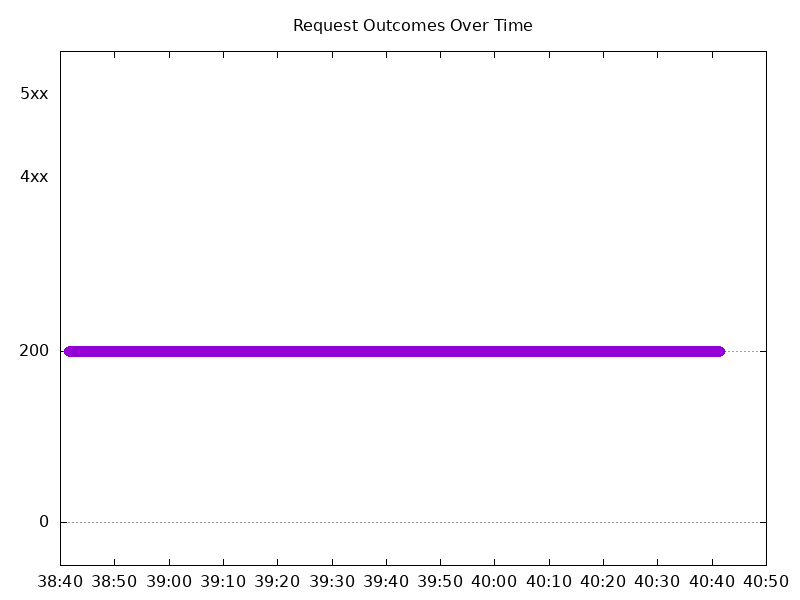

#### Test: Send http /coffee traffic

```text
Requests      [total, rate, throughput]         12000, 100.01, 100.01
Duration      [total, attack, wait]             2m0s, 2m0s, 1.051ms
Latencies     [min, mean, 50, 90, 95, 99, max]  436.458µs, 901.824µs, 903.591µs, 1.053ms, 1.108ms, 1.316ms, 8.954ms
Bytes In      [total, mean]                     1921179, 160.10
Bytes Out     [total, mean]                     0, 0.00
Success       [ratio]                           100.00%
Status Codes  [code:count]                      200:12000  
Error Set:
```

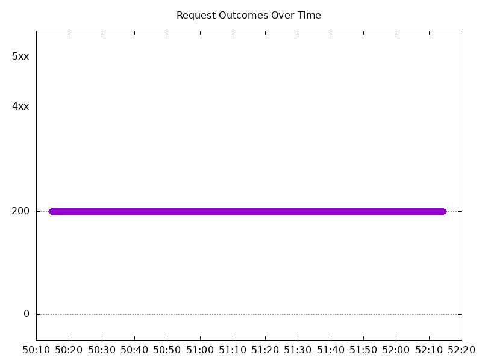

### Scale Down Abruptly

#### Test: Send http /coffee traffic

```text
Requests      [total, rate, throughput]         12000, 100.01, 100.01
Duration      [total, attack, wait]             2m0s, 2m0s, 873.314µs
Latencies     [min, mean, 50, 90, 95, 99, max]  467.466µs, 911.34µs, 915.449µs, 1.067ms, 1.12ms, 1.287ms, 8.111ms
Bytes In      [total, mean]                     1921192, 160.10
Bytes Out     [total, mean]                     0, 0.00
Success       [ratio]                           100.00%
Status Codes  [code:count]                      200:12000  
Error Set:
```

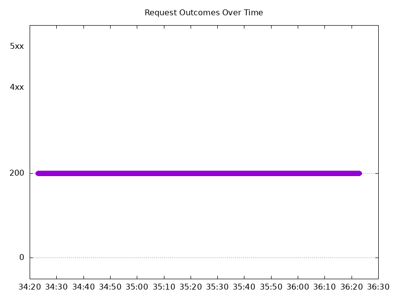

#### Test: Send https /tea traffic

```text
Requests      [total, rate, throughput]         12000, 100.01, 100.01
Duration      [total, attack, wait]             2m0s, 2m0s, 1.059ms
Latencies     [min, mean, 50, 90, 95, 99, max]  487.569µs, 955.261µs, 944.752µs, 1.116ms, 1.197ms, 1.507ms, 12.714ms
Bytes In      [total, mean]                     1837205, 153.10
Bytes Out     [total, mean]                     0, 0.00
Success       [ratio]                           100.00%
Status Codes  [code:count]                      200:12000  
Error Set:
```

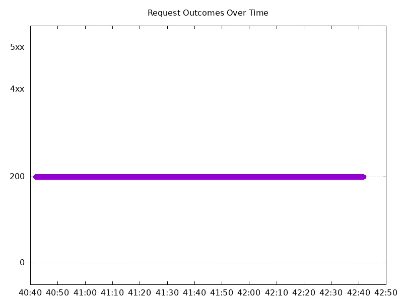

## Multiple NGF Pods run per node Test Results

### Scale Up Gradually

#### Test: Send https /tea traffic

```text
Requests      [total, rate, throughput]         30000, 100.00, 100.00
Duration      [total, attack, wait]             5m0s, 5m0s, 986.735µs
Latencies     [min, mean, 50, 90, 95, 99, max]  477.788µs, 953.471µs, 937.341µs, 1.113ms, 1.188ms, 1.499ms, 14.212ms
Bytes In      [total, mean]                     4593061, 153.10
Bytes Out     [total, mean]                     0, 0.00
Success       [ratio]                           100.00%
Status Codes  [code:count]                      200:30000  
Error Set:
```

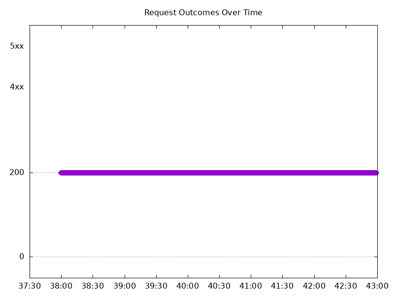

#### Test: Send http /coffee traffic

```text
Requests      [total, rate, throughput]         30000, 100.00, 100.00
Duration      [total, attack, wait]             5m0s, 5m0s, 966.713µs
Latencies     [min, mean, 50, 90, 95, 99, max]  431.189µs, 910.819µs, 903.225µs, 1.069ms, 1.14ms, 1.436ms, 11.921ms
Bytes In      [total, mean]                     4802989, 160.10
Bytes Out     [total, mean]                     0, 0.00
Success       [ratio]                           100.00%
Status Codes  [code:count]                      200:30000  
Error Set:
```

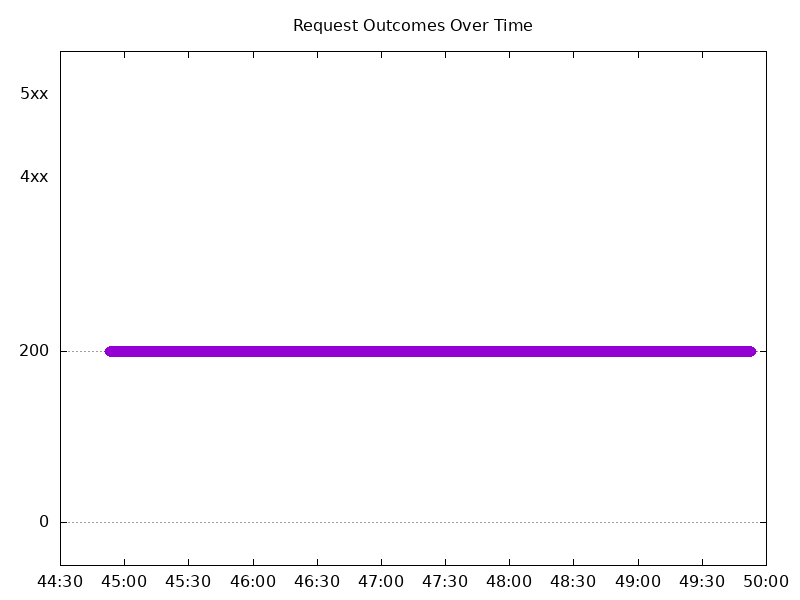

### Scale Down Gradually

#### Test: Send http /coffee traffic

```text
Requests      [total, rate, throughput]         96000, 100.00, 100.00
Duration      [total, attack, wait]             16m0s, 16m0s, 821.196µs
Latencies     [min, mean, 50, 90, 95, 99, max]  406.839µs, 931.654µs, 919.688µs, 1.096ms, 1.181ms, 1.548ms, 46.624ms
Bytes In      [total, mean]                     15369606, 160.10
Bytes Out     [total, mean]                     0, 0.00
Success       [ratio]                           100.00%
Status Codes  [code:count]                      200:96000  
Error Set:
```

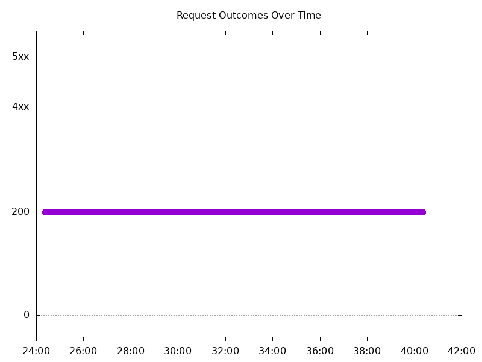

#### Test: Send https /tea traffic

```text
Requests      [total, rate, throughput]         96000, 100.00, 100.00
Duration      [total, attack, wait]             16m0s, 16m0s, 704.892µs
Latencies     [min, mean, 50, 90, 95, 99, max]  435.071µs, 969.274µs, 950.561µs, 1.14ms, 1.229ms, 1.554ms, 38.723ms
Bytes In      [total, mean]                     14697589, 153.10
Bytes Out     [total, mean]                     0, 0.00
Success       [ratio]                           100.00%
Status Codes  [code:count]                      200:96000  
Error Set:
```

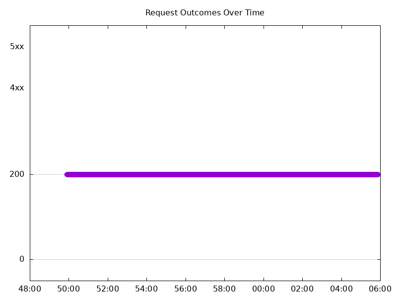

### Scale Up Abruptly

#### Test: Send http /coffee traffic

```text
Requests      [total, rate, throughput]         12000, 100.01, 100.01
Duration      [total, attack, wait]             2m0s, 2m0s, 893.887µs
Latencies     [min, mean, 50, 90, 95, 99, max]  462.338µs, 919.064µs, 911.933µs, 1.078ms, 1.135ms, 1.351ms, 6.01ms
Bytes In      [total, mean]                     1921146, 160.10
Bytes Out     [total, mean]                     0, 0.00
Success       [ratio]                           100.00%
Status Codes  [code:count]                      200:12000  
Error Set:
```

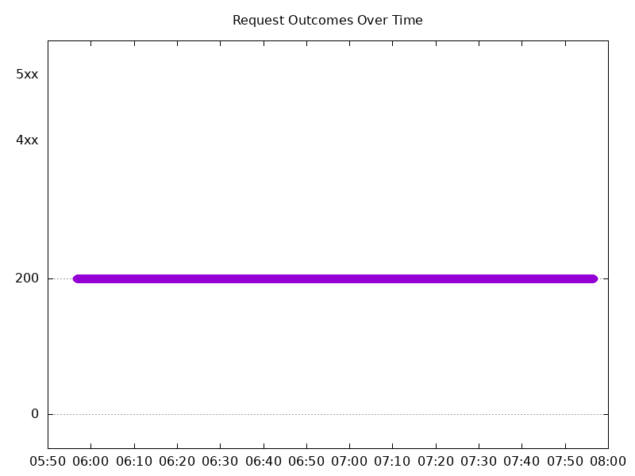

#### Test: Send https /tea traffic

```text
Requests      [total, rate, throughput]         12000, 100.01, 100.01
Duration      [total, attack, wait]             2m0s, 2m0s, 944.783µs
Latencies     [min, mean, 50, 90, 95, 99, max]  493.188µs, 946.818µs, 941.054µs, 1.114ms, 1.178ms, 1.419ms, 5.788ms
Bytes In      [total, mean]                     1837211, 153.10
Bytes Out     [total, mean]                     0, 0.00
Success       [ratio]                           100.00%
Status Codes  [code:count]                      200:12000  
Error Set:
```

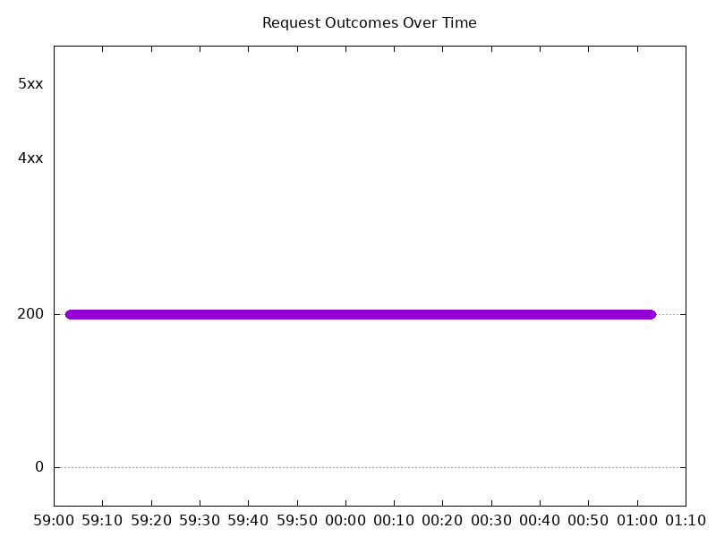

### Scale Down Abruptly

#### Test: Send https /tea traffic

```text
Requests      [total, rate, throughput]         12000, 100.01, 100.01
Duration      [total, attack, wait]             2m0s, 2m0s, 1.211ms
Latencies     [min, mean, 50, 90, 95, 99, max]  490.811µs, 961.164µs, 951.449µs, 1.132ms, 1.205ms, 1.42ms, 7.241ms
Bytes In      [total, mean]                     1837261, 153.11
Bytes Out     [total, mean]                     0, 0.00
Success       [ratio]                           100.00%
Status Codes  [code:count]                      200:12000  
Error Set:
```

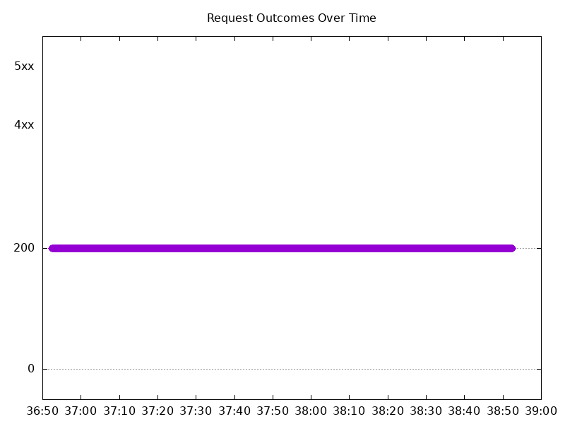

#### Test: Send http /coffee traffic

```text
Requests      [total, rate, throughput]         12000, 100.01, 100.01
Duration      [total, attack, wait]             2m0s, 2m0s, 1.176ms
Latencies     [min, mean, 50, 90, 95, 99, max]  464.558µs, 918.746µs, 914.201µs, 1.085ms, 1.152ms, 1.364ms, 7.39ms
Bytes In      [total, mean]                     1921256, 160.10
Bytes Out     [total, mean]                     0, 0.00
Success       [ratio]                           100.00%
Status Codes  [code:count]                      200:12000  
Error Set:
```


