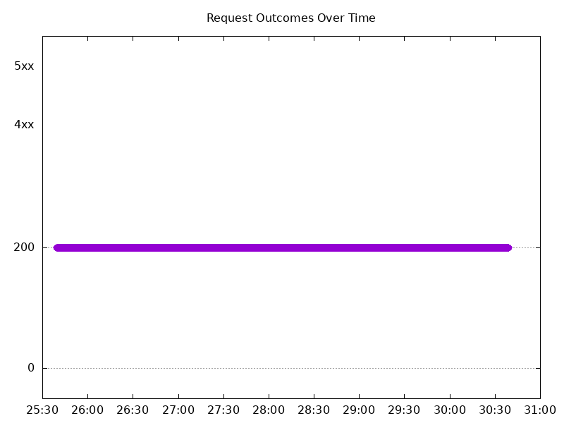
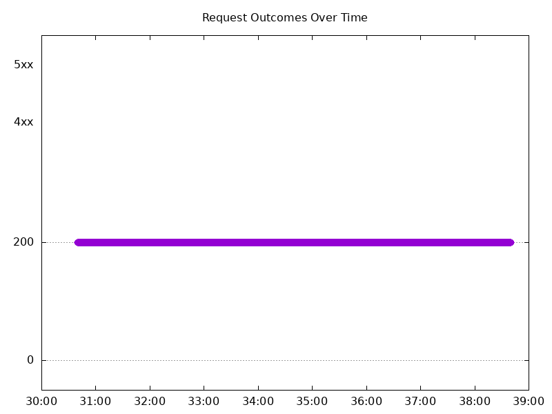
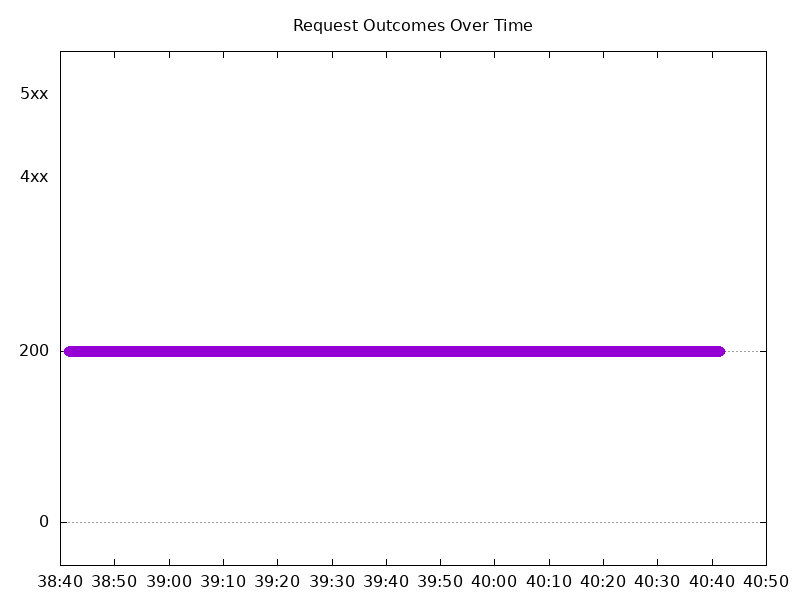
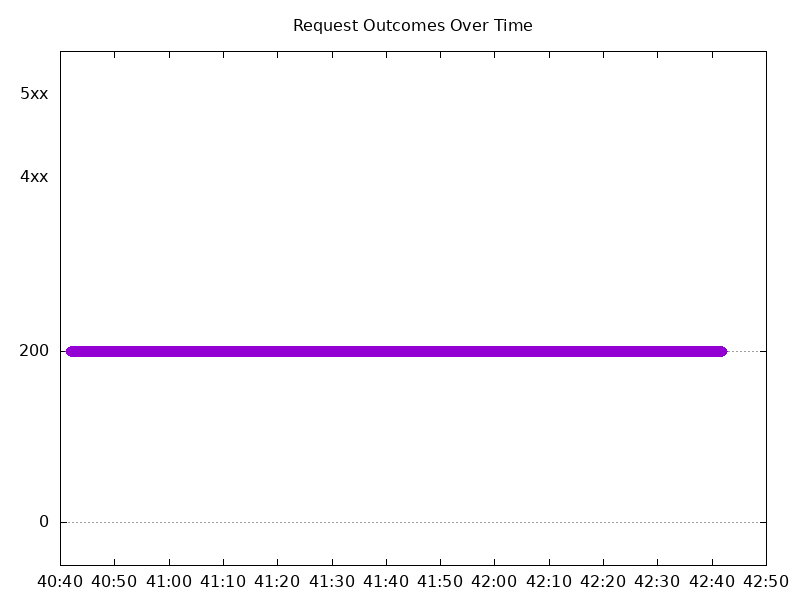
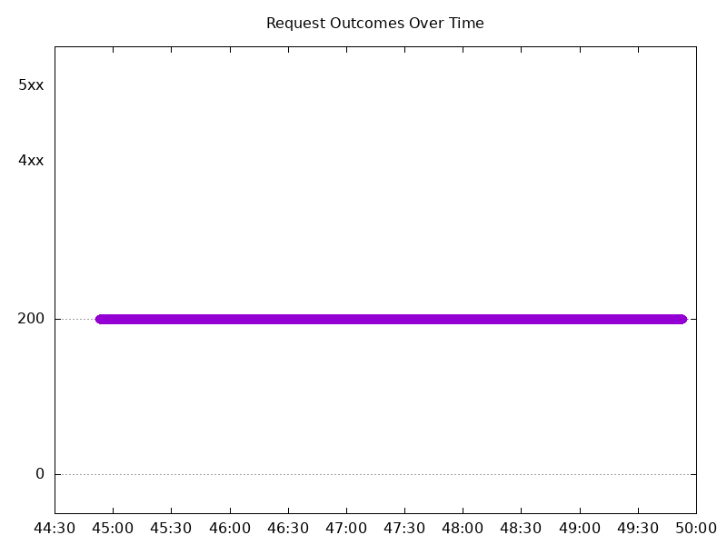
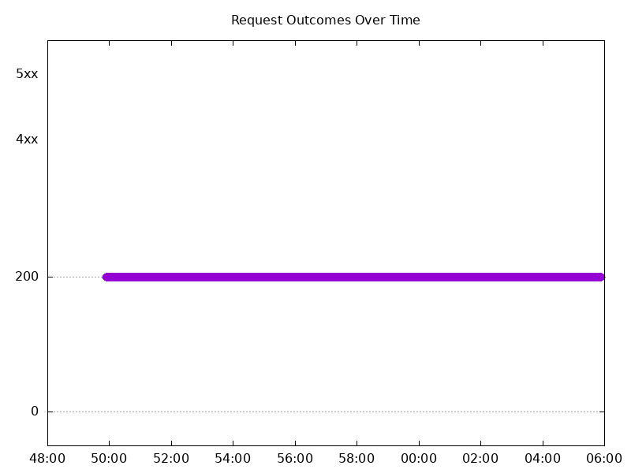
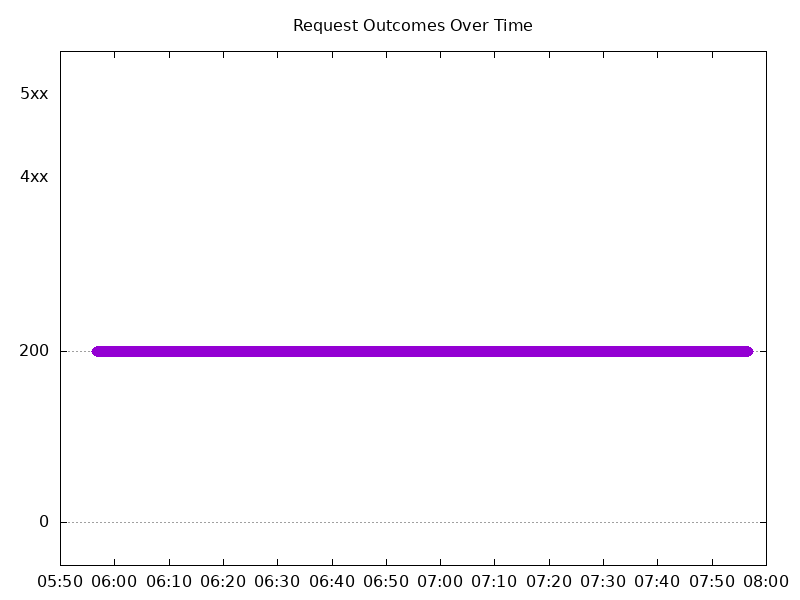

# Results

## Test environment

NGINX Plus: false

NGINX Gateway Fabric:

- Commit: 929413c15af7bee3adb32e103c9d1513a693da16
- Date: 2024-11-28T12:52:45Z
- Dirty: false

GKE Cluster:

- Node count: 12
- k8s version: v1.30.5-gke.1443001
- vCPUs per node: 16
- RAM per node: 65853964Ki
- Max pods per node: 110
- Zone: us-west1-b
- Instance Type: n2d-standard-16

## One NGF Pod runs per node Test Results

### Scale Up Gradually

#### Test: Send http /coffee traffic

```text
Requests      [total, rate, throughput]         30000, 100.00, 100.00
Duration      [total, attack, wait]             5m0s, 5m0s, 853.569µs
Latencies     [min, mean, 50, 90, 95, 99, max]  403.735µs, 872.487µs, 866.424µs, 1.016ms, 1.068ms, 1.343ms, 14.605ms
Bytes In      [total, mean]                     4835876, 161.20
Bytes Out     [total, mean]                     0, 0.00
Success       [ratio]                           100.00%
Status Codes  [code:count]                      200:30000  
Error Set:
```



#### Test: Send https /tea traffic

```text
Requests      [total, rate, throughput]         30000, 100.00, 100.00
Duration      [total, attack, wait]             5m0s, 5m0s, 588.205µs
Latencies     [min, mean, 50, 90, 95, 99, max]  420.134µs, 908.536µs, 894.146µs, 1.053ms, 1.112ms, 1.444ms, 16.143ms
Bytes In      [total, mean]                     4656006, 155.20
Bytes Out     [total, mean]                     0, 0.00
Success       [ratio]                           100.00%
Status Codes  [code:count]                      200:30000  
Error Set:
```


### Scale Down Gradually

#### Test: Send http /coffee traffic

```text
Requests      [total, rate, throughput]         48000, 100.00, 100.00
Duration      [total, attack, wait]             8m0s, 8m0s, 920.098µs
Latencies     [min, mean, 50, 90, 95, 99, max]  411.915µs, 871.991µs, 864.083µs, 1.01ms, 1.062ms, 1.292ms, 11.744ms
Bytes In      [total, mean]                     7737473, 161.20
Bytes Out     [total, mean]                     0, 0.00
Success       [ratio]                           100.00%
Status Codes  [code:count]                      200:48000  
Error Set:
```



#### Test: Send https /tea traffic

```text
Requests      [total, rate, throughput]         48000, 100.00, 100.00
Duration      [total, attack, wait]             8m0s, 8m0s, 893.276µs
Latencies     [min, mean, 50, 90, 95, 99, max]  445.96µs, 891.314µs, 879.197µs, 1.023ms, 1.077ms, 1.315ms, 15.084ms
Bytes In      [total, mean]                     7449548, 155.20
Bytes Out     [total, mean]                     0, 0.00
Success       [ratio]                           100.00%
Status Codes  [code:count]                      200:48000  
Error Set:
```


### Scale Up Abruptly

#### Test: Send http /coffee traffic

```text
Requests      [total, rate, throughput]         12000, 100.01, 100.01
Duration      [total, attack, wait]             2m0s, 2m0s, 1.085ms
Latencies     [min, mean, 50, 90, 95, 99, max]  438.659µs, 891.045µs, 883.024µs, 1.021ms, 1.073ms, 1.263ms, 12.66ms
Bytes In      [total, mean]                     1934395, 161.20
Bytes Out     [total, mean]                     0, 0.00
Success       [ratio]                           100.00%
Status Codes  [code:count]                      200:12000  
Error Set:
```


#### Test: Send https /tea traffic

```text
Requests      [total, rate, throughput]         12000, 100.01, 100.01
Duration      [total, attack, wait]             2m0s, 2m0s, 892.011µs
Latencies     [min, mean, 50, 90, 95, 99, max]  462.509µs, 915.826µs, 907.16µs, 1.053ms, 1.109ms, 1.353ms, 12.624ms
Bytes In      [total, mean]                     1862449, 155.20
Bytes Out     [total, mean]                     0, 0.00
Success       [ratio]                           100.00%
Status Codes  [code:count]                      200:12000  
Error Set:
```



### Scale Down Abruptly

#### Test: Send https /tea traffic

```text
Requests      [total, rate, throughput]         12000, 100.01, 100.01
Duration      [total, attack, wait]             2m0s, 2m0s, 737.209µs
Latencies     [min, mean, 50, 90, 95, 99, max]  545.131µs, 897.003µs, 876.249µs, 1.025ms, 1.08ms, 1.219ms, 6.359ms
Bytes In      [total, mean]                     1862379, 155.20
Bytes Out     [total, mean]                     0, 0.00
Success       [ratio]                           100.00%
Status Codes  [code:count]                      200:12000  
Error Set:
```



#### Test: Send http /coffee traffic

```text
Requests      [total, rate, throughput]         12000, 100.01, 100.01
Duration      [total, attack, wait]             2m0s, 2m0s, 798.545µs
Latencies     [min, mean, 50, 90, 95, 99, max]  435.031µs, 865.273µs, 849.619µs, 994.826µs, 1.044ms, 1.194ms, 7.802ms
Bytes In      [total, mean]                     1934460, 161.21
Bytes Out     [total, mean]                     0, 0.00
Success       [ratio]                           100.00%
Status Codes  [code:count]                      200:12000  
Error Set:
```


## Multiple NGF Pods run per node Test Results

### Scale Up Gradually

#### Test: Send http /coffee traffic

```text
Requests      [total, rate, throughput]         30000, 100.00, 100.00
Duration      [total, attack, wait]             5m0s, 5m0s, 851.035µs
Latencies     [min, mean, 50, 90, 95, 99, max]  414.8µs, 894.577µs, 879.152µs, 1.037ms, 1.101ms, 1.447ms, 16.088ms
Bytes In      [total, mean]                     4836040, 161.20
Bytes Out     [total, mean]                     0, 0.00
Success       [ratio]                           100.00%
Status Codes  [code:count]                      200:30000  
Error Set:
```



#### Test: Send https /tea traffic

```text
Requests      [total, rate, throughput]         30000, 100.00, 100.00
Duration      [total, attack, wait]             5m0s, 5m0s, 841.728µs
Latencies     [min, mean, 50, 90, 95, 99, max]  451.871µs, 923.201µs, 903.364µs, 1.063ms, 1.125ms, 1.501ms, 18.489ms
Bytes In      [total, mean]                     4655932, 155.20
Bytes Out     [total, mean]                     0, 0.00
Success       [ratio]                           100.00%
Status Codes  [code:count]                      200:30000  
Error Set:
```


### Scale Down Gradually

#### Test: Send http /coffee traffic

```text
Requests      [total, rate, throughput]         96000, 100.00, 100.00
Duration      [total, attack, wait]             16m0s, 16m0s, 816.903µs
Latencies     [min, mean, 50, 90, 95, 99, max]  404.544µs, 885.877µs, 877.594µs, 1.033ms, 1.092ms, 1.371ms, 65.536ms
Bytes In      [total, mean]                     15475002, 161.20
Bytes Out     [total, mean]                     0, 0.00
Success       [ratio]                           100.00%
Status Codes  [code:count]                      200:96000  
Error Set:
```



#### Test: Send https /tea traffic

```text
Requests      [total, rate, throughput]         96000, 100.00, 100.00
Duration      [total, attack, wait]             16m0s, 16m0s, 1.141ms
Latencies     [min, mean, 50, 90, 95, 99, max]  423.852µs, 911.655µs, 897.712µs, 1.058ms, 1.124ms, 1.404ms, 61.642ms
Bytes In      [total, mean]                     14899358, 155.20
Bytes Out     [total, mean]                     0, 0.00
Success       [ratio]                           100.00%
Status Codes  [code:count]                      200:96000  
Error Set:
```


### Scale Up Abruptly

#### Test: Send http /coffee traffic

```text
Requests      [total, rate, throughput]         12000, 100.01, 100.01
Duration      [total, attack, wait]             2m0s, 2m0s, 1.019ms
Latencies     [min, mean, 50, 90, 95, 99, max]  398.884µs, 848.606µs, 849.554µs, 984.273µs, 1.031ms, 1.215ms, 11.785ms
Bytes In      [total, mean]                     1934391, 161.20
Bytes Out     [total, mean]                     0, 0.00
Success       [ratio]                           100.00%
Status Codes  [code:count]                      200:12000  
Error Set:
```


#### Test: Send https /tea traffic

```text
Requests      [total, rate, throughput]         12000, 100.01, 100.01
Duration      [total, attack, wait]             2m0s, 2m0s, 1.014ms
Latencies     [min, mean, 50, 90, 95, 99, max]  428.234µs, 884.108µs, 879.174µs, 1.024ms, 1.08ms, 1.269ms, 12.873ms
Bytes In      [total, mean]                     1862423, 155.20
Bytes Out     [total, mean]                     0, 0.00
Success       [ratio]                           100.00%
Status Codes  [code:count]                      200:12000  
Error Set:
```



### Scale Down Abruptly

#### Test: Send http /coffee traffic

```text
Requests      [total, rate, throughput]         12000, 100.01, 100.01
Duration      [total, attack, wait]             2m0s, 2m0s, 526.209µs
Latencies     [min, mean, 50, 90, 95, 99, max]  435.147µs, 846.378µs, 848.085µs, 984.424µs, 1.033ms, 1.2ms, 12.247ms
Bytes In      [total, mean]                     1934471, 161.21
Bytes Out     [total, mean]                     0, 0.00
Success       [ratio]                           100.00%
Status Codes  [code:count]                      200:12000  
Error Set:
```


#### Test: Send https /tea traffic

```text
Requests      [total, rate, throughput]         12000, 100.01, 100.01
Duration      [total, attack, wait]             2m0s, 2m0s, 848.288µs
Latencies     [min, mean, 50, 90, 95, 99, max]  456.4µs, 871.533µs, 867.192µs, 1.008ms, 1.055ms, 1.255ms, 12.418ms
Bytes In      [total, mean]                     1862408, 155.20
Bytes Out     [total, mean]                     0, 0.00
Success       [ratio]                           100.00%
Status Codes  [code:count]                      200:12000  
Error Set:
```


