# Results

## Test environment

NGINX Plus: true

NGINX Gateway Fabric:

- Commit: 2ed7d4ae2f827623074c40653ac821b61ae72b63
- Date: 2024-08-08T21:29:44Z
- Dirty: false

GKE Cluster:

- Node count: 12
- k8s version: v1.29.6-gke.1254000
- vCPUs per node: 16
- RAM per node: 65855012Ki
- Max pods per node: 110
- Zone: us-west1-b
- Instance Type: n2d-standard-16

## One NGF Pod runs per node Test Results

### Scale Up Gradually

#### Test: Send http /coffee traffic

```text
Requests      [total, rate, throughput]         30000, 100.00, 100.00
Duration      [total, attack, wait]             5m0s, 5m0s, 742.868µs
Latencies     [min, mean, 50, 90, 95, 99, max]  430.975µs, 858.387µs, 848.62µs, 985.932µs, 1.042ms, 1.342ms, 12.311ms
Bytes In      [total, mean]                     4805982, 160.20
Bytes Out     [total, mean]                     0, 0.00
Success       [ratio]                           100.00%
Status Codes  [code:count]                      200:30000  
Error Set:
```

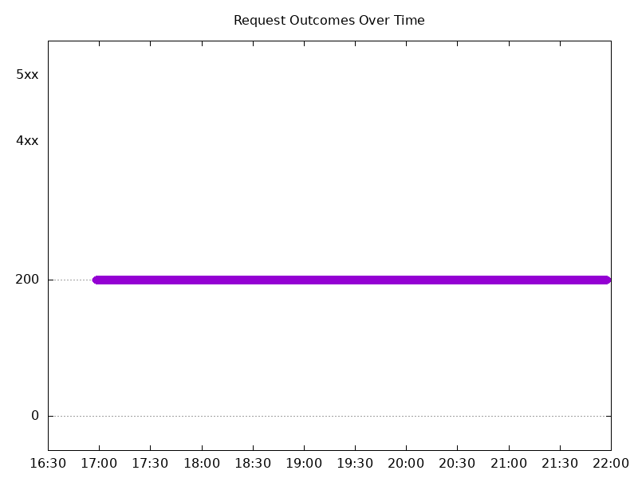

#### Test: Send https /tea traffic

```text
Requests      [total, rate, throughput]         30000, 100.00, 100.00
Duration      [total, attack, wait]             5m0s, 5m0s, 940.998µs
Latencies     [min, mean, 50, 90, 95, 99, max]  407.709µs, 879.135µs, 868.037µs, 1.013ms, 1.072ms, 1.307ms, 15.631ms
Bytes In      [total, mean]                     4596056, 153.20
Bytes Out     [total, mean]                     0, 0.00
Success       [ratio]                           100.00%
Status Codes  [code:count]                      200:30000  
Error Set:
```

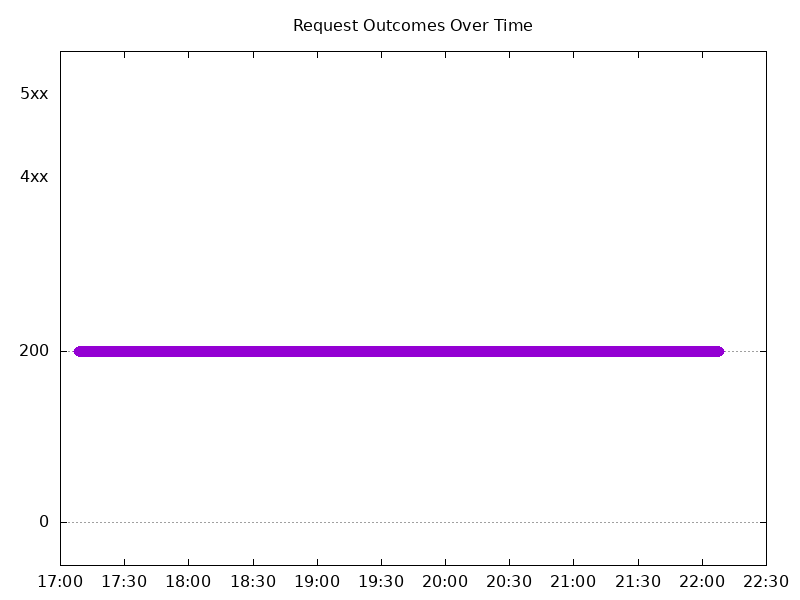

### Scale Down Gradually

#### Test: Send https /tea traffic

```text
Requests      [total, rate, throughput]         48000, 100.00, 100.00
Duration      [total, attack, wait]             8m0s, 8m0s, 844.962µs
Latencies     [min, mean, 50, 90, 95, 99, max]  431.243µs, 868.825µs, 862.718µs, 999.247µs, 1.047ms, 1.282ms, 20.497ms
Bytes In      [total, mean]                     7353477, 153.20
Bytes Out     [total, mean]                     0, 0.00
Success       [ratio]                           100.00%
Status Codes  [code:count]                      200:48000  
Error Set:
```

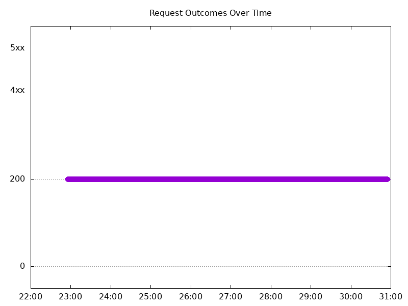

#### Test: Send http /coffee traffic

```text
Requests      [total, rate, throughput]         48000, 100.00, 100.00
Duration      [total, attack, wait]             8m0s, 8m0s, 843.235µs
Latencies     [min, mean, 50, 90, 95, 99, max]  409.573µs, 849.756µs, 849.332µs, 981.346µs, 1.027ms, 1.221ms, 30.406ms
Bytes In      [total, mean]                     7689681, 160.20
Bytes Out     [total, mean]                     0, 0.00
Success       [ratio]                           100.00%
Status Codes  [code:count]                      200:48000  
Error Set:
```


### Scale Up Abruptly

#### Test: Send https /tea traffic

```text
Requests      [total, rate, throughput]         12000, 100.01, 100.01
Duration      [total, attack, wait]             2m0s, 2m0s, 906.685µs
Latencies     [min, mean, 50, 90, 95, 99, max]  453.673µs, 869.007µs, 861.938µs, 1.003ms, 1.056ms, 1.231ms, 5.761ms
Bytes In      [total, mean]                     1838430, 153.20
Bytes Out     [total, mean]                     0, 0.00
Success       [ratio]                           100.00%
Status Codes  [code:count]                      200:12000  
Error Set:
```

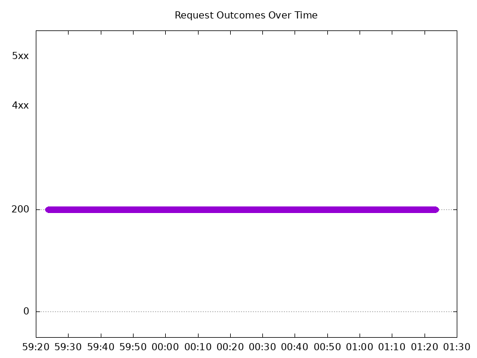

#### Test: Send http /coffee traffic

```text
Requests      [total, rate, throughput]         12000, 100.01, 100.01
Duration      [total, attack, wait]             2m0s, 2m0s, 882.014µs
Latencies     [min, mean, 50, 90, 95, 99, max]  430.388µs, 830.825µs, 832.125µs, 963.768µs, 1.012ms, 1.19ms, 6.501ms
Bytes In      [total, mean]                     1922382, 160.20
Bytes Out     [total, mean]                     0, 0.00
Success       [ratio]                           100.00%
Status Codes  [code:count]                      200:12000  
Error Set:
```

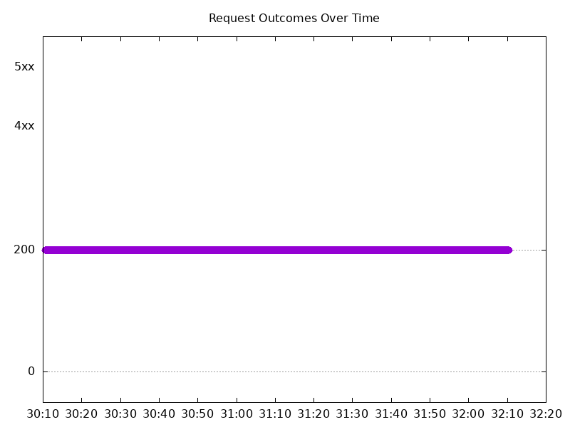

### Scale Down Abruptly

#### Test: Send http /coffee traffic

```text
Requests      [total, rate, throughput]         12000, 100.01, 100.01
Duration      [total, attack, wait]             2m0s, 2m0s, 831.159µs
Latencies     [min, mean, 50, 90, 95, 99, max]  419.465µs, 854.673µs, 852.374µs, 980.628µs, 1.024ms, 1.147ms, 32.764ms
Bytes In      [total, mean]                     1922379, 160.20
Bytes Out     [total, mean]                     0, 0.00
Success       [ratio]                           100.00%
Status Codes  [code:count]                      200:12000  
Error Set:
```


#### Test: Send https /tea traffic

```text
Requests      [total, rate, throughput]         12000, 100.01, 100.01
Duration      [total, attack, wait]             2m0s, 2m0s, 863.989µs
Latencies     [min, mean, 50, 90, 95, 99, max]  470.977µs, 860.697µs, 862.995µs, 990.706µs, 1.033ms, 1.155ms, 5.596ms
Bytes In      [total, mean]                     1838381, 153.20
Bytes Out     [total, mean]                     0, 0.00
Success       [ratio]                           100.00%
Status Codes  [code:count]                      200:12000  
Error Set:
```

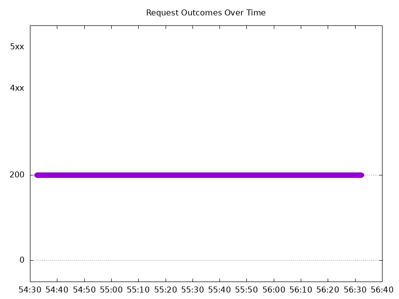

## Multiple NGF Pods run per node Test Results

### Scale Up Gradually

#### Test: Send http /coffee traffic

```text
Requests      [total, rate, throughput]         30000, 100.00, 100.00
Duration      [total, attack, wait]             5m0s, 5m0s, 947.155µs
Latencies     [min, mean, 50, 90, 95, 99, max]  406.282µs, 869.804µs, 862.867µs, 1.001ms, 1.052ms, 1.299ms, 10.681ms
Bytes In      [total, mean]                     4806028, 160.20
Bytes Out     [total, mean]                     0, 0.00
Success       [ratio]                           100.00%
Status Codes  [code:count]                      200:30000  
Error Set:
```

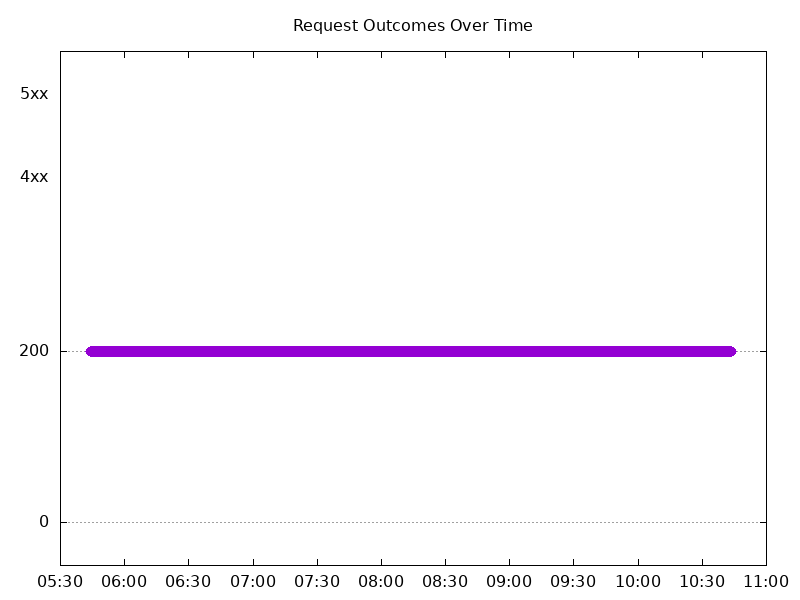

#### Test: Send https /tea traffic

```text
Requests      [total, rate, throughput]         30000, 100.00, 100.00
Duration      [total, attack, wait]             5m0s, 5m0s, 823.446µs
Latencies     [min, mean, 50, 90, 95, 99, max]  422.947µs, 898.151µs, 888.675µs, 1.037ms, 1.091ms, 1.35ms, 14.423ms
Bytes In      [total, mean]                     4596069, 153.20
Bytes Out     [total, mean]                     0, 0.00
Success       [ratio]                           100.00%
Status Codes  [code:count]                      200:30000  
Error Set:
```

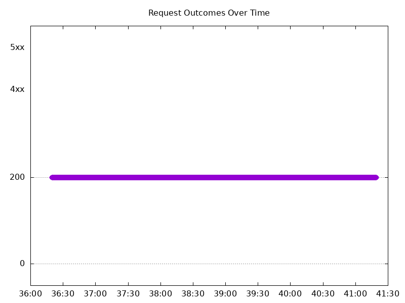

### Scale Down Gradually

#### Test: Send http /coffee traffic

```text
Requests      [total, rate, throughput]         96000, 100.00, 100.00
Duration      [total, attack, wait]             16m0s, 16m0s, 770.75µs
Latencies     [min, mean, 50, 90, 95, 99, max]  402.181µs, 851.672µs, 849.456µs, 984.48µs, 1.035ms, 1.283ms, 10.142ms
Bytes In      [total, mean]                     15379151, 160.20
Bytes Out     [total, mean]                     0, 0.00
Success       [ratio]                           100.00%
Status Codes  [code:count]                      200:96000  
Error Set:
```

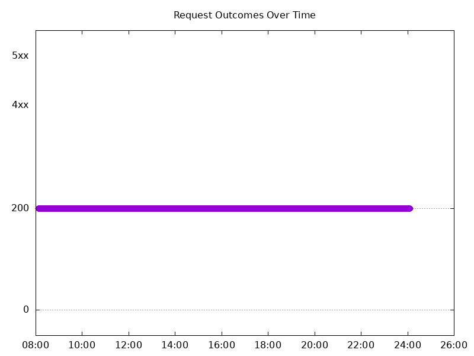

#### Test: Send https /tea traffic

```text
Requests      [total, rate, throughput]         96000, 100.00, 100.00
Duration      [total, attack, wait]             16m0s, 16m0s, 757.854µs
Latencies     [min, mean, 50, 90, 95, 99, max]  427.24µs, 883.453µs, 874.032µs, 1.018ms, 1.073ms, 1.309ms, 30.125ms
Bytes In      [total, mean]                     14707121, 153.20
Bytes Out     [total, mean]                     0, 0.00
Success       [ratio]                           100.00%
Status Codes  [code:count]                      200:96000  
Error Set:
```

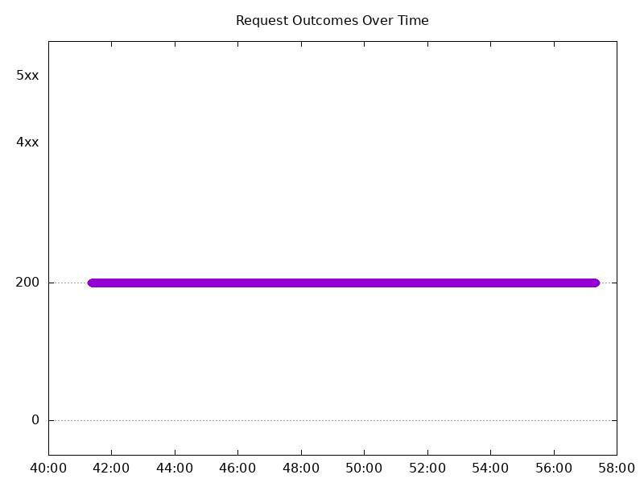

### Scale Up Abruptly

#### Test: Send https /tea traffic

```text
Requests      [total, rate, throughput]         12000, 100.01, 100.01
Duration      [total, attack, wait]             2m0s, 2m0s, 552.744µs
Latencies     [min, mean, 50, 90, 95, 99, max]  430.802µs, 869.475µs, 861.779µs, 1.014ms, 1.069ms, 1.273ms, 6.644ms
Bytes In      [total, mean]                     1838389, 153.20
Bytes Out     [total, mean]                     0, 0.00
Success       [ratio]                           100.00%
Status Codes  [code:count]                      200:12000  
Error Set:
```

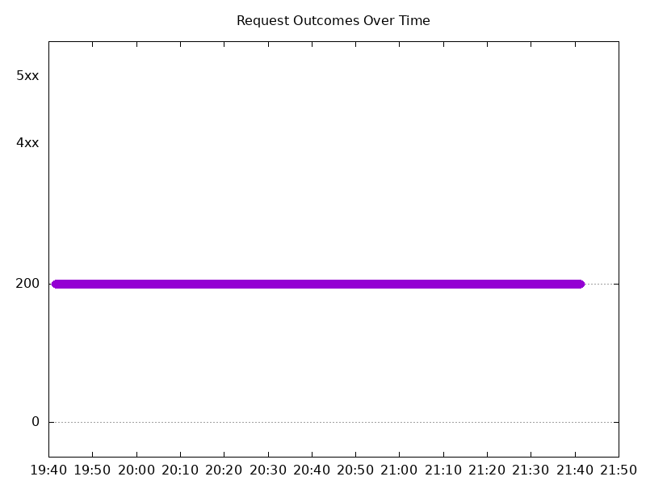

#### Test: Send http /coffee traffic

```text
Requests      [total, rate, throughput]         12000, 100.01, 100.01
Duration      [total, attack, wait]             2m0s, 2m0s, 799.046µs
Latencies     [min, mean, 50, 90, 95, 99, max]  424.551µs, 855.688µs, 851.401µs, 998.213µs, 1.049ms, 1.274ms, 12.006ms
Bytes In      [total, mean]                     1922398, 160.20
Bytes Out     [total, mean]                     0, 0.00
Success       [ratio]                           100.00%
Status Codes  [code:count]                      200:12000  
Error Set:
```

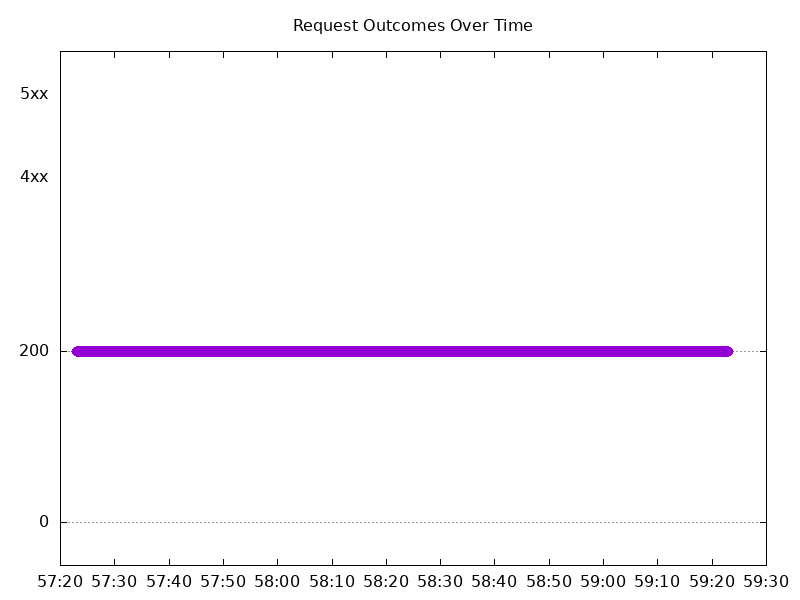

### Scale Down Abruptly

#### Test: Send https /tea traffic

```text
Requests      [total, rate, throughput]         12000, 100.01, 100.01
Duration      [total, attack, wait]             2m0s, 2m0s, 1.237ms
Latencies     [min, mean, 50, 90, 95, 99, max]  436.702µs, 882.972µs, 875.04µs, 1.035ms, 1.09ms, 1.245ms, 8.443ms
Bytes In      [total, mean]                     1838377, 153.20
Bytes Out     [total, mean]                     0, 0.00
Success       [ratio]                           100.00%
Status Codes  [code:count]                      200:12000  
Error Set:
```


#### Test: Send http /coffee traffic

```text
Requests      [total, rate, throughput]         12000, 100.01, 100.01
Duration      [total, attack, wait]             2m0s, 2m0s, 935.283µs
Latencies     [min, mean, 50, 90, 95, 99, max]  451.088µs, 861.016µs, 858.068µs, 1.003ms, 1.052ms, 1.184ms, 28.094ms
Bytes In      [total, mean]                     1922418, 160.20
Bytes Out     [total, mean]                     0, 0.00
Success       [ratio]                           100.00%
Status Codes  [code:count]                      200:12000  
Error Set:
```

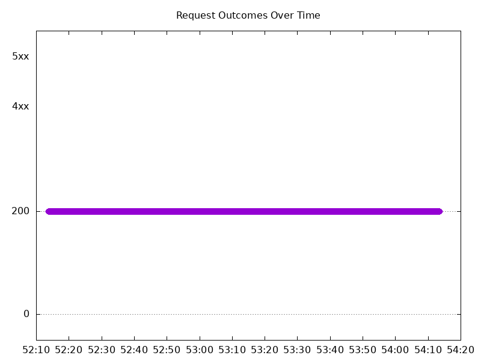

