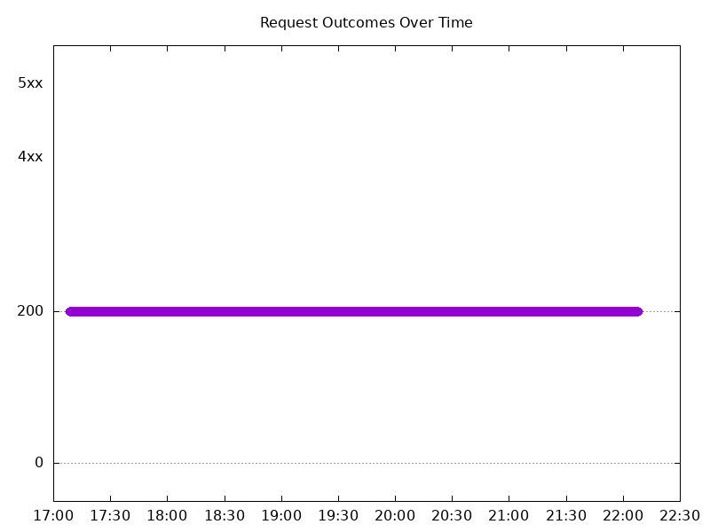
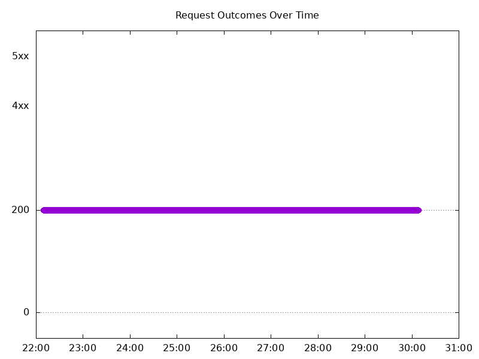
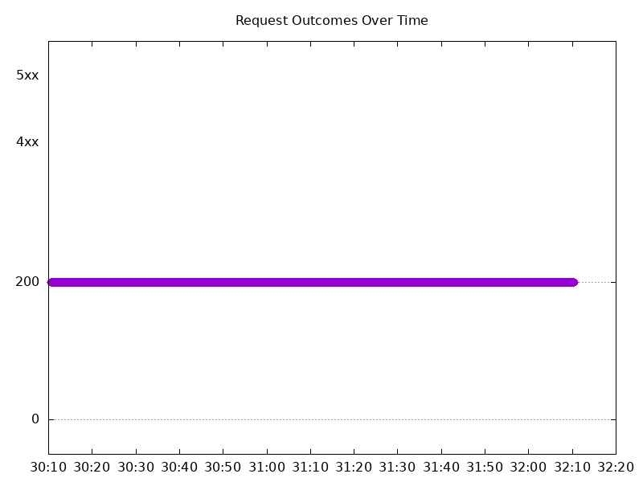
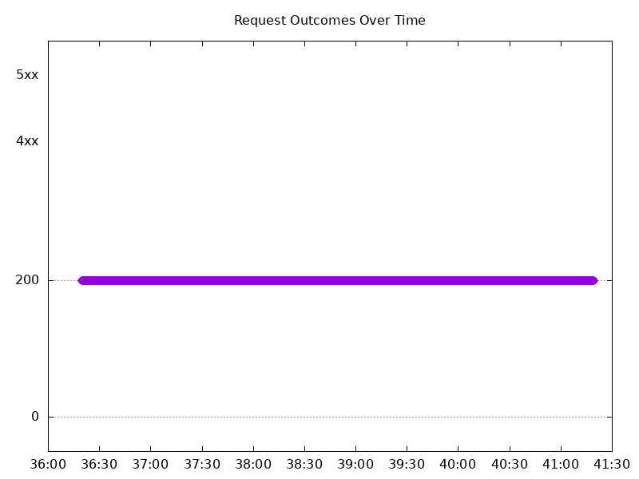
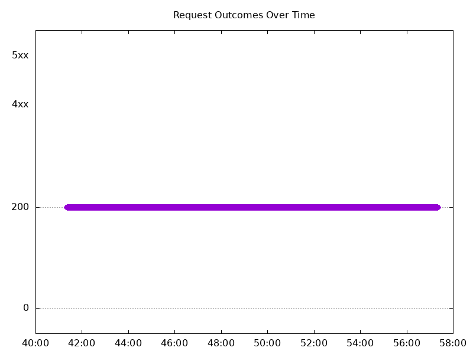
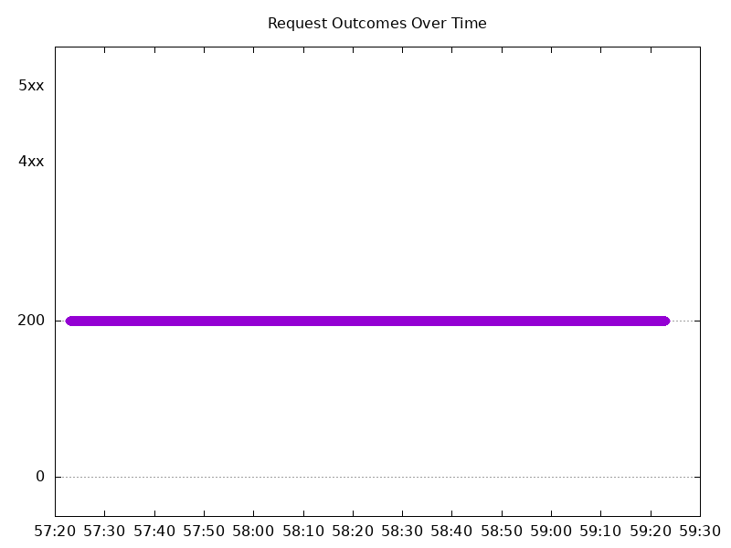
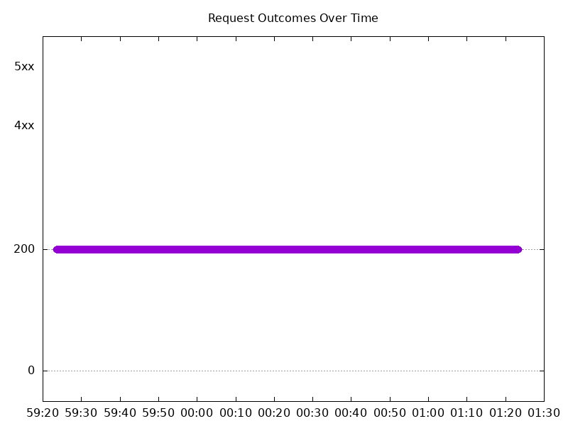

# Results

## Test environment

NGINX Plus: true

NGINX Gateway Fabric:

- Commit: 929413c15af7bee3adb32e103c9d1513a693da16
- Date: 2024-11-28T12:52:45Z
- Dirty: false

GKE Cluster:

- Node count: 12
- k8s version: v1.30.5-gke.1443001
- vCPUs per node: 16
- RAM per node: 65853972Ki
- Max pods per node: 110
- Zone: us-west1-b
- Instance Type: n2d-standard-16

## One NGF Pod runs per node Test Results

### Scale Up Gradually

#### Test: Send http /coffee traffic

```text
Requests      [total, rate, throughput]         30000, 100.00, 100.00
Duration      [total, attack, wait]             5m0s, 5m0s, 486.964µs
Latencies     [min, mean, 50, 90, 95, 99, max]  402.077µs, 850.76µs, 843.14µs, 989.268µs, 1.047ms, 1.338ms, 12.046ms
Bytes In      [total, mean]                     4865873, 162.20
Bytes Out     [total, mean]                     0, 0.00
Success       [ratio]                           100.00%
Status Codes  [code:count]                      200:30000  
Error Set:
```


#### Test: Send https /tea traffic

```text
Requests      [total, rate, throughput]         30000, 100.00, 100.00
Duration      [total, attack, wait]             5m0s, 5m0s, 3.306ms
Latencies     [min, mean, 50, 90, 95, 99, max]  427.446µs, 877.9µs, 863.9µs, 1.019ms, 1.08ms, 1.362ms, 13.752ms
Bytes In      [total, mean]                     4686048, 156.20
Bytes Out     [total, mean]                     0, 0.00
Success       [ratio]                           100.00%
Status Codes  [code:count]                      200:30000  
Error Set:
```



### Scale Down Gradually

#### Test: Send https /tea traffic

```text
Requests      [total, rate, throughput]         48000, 100.00, 100.00
Duration      [total, attack, wait]             8m0s, 8m0s, 762.861µs
Latencies     [min, mean, 50, 90, 95, 99, max]  406.883µs, 860.691µs, 850.614µs, 1.002ms, 1.06ms, 1.28ms, 21.264ms
Bytes In      [total, mean]                     7497533, 156.20
Bytes Out     [total, mean]                     0, 0.00
Success       [ratio]                           100.00%
Status Codes  [code:count]                      200:48000  
Error Set:
```



#### Test: Send http /coffee traffic

```text
Requests      [total, rate, throughput]         48000, 100.00, 100.00
Duration      [total, attack, wait]             8m0s, 8m0s, 846.497µs
Latencies     [min, mean, 50, 90, 95, 99, max]  399.865µs, 824.447µs, 821.99µs, 960.578µs, 1.01ms, 1.258ms, 17.16ms
Bytes In      [total, mean]                     7785507, 162.20
Bytes Out     [total, mean]                     0, 0.00
Success       [ratio]                           100.00%
Status Codes  [code:count]                      200:48000  
Error Set:
```


### Scale Up Abruptly

#### Test: Send https /tea traffic

```text
Requests      [total, rate, throughput]         12000, 100.01, 100.01
Duration      [total, attack, wait]             2m0s, 2m0s, 922.165µs
Latencies     [min, mean, 50, 90, 95, 99, max]  423.162µs, 874.511µs, 868.775µs, 1.021ms, 1.079ms, 1.33ms, 7.243ms
Bytes In      [total, mean]                     1874355, 156.20
Bytes Out     [total, mean]                     0, 0.00
Success       [ratio]                           100.00%
Status Codes  [code:count]                      200:12000  
Error Set:
```


#### Test: Send http /coffee traffic

```text
Requests      [total, rate, throughput]         12000, 100.01, 100.01
Duration      [total, attack, wait]             2m0s, 2m0s, 914.777µs
Latencies     [min, mean, 50, 90, 95, 99, max]  412.494µs, 834.624µs, 831.156µs, 969.007µs, 1.018ms, 1.217ms, 11.696ms
Bytes In      [total, mean]                     1946439, 162.20
Bytes Out     [total, mean]                     0, 0.00
Success       [ratio]                           100.00%
Status Codes  [code:count]                      200:12000  
Error Set:
```



### Scale Down Abruptly

#### Test: Send http /coffee traffic

```text
Requests      [total, rate, throughput]         12000, 100.01, 100.01
Duration      [total, attack, wait]             2m0s, 2m0s, 767.054µs
Latencies     [min, mean, 50, 90, 95, 99, max]  398.784µs, 807.361µs, 806.835µs, 947.519µs, 997.26µs, 1.146ms, 55.075ms
Bytes In      [total, mean]                     1946402, 162.20
Bytes Out     [total, mean]                     0, 0.00
Success       [ratio]                           100.00%
Status Codes  [code:count]                      200:12000  
Error Set:
```


#### Test: Send https /tea traffic

```text
Requests      [total, rate, throughput]         12000, 100.01, 100.01
Duration      [total, attack, wait]             2m0s, 2m0s, 761.092µs
Latencies     [min, mean, 50, 90, 95, 99, max]  427.161µs, 851.784µs, 843.144µs, 1.002ms, 1.065ms, 1.237ms, 35.971ms
Bytes In      [total, mean]                     1874332, 156.19
Bytes Out     [total, mean]                     0, 0.00
Success       [ratio]                           100.00%
Status Codes  [code:count]                      200:12000  
Error Set:
```


## Multiple NGF Pods run per node Test Results

### Scale Up Gradually

#### Test: Send http /coffee traffic

```text
Requests      [total, rate, throughput]         30000, 100.00, 100.00
Duration      [total, attack, wait]             5m0s, 5m0s, 750.938µs
Latencies     [min, mean, 50, 90, 95, 99, max]  433.737µs, 892.229µs, 881.267µs, 1.028ms, 1.087ms, 1.433ms, 12.489ms
Bytes In      [total, mean]                     4865972, 162.20
Bytes Out     [total, mean]                     0, 0.00
Success       [ratio]                           100.00%
Status Codes  [code:count]                      200:30000  
Error Set:
```


#### Test: Send https /tea traffic

```text
Requests      [total, rate, throughput]         30000, 100.00, 100.00
Duration      [total, attack, wait]             5m0s, 5m0s, 889.749µs
Latencies     [min, mean, 50, 90, 95, 99, max]  449.27µs, 920.441µs, 905.389µs, 1.058ms, 1.12ms, 1.467ms, 14.3ms
Bytes In      [total, mean]                     4686028, 156.20
Bytes Out     [total, mean]                     0, 0.00
Success       [ratio]                           100.00%
Status Codes  [code:count]                      200:30000  
Error Set:
```



### Scale Down Gradually

#### Test: Send http /coffee traffic

```text
Requests      [total, rate, throughput]         96000, 100.00, 100.00
Duration      [total, attack, wait]             16m0s, 16m0s, 983.478µs
Latencies     [min, mean, 50, 90, 95, 99, max]  407.45µs, 896.777µs, 884.229µs, 1.029ms, 1.086ms, 1.429ms, 40.565ms
Bytes In      [total, mean]                     15571334, 162.20
Bytes Out     [total, mean]                     0, 0.00
Success       [ratio]                           100.00%
Status Codes  [code:count]                      200:96000  
Error Set:
```


#### Test: Send https /tea traffic

```text
Requests      [total, rate, throughput]         96000, 100.00, 100.00
Duration      [total, attack, wait]             16m0s, 16m0s, 873.341µs
Latencies     [min, mean, 50, 90, 95, 99, max]  433.592µs, 916.781µs, 902.955µs, 1.056ms, 1.116ms, 1.433ms, 22.45ms
Bytes In      [total, mean]                     14995129, 156.20
Bytes Out     [total, mean]                     0, 0.00
Success       [ratio]                           100.00%
Status Codes  [code:count]                      200:96000  
Error Set:
```



### Scale Up Abruptly

#### Test: Send https /tea traffic

```text
Requests      [total, rate, throughput]         12000, 100.01, 100.01
Duration      [total, attack, wait]             2m0s, 2m0s, 1.021ms
Latencies     [min, mean, 50, 90, 95, 99, max]  463.882µs, 896.894µs, 885.317µs, 1.027ms, 1.087ms, 1.296ms, 10.64ms
Bytes In      [total, mean]                     1874323, 156.19
Bytes Out     [total, mean]                     0, 0.00
Success       [ratio]                           100.00%
Status Codes  [code:count]                      200:12000  
Error Set:
```



#### Test: Send http /coffee traffic

```text
Requests      [total, rate, throughput]         12000, 100.01, 100.01
Duration      [total, attack, wait]             2m0s, 2m0s, 863.848µs
Latencies     [min, mean, 50, 90, 95, 99, max]  432.006µs, 871.751µs, 865.883µs, 1.001ms, 1.051ms, 1.29ms, 10.517ms
Bytes In      [total, mean]                     1946424, 162.20
Bytes Out     [total, mean]                     0, 0.00
Success       [ratio]                           100.00%
Status Codes  [code:count]                      200:12000  
Error Set:
```


### Scale Down Abruptly

#### Test: Send http /coffee traffic

```text
Requests      [total, rate, throughput]         12000, 100.01, 100.01
Duration      [total, attack, wait]             2m0s, 2m0s, 854.045µs
Latencies     [min, mean, 50, 90, 95, 99, max]  461.983µs, 876.072µs, 866.038µs, 994.684µs, 1.042ms, 1.183ms, 10.04ms
Bytes In      [total, mean]                     1946440, 162.20
Bytes Out     [total, mean]                     0, 0.00
Success       [ratio]                           100.00%
Status Codes  [code:count]                      200:12000  
Error Set:
```


#### Test: Send https /tea traffic

```text
Requests      [total, rate, throughput]         12000, 100.01, 100.01
Duration      [total, attack, wait]             2m0s, 2m0s, 883.461µs
Latencies     [min, mean, 50, 90, 95, 99, max]  522.014µs, 908.449µs, 892.385µs, 1.026ms, 1.074ms, 1.225ms, 8.873ms
Bytes In      [total, mean]                     1874322, 156.19
Bytes Out     [total, mean]                     0, 0.00
Success       [ratio]                           100.00%
Status Codes  [code:count]                      200:12000  
Error Set:
```


