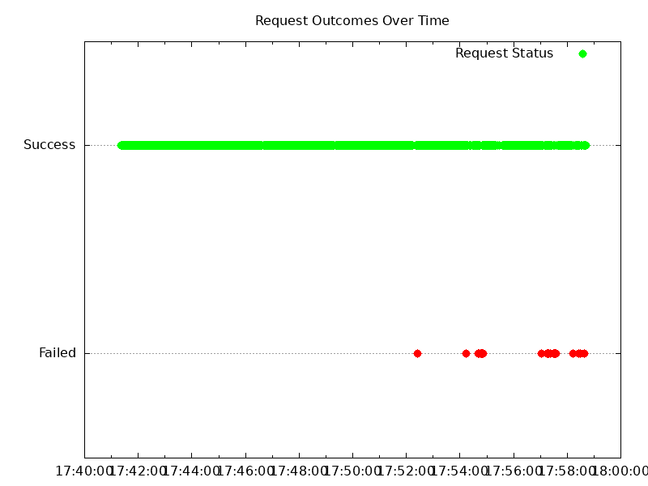
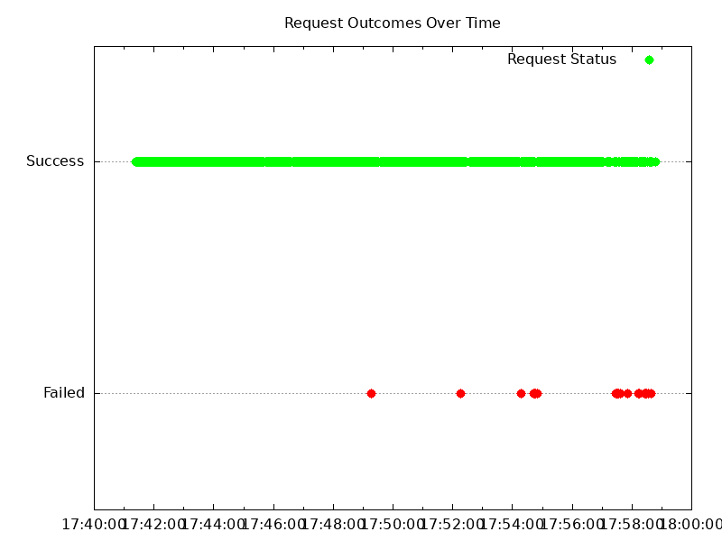
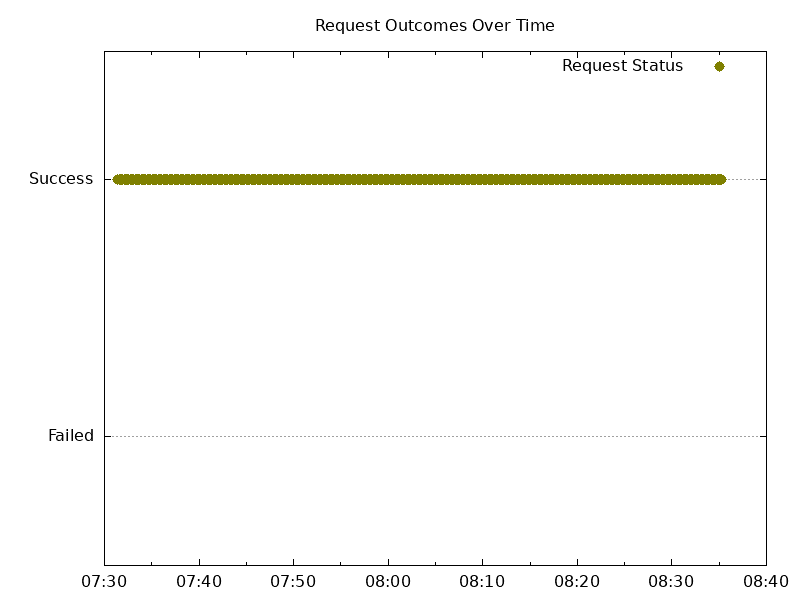
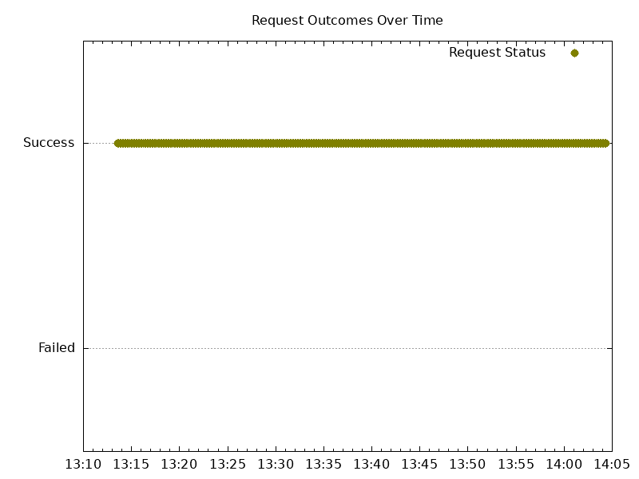
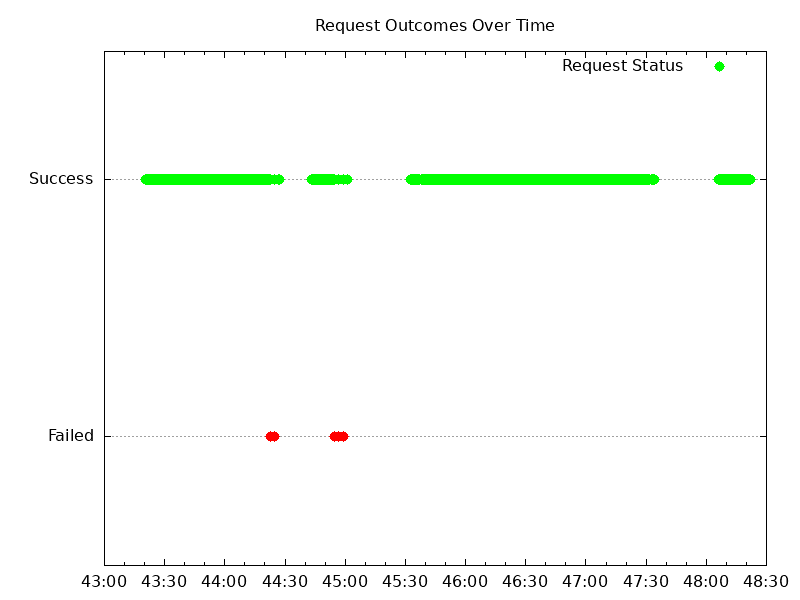
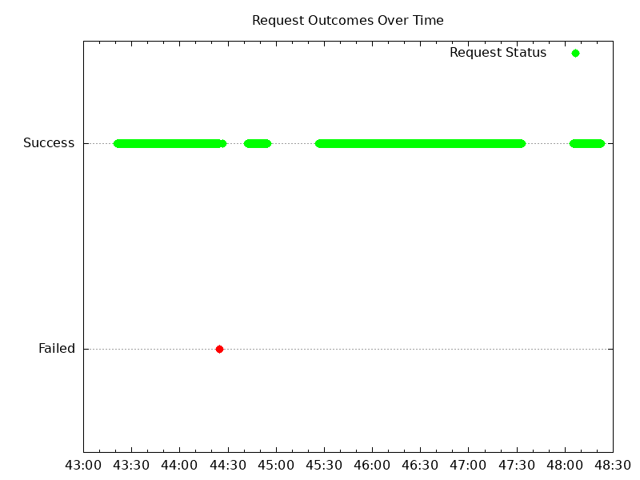
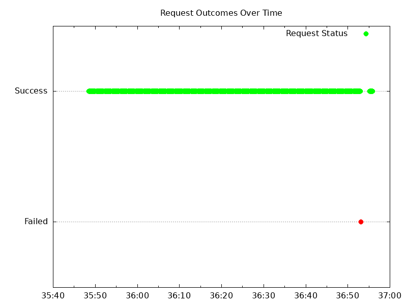

# Results

## Versions

Kubernetes:

```text
Server Version: version.Info{Major:"1", Minor:"27", GitVersion:"v1.27.6-gke.1506000",
GitCommit:"0df9c4d6ac69ad53e985ad9526ca2dad916d6f13", GitTreeState:"clean", BuildDate:"2023-10-04T09:38:18Z",
GoVersion:"go1.20.8 X:boringcrypto", Compiler:"gc", Platform:"linux/amd64"
```

NGF:

```text
"version":"edge",
"commit":"73f8b3a1643c2e9b8ff129aeae1ae48447c7b2d2",
"date":"2023-10-23T17:08:41Z"
```

with NGINX:

```text
nginx version: nginx/1.25.2
built by gcc 12.2.1 20220924 (Alpine 12.2.1_git20220924-r10)
OS: Linux 5.15.109+
```

## Summary

- Clients experience some downtime when scaling NGF gradually up or down.

  This downtime mostly occurs when there are fewer NGF Pods running. I believe this is due to overloading the NGF Pods or
  Kubernetes network by sending too many requests over a long duration of time. In general, when there are more NGF Pods
  running, there are less failed requests.

- NGF Pod readiness flagged (oscillated between ready/not ready) under high load.

  While scaling up/down, some Pods would switch from ready to not ready. The readiness probes were timing out:

  ```text
  Readiness probe failed: Get "http://10.4.0.17:8081/readyz": context deadline exceeded (Client.Timeout exceeded while awaiting headers)
  ```

  This behavior only happened when there was a lot of traffic being sent to the Pods.

- There were some NGINX error and warn logs pertaining to upstreams:

  ```text
  2023/10/24 17:31:43 [warn] 176#176: *358453 upstream server temporarily disabled while connecting to upstream, client: 10.X.X.X:, server: cafe.example.com, request: "GET /tea HTTP/1.1", upstream: "http://10.X.X.X:8080/tea", host: "cafe.example.com"
  2023/10/24 17:31:43 [error] 176#176: *358453 upstream timed out (110: Operation timed out) while connecting to upstream, client: 10.X.X.X, server: cafe.example.com, request: "GET /tea HTTP/1.1", upstream: "http://10.X.X.X:8080/tea", host: "cafe.example.com"
  ```

- There were some 499s in the NGINX logs:

  ```text
  10.168.0.14 - - [24/Oct/2023:17:58:47 +0000] "GET /coffee HTTP/1.1" 499 0 "-" "-"
  ```

  A 499 status code means the client closed the connection. Probably due to wrk and curl closing connections after 60s.

- There were some socket read errors and socket timeouts

- There were no errors in NGF or problems with leader election. The statuses were updated as expected.

Related Issues:

- https://github.com/nginxinc/nginx-gateway-fabric/issues/1185
- https://github.com/nginxinc/nginx-gateway-fabric/issues/1147

## 25 Node Cluster with anti affinity

### Scale Up Gradually

HTTP wrk output:

```text
Running 5m test @ http://cafe.example.com/coffee
  2 threads and 2 connections
  Thread Stats   Avg      Stdev     Max   +/- Stdev
    Latency     5.88ms   59.69ms   1.07s    99.05%
    Req/Sec     1.53k   143.30     1.81k    74.47%
  Latency Distribution
     50%  632.00us
     75%  704.00us
     90%  796.00us
     99%   15.02ms
  788635 requests in 5.00m, 281.73MB read
  Socket errors: connect 0, read 17, write 0, timeout 1
Requests/sec:   2627.93
Transfer/sec:      0.94MB
```

HTTP Graph:


HTTP failure rate: .32%

HTTPS wrk output:

```text
Running 5m test @ https://cafe.example.com/tea
  2 threads and 2 connections
  Thread Stats   Avg      Stdev     Max   +/- Stdev
    Latency     4.25ms   49.55ms   1.06s    99.35%
    Req/Sec     1.45k   130.50     1.76k    75.07%
  Latency Distribution
     50%  660.00us
     75%  735.00us
     90%  831.00us
     99%    2.32ms
  731286 requests in 5.00m, 256.43MB read
  Socket errors: connect 0, read 18, write 0, timeout 1
Requests/sec:   2437.02
Transfer/sec:      0.85MB
```

HTTPS graph:


HTTPS failure rate: .31%

Observations:

- After a minute or so, the oldest Pod switched from Ready -> Not Ready and took ~ 1 min to recover. The following event
  was recorded on the Pod:

  ```text
  Readiness probe failed: Get "http://10.4.0.17:8081/readyz": context deadline exceeded (Client.Timeout exceeded while awaiting headers)
  ````

Logs:

- NGF error logs: none
- NGINX error logs:

  Handful of these errors and warnings:

  ```text
  2023/10/24 17:31:43 [warn] 176#176: *358453 upstream server temporarily disabled while connecting to upstream, client: 10.X.X.X:, server: cafe.example.com, request: "GET /tea HTTP/1.1", upstream: "http://10.X.X.X:8080/tea", host: "cafe.example.com"
  2023/10/24 17:31:43 [error] 176#176: *358453 upstream timed out (110: Operation timed out) while connecting to upstream, client: 10.X.X.X, server: cafe.example.com, request: "GET /tea HTTP/1.1", upstream: "http://10.X.X.X:8080/tea", host: "cafe.example.com"
  ```

- NGINX access logs:
  - 1.5 million 200s

### Scale Down Gradually

HTTP wrk output:

```text
Running 20m test @ http://cafe.example.com/coffee
  2 threads and 2 connections
    Thread Stats   Avg      Stdev     Max   +/- Stdev
    Latency    15.01ms   98.51ms   1.06s    97.53%
    Req/Sec     1.54k   175.82     1.85k    86.64%
  Latency Distribution
     50%  629.00us
     75%  701.00us
     90%  800.00us
     99%  662.41ms
  2548003 requests in 17.44m, 0.89GB read
  Socket errors: connect 0, read 15, write 0, timeout 50
Requests/sec:   2434.36
Transfer/sec:      0.87MB
```

HTTP graph:



HTTP failure rate .26%

HTTPS wrk output:

```text
Running 20m test @ https://cafe.example.com/tea
  2 threads and 2 connections
    Thread Stats   Avg      Stdev     Max   +/- Stdev
    Latency    22.15ms  119.12ms   1.07s    96.38%
    Req/Sec     1.46k   178.46     1.76k    90.82%
  Latency Distribution
     50%  658.00us
     75%  736.00us
     90%    0.86ms
     99%  780.01ms
  2427687 requests in 17.44m, 851.30MB read
  Socket errors: connect 0, read 15, write 0, timeout 53
Requests/sec:   2319.78
Transfer/sec:    832.98KB
```

HTTPs graph:



HTTPS failure rate .27%

Logs:

- NGF logs: none
- NGINX error logs: none
  - NGINX access logs:
    - ~ 5 million 200s
    - non-200s:

      ```text
      10.168.0.14 - - [24/Oct/2023:17:58:47 +0000] "GET /coffee HTTP/1.1" 499 0 "-" "-"
      10.168.0.14 - - [24/Oct/2023:17:58:47 +0000] "GET /coffee HTTP/1.1" 499 0 "-" "-"
      10.168.15.242 - - [24/Oct/2023:17:58:47 +0000] "GET /tea HTTP/1.1" 499 0 "-" "-"
      10.168.15.242 - - [24/Oct/2023:17:58:47 +0000] "GET /tea HTTP/1.1" 499 0 "-" "-"
      10.168.0.14 - - [24/Oct/2023:17:58:48 +0000] "GET /coffee HTTP/1.1" 499 0 "-" "curl/7.74.0"
      10.168.15.242 - - [24/Oct/2023:17:58:49 +0000] "GET /tea HTTP/1.1" 499 0 "-" "curl/7.74.0"
      ```

### Scale Up Abruptly

HTTP wrk output:

```text
Running 5m test @ http://cafe.example.com/coffee
  2 threads and 2 connections
    Thread Stats   Avg      Stdev     Max   +/- Stdev
    Latency   727.66us  289.00us  14.66ms   94.11%
    Req/Sec     1.40k   147.21     1.71k    67.03%
  Latency Distribution
     50%  683.00us
     75%  777.00us
     90%    0.90ms
     99%    1.52ms
  179587 requests in 1.08m, 64.16MB read
Requests/sec:   2779.81
Transfer/sec:      0.99MB
```

HTTP graph:


HTTPS wrk output:

```text
Running 5m test @ https://cafe.example.com/tea
  2 threads and 2 connections
    Thread Stats   Avg      Stdev     Max   +/- Stdev
    Latency   753.61us  356.01us  18.67ms   95.92%
    Req/Sec     1.35k   152.59     1.70k    66.90%
  Latency Distribution
     50%  701.00us
     75%  797.00us
     90%    0.93ms
     99%    1.68ms
  173727 requests in 1.08m, 60.92MB read
  Socket errors: connect 0, read 1, write 0, timeout 0
Requests/sec:   2693.18
Transfer/sec:      0.94MB
```

HTTPS graph:



Logs:

- NGF Logs:
  A few Pods on startup:

  ```text
  {"level":"info", "logger":"controller-runtime.healthz", "msg":"healthz check failed", "statuses":[…], "ts":"2023-10-24T18:07:38Z"}
  {"checker":"readyz", "error":"nginx has not yet become ready to accept traffic", "level":"debug", "logger":"controller-runtime.healthz", "msg":"healthz check failed", "ts":"2023-10-24T18:07:38Z"}
  ```

- NGINX error logs: none
- NGINX access logs:
  - 345,361 200s

### Scale Down Abruptly

HTTP wrk output:

```text
Running 5m test @ http://cafe.example.com/coffee
  2 threads and 2 connections
   Thread Stats   Avg      Stdev     Max   +/- Stdev
    Latency   716.53us  329.20us  17.52ms   95.41%
    Req/Sec     1.43k   163.49     1.79k    72.45%
  Latency Distribution
     50%  667.00us
     75%  756.00us
     90%    0.88ms
     99%    1.64ms
  147442 requests in 0.87m, 52.67MB read
Requests/sec:   2840.70
Transfer/sec:      1.01MB
```

HTTP graph:


HTTPS wrk output:

```text
Running 5m test @ http://cafe.example.com/coffee
  2 threads and 2 connections
   Thread Stats   Avg      Stdev     Max   +/- Stdev
    Latency   716.53us  329.20us  17.52ms   95.41%
    Req/Sec     1.43k   163.49     1.79k    72.45%
  Latency Distribution
     50%  667.00us
     75%  756.00us
     90%    0.88ms
     99%    1.64ms
  147442 requests in 0.87m, 52.67MB read
Requests/sec:   2840.70
Transfer/sec:      1.01MB
```

HTTPS graph:



Logs:

- NGF logs: none
- NGINX error logs: none
- NGINX access logs:
  - 288,528 200s

## 10 Node Cluster

### Scale Up Gradually

HTTP wrk output:

```text
Running 5m test @ http://cafe.example.com/coffee
  2 threads and 2 connections
  Thread Stats   Avg      Stdev     Max   +/- Stdev
    Latency    16.78ms  103.75ms   1.06s    97.23%
    Req/Sec     1.48k   188.11     1.76k    84.22%
  Latency Distribution
     50%  650.00us
     75%  735.00us
     90%    0.87ms
     99%  699.82ms
  570533 requests in 5.00m, 202.95MB read
  Socket errors: connect 0, read 12, write 0, timeout 8
Requests/sec:   1901.16
Transfer/sec:    692.50KB
```

HTTP graph:



HTTP failure rate: .27%

HTTPS wrk output:

```text
Running 5m test @ https://cafe.example.com/tea
  2 threads and 2 connections
  Thread Stats   Avg      Stdev     Max   +/- Stdev
    Latency    11.78ms   86.21ms   1.06s    98.04%
    Req/Sec     1.40k   166.66     1.67k    83.00%
  Latency Distribution
     50%  686.00us
     75%  770.00us
     90%    0.90ms
     99%  550.57ms
  539275 requests in 5.00m, 188.23MB read
  Socket errors: connect 0, read 13, write 0, timeout 8
Requests/sec:   1797.52
Transfer/sec:    642.46KB
```

HTTPS graph:



HTTPS failure rate .058%

Logs:

- NGF error logs: none
- NGINX error/warn logs:

  ```text
  2023/10/24 20:45:22 [warn] 73#73: *22192 upstream server temporarily disabled while connecting to upstream, client: 10.168.0.14, server: cafe.example.com, request: "GET /coffee HTTP/1.1", upstream: "http://10.4.7.23:8080/coffee", host: "cafe.example.com"
  2023/10/24 20:45:22 [error] 73#73: *22192 upstream timed out (110: Operation timed out) while connecting to upstream, client: 10.168.0.14, server: cafe.example.com, request: "GET /coffee HTTP/1.1", upstream: "http://10.4.7.23:8080/coffee", host: "cafe.example.com"
  ```

- NGINX access logs:
  - ~ 1.1 million 200s

### Scale Down Gradually

HTTP wrk output:

```text
Running 20m test @ http://cafe.example.com/coffee
  2 threads and 2 connections
    Thread Stats   Avg      Stdev     Max   +/- Stdev
    Latency    37.38ms  154.32ms   1.07s    94.19%
    Req/Sec     1.43k   220.22     1.76k    94.12%
  Latency Distribution
     50%  677.00us
     75%  774.00us
     90%    1.01ms
     99%  884.78ms
  2214652 requests in 18.11m, 787.79MB read
  Socket errors: connect 0, read 11, write 0, timeout 80
Requests/sec:   2037.83
Transfer/sec:    742.29KB
```

HTTP graph:


HTTP failure rate: .33%

HTTPS wrk output:

```text
Running 20m test @ https://cafe.example.com/tea
  2 threads and 2 connections
    Thread Stats   Avg      Stdev     Max   +/- Stdev
    Latency    32.18ms  143.46ms   1.07s    94.92%
    Req/Sec     1.37k   204.70     1.69k    93.17%
  Latency Distribution
     50%  704.00us
     75%  799.00us
     90%    1.00ms
     99%  860.65ms
  2044060 requests in 18.21m, 713.46MB read
  Socket errors: connect 0, read 10, write 0, timeout 72
Requests/sec:   1871.22
Transfer/sec:    668.81KB
```

HTTPS graph:


HTTPS failure rate: .32%

Logs:

- NGF error logs: none
- NGINX error/warn logs:

  1 warn/error about upstreams:

  ```text
  2023/10/24 21:24:39 [warn] 220#220: *423560 upstream server temporarily disabled while connecting to upstream, client: 10.168.15.242, server: cafe.example.com, request: "GET /tea HTTP/1.1", upstream: "http://10.4.8.19:8080/tea", host: "cafe.example.com"
  2023/10/24 21:24:39 [error] 220#220: *423560 upstream timed out (110: Operation timed out) while connecting to upstream, client: 10.168.15.242, server: cafe.example.com, request: "GET /tea HTTP/1.1", upstream: "http://10.4.8.19:8080/tea", host: "cafe.example.com"
  ```

- NGINX access logs:
  - ~ 4.2 million 200 access logs
  - Six 499 `"10.168.15.242 - - [24/Oct/2023:21:25:46 +0000] "GET /tea HTTP/1.1" 499 0 "-" "-""` access logs

### Scale Up Abruptly

HTTP wrk output:

```text
Running 2m test @ http://cafe.example.com/coffee
  2 threads and 2 connections
    Thread Stats   Avg      Stdev     Max   +/- Stdev
    Latency   763.68us  407.46us  14.86ms   94.97%
    Req/Sec     1.35k   204.97     1.75k    65.94%
  Latency Distribution
     50%  696.00us
     75%  809.00us
     90%    0.98ms
     99%    2.15ms
  166835 requests in 1.17m, 59.35MB read
  Socket errors: connect 0, read 1, write 0, timeout 0
Requests/sec:   2382.56
Transfer/sec:    867.86KB
```

HTTP graph:


HTTPS wrk output:

```text
Running 2m test @ https://cafe.example.com/tea
  2 threads and 2 connections
    Thread Stats   Avg      Stdev     Max   +/- Stdev
    Latency   809.93us  418.96us  14.59ms   94.57%
    Req/Sec     1.27k   199.48     1.65k    65.71%
  Latency Distribution
     50%  737.00us
     75%    0.86ms
     90%    1.04ms
     99%    2.29ms
  158085 requests in 1.19m, 55.18MB read
Requests/sec:   2222.64
Transfer/sec:    794.41KB
```

HTTPS graph:



HTTPS failure rate: .2%

Logs:

- NGF error logs: none
- NGINX error/warn logs: none
- NGINX access logs:
  - 325,991 200s
  - Six 499 `"10.168.15.242 - - [24/Oct/2023:21:37:02 +0000] "GET /tea HTTP/1.1" 499 0 "-" "curl/7.74.0"` access logs

### Scale Down Abruptly

HTTP wrk output:

```text
Running 2m test @ http://cafe.example.com/coffee
  2 threads and 2 connections
    Thread Stats   Avg      Stdev     Max   +/- Stdev
    Latency   751.88us  419.68us  19.80ms   95.77%
    Req/Sec     1.36k   199.90     1.75k    72.37%
  Latency Distribution
     50%  686.00us
     75%  795.00us
     90%    0.96ms
     99%    2.07ms
  146833 requests in 1.31m, 52.23MB read
Requests/sec:   1871.67
Transfer/sec:    681.76KB
```

HTTP graph:


HTTP failure rate: 2.31%

HTTPS wrk output:

```text
Running 2m test @ https://cafe.example.com/tea
  2 threads and 2 connections
    Thread Stats   Avg      Stdev     Max   +/- Stdev
    Latency   796.95us  443.82us  19.88ms   95.80%
    Req/Sec     1.28k   182.54     1.68k    73.64%
  Latency Distribution
     50%  727.00us
     75%  841.00us
     90%    1.01ms
     99%    2.24ms
  136681 requests in 1.31m, 47.71MB read
Requests/sec:   1742.16
Transfer/sec:    622.68KB
```

HTTPS graph:


HTTPS failure rate: 2.81%

Logs:

- NGF error logs: none
- NGINX error/warn logs: none
- NGINX access logs:
  - 284,376 200s
  - Four 499s `10.168.15.242 - - [24/Oct/2023:21:42:04 +0000] "GET /tea HTTP/1.1" 499 0 "-" "-"`

Observations:

- The last Pod flapped but probably because of all the traffic

  ```text
  Warning  Unhealthy  14s (x18 over 32s)  kubelet            Readiness probe failed: Get "http://10.4.9.22:8081/readyz": context deadline exceeded (Client.Timeout exceeded while awaiting headers)
  Warning  Unhealthy  13s                 kubelet            Readiness probe failed: Get "http://10.4.9.22:8081/readyz": dial tcp 10.4.9.22:8081: i/o timeout (Client.Timeout exceeded while awaiting headers)
  ```

- It took a bit of time to become leader and update the status
