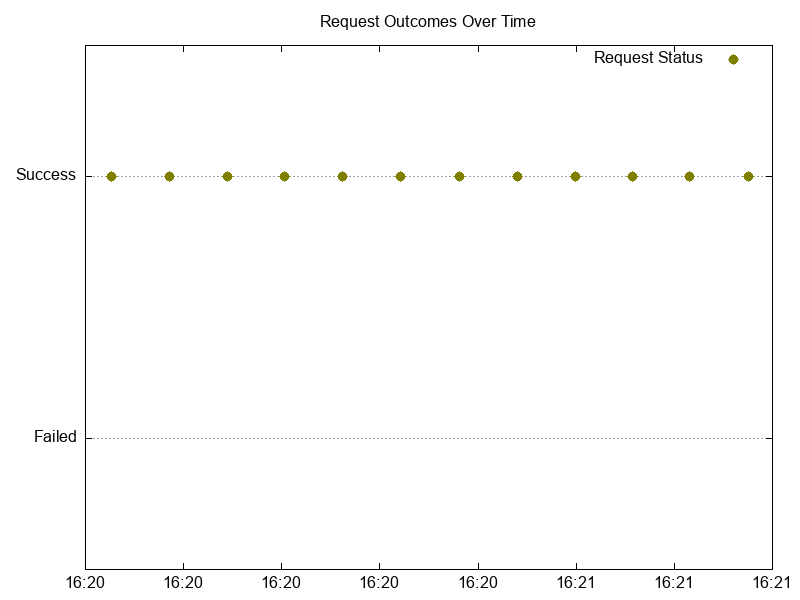
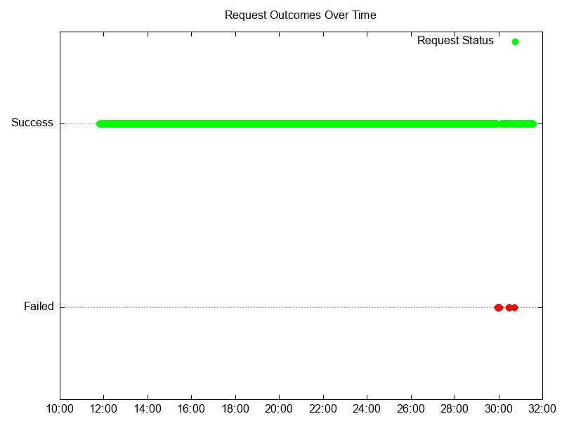
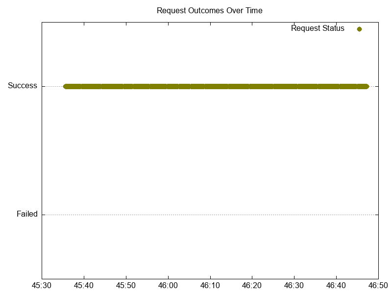
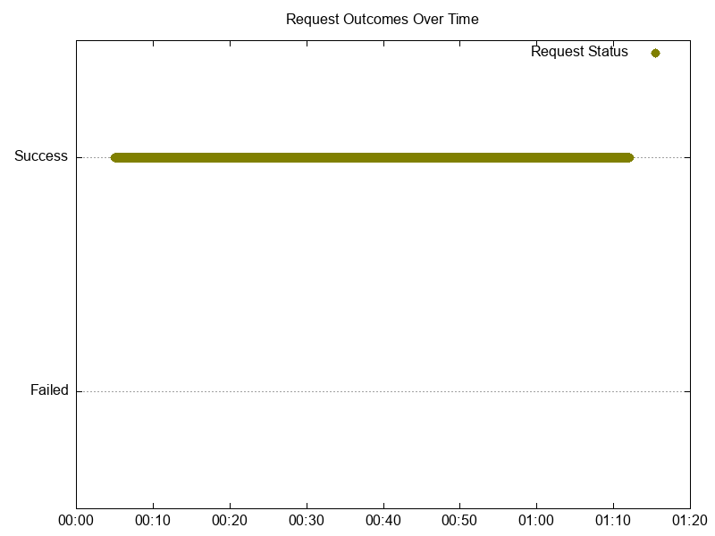
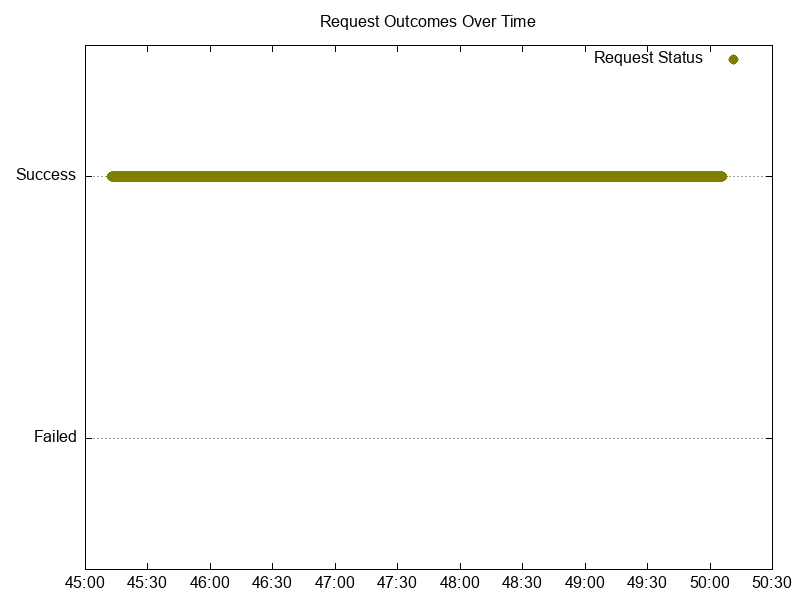
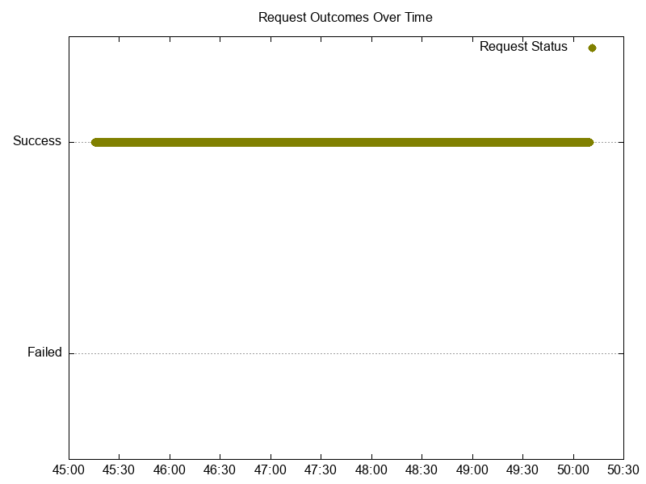
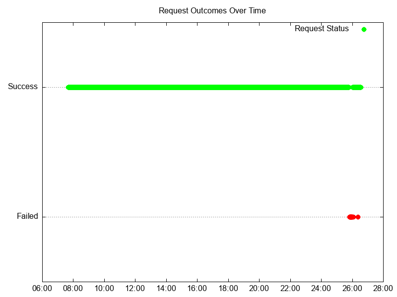

# Results

## Versions

Kubernetes:

```text
Server Version: version.Info{Major:"1", Minor:"27", GitVersion:"v1.27.8-gke.1067004", GitCommit:"6f460c12ad45abb234c18ec4f0ea335a1203c415", GitTreeState:"clean", BuildDate:"2024-01-04T22:48:32Z", GoVersion:"go1.20.11 X:boringcrypto", Compiler:"gc", Platform:"linux/amd64"}
```

NGF:

```text
"version":"edge"
"commit":"5b9f37c6556388e28d2cd168810b728cca4c0e46"
"date":"2024-03-19T20:53:54Z"
```

with NGINX:

```text
nginx version: nginx/1.25.4
Built by gcc 12.2.1 20220924 (Alpine 12.2.1_git20220924-r10)
OS: Linux 5.15.133+
```

## Summary

Results are similar with 1.1.0 test results. Noticed some spikes in NGF log errors when downgrading the number of replicas from 25 to 1 related to telemetry. Further investigating might be needed.

Added a new issue related to telemetry collection failure when scaling down NGF

- https://github.com/nginxinc/nginx-gateway-fabric/issues/1738

## 10 Node Cluster Test Results


### Scale Up Gradually

HTTP wrk output

```text
wrk -t2 -c2 -d5m --latency --timeout 2s  http://cafe.example.com/coffee
Running 5m test @ http://cafe.example.com/coffee
  2 threads and 2 connections
  Thread Stats   Avg      Stdev     Max   +/- Stdev
    Latency     1.50ms  773.48us  34.14ms   92.03%
    Req/Sec   687.59    106.56     0.97k    70.74%
  Latency Distribution
     50%    1.37ms
     75%    1.67ms
     90%    2.06ms
     99%    4.20ms
  351750 requests in 4.28m, 125.39MB read
  Socket errors: connect 0, read 16, write 0, timeout 0
Requests/sec:   1368.69
Transfer/sec:    499.62KB
```

HTTP Graph:


HTTPS wrk output

```text
wrk -t2 -c2 -d5m --latency --timeout 2s  https://cafe.example.com/tea
Running 5m test @ https://cafe.example.com/tea
  2 threads and 2 connections
  Thread Stats   Avg      Stdev     Max   +/- Stdev
    Latency     1.60ms  769.01us  36.29ms   92.22%
    Req/Sec   641.09     97.84     0.96k    70.71%
  Latency Distribution
     50%    1.47ms
     75%    1.77ms
     90%    2.16ms
     99%    4.27ms
  328759 requests in 4.29m, 114.88MB read
  Socket errors: connect 0, read 16, write 0, timeout 0
Requests/sec:   1276.21
Transfer/sec:    456.64KB
```

HTTPS Graph:



Logs:

- NGF error logs: none
- NGINX error/warn logs: none
- NGINX access logs
  - 842986 [200 Oks]
  - One 499 `INFO 2024-03-19T21:28:15.266352183Z [resource.labels.containerName: nginx] 10.150.0.27 - - [19/Mar/2024:21:28:15 +0000] "GET /tea HTTP/1.1" 499 0 "-" "-"`


### Scale Down Gradually

HTTP wrk output

```text
wrk -t2 -c2 -d20m --latency --timeout 2s  http://cafe.example.com/coffee
Running 20m test @ http://cafe.example.com/coffee
  2 threads and 2 connections
  Thread Stats   Avg      Stdev     Max   +/- Stdev
    Latency     8.99ms   71.48ms   1.07s    98.65%
    Req/Sec   704.32     82.44     0.95k    74.78%
  Latency Distribution
     50%    1.35ms
     75%    1.63ms
     90%    2.03ms
     99%  326.29ms
  1603461 requests in 19.81m, 570.38MB read
  Socket errors: connect 0, read 21, write 0, timeout 10
Requests/sec:   1349.02
Transfer/sec:    491.38KB
```

HTTP Graph


HTPPS wrk output

```text
wrk -t2 -c2 -d20m --latency --timeout 2s  https://cafe.example.com/tea
Running 20m test @ https://cafe.example.com/tea
  2 threads and 2 connections
  Thread Stats   Avg      Stdev     Max   +/- Stdev
    Latency     7.13ms   61.54ms   1.07s    98.98%
    Req/Sec   661.77     77.50     0.90k    75.68%
  Latency Distribution
     50%    1.43ms
     75%    1.73ms
     90%    2.13ms
     99%   85.50ms
  1500047 requests in 19.75m, 523.58MB read
  Socket errors: connect 0, read 27, write 0, timeout 12
Requests/sec:   1265.79
Transfer/sec:    452.41KB
```

HTTPS Graph



Logs:

- NGF error logs: 25

All or most errors were related to failure collecting telemetry. The below error occurred 25 times.

```text
{"error":"failed to collect cluster information: failed to get NodeList: Get "https://10.119.32.1:443/api/v1/nodes?timeout=10s": context canceled", "level":"error", "logger":"telemetryJob", "msg":"Failed to collect telemetry data", "stacktrace":"github.com/nginxinc/nginx-gateway-fabric/internal/mode/static.createTelemetryJob.CreateTelemetryJobWorker.func4
	/home/runner/work/nginx-gateway-fabric/nginx-gateway-fabric/internal/mode/static/telemetry/job_worker.go:29
k8s.io/apimachinery/pkg/util/wait.JitterUntilWithContext.func1
	pkg/mod/k8s.io/apimachinery@v0.29.3/pkg/util/wait/backoff.go:259
k8s.io/apimachinery/pkg/util/wait.BackoffUntil.func1
	pkg/mod/k8s.io/apimachinery@v0.29.3/pkg/util/wait/backoff.go:226
k8s.io/apimachinery/pkg/util/wait.BackoffUntil
	pkg/mod/k8s.io/apimachinery@v0.29.3/pkg/util/wait/backoff.go:227
k8s.io/apimachinery/pkg/util/wait.JitterUntil
	pkg/mod/k8s.io/apimachinery@v0.29.3/pkg/util/wait/backoff.go:204
k8s.io/apimachinery/pkg/util/wait.JitterUntilWithContext
	pkg/mod/k8s.io/apimachinery@v0.29.3/pkg/util/wait/backoff.go:259
github.com/nginxinc/nginx-gateway-fabric/internal/framework/runnables.(*CronJob).Start
	/home/runner/work/nginx-gateway-fabric/nginx-gateway-fabric/internal/framework/runnables/cronjob.go:53
sigs.k8s.io/controller-runtime/pkg/manager.(*runnableGroup).reconcile.func1
	pkg/mod/sigs.k8s.io/controller-runtime@v0.17.2/pkg/manager/runnable_group.go:223", "ts":"2024-03-20T16:56:30Z"}
```

- NGINX error/warn logs: none
- NGINX access logs:
  - 3.06 million 200s


### Scale Up Abruptly

HTTP wrk output

```text
wrk -t2 -c2 -d2m --latency --timeout 2s  http://cafe.example.com/coffee
Running 2m test @ http://cafe.example.com/coffee
  2 threads and 2 connections
  Thread Stats   Avg      Stdev     Max   +/- Stdev
    Latency     1.52ms    1.00ms  42.25ms   94.80%
    Req/Sec   693.39    100.35     0.94k    70.54%
  Latency Distribution
     50%    1.35ms
     75%    1.64ms
     90%    2.08ms
     99%    5.19ms
  165726 requests in 2.00m, 58.95MB read
  Socket errors: connect 0, read 2, write 0, timeout 0
Requests/sec:   1380.12
Transfer/sec:    502.71KB
```

HTTP Graph


HTTPS wrk output

```text
wrk -t2 -c2 -d2m --latency --timeout 2s  https://cafe.example.com/tea
Running 2m test @ https://cafe.example.com/tea
  2 threads and 2 connections
  Thread Stats   Avg      Stdev     Max   +/- Stdev
    Latency     1.60ms    0.95ms  31.53ms   93.64%
    Req/Sec   651.71     93.73     0.88k    69.42%
  Latency Distribution
     50%    1.43ms
     75%    1.74ms
     90%    2.20ms
     99%    5.14ms
  155793 requests in 2.00m, 54.38MB read
Requests/sec:   1297.29
Transfer/sec:    463.67KB
```

HTTPS Graph



Logs:

- NGF error logs - none
- NGINX error/warn logs - none
- NGINX access logs
  - 24289 200s


### Scale Down Abruptly


HTTP wrk output

```text
wrk -t2 -c2 -d2m --latency --timeout 2s  http://cafe.example.com/coffee
Running 2m test @ http://cafe.example.com/coffee
  2 threads and 2 connections
  Thread Stats   Avg      Stdev     Max   +/- Stdev
    Latency     1.60ms    1.00ms  34.67ms   94.04%
    Req/Sec   653.17    105.34     0.95k    73.63%
  Latency Distribution
     50%    1.41ms
     75%    1.75ms
     90%    2.23ms
     99%    5.61ms
  138169 requests in 2.00m, 49.15MB read
Requests/sec:   1150.52
Transfer/sec:    419.08KB
```

HTTP graph



HTTPS wrk output

```text
wrk -t2 -c2 -d2m --latency --timeout 2s  https://cafe.example.com/tea
Running 2m test @ https://cafe.example.com/tea
  2 threads and 2 connections
  Thread Stats   Avg      Stdev     Max   +/- Stdev
    Latency     1.70ms    1.07ms  41.66ms   94.23%
    Req/Sec   612.48     95.98     0.96k    76.40%
  Latency Distribution
     50%    1.50ms
     75%    1.86ms
     90%    2.37ms
     99%    5.68ms
  126165 requests in 2.00m, 44.04MB read
Requests/sec:   1051.24
Transfer/sec:    375.73KB
```

HTTPS graph


Logs

- NGINX error/warn logs - none
- NGF error logs - 25

All errors were related to failure collecting telemetry. The below error occurred 25 times.

```text
{"error":"failed to collect cluster information: failed to get NodeList: Get "https://10.119.32.1:443/api/v1/nodes?timeout=10s": context canceled", "level":"error", "logger":"telemetryJob", "msg":"Failed to collect telemetry data", "stacktrace":"github.com/nginxinc/nginx-gateway-fabric/internal/mode/static.createTelemetryJob.CreateTelemetryJobWorker.func4
	/home/runner/work/nginx-gateway-fabric/nginx-gateway-fabric/internal/mode/static/telemetry/job_worker.go:29
k8s.io/apimachinery/pkg/util/wait.JitterUntilWithContext.func1
	pkg/mod/k8s.io/apimachinery@v0.29.3/pkg/util/wait/backoff.go:259
k8s.io/apimachinery/pkg/util/wait.BackoffUntil.func1
	pkg/mod/k8s.io/apimachinery@v0.29.3/pkg/util/wait/backoff.go:226
k8s.io/apimachinery/pkg/util/wait.BackoffUntil
	pkg/mod/k8s.io/apimachinery@v0.29.3/pkg/util/wait/backoff.go:227
k8s.io/apimachinery/pkg/util/wait.JitterUntil
	pkg/mod/k8s.io/apimachinery@v0.29.3/pkg/util/wait/backoff.go:204
k8s.io/apimachinery/pkg/util/wait.JitterUntilWithContext
	pkg/mod/k8s.io/apimachinery@v0.29.3/pkg/util/wait/backoff.go:259
github.com/nginxinc/nginx-gateway-fabric/internal/framework/runnables.(*CronJob).Start
	/home/runner/work/nginx-gateway-fabric/nginx-gateway-fabric/internal/framework/runnables/cronjob.go:53
sigs.k8s.io/controller-runtime/pkg/manager.(*runnableGroup).reconcile.func1
	pkg/mod/sigs.k8s.io/controller-runtime@v0.17.2/pkg/manager/runnable_group.go:223", "ts":"2024-03-20T16:56:30Z"}
```

- NGINX access logs
  - 265 K 200s
  - Four 499

```text
INFO 2024-03-20T03:02:03.477744939Z [resource.labels.containerName: nginx] 10.150.0.26 - - [20/Mar/2024:03:02:03 +0000] "GET /coffee HTTP/1.1" 499 0 "-" "-"
INFO 2024-03-20T03:02:03.477834719Z [resource.labels.containerName: nginx] 10.150.0.26 - - [20/Mar/2024:03:02:03 +0000] "GET /coffee HTTP/1.1" 499 0 "-" "-"
10.150.0.27 - - [20/Mar/2024:03:02:06 +0000] "GET /tea HTTP/1.1" 499 0 "-" "-"
10.150.0.27 - - [20/Mar/2024:03:02:06 +0000] "GET /tea HTTP/1.1" 499 0 "-" "-"
```


## 25 Node Cluster Test Results


### Scale up gradually

HTTP wrk output

```text
wrk -t2 -c2 -d5m --latency --timeout 2s  http://cafe.example.com/coffee
Running 5m test @ http://cafe.example.com/coffee
  2 threads and 2 connections
  Thread Stats   Avg      Stdev     Max   +/- Stdev
    Latency     1.47ms  697.26us  45.93ms   91.30%
    Req/Sec   695.91     96.01     0.96k    70.37%
  Latency Distribution
     50%    1.37ms
     75%    1.65ms
     90%    1.99ms
     99%    3.68ms
  415650 requests in 5.00m, 148.17MB read
  Socket errors: connect 0, read 15, write 0, timeout 0
Requests/sec:   1385.14
Transfer/sec:    505.62KB
```


HTTP graph




HTTPS wrk output

```text
wrk -t2 -c2 -d5m --latency --timeout 2s  https://cafe.example.com/tea
Running 5m test @ https://cafe.example.com/tea
  2 threads and 2 connections
  Thread Stats   Avg      Stdev     Max   +/- Stdev
    Latency     1.57ms  674.38us  29.21ms   89.90%
    Req/Sec   651.41     93.81     0.92k    67.69%
  Latency Distribution
     50%    1.45ms
     75%    1.75ms
     90%    2.11ms
     99%    3.93ms
  386578 requests in 4.97m, 135.08MB read
  Socket errors: connect 0, read 14, write 0, timeout 0
Requests/sec:   1296.69
Transfer/sec:    463.96KB
```


HTTPS graph



Logs

- NGF error logs - none
- NGINX error/warn logs - none
- NGINX Access Logs:
  - 260K 200s
  - Zero 499s


### Scale down gradually


HTTP wrk output

```text
wrk -t2 -c2 -d20m --latency --timeout 2s  http://cafe.example.com/coffee
Running 20m test @ http://cafe.example.com/coffee
  2 threads and 2 connections
  Thread Stats   Avg      Stdev     Max   +/- Stdev
    Latency     5.63ms   53.03ms   1.06s    99.24%
    Req/Sec   673.05     87.81     0.97k    72.66%
  Latency Distribution
     50%    1.42ms
     75%    1.71ms
     90%    2.07ms
     99%    6.44ms
  1480823 requests in 18.87m, 527.88MB read
  Socket errors: connect 0, read 19, write 2, timeout 5
Requests/sec:   1307.77
Transfer/sec:    477.38KB
```

HTTP graph


HTTPS wrk output

```text
wrk -t2 -c2 -d20m --latency --timeout 2s  https://cafe.example.com/tea
Running 20m test @ https://cafe.example.com/tea
  2 threads and 2 connections
  Thread Stats   Avg      Stdev     Max   +/- Stdev
    Latency     5.73ms   53.29ms   1.07s    99.24%
    Req/Sec   639.25     88.03     0.96k    71.21%
  Latency Distribution
     50%    1.49ms
     75%    1.79ms
     90%    2.17ms
     99%    6.47ms
  1402055 requests in 18.88m, 489.91MB read
  Socket errors: connect 0, read 18, write 0, timeout 8
Requests/sec:   1237.80
Transfer/sec:    442.90KB
```

HTTPS graph


Logs

- NGF error logs - 25
- NGINX error/warn logs - none
- NGINX Access Logs:
  - 3.7 million 200s
  - Four 499s

```text
10.150.0.26 - - [20/Mar/2024:16:26:29 +0000] "GET /coffee HTTP/1.1" 499 0 "-" "-"
10.150.0.26 - - [20/Mar/2024:16:26:29 +0000] "GET /coffee HTTP/1.1" 499 0 "-" "-"
10.150.0.26 - - [20/Mar/2024:16:26:29 +0000] "GET /coffee HTTP/1.1" 499 0 "-" "-"
10.150.0.27 - - [20/Mar/2024:16:26:31 +0000] "GET /tea HTTP/1.1" 499 0 "-" "-"
```


### Scale up abruptly

HTTP wrk output

```text
 wrk -t2 -c2 -d2m --latency --timeout 2s  http://cafe.example.com/coffee
Running 2m test @ http://cafe.example.com/coffee
  2 threads and 2 connections
  Thread Stats   Avg      Stdev     Max   +/- Stdev
    Latency     1.59ms  827.86us  24.57ms   92.30%
    Req/Sec   651.66    109.00     0.97k    71.96%
  Latency Distribution
     50%    1.45ms
     75%    1.76ms
     90%    2.17ms
     99%    4.68ms
  155782 requests in 2.00m, 55.53MB read
Requests/sec:   1297.24
Transfer/sec:    473.54KB
```

HTTP Graph



HTTPS wrk output

```text
wrk -t2 -c2 -d2m --latency --timeout 2s  https://cafe.example.com/tea
Running 2m test @ https://cafe.example.com/tea
  2 threads and 2 connections
  Thread Stats   Avg      Stdev     Max   +/- Stdev
    Latency     3.86ms   39.67ms   1.06s    99.59%
    Req/Sec   640.00    110.00     0.94k    71.55%
  Latency Distribution
     50%    1.47ms
     75%    1.79ms
     90%    2.23ms
     99%    6.24ms
  152404 requests in 2.00m, 53.25MB read
Requests/sec:   1269.04
Transfer/sec:    454.07KB
```

HTTP Graph


Logs

- NGF error logs - none
- NGINX error/warn logs - none
- NGINX Access Logs:
  - 309K 200s


### Scale down abruptly

HTTP wrk output

```text
wrk -t2 -c2 -d2m --latency --timeout 2s  http://cafe.example.com/coffee
Running 2m test @ http://cafe.example.com/coffee
  2 threads and 2 connections
  Thread Stats   Avg      Stdev     Max   +/- Stdev
    Latency     1.63ms    0.94ms  37.11ms   93.21%
    Req/Sec   634.30    100.40     0.96k    78.64%
  Latency Distribution
     50%    1.47ms
     75%    1.81ms
     90%    2.27ms
     99%    4.74ms
  126662 requests in 2.00m, 45.15MB read
  Socket errors: connect 0, read 0, write 0, timeout 2
Requests/sec:   1055.32
Transfer/sec:    385.23KB
```


HTTP Graph


HTTPS wrk output

```text
wrk -t2 -c2 -d2m --latency --timeout 2s  https://cafe.example.com/tea
Running 2m test @ https://cafe.example.com/tea
  2 threads and 2 connections
  Thread Stats   Avg      Stdev     Max   +/- Stdev
    Latency     1.70ms    0.97ms  36.95ms   93.59%
    Req/Sec   603.54     96.80     0.90k    77.44%
  Latency Distribution
     50%    1.53ms
     75%    1.89ms
     90%    2.37ms
     99%    4.74ms
  118369 requests in 2.00m, 41.36MB read
  Socket errors: connect 0, read 2, write 0, timeout 2
Requests/sec:    986.21
Transfer/sec:    352.87KB
```


HTTPS Graph


Logs

- NGF error logs - 25

All errors were related to failure collecting telemetry. The below error occurred 25 times.

```text
{"error":"failed to collect cluster information: failed to get NodeList: Get "https://10.119.32.1:443/api/v1/nodes?timeout=10s": context canceled", "level":"error", "logger":"telemetryJob", "msg":"Failed to collect telemetry data", "stacktrace":"github.com/nginxinc/nginx-gateway-fabric/internal/mode/static.createTelemetryJob.CreateTelemetryJobWorker.func4
	/home/runner/work/nginx-gateway-fabric/nginx-gateway-fabric/internal/mode/static/telemetry/job_worker.go:29
k8s.io/apimachinery/pkg/util/wait.JitterUntilWithContext.func1
	pkg/mod/k8s.io/apimachinery@v0.29.3/pkg/util/wait/backoff.go:259
k8s.io/apimachinery/pkg/util/wait.BackoffUntil.func1
	pkg/mod/k8s.io/apimachinery@v0.29.3/pkg/util/wait/backoff.go:226
k8s.io/apimachinery/pkg/util/wait.BackoffUntil
	pkg/mod/k8s.io/apimachinery@v0.29.3/pkg/util/wait/backoff.go:227
k8s.io/apimachinery/pkg/util/wait.JitterUntil
	pkg/mod/k8s.io/apimachinery@v0.29.3/pkg/util/wait/backoff.go:204
k8s.io/apimachinery/pkg/util/wait.JitterUntilWithContext
	pkg/mod/k8s.io/apimachinery@v0.29.3/pkg/util/wait/backoff.go:259
github.com/nginxinc/nginx-gateway-fabric/internal/framework/runnables.(*CronJob).Start
	/home/runner/work/nginx-gateway-fabric/nginx-gateway-fabric/internal/framework/runnables/cronjob.go:53
sigs.k8s.io/controller-runtime/pkg/manager.(*runnableGroup).reconcile.func1
	pkg/mod/sigs.k8s.io/controller-runtime@v0.17.2/pkg/manager/runnable_group.go:223", "ts":"2024-03-20T16:56:30Z"}
```

- NGINX error/warn logs - none
- NGINX Access Logs:
  - 246K 200s
  - Four 499s

```text
10.150.0.26 - - [20/Mar/2024:16:57:40 +0000] "GET /coffee HTTP/1.1" 499 0 "-" "-"
10.150.0.26 - - [20/Mar/2024:16:57:40 +0000] "GET /coffee HTTP/1.1" 499 0 "-" "-"
10.150.0.27 - - [20/Mar/2024:16:57:42 +0000] "GET /tea HTTP/1.1" 499 0 "-" "-"
10.150.0.27 - - [20/Mar/2024:16:57:42 +0000] "GET /tea HTTP/1.1" 499 0 "-" "-"
```
