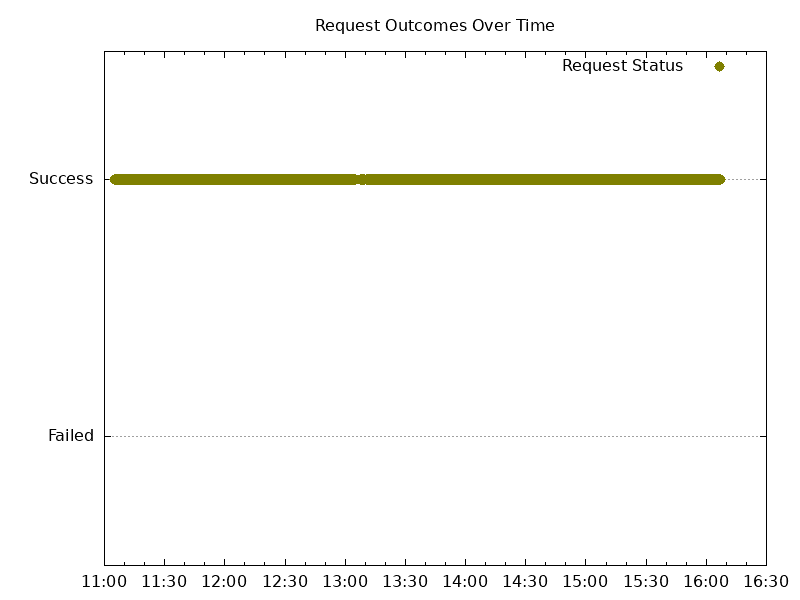
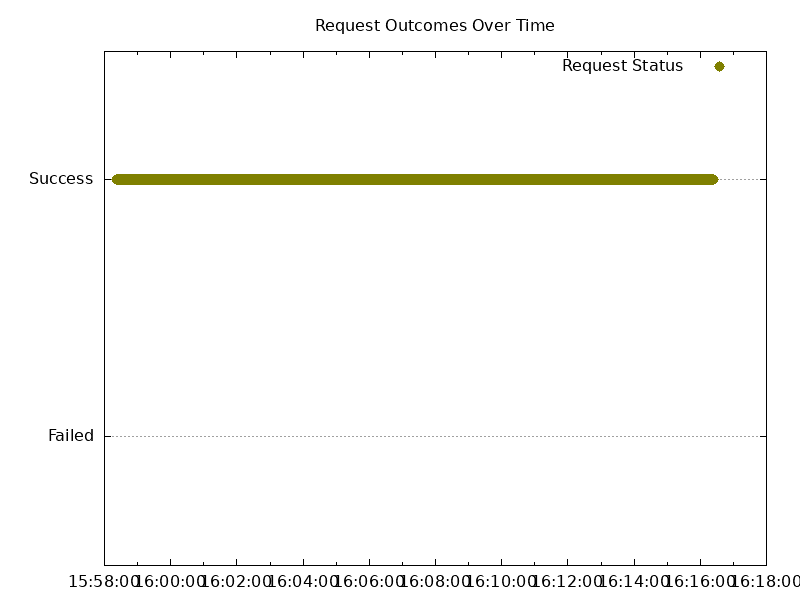
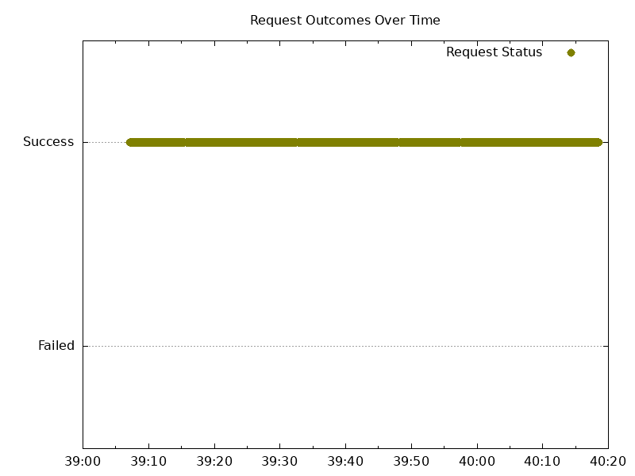
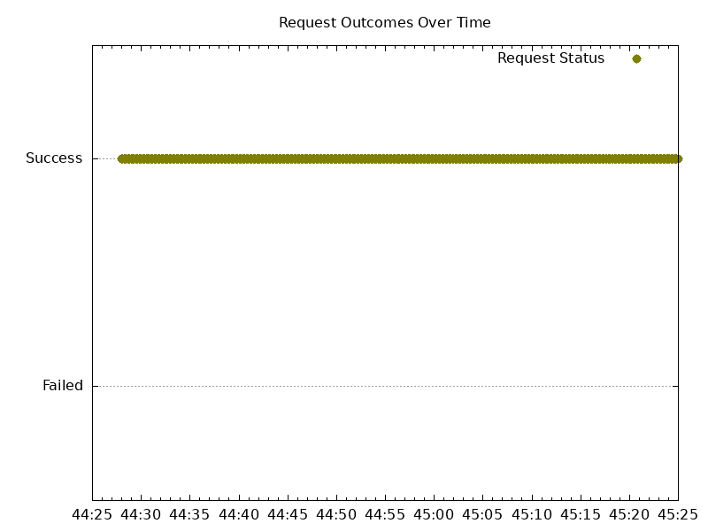
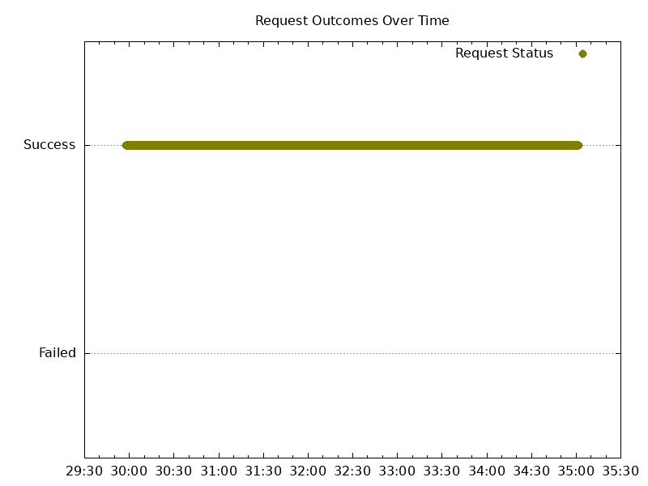
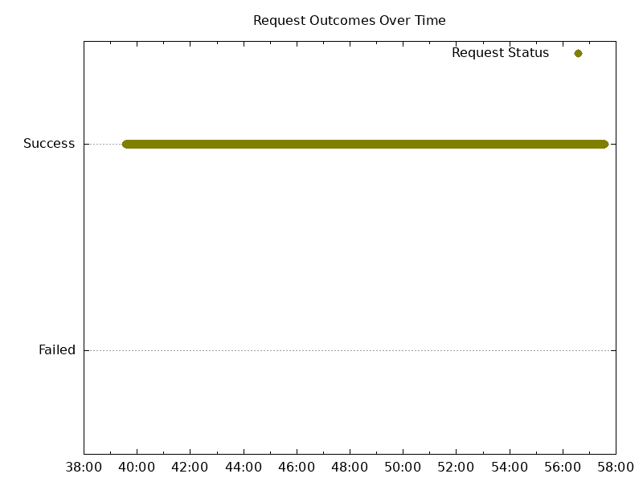
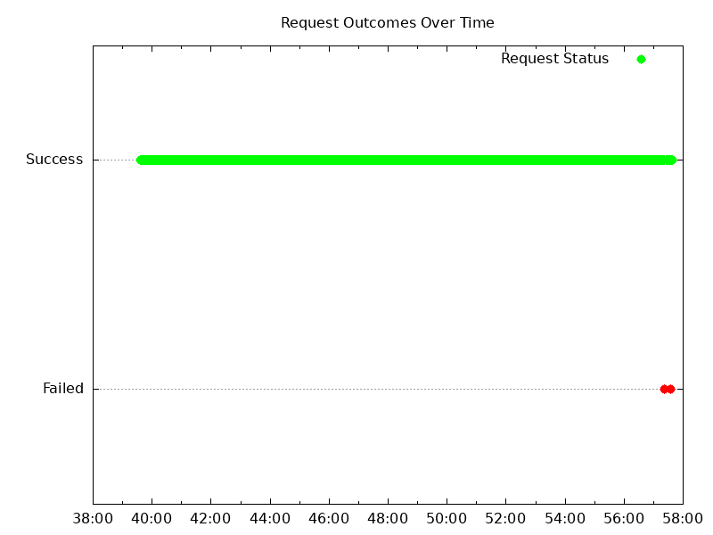
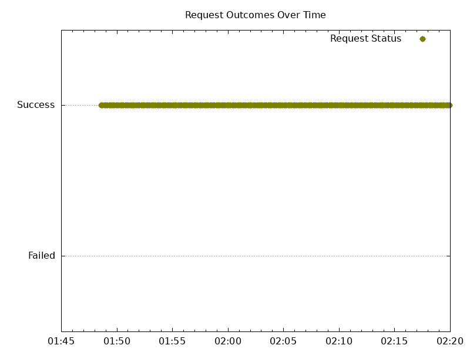
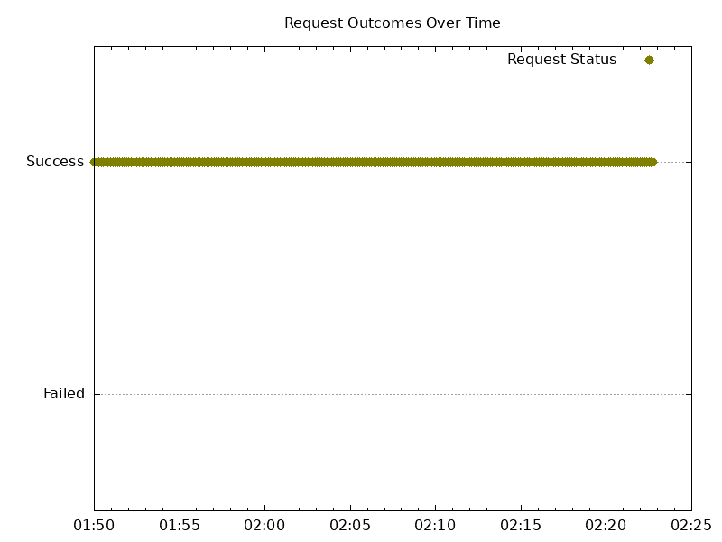
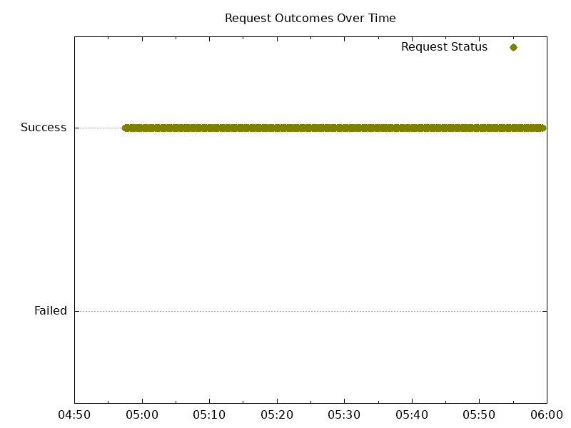

# Results

## Versions

Kubernetes:

```text
Client Version: v1.30.1
Kustomize Version: v5.0.4-0.20230601165947-6ce0bf390ce3
Server Version: v1.29.4-gke.1043002
```

NGF:

```text
"version":"edge"
"commit":"01a18c674f4536dc10614a380b09b5852cb60da7"
"date":"2024-06-05T05:05:16Z"
```

with NGINX:

```text
nginx version: nginx/1.27.0
Built by gcc 13.2.1 20231014 (Alpine 13.2.1_git20231014)
OS: Linux 6.1.75+
```

## Summary

Overall results look similar if not slightly better than the last release. Fewer errors and 499s. No issues that stood out.

## 10 Node Cluster Test Results

### Scale Up Gradually

HTTP wrk output

```text
Running 5m test @ http://cafe.example.com/coffee
  2 threads and 2 connections
  Thread Stats   Avg      Stdev     Max   +/- Stdev
    Latency     1.37ms    1.35ms  44.28ms   95.23%
    Req/Sec   819.80    149.21     1.15k    72.05%
  Latency Distribution
     50%    1.08ms
     75%    1.34ms
     90%    1.87ms
     99%    7.03ms
  478239 requests in 5.00m, 170.57MB read
  Socket errors: connect 0, read 15, write 0, timeout 2
Requests/sec:   1594.08
Transfer/sec:    582.20KB
```

HTTP Graph:


HTTPS wrk output

```text
Running 5m test @ https://cafe.example.com/tea
  2 threads and 2 connections
  Thread Stats   Avg      Stdev     Max   +/- Stdev
    Latency     4.67ms   46.75ms   1.03s    99.39%
    Req/Sec   775.67    145.97     1.07k    71.80%
  Latency Distribution
     50%    1.14ms
     75%    1.42ms
     90%    2.01ms
     99%   11.23ms
  452924 requests in 5.00m, 158.52MB read
  Socket errors: connect 0, read 12, write 0, timeout 2
Requests/sec:   1509.38
Transfer/sec:    540.95KB
```

HTTPS Graph:



Logs:

- NGF error logs: none
- NGINX error/warn logs: none
- NGINX access logs: no non-200s

### Scale Down Gradually

HTTP wrk output

```text
Running 20m test @ http://cafe.example.com/coffee
  2 threads and 2 connections
  Thread Stats   Avg      Stdev     Max   +/- Stdev
    Latency     5.87ms   17.66ms 171.38ms   93.47%
    Req/Sec   714.83    222.68     1.10k    73.79%
  Latency Distribution
     50%    1.16ms
     75%    1.57ms
     90%    4.39ms
     99%   97.87ms
  1528604 requests in 17.99m, 545.21MB read
  Socket errors: connect 0, read 13, write 0, timeout 0
Requests/sec:   1416.05
Transfer/sec:    517.18KB
```

HTTP Graph


HTPPS wrk output

```text
Running 20m test @ https://cafe.example.com/tea
  2 threads and 2 connections
  Thread Stats   Avg      Stdev     Max   +/- Stdev
    Latency     5.64ms   17.05ms 163.03ms   93.78%
    Req/Sec   684.32    211.48     1.05k    73.99%
  Latency Distribution
     50%    1.21ms
     75%    1.62ms
     90%    4.03ms
     99%   96.45ms
  1466003 requests in 18.02m, 513.09MB read
  Socket errors: connect 0, read 11, write 0, timeout 0
Requests/sec:   1356.14
Transfer/sec:    486.03KB
```

HTTPS Graph



Logs:

- NGF error logs: none
- NGINX error/warn logs: none
- NGINX access logs: no non-200s

### Scale Up Abruptly

HTTP wrk output

```text
Running 2m test @ http://cafe.example.com/coffee
  2 threads and 2 connections
  Thread Stats   Avg      Stdev     Max   +/- Stdev
    Latency     2.35ms    3.51ms  95.23ms   95.57%
    Req/Sec   538.34    167.36     1.04k    73.13%
  Latency Distribution
     50%    1.62ms
     75%    2.29ms
     90%    3.47ms
     99%   16.64ms
  83019 requests in 1.29m, 29.61MB read
  Socket errors: connect 0, read 1, write 0, timeout 0
Requests/sec:   1071.66
Transfer/sec:    391.40KB
```

HTTP Graph



HTTPS wrk output

```text
Running 2m test @ https://cafe.example.com/tea
  2 threads and 2 connections
  Thread Stats   Avg      Stdev     Max   +/- Stdev
    Latency     2.36ms    3.40ms  94.47ms   95.47%
    Req/Sec   526.63    169.05     0.99k    72.82%
  Latency Distribution
     50%    1.64ms
     75%    2.34ms
     90%    3.55ms
     99%   15.61ms
  82986 requests in 1.32m, 29.04MB read
  Socket errors: connect 0, read 2, write 0, timeout 0
Requests/sec:   1048.20
Transfer/sec:    375.67KB
```

HTTPS Graph


Logs:

- NGF error log: none
- NGINX error/warn logs: none
- NGINX access logs: no non-200s

### Scale Down Abruptly


HTTP wrk output

```text
Running 2m test @ http://cafe.example.com/coffee
  2 threads and 2 connections
  Thread Stats   Avg      Stdev     Max   +/- Stdev
    Latency     1.72ms    2.79ms  66.43ms   96.12%
    Req/Sec   737.43    204.19     1.09k    67.93%
  Latency Distribution
     50%    1.15ms
     75%    1.56ms
     90%    2.38ms
     99%   12.61ms
  83138 requests in 0.94m, 29.65MB read
  Socket errors: connect 0, read 1, write 0, timeout 0
Requests/sec:   1467.65
Transfer/sec:    536.03KB
```

HTTP graph



HTTPS wrk output

```text
Running 2m test @ https://cafe.example.com/tea
  2 threads and 2 connections
  Thread Stats   Avg      Stdev     Max   +/- Stdev
    Latency     1.78ms    2.85ms  96.98ms   96.36%
    Req/Sec   695.97    189.01     1.03k    65.14%
  Latency Distribution
     50%    1.23ms
     75%    1.64ms
     90%    2.47ms
     99%   12.24ms
  80139 requests in 0.96m, 28.05MB read
  Socket errors: connect 0, read 2, write 0, timeout 0
Requests/sec:   1385.48
Transfer/sec:    496.55KB
```

HTTPS graph


Logs

- NGF error log: none
- NGINX error/warn logs: none
- NGINX access logs: no non-200s

## 25 Node Cluster Test Results

### Scale Up Gradually

HTTP wrk output

```text
Running 5m test @ http://cafe.example.com/coffee
  2 threads and 2 connections
  Thread Stats   Avg      Stdev     Max   +/- Stdev
    Latency     1.25ms    1.05ms  37.63ms   95.83%
    Req/Sec     0.87k   155.89     1.15k    74.39%
  Latency Distribution
     50%    1.05ms
     75%    1.24ms
     90%    1.62ms
     99%    5.18ms
  518856 requests in 5.00m, 184.91MB read
  Socket errors: connect 0, read 18, write 0, timeout 0
Requests/sec:   1729.10
Transfer/sec:    631.01KB
```

HTTP Graph:



HTTPS wrk output

```text
Running 5m test @ https://cafe.example.com/tea
  2 threads and 2 connections
  Thread Stats   Avg      Stdev     Max   +/- Stdev
    Latency     1.33ms    1.19ms  67.50ms   96.26%
    Req/Sec   811.60    142.05     1.07k    76.84%
  Latency Distribution
     50%    1.12ms
     75%    1.32ms
     90%    1.70ms
     99%    5.34ms
  484699 requests in 5.00m, 169.36MB read
  Socket errors: connect 0, read 8, write 0, timeout 0
Requests/sec:   1615.20
Transfer/sec:    577.93KB
```

HTTPS Graph:


Logs:

- NGF error logs: none
- NGINX error/warn logs: none
- NGINX access logs: no non-200s

### Scale Down Gradually

HTTP wrk output

```text
Running 20m test @ http://cafe.example.com/coffee
  2 threads and 2 connections
  Thread Stats   Avg      Stdev     Max   +/- Stdev
    Latency     2.87ms   33.46ms   1.06s    99.69%
    Req/Sec     0.88k   134.20     1.17k    74.31%
  Latency Distribution
     50%    1.05ms
     75%    1.23ms
     90%    1.55ms
     99%    5.99ms
  1867249 requests in 18.00m, 665.46MB read
  Socket errors: connect 0, read 14, write 0, timeout 2
Requests/sec:   1728.65
Transfer/sec:    630.84KB
```

HTTP Graph




HTPPS wrk output

```text
Running 20m test @ https://cafe.example.com/tea
  2 threads and 2 connections
  Thread Stats   Avg      Stdev     Max   +/- Stdev
    Latency     3.15ms   35.52ms   1.07s    99.65%
    Req/Sec   820.50    121.93     1.07k    74.48%
  Latency Distribution
     50%    1.12ms
     75%    1.31ms
     90%    1.65ms
     99%    6.22ms
  1749986 requests in 18.02m, 611.48MB read
  Socket errors: connect 0, read 11, write 0, timeout 2
Requests/sec:   1618.17
Transfer/sec:    579.00KB
```

HTTPS Graph



Logs:

- NGF error logs:
    1 error: ```{"error":"leader election lost", "level":"error", "msg":"error received after stop sequence was engaged", "stacktrace":"sigs.k8s.io/controller-runtime/pkg/manager.(*controllerManager).engageStopProcedure.func1
	pkg/mod/sigs.k8s.io/controller-runtime@v0.18.3/pkg/manager/internal.go:499", "ts":"2024-06-05T17:55:20Z"}```
- NGINX error/warn logs: none
- NGINX access logs: 2 499s when accessing tea over HTTPS

### Scale Up Abruptly

HTTP wrk output

```text
Running 2m test @ http://cafe.example.com/coffee
  2 threads and 2 connections
  Thread Stats   Avg      Stdev     Max   +/- Stdev
    Latency     1.84ms    1.51ms  36.50ms   93.84%
    Req/Sec   596.46    156.20     1.03k    74.51%
  Latency Distribution
     50%    1.50ms
     75%    1.99ms
     90%    2.76ms
     99%    8.02ms
  36590 requests in 30.82s, 13.04MB read
  Socket errors: connect 0, read 1, write 0, timeout 0
Requests/sec:   1187.24
Transfer/sec:    433.27KB
```

HTTP Graph



HTTPS wrk output

```text
Running 2m test @ https://cafe.example.com/tea
  2 threads and 2 connections
  Thread Stats   Avg      Stdev     Max   +/- Stdev
    Latency     1.88ms    1.78ms  49.07ms   95.13%
    Req/Sec   588.31    158.25     0.99k    70.50%
  Latency Distribution
     50%    1.51ms
     75%    2.02ms
     90%    2.76ms
     99%    8.65ms
  37739 requests in 32.22s, 13.19MB read
Requests/sec:   1171.20
Transfer/sec:    419.06KB
```

HTTPS Graph



Logs:

- NGF error log: none
- NGINX error/warn logs: none
- NGINX access logs: no non-200s

### Scale Down Abruptly


HTTP wrk output

```text
Running 2m test @ http://cafe.example.com/coffee
  2 threads and 2 connections
  Thread Stats   Avg      Stdev     Max   +/- Stdev
    Latency     1.51ms    1.30ms  55.34ms   94.11%
    Req/Sec   722.71    201.09     1.15k    62.09%
  Latency Distribution
     50%    1.18ms
     75%    1.62ms
     90%    2.31ms
     99%    6.27ms
  88110 requests in 1.02m, 31.40MB read
  Socket errors: connect 0, read 1, write 0, timeout 0
Requests/sec:   1438.52
Transfer/sec:    524.97KB
```

HTTP graph



HTTPS wrk output

```text
Running 2m test @ https://cafe.example.com/tea
  2 threads and 2 connections
  Thread Stats   Avg      Stdev     Max   +/- Stdev
    Latency     1.57ms    1.11ms  36.38ms   92.86%
    Req/Sec   683.88    178.63     1.05k    64.72%
  Latency Distribution
     50%    1.26ms
     75%    1.69ms
     90%    2.38ms
     99%    6.18ms
  88825 requests in 1.09m, 31.04MB read
  Socket errors: connect 0, read 1, write 0, timeout 0
Requests/sec:   1361.17
Transfer/sec:    487.04KB
```

HTTPS graph


Logs

- NGF error logs:
    1 error: ```{"error":"leader election lost", "level":"error", "msg":"error received after stop sequence was engaged", "stacktrace":"sigs.k8s.io/controller-runtime/pkg/manager.(*controllerManager).engageStopProcedure.func1
	pkg/mod/sigs.k8s.io/controller-runtime@v0.18.3/pkg/manager/internal.go:499", "ts":"2024-06-05T18:05:43Z"}```
- NGINX error/warn logs: none
- NGINX access logs: no non-200s
