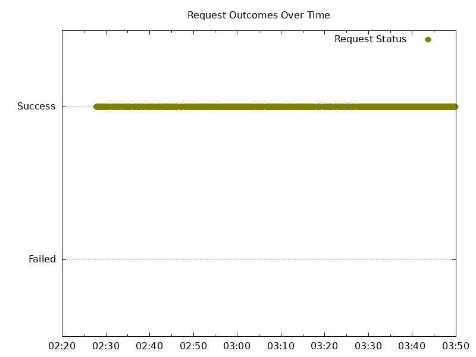
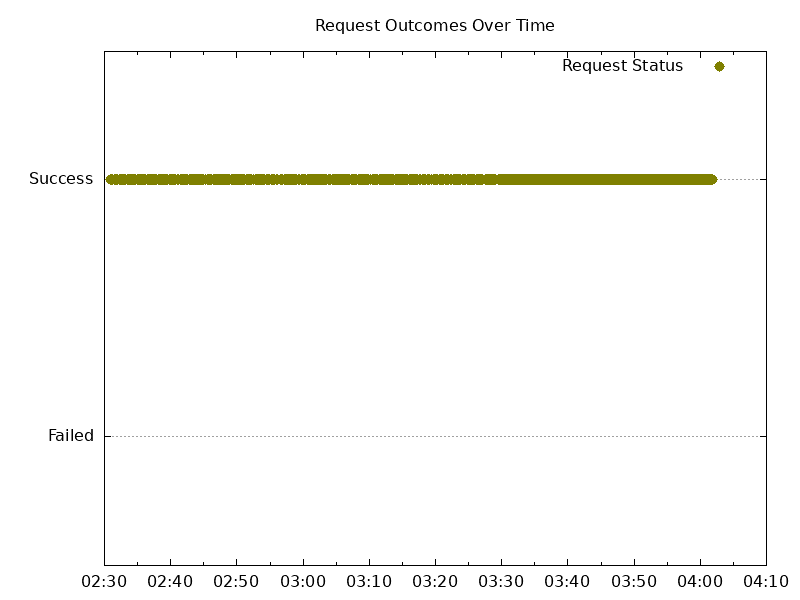

# Results

## Why is it named Special?

A proper zero downtime upgrade test tests an upgrade from the latest stable release
to a new version.

At the time of the test, the latest stable release 0.6.0 doesn't support features
to achieve zero downtime upgrades. As a result, we can't run a proper test.

Instead, we will do an upgrade from the same version to the same version to test
that the new zero downtime upgrade features ([PR-1159](https://github.com/nginxinc/nginx-gateway-fabric/pull/1159))
achieve zero downtime upgrades.

## Versions

Kubernetes:

```text
Server Version: version.Info{Major:"1", Minor:"27", GitVersion:"v1.27.3-gke.100", GitCommit:"6466b51b762a5c49ae3fb6c2c7233ffe1c96e48c", GitTreeState:"clean", BuildDate:"2023-06-23T09:27:28Z", GoVersion:"go1.20.5 X:boringcrypto", Compiler:"gc", Platform:"linux/amd64"}
```

NGF - version from https://github.com/nginxinc/nginx-gateway-fabric/pull/1159

## Start

To deploy NGF, use a helm command:

```command
helm install  my-release ../../deploy/helm-chart  --create-namespace --wait -n nginx-gateway -f values.yaml
```

Deployed Pods:

```text
NAME                                               READY   STATUS    RESTARTS   AGE    IP           NODE                                       NOMINATED NODE   READINESS GATES
my-release-nginx-gateway-fabric-66cb67bf9c-4nvms   2/2     Running   0          100s   10.12.6.10   gke-michael-3-default-pool-78305034-bkqs   <none>           <none>
my-release-nginx-gateway-fabric-66cb67bf9c-nnr95   2/2     Running   0          101s   10.12.8.10   gke-michael-3-default-pool-78305034-fl2c   <none>           <none>
```

Logs check:

- my-release-nginx-gateway-fabric-66cb67bf9c-4nvms
  - NGINX logs - no errors or warnings.
  - NGF logs - no errors
- my-release-nginx-gateway-fabric-66cb67bf9c-nnr95
  - NGINX logs - no errors or warnings.
  - NGF logs - no errors

## Upgrades

To simulate an upgrade, run:

```text
kubectl -n nginx-gateway rollout restart deployment/my-release-nginx-gateway-fabric
```

New Pods:

```text
NAME                                             READY   STATUS    RESTARTS   AGE     IP          NODE                                       NOMINATED NODE   READINESS GATES
my-release-nginx-gateway-fabric-8497f944-4sz2x   2/2     Running   0          3m47s   10.12.9.8   gke-michael-3-default-pool-78305034-7nqm   <none>           <none>
my-release-nginx-gateway-fabric-8497f944-6rjlb   2/2     Running   0          3m41s   10.12.7.5   gke-michael-3-default-pool-78305034-srqf   <none>           <none>
```

Note: the new Pods were scheduled on different nodes from the old Pods' nodes, as we wanted.

Check that one of the NGF Pods became the leader:

```text
kubectl -n nginx-gateway get lease
NAME                                              HOLDER                                           AGE
my-release-nginx-gateway-fabric-leader-election   my-release-nginx-gateway-fabric-8497f944-6rjlb   22h
```

Pod my-release-nginx-gateway-fabric-8497f944-6rjlb is the leader.

Gateway status has been updated with the new listener.

### Analyze

#### Tester VMs

Tester 1 wrk output:

```text
Running 1m test @ http://cafe.example.com/coffee
  2 threads and 100 connections
  Thread Stats   Avg      Stdev     Max   +/- Stdev
    Latency    26.09ms   23.97ms 366.19ms   86.57%
    Req/Sec     2.26k   740.51     4.57k    69.33%
  Latency Distribution
     50%   19.93ms
     75%   32.78ms
     90%   53.08ms
     99%  120.73ms
  269508 requests in 1.00m, 95.87MB read
  Socket errors: connect 0, read 4, write 0, timeout 0
Requests/sec:   4490.57
Transfer/sec:      1.60MB
```

There are 4 read socket errors.
See https://github.com/nginxinc/nginx-gateway-fabric/issues/1147

Tester 1 graph:



All curl requests succeeded.

Tester 2 wrk output:

```text
Running 1m test @ https://cafe.example.com/tea
  2 threads and 100 connections
  Thread Stats   Avg      Stdev     Max   +/- Stdev
    Latency    28.03ms   25.31ms 369.99ms   86.64%
    Req/Sec     2.07k   618.73     3.64k    63.83%
  Latency Distribution
     50%   21.33ms
     75%   35.10ms
     90%   56.07ms
     99%  127.31ms
  247847 requests in 1.00m, 86.51MB read
  Socket errors: connect 0, read 3, write 0, timeout 0
Requests/sec:   4129.21
Transfer/sec:      1.44MB
```

There are 3 read socket errors.
See https://github.com/nginxinc/nginx-gateway-fabric/issues/1147

Tester 2 graph:



All curl requests succeeded.

#### Old Pods

- my-release-nginx-gateway-fabric-66cb67bf9c-4nvms
  - NGF - no errors
  - NGINX
    - Access logs - all responses are 200.
    - Error logs - no errors or warnings.
- my-release-nginx-gateway-fabric-66cb67bf9c-nnr95
  - NGF - no errors
  - NGINX
    - Access logs - only 200 responses.
    - Error logs - no errors or warnings.

#### New Pods

- my-release-nginx-gateway-fabric-8497f944-4sz2x
  - NGF - no errors
  - NGINX
    - Access logs - 44 responses like below:

          ```text
          INFO 2023-10-19T20:03:26.362441989Z [resource.labels.containerName: nginx] 10.128.0.9 - - [19/Oct/2023:20:03:26 +0000] "GET /coffee HTTP/1.1" 499 0 "-" "-"
          . . .
          INFO 2023-10-19T20:03:29.469971066Z [resource.labels.containerName: nginx] 10.128.15.241 - - [19/Oct/2023:20:03:29 +0000] "GET /tea HTTP/1.1" 499 0 "-" "-"
          ```

          Meaning clients closed connection (499 status code).
          Those requests belong to wrk (curl requests have `curl` user agent in the logs).
          All requests for coffee are during the same time. Same for tea.
          That's probably how wrk closed connections before it exited after 60s.
    - Error logs - No errors or warnings.
- my-release-nginx-gateway-fabric-8497f944-6rjlb
  - NGF - no errors.
  - NGINX
    - Access logs - 44 responses similar to the first Pod. Same conclusion as above.
    - Error logs - No errors or warnings.
